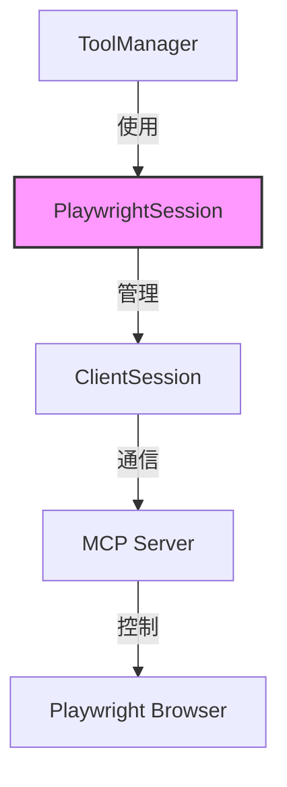
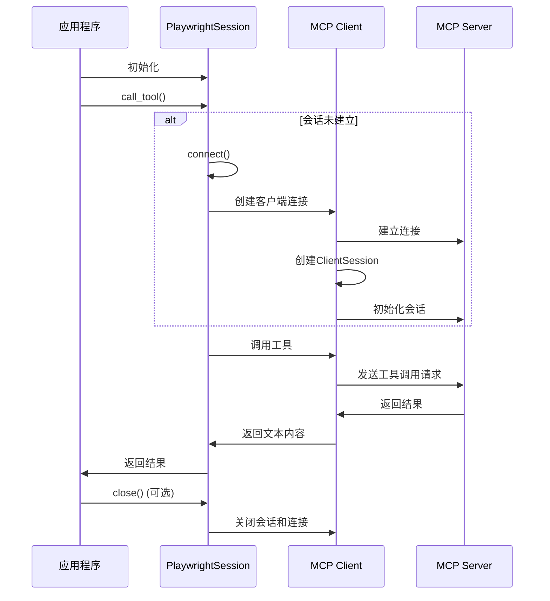

# browser_session 模块文档

## 目录
1. [模块概述](#模块概述)
2. [核心组件](#核心组件)
3. [架构与工作原理](#架构与工作原理)
4. [使用指南](#使用指南)
5. [注意事项与限制](#注意事项与限制)
6. [与其他模块的关系](#与其他模块的关系)

## 模块概述

`browser_session` 模块是 `miroflow_tools_management` 包下的一个关键组件，主要负责管理与 Playwright MCP (Model Context Protocol) 服务器的持久化连接会话。该模块的核心目的是提供一个可靠的机制，通过保持浏览器会话的连续性，避免在多次工具调用之间重新初始化浏览器实例，从而提高浏览器自动化操作的效率。

### 设计理念
该模块采用了面向对象的设计思想，将复杂的 MCP 会话管理逻辑封装在 `PlaywrightSession` 类中。通过提供简洁的 API，它使得开发者可以轻松地建立连接、调用工具以及最终安全地关闭会话。持久化会话的设计特别适合于需要执行多个连续浏览器操作的场景，如网页导航、内容提取和页面快照等。

## 核心组件

### PlaywrightSession 类

`PlaywrightSession` 是该模块的核心类，负责管理与 MCP 服务器的连接和通信。

#### 初始化

```python
def __init__(self, server_params):
```

**参数**:
- `server_params`: 服务器连接参数，可以是 `StdioServerParameters` 类型（用于标准输入输出通信）或字符串类型（用于 SSE - Server-Sent Events 通信）。

**属性**:
- `server_params`: 存储服务器连接参数
- `read`: 异步读取流，用于从服务器接收数据
- `write`: 异步写入流，用于向服务器发送数据
- `session`: MCP 客户端会话对象
- `_client`: 底层客户端连接对象

#### 主要方法

##### connect 方法

```python
async def connect(self):
```

**功能**: 建立与 MCP 服务器的连接并初始化会话。

**工作原理**:
1. 检查会话是否已存在，避免重复连接
2. 根据服务器参数类型选择适当的客户端（stdio_client 或 sse_client）
3. 初始化异步读写流
4. 创建 ClientSession 实例并初始化
5. 记录连接成功的日志信息

**注意**: 如果会话已经存在，该方法不会执行任何操作。

##### call_tool 方法

```python
async def call_tool(self, tool_name, arguments=None):
```

**功能**: 调用 MCP 服务器上的工具，同时保持会话的持续性。

**参数**:
- `tool_name`: 要调用的工具名称（字符串）
- `arguments`: 工具调用的参数字典（可选，默认为 None）

**返回值**: 工具调用结果的文本内容

**工作原理**:
1. 检查会话是否存在，如不存在则先调用 `connect()` 建立连接
2. 记录工具调用的日志信息
3. 通过会话对象调用指定工具
4. 提取并返回工具结果中的文本内容

**注意**: 工具调用结果假设至少包含一个内容项，且该内容项有文本属性。

##### close 方法

```python
async def close(self):
```

**功能**: 安全关闭会话和底层连接。

**工作原理**:
1. 依次关闭会话和客户端连接
2. 重置相关属性为 None
3. 记录关闭会话的日志信息

**设计意图**: 确保资源被正确释放，防止资源泄漏。

## 架构与工作原理

### 架构设计

`browser_session` 模块在整个工具管理系统中扮演着专用连接管理器的角色。它被 `ToolManager` 类特别使用，专门处理与 Playwright 相关的工具调用，而其他工具则通过临时连接进行处理。



**架构说明**:
1. `ToolManager` 在检测到 Playwright 相关工具调用时，会创建或重用 `PlaywrightSession` 实例
2. `PlaywrightSession` 内部管理 `ClientSession` 对象，负责实际的 MCP 协议通信
3. `ClientSession` 与 MCP 服务器建立并保持连接
4. MCP 服务器控制 Playwright 浏览器执行实际操作

### 连接流程



### 数据流程

当调用浏览器相关工具时，数据流向如下：

1. **请求路径**: 工具调用请求 → `PlaywrightSession.call_tool()` → `ClientSession.call_tool()` → MCP 服务器
2. **响应路径**: MCP 服务器 → `ClientSession.call_tool()` → 提取文本内容 → `PlaywrightSession.call_tool()` → 调用方

## 使用指南

### 基本使用

以下是使用 `PlaywrightSession` 类的基本步骤：

```python
import asyncio
import json
import logging
from mcp import StdioServerParameters
from libs.miroflow-tools.src.miroflow_tools.mcp_servers.browser_session import PlaywrightSession

logger = logging.getLogger("miroflow")

async def example_usage():
    # 创建会话 - 使用 SSE 连接
    session = PlaywrightSession("http://localhost:8931")
    
    try:
        # 第一次调用会自动建立连接
        await session.call_tool("browser_navigate", {"url": "https://example.com"})
        logger.info("导航完成")
        
        # 等待页面加载
        await asyncio.sleep(2)
        
        # 第二次调用 - 复用同一连接
        snapshot_result = await session.call_tool("browser_snapshot", {})
        
        # 处理结果
        snapshot_json = json.loads(snapshot_result)
        logger.info(f"页面 URL: {snapshot_json.get('url')}")
        logger.info(f"页面标题: {snapshot_json.get('title')}")
        
    finally:
        # 确保关闭连接
        await session.close()

# 运行示例
if __name__ == "__main__":
    logging.basicConfig(level=logging.INFO)
    asyncio.run(example_usage())
```

### 支持的服务器参数类型

`PlaywrightSession` 支持两种类型的服务器连接参数：

1. **SSE (Server-Sent Events) 连接**:
   ```python
   # 使用 HTTP/HTTPS URL
   session = PlaywrightSession("http://localhost:8931")
   ```

2. **标准输入/输出连接**:
   ```python
   from mcp import StdioServerParameters
   
   server_params = StdioServerParameters(
       command="npx",
       args=["-y", "@modelcontextprotocol/server-playwright"]
   )
   session = PlaywrightSession(server_params)
   ```

### 在 ToolManager 中的使用

`PlaywrightSession` 类主要设计为在 `ToolManager` 内部使用：

```python
# ToolManager 中的相关代码片段
if server_name == "playwright":
    try:
        if self.browser_session is None:
            self.browser_session = PlaywrightSession(server_params)
            await self.browser_session.connect()
        tool_result = await self.browser_session.call_tool(
            tool_name, arguments=arguments
        )
        return {
            "server_name": server_name,
            "tool_name": tool_name,
            "result": tool_result,
        }
    except Exception as e:
        return {
            "server_name": server_name,
            "tool_name": tool_name,
            "error": f"Tool call failed: {str(e)}",
        }
```

## 注意事项与限制

### 连接管理

1. **会话唯一性**: `PlaywrightSession` 实例内部维护单个会话，不支持同时连接多个服务器。如需连接多个 Playwright 服务器，请创建多个实例。

2. **异步上下文**: 所有方法都是异步的，必须在异步上下文中调用，确保正确使用 `async/await` 语法。

3. **资源释放**: 使用完毕后务必调用 `close()` 方法释放资源，特别是在长时间运行的应用中，防止资源泄漏。

4. **错误处理**: 网络错误或服务器断开连接可能导致工具调用失败，建议在调用 `call_tool()` 时实施适当的错误处理和重试机制。

### 工具调用

1. **结果处理**: `call_tool()` 方法仅返回结果中的第一个文本内容项。如果工具返回多个内容项或非文本内容，可能需要修改该方法以适应特定需求。

2. **参数验证**: 该类不验证工具名称或参数的有效性，这些验证由 MCP 服务器端处理。

3. **超时处理**: 当前实现没有内置超时机制，长时间运行的工具调用可能会导致应用程序阻塞，建议在调用层设置适当的超时控制。

### 与 ToolManager 的集成

1. **特殊处理**: `ToolManager` 对 Playwright 服务器有特殊处理逻辑，只有服务器名称为 "playwright" 时才会使用持久化会话。

2. **会话生命周期**: 在 `ToolManager` 中，`PlaywrightSession` 的生命周期与 `ToolManager` 实例绑定，没有自动过期机制。

## 与其他模块的关系

### ToolManager 模块

`browser_session` 模块与 `tool_manager` 模块关系最为紧密。`ToolManager` 类中，专门针对 Playwright 服务器使用 `PlaywrightSession` 来维持持久连接，而对其他服务器则使用临时连接方式。

详细信息请参考 [tool_manager 模块文档](tool_manager.md)。

### 日志模块

`PlaywrightSession` 使用 `miroflow_agent_logging` 模块的日志功能记录连接和工具调用信息，确保操作的可追踪性。

### MCP 协议库

该模块依赖 MCP 协议库的以下组件：
- `StdioServerParameters`: 用于定义标准输入输出服务器参数
- `ClientSession`: MCP 客户端会话管理
- `stdio_client` 和 `sse_client`: 两种不同的通信方式客户端

## 总结

`browser_session` 模块提供了一种高效管理 Playwright MCP 服务器持久连接的解决方案，通过 `PlaywrightSession` 类封装了复杂的连接管理逻辑，为浏览器自动化操作提供了便捷的接口。它与 `ToolManager` 的集成使得多步骤浏览器操作可以在同一会话中连续执行，大大提高了浏览器相关工具的执行效率。

在使用该模块时，需要注意正确管理连接生命周期，实施适当的错误处理，并理解其与 `ToolManager` 的特殊集成方式。
