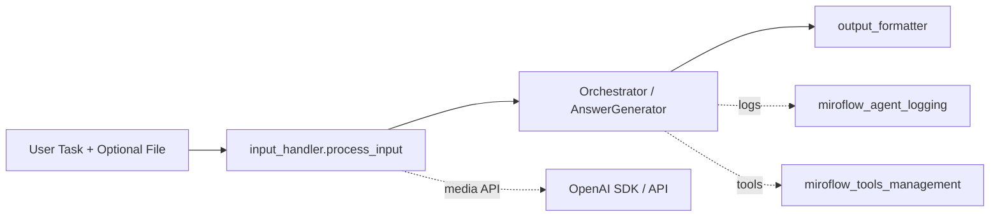
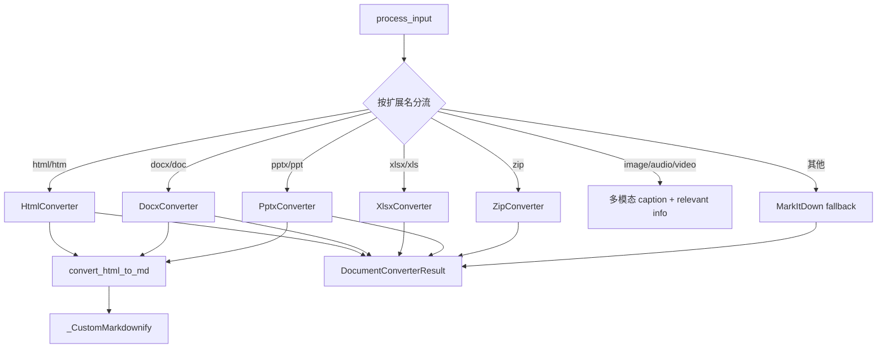
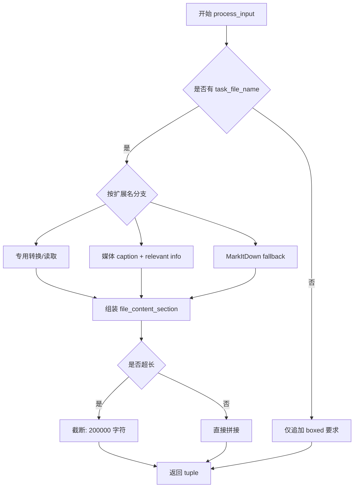
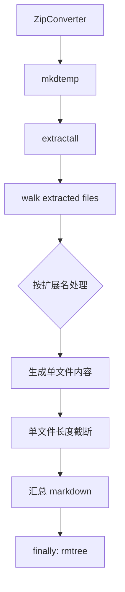

# input_handler 模块深度文档

## 模块简介与设计动机

`input_handler` 位于 `miroflow_agent_io` 的输入侧，是 MiroFlow Agent 把“用户原始任务 + 附件”转换为“LLM 可消费上下文”的核心入口。它存在的根本原因是：真实任务往往包含异构文件（PDF、DOCX、XLSX、PPTX、图片、音频、视频、ZIP 等），而核心推理链路（`Orchestrator`、`AnswerGenerator`）更适合处理结构化文本。`input_handler` 通过统一解析、格式归一、异常降级与长度控制，让上层编排逻辑不需要关心具体文件细节。

模块采用了“专用转换器优先 + MarkItDown 兜底 + 多模态任务相关抽取”的策略。专用转换器负责提高主要格式的可读性与稳定性；兜底机制提升长尾格式可用率；任务相关抽取（task-relevant extraction）则减少多模态内容噪声，避免后续 LLM 在无关信息上消耗推理预算。

> 关于 `miroflow_agent_io` 在系统中的整体定位，请先参考 [miroflow_agent_io.md](miroflow_agent_io.md)。

---

## 在系统中的位置



`input_handler` 的输出是“已拼接文件内容的任务描述字符串”，直接影响 `Orchestrator` 进入主 Agent 推理时的上下文质量。如果输入描述过长、格式失真或噪声过高，会连锁影响工具调用决策、答案质量和重试效率。

---

## 核心组件总览

本模块在代码层面最核心的两个结构是：

1. `DocumentConverterResult`：统一承载转换结果。
2. `_CustomMarkdownify`：自定义 HTML → Markdown 转换器。

实际运行的主要入口函数是 `process_input`，它组织并调度所有转换路径。



---

## 核心类详解

## 1) `DocumentConverterResult`

`DocumentConverterResult` 是一个轻量结果对象，字段如下：

- `title: Union[str, None]`
- `text_content: str`

它的价值在于统一各种转换器返回契约。`process_input` 不需要知道各转换器内部细节，只需读取 `title` 与 `text_content` 即可拼装 prompt 片段。这样的统一结构也让 ZIP 递归处理更简单，因为 ZIP 内部文件同样可以复用同一套结果拼接逻辑。

**行为特点**：
- 不包含校验逻辑；调用方需保证 `text_content` 可用。
- 允许 `title=None`，适配无标题来源（如纯文本文件）。

---

## 2) `_CustomMarkdownify`

`_CustomMarkdownify` 继承自 `markdownify.MarkdownConverter`，对默认 HTML 转 Markdown 行为做了定制，以提高安全性和可读性。

### 设计意图

默认 markdownify 的转换在 LLM 场景中会遇到三个问题：链接协议不安全、data URI 图片过大、标题与段落边界不稳定。该类针对这些问题做了最小但关键的修复。

### 关键方法与内部逻辑

**`__init__(**options)`**
- 强制默认标题风格为 `ATX`（`#`, `##`），使输出分段稳定。

**`convert_hn(n, el, text, convert_as_inline)`**
- 确保块级标题前有换行，避免标题粘连在上一个段落末尾。

**`convert_a(el, text, convert_as_inline)`**
- 仅允许 `http/https/file` 链接。
- 遇到其它 scheme（如 `javascript:`）直接降级成纯文本。
- 对 URL path 做 `quote/unquote` 处理，降低 Markdown 解析冲突风险。

**`convert_img(el, text, convert_as_inline)`**
- 对 `data:` URI 图片做截断（保留前缀并加 `...`），避免超长 base64 混入 prompt。

### 副作用与限制

- 过滤非白名单链接可能导致某些协议型链接信息丢失（这是有意的安全取舍）。
- data URI 截断提升性能，但损失了原图可还原性。

---

## 关键函数详解

## 1) `process_input(task_description: str, task_file_name: str) -> Tuple[str, str]`

这是本模块主入口。它根据附件扩展名选择转换路径，把结果拼接到任务描述末尾，并附加统一输出约束：

`You should follow the format instruction in the request strictly and wrap the final answer in \boxed{}.`

### 参数

- `task_description`：用户原始任务文本。
- `task_file_name`：附件路径；为空时仅追加 boxed 要求并返回。

### 返回值

- 返回 `(updated_task_description, updated_task_description)`，当前两个值相同。

### 处理流程



### 支持格式（概念）

- 文档：PDF, DOCX/DOC, HTML/HTM, PPTX/PPT, XLSX/XLS
- 文本/数据：TXT, MD, SH, YAML/YML, TOML, CSV, JSON/JSONLD, PY
- 媒体：图片、音频、视频
- 压缩包：ZIP
- 特殊：PDB（仅提示，不解析）

### 关键行为注意点

- **MarkItDown 兜底**：仅在专用路径未生成结果且扩展名不在 `SKIP_MARKITDOWN_EXTENSIONS` 时尝试。
- **内容截断**：统一按字符截断，而非 token 级截断。
- **异常策略**：多数异常不会中断主流程，而是写 warning 到输出文本或返回占位文本。

---

## 2) 多模态 caption 与任务相关抽取函数

图片、音频、视频各有两类函数：

- 通用描述：`_generate_image_caption` / `_generate_audio_caption` / `_generate_video_caption`
- 任务相关抽取：`_extract_task_relevant_info_from_*`

### 运行机制

- 读取 `OPENAI_API_KEY` 和 `OPENAI_BASE_URL` 初始化 `OpenAI` 客户端。
- 图片/视频使用 base64 数据内联调用多模态模型。
- 音频转录使用 `gpt-4o-transcribe`；任务相关音频分析使用 `gpt-4o-audio-preview`。

### 返回约定

- caption 函数失败通常返回可读错误字符串（例如 `[Caption generation failed: ...]`）。
- relevant info 函数失败返回空字符串，避免污染主要提示词。

### 成本与性能提示

- 大媒体文件会显著增加请求体体积、延迟和成本。
- 若没有 `OPENAI_API_KEY`，caption/relevant info 会退化为占位文本或空串。

---

## 3) 文档转换函数族

## `convert_html_to_md(html_content)` 与 `HtmlConverter(local_path)`

该链路先用 `BeautifulSoup` 移除 `script/style`，优先转换 `<body>` 内容，再经 `_CustomMarkdownify` 生成 Markdown，并返回 `DocumentConverterResult`。这保证了 HTML 的可读文本优先级，同时减少噪声代码污染。

## `DocxConverter(local_path)`

先使用 `mammoth` 把 DOCX 转换为 HTML，再复用 HTML 转 Markdown 链路。这样避免维护两套文本语义映射逻辑，降低长期维护成本。

## `XlsxConverter(local_path)`

`XlsxConverter` 是最复杂转换器之一：

- 使用 `openpyxl` 读取工作簿（`data_only=True`）。
- 遍历每个 sheet，按非空单元格范围构建 Markdown 表格。
- 尝试提取颜色/字体样式（背景色、字体色、粗体、斜体、下划线）。
- 样式通过内联 HTML（如 `<span style="...">`）嵌入表格文本。

此实现优先“语义保留”，不是“视觉等价还原”。不同 Markdown 渲染器对内联 HTML 支持不一致，因此模块会附加格式说明。

## `PptxConverter(local_path)`

处理逻辑覆盖幻灯片标题、普通文本、表格、图片与备注：

- slide title 转为 Markdown `#` 标题。
- 表格先构建 HTML，再复用 HTML->MD 转换。
- 图片输出 `` 占位，alt 尽量从形状描述提取。
- 备注页写入 `### Notes`。

## `ZipConverter(local_path)`

ZIP 会解压到临时目录并递归处理文件：

- 每个文件按扩展名分流，复用与 `process_input` 类似的策略。
- 每个文件内容有单独截断上限（50,000 字符）。
- 最终合并为一个 `DocumentConverterResult(title="ZIP Archive Contents", ...)`。



---

## 配置与依赖

### 环境变量

- `OPENAI_API_KEY`：多模态处理必需。
- `OPENAI_BASE_URL`：可选，默认 `https://api.openai.com/v1`。

### 主要依赖库

- 文档类：`pdfminer`, `mammoth`, `markdownify`, `beautifulsoup4`
- Office 类：`openpyxl`, `python-pptx`
- 兜底转换：`markitdown`
- 多模态调用：`openai`

---

## 错误处理与边界条件

本模块采取“尽量不抛出到上层”的容错策略，典型行为包括：

- 文件不存在：写入 warning 文本。
- 转换器异常：捕获后尽量 fallback。
- 多模态 API 失败：返回错误占位文本或空串。
- ZIP 内局部失败：记录单文件错误，不阻断整体结果。

### 需要重点关注的限制

- 当前长度控制按字符，不按 token。
- ZIP `extractall` 对不可信压缩包需额外安全防护（路径穿越、解压炸弹）。
- PDB 仅提示不解析，业务若依赖该格式需扩展专用转换器。
- 返回二元组内容相同，属于历史兼容设计。

---

## 扩展指南（新增格式）

若要新增一种文件类型（例如 `rtf`），建议同时修改以下两处：

1. `process_input` 的顶层扩展名分流。
2. `ZipConverter` 的内部分流，保证压缩包内外行为一致。

并保持以下约束：

- 转换器返回 `DocumentConverterResult`。
- 提供明确的 `Note` 和章节标题，利于 LLM 理解上下文来源。
- 设置合理截断阈值，避免 prompt 爆炸。

示例：

```python
elif file_extension == "rtf":
    parsing_result = RtfConverter(local_path=task_file_name)
    file_content_section += "\n\nNote: An RTF file ...\n\n"
    file_content_section += f"## RTF File\nFile: {task_file_name}\n\n"
```

---

## 与其他模块的协作关系（引用）

- 编排与主循环：见 [orchestrator.md](orchestrator.md)
- 答案生成与重试：见 [answer_generator.md](answer_generator.md)
- 输出收口：见 [output_formatter.md](output_formatter.md)
- IO 总览：见 [miroflow_agent_io.md](miroflow_agent_io.md)
- LLM 客户端抽象：见 [base_client.md](base_client.md)、[openai_client.md](openai_client.md)

这份文档聚焦输入处理逻辑，不重复展开上述模块内部实现细节。
