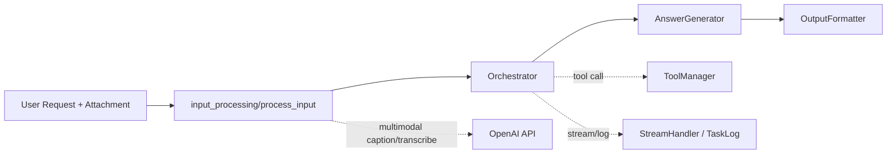
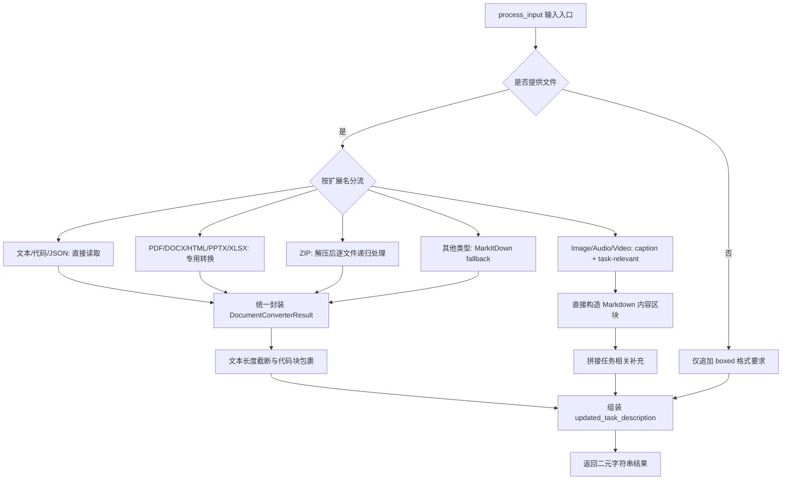
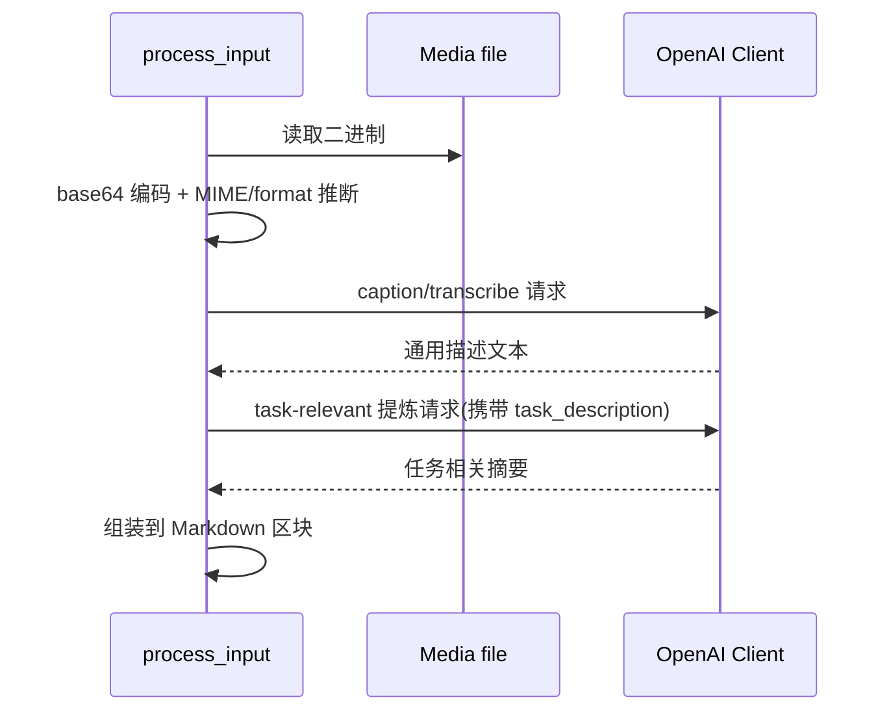

# input_processing 模块文档

## 模块概述与设计背景

`input_processing` 是 `miroflow_agent_io` 的输入处理子模块，代码实现位于 `apps/miroflow-agent/src/io/input_handler.py`。它的核心职责是把“用户任务描述 + 可选附件”转换成适合大模型消费的统一文本上下文，并尽可能保留原始文件的信息密度与任务相关性。

这个模块存在的根本原因是：Agent 在真实业务中面对的输入并不只是纯文本，而是高度异构的文件集合（文档、表格、演示文稿、图片、音频、视频、压缩包等）。如果直接把原始二进制或未经结构化的内容传入 `Orchestrator` / `AnswerGenerator`，会导致提示词噪声高、上下文不可控、工具调用策略偏离。`input_processing` 通过“按类型专用解析 + 通用兜底 + 多模态提炼 + 长度限制 + 容错降级”的组合策略，完成输入归一化。

从系统链路来看，它是推理前置层：输出内容直接进入 `miroflow_agent_core`（尤其是 `Orchestrator` 与 `AnswerGenerator`）作为任务上下文，因此会显著影响后续推理质量、响应稳定性与 token 成本。关于编排层和答案生命周期，请参考 [miroflow_agent_core.md](miroflow_agent_core.md) 与 [answer_lifecycle.md](answer_lifecycle.md)。

---

## 在系统中的位置与上下游关系



`input_processing` 的输出形式是一个拼接后的任务描述字符串（并在末尾附带格式指令与文件内容区块）。该模块本身不执行 Agent 推理，不负责工具调用决策，也不负责最终输出渲染，但它为这三者提供上下文基础。输出质量越高，后续模块越少出现“理解偏差—错误工具调用—重复重试”的连锁问题。

---

## 架构设计与处理策略

### 总体策略

模块采用“先专用后兜底”的转换路径：优先使用针对特定格式的解析器（例如 `XlsxConverter`, `DocxConverter`），若未匹配则尝试 `MarkItDown` 作为通用 fallback。对于图片/音频/视频，除了生成通用描述（caption/transcription），还会做一轮“基于任务描述的相关信息提取”，将噪声压缩为任务可用信息。

### 处理流程图



这个设计的关键点在于：

1. **输入路径统一**：无论源文件类型如何，最终都归一到字符串上下文。
2. **质量优先**：常见格式通过专用转换器提高语义保真。
3. **鲁棒优先**：长尾格式通过 fallback 尽可能“有结果可用”。
4. **成本控制**：内容长度有上限，避免极端输入冲爆上下文。

---

## 核心组件详解

## `DocumentConverterResult`

`DocumentConverterResult` 是本模块最基础的数据承载对象，结构极简：

- `title: Union[str, None]`
- `text_content: str`

它并不是一个 dataclass，也不包含校验逻辑。它的价值在于建立“转换器之间的统一返回契约”：`process_input` 只需读取 `title/text_content` 即可拼接，不必关心解析器内部实现。这个约束同时简化了 `ZipConverter` 的递归处理，因为 ZIP 内文件也可沿用同一输出模型。

### 行为与副作用

`DocumentConverterResult` 本身无副作用，但上游若传入空内容不会自动报错；调用方需在拼装阶段进行防御性判断（代码中已通过 `getattr(..., "text_content", None)` 做了容错）。

---

## `_CustomMarkdownify`

`_CustomMarkdownify` 继承 `markdownify.MarkdownConverter`，专用于提升 HTML → Markdown 过程的安全性与可读性。它解决了通用转换在 Agent 场景中的三个典型问题：

1. 标题换行边界不稳定；
2. 链接协议可能包含 `javascript:` 等高风险 scheme；
3. data URI 图片（base64）会导致文本爆炸。

### 关键方法

#### `__init__(**options)`

默认将 `heading_style` 设为 `markdownify.ATX`，即 `#`, `##` 风格标题，确保层级可读且模型更易理解结构边界。

#### `convert_hn(...)`

覆盖标题转换逻辑，确保块级标题前有换行，避免和上一段落黏连。

#### `convert_a(...)`

这是安全策略最关键的函数。主要行为：

- 如果 `href` 的 scheme 不是 `http/https/file`，直接降级为纯文本（不保留链接）；
- 对 URL path 做 `quote(unquote(path))`，减少 Markdown/URL 编码冲突；
- 保留 autolink/default_title 逻辑与 markdownify 的兼容语义。

这能降低恶意链接注入风险，同时避免某些特殊字符导致 Markdown 解析失败。

#### `convert_img(...)`

对 `src` 为 `data:` 的图片进行截断，只保留前缀并添加 `...`，防止大段 base64 进入 prompt。该策略牺牲了可还原性，但显著提升上下文可控性。

---

## 关键函数与内部机制

## `process_input(task_description: str, task_file_name: str) -> Tuple[str, str]`

这是当前模块的主入口。函数会根据附件扩展名选择处理策略，并把内容追加到任务描述末尾。

### 参数与返回值

- `task_description`：用户原始任务文本。
- `task_file_name`：附件路径，可为空字符串。
- 返回值：`(updated_task_description, updated_task_description)`，当前实现返回两个相同字符串（兼容调用链的双返回约定）。

### 关键行为

函数在末尾**无条件追加**以下输出约束：

```text
You should follow the format instruction in the request strictly and wrap the final answer in \boxed{}.
```

这会对后续 `AnswerGenerator` 输出风格产生强约束，属于输入阶段“提示词策略注入”。

### 分支处理简述

- **文本/代码/配置类文件**（`py/txt/md/sh/yaml/yml/toml/csv`）：直接读取 UTF-8 文本。
- **JSON/JSONLD**：加载后以 `json.dumps(..., indent=2, ensure_ascii=False)` 规范化。
- **PDF**：`pdfminer.high_level.extract_text`。
- **DOCX/DOC**：`mammoth` 转 HTML，再走 HTML→Markdown。
- **HTML/HTM**：`BeautifulSoup` 清理后走 `_CustomMarkdownify`。
- **XLSX/XLS**：`openpyxl` 解析为 Markdown 表格并尽量保留格式。
- **PPTX/PPT**：提取标题、文本、表格、图片 alt 文本、备注。
- **媒体文件**：调用 OpenAI 生成 caption/transcription，并提炼 task-relevant 信息。
- **ZIP**：解压至临时目录后逐文件复用同类逻辑。
- **PDB**：仅提示可用工具读取，不做内联解析。
- **其他格式**：尝试 `MarkItDown(enable_plugins=True)` fallback。

### 长度控制

对于普通解析结果，模块将文本上限设为 `200_000` 字符，超出部分追加 `... [File truncated]`。这是硬截断（字符级），并非 token-aware 截断，可能在语义边界中间切断。

---

## 转换器族细节

## `convert_html_to_md` / `HtmlConverter`

HTML 转换先移除 `script/style`，优先转换 `<body>`，再用 `_CustomMarkdownify` 输出 Markdown，并封装为 `DocumentConverterResult`。这样可以保留可读主体内容，同时降低脚本噪声与潜在注入风险。

## `DocxConverter`

`DocxConverter` 采用“DOCX → HTML → Markdown”的两段式流水线。优点是复用 HTML 处理链，减少格式分叉；缺点是某些 Word 复杂样式可能在 `mammoth` 阶段已经降级。

## `XlsxConverter`

`XlsxConverter` 是最复杂的解析器之一。它会：

- 使用 `openpyxl.load_workbook(data_only=True)` 读取表格；
- 通过 `_cells` 估算已使用范围；
- 生成 Markdown 表格骨架；
- 尝试提取背景色、字体色、粗体、斜体、下划线，并以内联 HTML 表示（`<span>`, `<strong>`, `<em>`, `<u>`）。

这意味着输出并非“纯 Markdown”，而是 Markdown + HTML 混排。某些渲染器不支持内联 HTML 样式，因此代码会附加格式说明段。

## `PptxConverter`

`PptxConverter` 处理幻灯片中的三类信息：

1. 文本框（含标题）；
2. 表格（先转 HTML，再转 Markdown）；
3. 图片（输出为 Markdown 图片语法，优先使用 alt 描述）。

它还会附带注释页（notes）内容，适合保留演讲者备注这类对任务有价值但常被忽略的信息。

## `ZipConverter`

`ZipConverter` 会把 ZIP 解压到临时目录，逐文件执行与 `process_input` 类似的判断逻辑，并把每个文件结果汇总到一个总 Markdown 中。每个文件内容上限为 `50_000` 字符。最后在 `finally` 中尝试删除临时目录，避免磁盘泄漏。

---

## 多模态处理机制

媒体相关能力分两层：

1. **通用描述层**：`_generate_image_caption`, `_generate_audio_caption`, `_generate_video_caption`
2. **任务相关提炼层**：`_extract_task_relevant_info_from_image/audio/video`

### 数据流图



### 配置项

- `OPENAI_API_KEY`：必需，未配置时返回占位文本或空字符串。
- `OPENAI_BASE_URL`：可选，默认 `https://api.openai.com/v1`，用于兼容代理或私有网关。

### 模型选择（代码当前写死）

- 图片/视频描述：`gpt-4o`
- 音频转录：`gpt-4o-transcribe`
- 音频任务相关提炼：`gpt-4o-audio-preview`

这些模型名在代码中硬编码，扩展时应优先抽成配置。

---

## 异常处理、边界条件与已知限制

## 异常处理策略

模块整体采用“尽量不中断主流程”的降级思路。多数错误会：

- 打印 `Warning/Error` 到标准输出；
- 在任务描述中附加可读 warning；
- 或返回占位文本（例如 caption 失败）。

这使系统在输入异常时仍可继续推理，但也意味着调用方不能仅通过异常捕获判断处理质量，建议结合日志系统做观测。日志体系请参考 [miroflow_agent_logging.md](miroflow_agent_logging.md)。

## 关键边界条件

- **文件不存在**：捕获 `FileNotFoundError` 并附加 warning。
- **无扩展名文件**：可能直接走 `MarkItDown` fallback。
- **媒体文件过大**：base64 内联会显著放大请求体，可能触发 API 限制。
- **非 UTF-8 文本文件**：直接读取路径使用 UTF-8，可能抛解码错误。
- **超长内容截断**：可能截断在语义中间，影响下游理解。
- **`ppt` 扩展名**：`PptxConverter` 实际要求 `.pptx`，传入 `.ppt` 会返回错误文本而非抛错。
- **`xls` 支持依赖**：`openpyxl` 对旧版 `xls` 支持有限，可能失败。

## 安全与合规注意

- HTML 中脚本样式会被剔除，但这不是完整的安全审计。
- 链接只允许 `http/https/file`，减少协议注入风险。
- ZIP 解压未显式做路径穿越防护（如 `../`），在高风险场景建议额外校验。

---

## 使用示例

## 基础调用

```python
from apps.miroflow-agent.src.io.input_handler import process_input

task = "请总结这份文档中的风险点并给出整改建议。"
updated, _ = process_input(task, "./data/security_report.pdf")
print(updated[:1200])
```

## 环境变量配置（多模态能力）

```bash
export OPENAI_API_KEY="sk-..."
export OPENAI_BASE_URL="https://api.openai.com/v1"
```

## 直接使用转换器

```python
from apps.miroflow-agent.src.io.input_handler import DocxConverter

result = DocxConverter("./docs/spec.docx")
print(result.title)
print(result.text_content[:500])
```

---

## 扩展与二次开发指南

扩展新文件类型时，推荐遵循现有结构：

1. 新增一个返回 `DocumentConverterResult` 的专用转换函数；
2. 在 `process_input` 的扩展名分支中注册该函数；
3. 明确该类型是否应加入 `SKIP_MARKITDOWN_EXTENSIONS`；
4. 给出统一的 Note + `## Section` 说明文案；
5. 评估长度截断策略与异常降级行为。

如果你需要更强的可维护性，建议把当前 `if/elif` 分支重构为“扩展名 → handler”映射表，并将 OpenAI 模型名、截断阈值、提示模板抽为配置项，减少硬编码。

---

## 与其他模块的协作关系（避免重复说明）

`input_processing` 负责“输入归一化”，而不是“推理编排”。完整链路中：

- 编排与执行策略：参见 [orchestration_runtime.md](orchestration_runtime.md)
- 答案生成阶段：参见 [answer_lifecycle.md](answer_lifecycle.md)
- 输出格式化：参见 [output_formatting.md](output_formatting.md)
- LLM 客户端抽象：参见 [llm_client_foundation.md](llm_client_foundation.md)

这里建议保持职责边界：不要把工具调用策略、答案后处理逻辑下沉到输入模块，以免形成高耦合。

---

## 总结

`input_processing` 的核心价值不在“把文件读出来”，而在“把异构输入转成稳定、可控、任务相关的模型上下文”。`DocumentConverterResult` 提供统一契约，`_CustomMarkdownify` 解决 HTML 转换中的关键安全与可读性问题，`process_input` 则承担总调度与上下文组装。若要提升整体 Agent 质量，输入层通常是最具杠杆效应的优化点之一。
