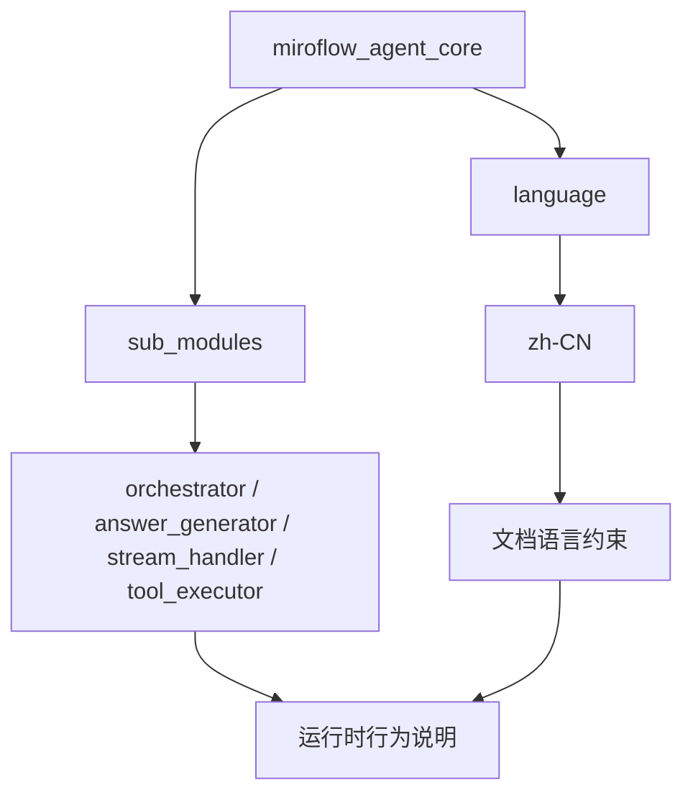
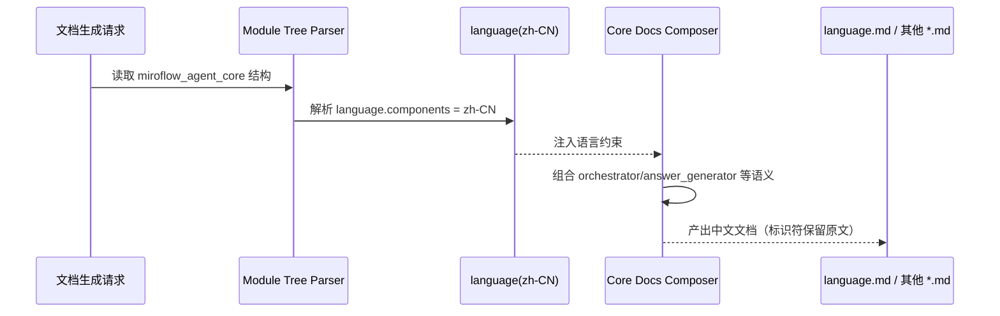
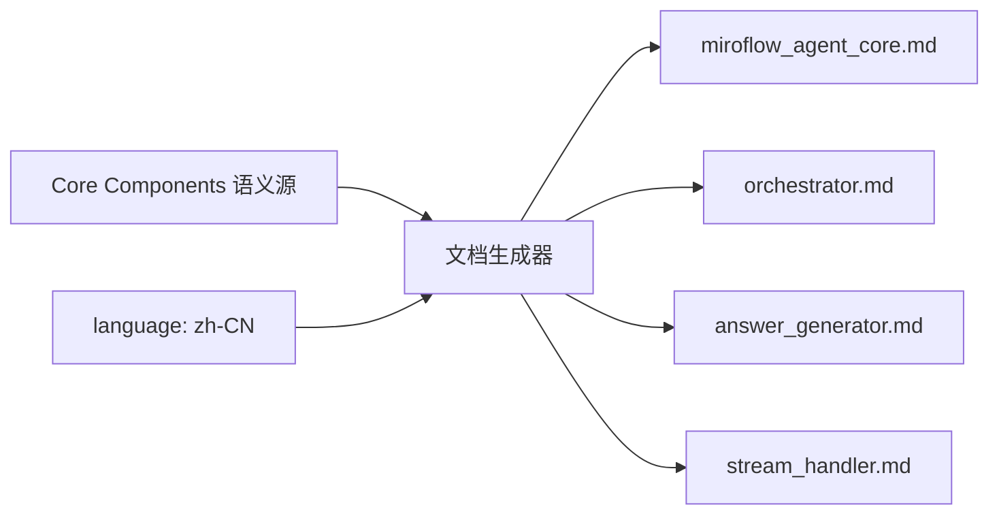
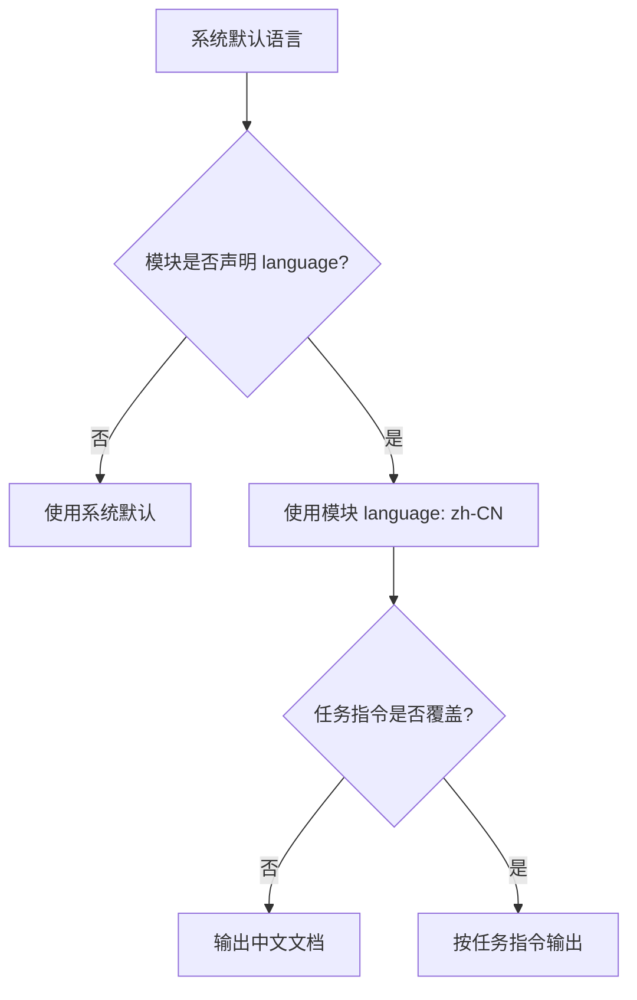

# language 模块文档

## 模块定位与设计动机

`language` 是 `miroflow_agent_core` 文档树下的语言策略子模块，当前核心组件为 `zh-CN`。它并不实现 `Orchestrator`、`AnswerGenerator`、`StreamHandler`、`ToolExecutor` 这类运行时代码逻辑，而是为这一组核心能力提供统一的**文档输出语言约束**。换句话说，`language` 决定“如何表达”，而不是“如何执行”。

在一个跨模块、跨团队、持续演进的 Agent 系统里，文档一致性是长期维护成本的关键来源之一。若没有显式语言策略，文档通常会出现中英混杂、术语漂移、同概念多译法等问题，直接增加新人理解门槛。`language` 模块通过结构化方式声明 `zh-CN`，把“写中文文档”从口头约定提升为可追踪、可复用、可自动化执行的系统约束。

## 在整体系统中的位置

从模块树看，`language` 与 `sub_modules` 同属于 `miroflow_agent_core` 的子节点：`sub_modules` 负责描述核心运行时实现，`language` 负责限定这些实现的叙述语言。前者面向执行链路，后者面向知识交付。



上图表达的重点是：`language` 不替代任何运行时模块，而是为其文档层输出设定“统一语种与风格基线”。这也是为什么你在 `orchestrator.md`、`answer_generator.md` 等文件中看到的是中文说明与英文标识符共存。

## 核心组件：`zh-CN`

当前模块仅有一个核心组件 `zh-CN`。它应被理解为一个策略标识（policy token），而非可执行类或函数。由于不是代码实体，它没有传统意义上的参数、返回值、异常类型，但可以从“策略输入/输出”的角度理解其行为。

### 策略语义

`zh-CN` 通常隐含三层规则。第一层是叙述语言规则：模块介绍、原理说明、流程解释、边界条件分析使用简体中文。第二层是标识符保持规则：类名、方法名、配置键、文件名、环境变量、错误码等保持原文，避免二次翻译导致搜索困难。第三层是代码原样规则：代码块里的语法关键字、库名、API 名称不做本地化转换。

### “输入-输出-副作用”视角

虽然 `zh-CN` 不是函数，仍可形式化描述其效果：

- 输入：模块树结构、核心组件信息、生成指令（prompt / template）
- 输出：中文主叙述的 Markdown 文档
- 副作用：统一术语风格，降低跨文档语言漂移概率，提高检索与评审效率

## 与核心执行模块的关系

`language` 模块与运行时模块是“正交关系”。`Orchestrator` 等组件处理任务编排、工具调用、流事件和答案收敛；`language` 只影响这些能力被记录、解释和传达的方式。



这意味着当你调整 `Orchestrator` 的实现时，`language` 本身通常无需改动；但若你调整文档语言策略（如改为 `en-US`），运行时代码也无需改动。二者解耦是该设计的核心价值。

## 依赖与边界

`language` 没有直接代码依赖，不调用 `BaseClient`、`ToolManager` 或 `OutputFormatter`。但在文档生成流程中，它会与这些模块的“文档内容”发生间接协作关系，即：它约束文档文本的语言，而这些模块提供需要被解释的技术内容。



如果你需要运行时细节，应查看以下文档而不是在 `language.md` 中重复：

- Core 总览：[`miroflow_agent_core.md`](miroflow_agent_core.md)
- 编排主控：[`orchestrator.md`](orchestrator.md)
- 答案策略：[`answer_generator.md`](answer_generator.md)
- 流式事件：[`stream_handler.md`](stream_handler.md)
- 工具执行治理：[`tool_executor.md`](tool_executor.md)

## 使用方式与配置示例

在当前文档体系中，`language` 的使用方式是通过模块树声明语言组件，而不是通过 Python API 调用。典型配置如下：

```json
{
  "miroflow_agent_core": {
    "children": {
      "language": {
        "components": ["zh-CN"],
        "children": {}
      }
    }
  }
}
```

为了减少“树配置”和“提示词要求”冲突，实践中建议在生成指令中加入同义约束：

```text
Write ALL documentation content in Chinese (Simplified).
Keep code snippets, identifiers, filenames, and technical keywords in original language.
```

这种“双通道约束”（结构化配置 + 指令约束）对批量文档生成尤其有效。

## 扩展与二次开发建议

如果未来要支持多语言文档，`language` 模块可以继续沿用同一模式：将 `components` 从 `zh-CN` 切换到目标标签（如 `en-US`、`ja-JP`），并在生成器中增加语言映射与术语表。建议把扩展重点放在术语一致性，而不仅是语言切换本身，因为大型系统文档的问题通常不是“能不能翻译”，而是“同一概念是否始终用同一个译法”。

可行的增强方向包括：在生成器层增加 glossary 校验；在 CI 中做语言一致性检测；对标题结构与术语稳定性做自动 lint；把模块级覆盖规则（父模块默认、子模块覆盖、任务级临时覆盖）显式化。

## 边界条件、错误场景与限制

`language` 模块最常见的问题不在代码异常，而在策略冲突与语义误读。第一类问题是冲突优先级：如果模块树写 `zh-CN`，但任务级指令要求英文，必须在生成器里定义明确优先级，否则不同批次文档会出现风格漂移。第二类问题是“误以为会翻译代码”：`zh-CN` 只约束解释文本，不会自动改写源码注释、第三方报错、日志原文。第三类问题是术语不一致：即便都用中文，没有 glossary 时仍可能出现“回滚/撤销/退回”并存现象。

此外，由于该模块不是运行时实体，它天然不提供函数级 tracing、参数校验或异常栈；其可观测性主要来自文档产物本身（例如生成结果是否符合语言规范）。这是一种设计上的“轻量限制”，也是它保持稳定、低耦合的原因。

## 语言策略优先级与冲突解析

在实际落地中，`language` 模块最容易被忽略的不是“是否声明了 `zh-CN`”，而是“当多个层级同时声明语言时，谁生效”。建议在文档生成管线中明确以下优先级：任务级临时指令（runtime prompt） > 模块级显式声明（如 `language.components`） > 系统默认值。这样可以兼顾日常稳定性与临时任务灵活性。



该优先级模型的意义在于让行为可预测。没有优先级时，文档结果可能依赖于生成器实现细节，导致同一模块在不同批次生成出不同语种，这会直接破坏评审与审计的一致性。

## 维护建议

维护 `language` 模块时，建议将其视作文档治理基础设施而不是一次性配置。每当系统新增核心模块或重构术语体系，都应同步检查语言策略是否仍然满足目标读者群体。对于长期项目，建议建立最小术语表并纳入评审流程，这比单纯依赖人工写作习惯更可持续。

总体而言，`language`（`zh-CN`）模块虽然实现层面极简，但它在知识传递链路中的作用非常关键：它将“文档语言一致性”制度化，确保复杂 Agent 系统的技术细节可以被稳定、准确地理解和维护。
