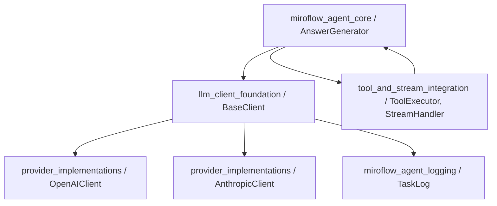
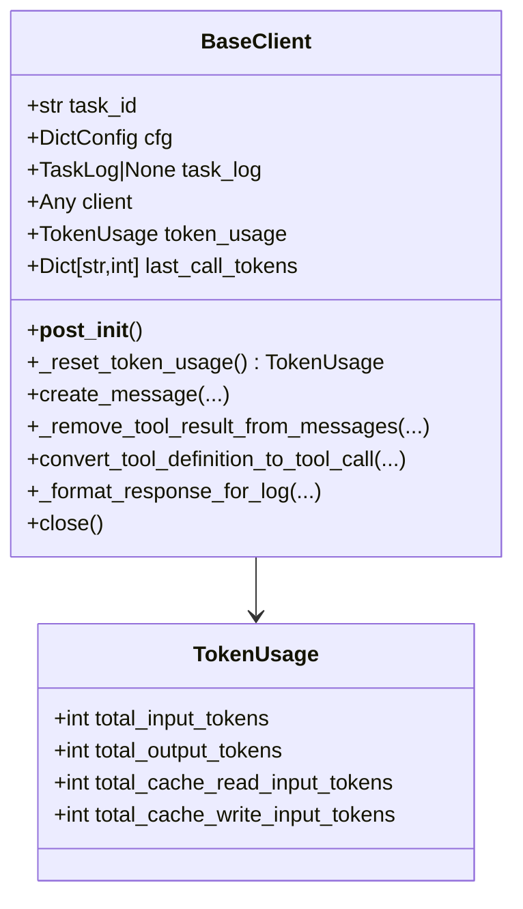
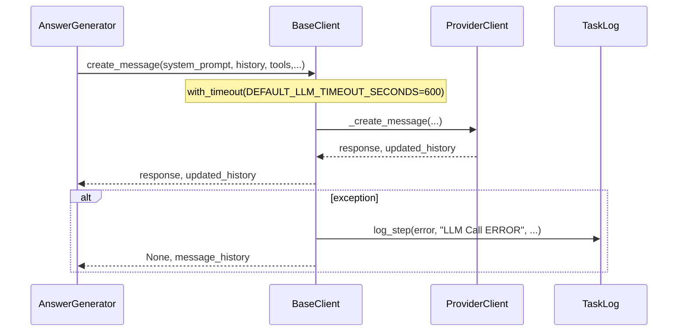
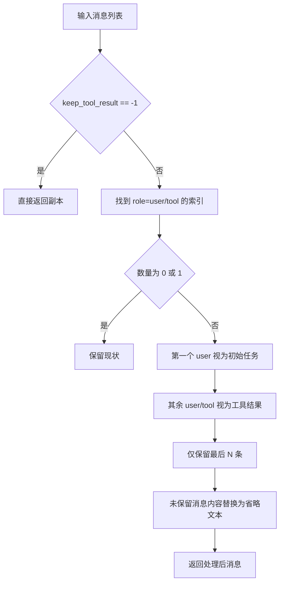
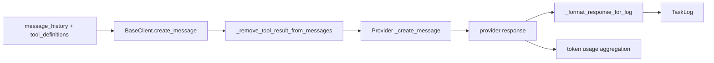

# llm_client_foundation 模块文档

## 模块概述与设计背景

`llm_client_foundation` 是 `miroflow_agent_llm_layer` 的基础抽象模块，核心包含 `BaseClient` 与 `TokenUsage`。这个模块的存在价值，不是“直接完成一次模型调用”，而是建立一层稳定的、跨供应商一致的 LLM 访问语义，让上层 Agent 编排逻辑不必感知 OpenAI、Anthropic 等不同 API 的细节差异。

在 Miroflow 的整体架构里，上层组件（如 `AnswerGenerator`、`Orchestrator`）持续进行多轮推理、工具调用、结果整合。若没有这一层基础抽象，所有 provider 差异（消息结构、token 统计口径、超时行为、工具定义格式）都会泄漏到上层，导致流程代码耦合、扩展困难、维护成本高。`llm_client_foundation` 通过“统一入口 + 统一状态 + 统一日志语义”把这些横切关注点收敛到同一位置。

从工程角度看，它承担了“协议适配层 + 运行治理层”的双重角色：前者负责把内部调用模型转成 provider 可接受的输入，后者负责超时控制、历史消息裁剪、日志可观测性与 token 统计基线。provider 具体实现（`OpenAIClient`、`AnthropicClient`）则在这个基础上补足 API 调用细节。

---

## 核心组件

本模块只有两个核心组件，但二者共同定义了 LLM 层的运行边界。

### `TokenUsage`

`TokenUsage` 是一个 `TypedDict`，用于统一不同厂商的 token 用量统计口径。

```python
class TokenUsage(TypedDict, total=True):
    total_input_tokens: int
    total_output_tokens: int
    total_cache_read_input_tokens: int
    total_cache_write_input_tokens: int
```

它的意义在于“归一化”：OpenAI 与 Anthropic 原生 usage 字段并不一致，尤其在缓存读写计费方面存在差异。该结构把这些差异抽象为四个统一维度，让上层日志、成本分析、回放诊断可以使用同一数据模型。

### `BaseClient`

`BaseClient` 是一个 `@dataclass` + `ABC` 的抽象基类，统一封装所有 provider 客户端共享的能力，包括配置解析、调用超时封装、工具结果保留策略、响应日志格式化与连接关闭逻辑。其本身不实现 provider 请求细节，而是通过子类 `_create_client` 与 `_create_message`（约定接口）完成实际调用。

---

## 架构位置与模块关系



`BaseClient` 是 `AnswerGenerator` 与 provider 实现之间的“中间稳定层”。`AnswerGenerator` 只需要依赖统一调用入口，不需要知道各 provider 的参数差异；provider 客户端只需实现自己的 API 细节，不必重复实现超时、消息裁剪、日志格式化这些公共能力。

如果你希望先理解上层流程，再回看本模块，建议先阅读 [answer_generator.md](answer_generator.md) 与 [miroflow_agent_core.md](miroflow_agent_core.md)。

---

## 组件结构图



这个结构体现了一个关键设计：`BaseClient` 管“生命周期与治理”，子类管“供应商实现”。因此它的字段里既有配置类参数（如采样参数、上下文上限），也有运行态状态（如 `token_usage`、`last_call_tokens`、`client`）。

---

## 生命周期与调用流程



该流程的重点不在“如何发请求”，而在“统一失败语义”。无论 provider 内部异常类型是什么，`BaseClient.create_message` 都尽量把错误收敛为日志 + `response=None` 的可恢复返回形式，便于上层控制重试与降级。

---

## 关键实现详解

## `__post_init__(self)`

初始化阶段会执行以下动作：先初始化 `last_call_tokens`，然后从 `cfg.llm` 与 `cfg.agent` 拉取运行参数，再初始化 `token_usage`，并调用 `_create_client()` 创建底层 SDK client。最后写入初始化日志。

它提取的关键配置包括：

- `provider`、`model_name`
- 采样参数：`temperature`、`top_p`、`min_p`、`top_k`
- 上下文与输出限制：`max_context_length`、`max_tokens`
- 连接行为：`async_client`、`api_key`、`base_url`
- 工具与生成细节：`use_tool_calls`、`repetition_penalty`
- 历史控制：`keep_tool_result`（来自 `cfg.agent`）

**副作用与注意点**：虽然 `task_log` 类型是 `Optional[TaskLog]`，但实现中直接调用 `self.task_log.log_step(...)`。如果未传入 `task_log`，初始化时可能触发 `AttributeError`。在当前实现语义下，应将 `task_log` 视作必传。

## `_reset_token_usage(self) -> TokenUsage`

该方法返回一个全 0 的标准 `TokenUsage`，用于初始化或重置累计统计。它没有外部副作用，但定义了 token 统计状态的基线结构。

## `_remove_tool_result_from_messages(self, messages, keep_tool_result) -> List[Dict]`

这是本模块最关键的成本控制机制之一。它通过“保留消息骨架、替换部分内容”来减少上下文 token 压力，同时尽量保持对话结构连续，避免直接删除消息导致的上下文断裂。



实现规则有几个容易忽略但非常关键的点。第一，首个 `user` 永远保留，系统将其视为“任务原始需求”；第二，后续 `user` 与 `tool` 会统一被当作工具结果候选；第三，被裁剪的消息不会删除，仅替换 `content` 为 `Tool result is omitted to save tokens.`，Anthropic（`content` 是 list）和 OpenAI（`content` 是 string）格式分别处理。

这种策略在长任务下可显著降低 token 消耗，但也可能带来语义损失：模型失去完整工具返回内容，只能看到“已省略”的占位信息。因此 `keep_tool_result` 需要根据任务复杂度与成本预算平衡设置。

## `create_message(...) -> Tuple[Any, List[Dict]]`

该方法是上层统一调用入口，带 `@with_timeout(DEFAULT_LLM_TIMEOUT_SECONDS)` 装饰器，默认总超时 600 秒。调用时它会将实际请求委托给子类 `_create_message(...)`，并在异常时记录错误日志后返回 `None` 响应。

参数上最重要的是 `system_prompt`、`message_history`、`tool_definitions` 与 `keep_tool_result`。`step_id`、`task_log`、`agent_type` 主要服务于调用上下文与日志标识。需要注意：当前实现主要使用 `self.task_log` 记录日志，入参 `task_log` 并未在基类里被实际消费。

## `convert_tool_definition_to_tool_call(tools_definitions)`

该静态方法负责把 MCP 风格工具定义转换成 OpenAI function-calling 所需结构。转换后工具名采用 `"{server_name}-{tool_name}"` 前缀规则，避免不同 server 下同名工具冲突。

```python
tool_def = {
  "type": "function",
  "function": {
    "name": f"{server['name']}-{tool['name']}",
    "description": tool["description"],
    "parameters": tool["schema"],
  }
}
```

虽然它声明为 `async def`，但内部没有 `await`，本质是纯转换函数。这通常不会影响正确性，但在风格上属于“异步签名兼容型实现”。

## `_format_response_for_log(self, response) -> Dict`

此方法将原始 provider 响应压缩成可记录的轻量结构。对文本响应会截断长度（如内容最多保留前 500 字符，工具输入最多 200 字符），并提取关键字段（`finish_reason`、`tool_calls_count` 等），提升排障可读性同时降低日志体积。

## `close(self)`

`close` 采用 best-effort 资源释放策略：优先调用 `self.client.close()`；若检测到异步 close 语义，则尝试关闭内部 `_client`。该实现强调“尽力释放”，但不保证所有 SDK 都能被完全优雅关闭。在严格资源管理场景下，建议在外层异步上下文中使用 provider 官方 `aclose()`（若有）。

---

## 配置模型与示例

```yaml
llm:
  provider: openai
  model_name: gpt-4o-mini
  temperature: 0.7
  top_p: 1.0
  min_p: 0.0
  top_k: -1
  max_context_length: 128000
  max_tokens: 4096
  async_client: true
  api_key: ${oc.env:LLM_API_KEY}
  base_url: null
  use_tool_calls: true
  repetition_penalty: 1.0

agent:
  keep_tool_result: 3
```

`keep_tool_result` 是生产环境中最敏感的调优项之一。值越小，成本越低，但模型能看到的历史工具细节越少；值越大，可追溯信息更完整，但上下文膨胀和超时风险更高。对于工具调用频繁的任务，通常建议从 2~5 起步。

---

## 使用方式与调用模式

```python
from apps.miroflow-agent.src.llm.providers.openai_client import OpenAIClient

client = OpenAIClient(task_id=task_id, cfg=cfg, task_log=task_log)

response, message_history = await client.create_message(
    system_prompt=system_prompt,
    message_history=message_history,
    tool_definitions=tool_definitions,
    keep_tool_result=cfg.agent.keep_tool_result,
    step_id=step_id,
    agent_type="main",
)

if response is None:
    # 上层可执行重试、降级或中断
    ...
```

工具定义转换通常在调用前完成：

```python
tools = await BaseClient.convert_tool_definition_to_tool_call(mcp_servers)
```

---

## 扩展新 Provider 的实践建议

新增 provider 客户端时，建议把 `BaseClient` 视为稳定契约层。实现上至少要补齐三类能力：一是 `_create_client()`，负责 SDK 初始化与连接参数注入；二是 `_create_message()`，负责请求参数构造、错误处理与 `(response, message_history)` 返回；三是 usage 映射，把 provider 原生 token 字段归并到 `TokenUsage`。

建议优先复用基类已有能力，而不是在子类重复实现消息裁剪、日志格式化和连接关闭逻辑。这样可以确保跨 provider 行为一致，降低系统性偏差。

更具体的 provider 行为请参考 [openai_client.md](openai_client.md) 与 [anthropic_client.md](anthropic_client.md)。

---

## 数据流与交互约束



这条链路说明 `BaseClient` 不是“被动透传层”，而是主动参与数据治理。消息进入 provider 前会被控制，响应回到上层前会被摘要化记录，token 使用会被统一归档。因此它是排障、成本分析、行为一致性的关键抓手。

---

## 边界条件、错误处理与已知限制

本模块在工程实践中有一些典型边界条件需要提前认知。首先，`task_log` 实际上是强依赖，尽管类型注解显示可选。其次，超时控制是“整次调用”级别，如果子类内部还有重试，会出现外层超时与内层重试叠加导致时延不可预期。再次，工具结果识别依赖 role 约定（首个 `user` 是任务，后续 `user/tool` 是工具回填）；若上游消息构造不遵循该约定，裁剪行为可能偏离预期。

此外，消息裁剪是替换内容而非删除条目，这能保持结构但不减少消息条数；某些 provider 若对消息条数敏感，仍可能触发额外行为。`close()` 也只是 best-effort，不应视为严格资源回收保证。

---

## 运维与排障建议

当你遇到“成本异常升高、响应不稳定、超时频发、模型上下文错乱”时，应优先检查 `TaskLog` 中的 LLM 相关步骤日志，尤其是消息保留摘要和异常日志。若日志显示大量工具结果被省略，但任务需要强上下文连续性，可适度增大 `keep_tool_result`。若超时集中在长链工具任务，应同时检查 provider 子类是否存在额外重试机制，与基类超时策略形成冲突。

在监控侧，建议把 `TokenUsage` 四个字段纳入统一指标采集，尤其关注缓存读写 token 占比，这对评估不同 provider 的实际成本差异非常有价值。

---

## 与其他文档的关联

- LLM 层总览： [miroflow_agent_llm_layer.md](miroflow_agent_llm_layer.md)
- Provider 具体实现： [openai_client.md](openai_client.md), [anthropic_client.md](anthropic_client.md)
- 核心调用链路： [answer_generator.md](answer_generator.md), [orchestrator.md](orchestrator.md), [miroflow_agent_core.md](miroflow_agent_core.md)
- 日志模型： [miroflow_agent_logging.md](miroflow_agent_logging.md)
