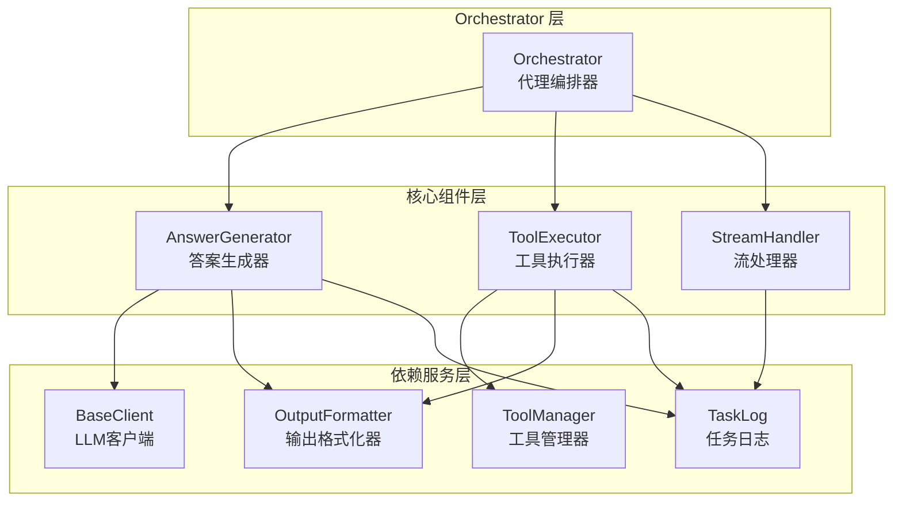
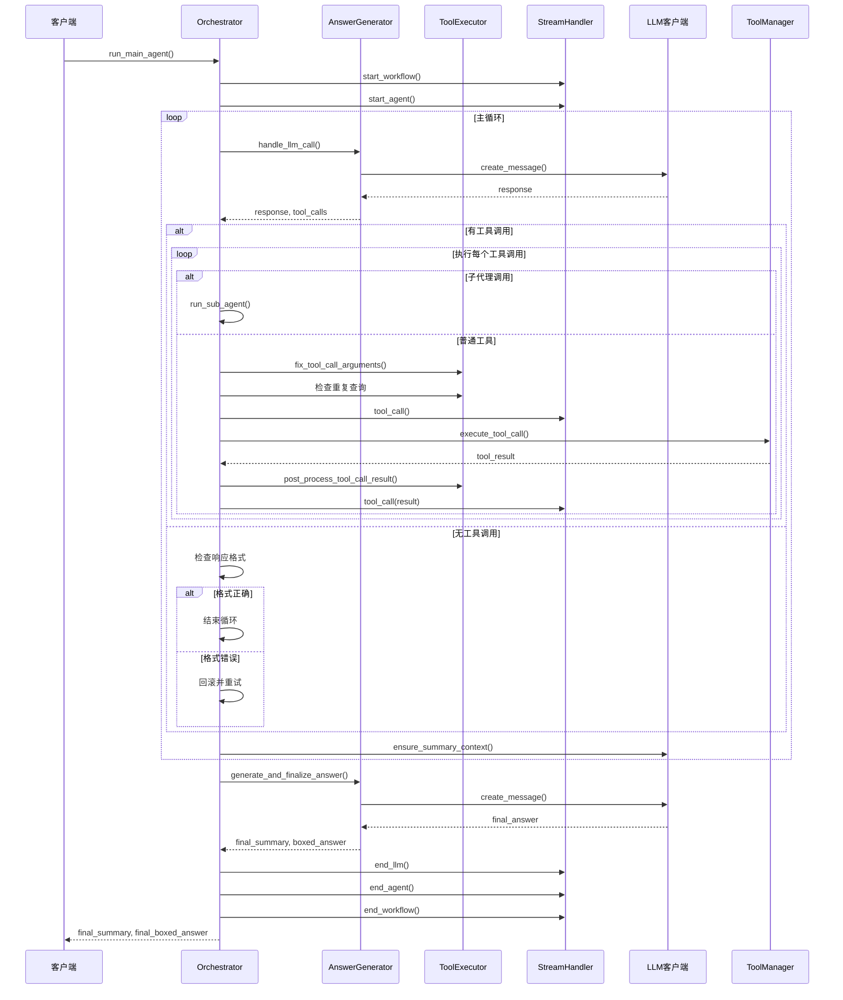

# MiroFlow Agent Core 模块文档

## 概述

MiroFlow Agent Core 是一个智能代理编排系统，负责协调主代理和子代理的任务执行流程。该模块提供了完整的代理任务管理框架，包括LLM调用处理、工具执行、流式事件处理和上下文管理等核心功能。

### 核心功能

- **代理编排**: 协调主代理和子代理的执行流程，支持多层级代理架构
- **工具执行管理**: 处理工具调用的参数修正、重复检测、结果处理和错误恢复
- **流式事件**: 提供完整的SSE协议支持，实现实时任务执行状态反馈
- **答案生成**: 管理最终答案生成，包括重试机制和上下文压缩
- **上下文管理**: 支持失败经验总结和多轮重试，提高任务完成率

### 设计理念

该模块采用模块化设计，将编排逻辑、工具执行、流式处理和答案生成分离为独立组件，便于维护和扩展。系统内置了多种容错机制，包括重复查询检测、回滚机制和上下文压缩，确保在复杂任务场景下的稳定性和可靠性。

## 架构概览



### 组件关系说明

1. **Orchestrator**: 作为核心协调者，负责初始化和管理其他组件，控制主代理和子代理的执行流程
2. **AnswerGenerator**: 专注于LLM调用处理和最终答案生成，包含重试机制和上下文管理逻辑
3. **ToolExecutor**: 处理所有工具调用相关逻辑，包括参数修正、重复检测和结果处理
4. **StreamHandler**: 管理SSE流式事件，向客户端实时推送任务执行状态

各组件之间通过明确的接口协作，确保了系统的可维护性和可扩展性。

## 核心组件

### Orchestrator

Orchestrator 是整个系统的核心编排组件，负责管理代理任务的完整生命周期。它协调主代理和子代理的执行，处理LLM调用、工具执行、流式事件和上下文管理。

主要职责：
- 初始化和配置核心组件
- 管理主代理执行循环
- 协调子代理的启动和执行
- 处理上下文压缩和失败重试
- 维护任务执行状态和日志

详细信息请参考 [orchestrator.md](orchestrator.md)

### AnswerGenerator

AnswerGenerator 专注于最终答案的生成和上下文管理。它处理LLM调用、失败总结生成、最终答案重试和各种回退策略。

主要职责：
- 统一处理LLM调用和日志记录
- 生成失败经验总结用于上下文压缩
- 实现最终答案的重试机制
- 根据上下文管理设置处理回退策略

详细信息请参考 [answer_generator.md](answer_generator.md)

### StreamHandler

StreamHandler 负责管理SSE（Server-Sent Events）协议的流式事件，提供实时的任务执行状态反馈。

主要职责：
- 发送工作流生命周期事件
- 管理代理生命周期事件
- 处理LLM交互事件
- 推送工具调用事件
- 错误状态通知

详细信息请参考 [stream_handler.md](stream_handler.md)

### ToolExecutor

ToolExecutor 处理工具调用的执行，包括参数修正、重复检测、结果处理和错误处理。

主要职责：
- 修正常见的工具调用参数错误
- 检测和处理重复查询
- 处理工具执行结果（包括演示模式下的截断）
- 实现错误检测和回滚逻辑
- 记录工具调用执行信息

详细信息请参考 [tool_executor.md](tool_executor.md)

## 工作流程

### 主代理执行流程



### 子代理执行流程

子代理执行流程与主代理类似，但具有以下特点：
- 独立的任务描述和系统提示
- 专用的工具集配置
- 限制的最大回合数
- 执行完成后将结果返回给主代理

### 上下文管理流程

当启用上下文管理（context_compress_limit > 0）时，系统会在任务失败时生成失败经验总结，用于后续重试：

1. 检测任务是否因达到最大回合数或上下文限制而失败
2. 生成结构化的失败经验总结
3. 在下次重试时使用总结作为上下文
4. 支持多轮重试直到达到压缩限制

## 使用指南

### 基本使用

```python
from miroflow_agent_core.orchestrator import Orchestrator
from miroflow_agent_llm_layer import OpenAIClient
from miroflow_tools_management import ToolManager
from miroflow_agent_io import OutputFormatter
from miroflow_agent_logging import TaskLog
from omegaconf import DictConfig

# 初始化组件
tool_manager = ToolManager(...)
llm_client = OpenAIClient(...)
output_formatter = OutputFormatter(...)
task_log = TaskLog(...)
cfg = DictConfig(...)

# 创建编排器
orchestrator = Orchestrator(
    main_agent_tool_manager=tool_manager,
    sub_agent_tool_managers={},
    llm_client=llm_client,
    output_formatter=output_formatter,
    cfg=cfg,
    task_log=task_log,
    stream_queue=None
)

# 执行任务
final_summary, final_answer, failure_summary = await orchestrator.run_main_agent(
    task_description="解决这个问题...",
    task_id="task_001"
)
```

### 配置选项

主要配置项：
- `agent.main_agent.max_turns`: 主代理最大回合数
- `agent.sub_agents.<agent_name>.max_turns`: 子代理最大回合数
- `agent.context_compress_limit`: 上下文压缩限制（0表示禁用）
- `agent.keep_tool_result`: 工具结果保留策略

### 扩展开发

系统设计支持多种扩展方式：
- 自定义工具：通过ToolManager注册新工具
- 新的LLM提供商：继承BaseClient实现新的LLM客户端
- 自定义流式处理：扩展StreamHandler添加新的事件类型

## 注意事项

### 错误处理

- 系统内置了多种回滚机制，处理格式错误、工具调用失败等情况
- 最大连续回滚次数默认为5次，超过后会终止任务
- 上下文管理模式下，失败时会生成经验总结用于重试

### 性能考虑

- 演示模式下会自动截断长文本以支持更多对话回合
- 工具定义会被缓存以减少重复获取
- 支持配置上下文压缩来管理长对话

### 已知限制

- 子代理调用会启动完整的子代理会话，可能增加资源消耗
- 上下文压缩需要额外的LLM调用，会增加延迟和成本
- 某些工具可能有特定的参数格式要求，需要通过fix_tool_call_arguments处理

## 文档索引与交叉引用

## 子模块导览（本次文档拆分）

为避免在主文档中重复展开实现细节，`miroflow_agent_core` 已按“运行时编排、答案收敛、工具与流式集成”拆分为三个子模块文档。下面给出每个子模块的高层说明与阅读入口。

### 1) orchestration_runtime

`orchestration_runtime` 聚焦 `Orchestrator` 运行时状态机，是整个系统从“收到任务”到“产出最终答案”的执行骨架。该文档详细解释了主代理与子代理的多轮循环、回滚保护、重复查询防抖、上下文长度检查以及最终总结触发条件，适合用来理解系统为什么能在复杂失败路径下保持可恢复性。若你要排查“为什么任务在第 N 轮提前结束”或“为什么触发了回滚/子代理切换”，应优先阅读该文档。

详见：[orchestration_runtime.md](orchestration_runtime.md)

### 2) answer_lifecycle

`answer_lifecycle` 聚焦 `AnswerGenerator` 的答案生命周期控制，不负责工具执行本身，而负责“如何把已有上下文收敛为可交付答案”。文档重点说明了统一 LLM 调用出口、`\boxed{}` 格式校验、最终答案重试机制、失败经验摘要生成，以及在不同 context management 模式下为何采用不同 fallback 策略。若你关注“最终答案为什么失败”“为什么有时使用中间答案兜底、有时不兜底”，该文档是最直接的入口。

详见：[answer_lifecycle.md](answer_lifecycle.md)

### 3) tool_and_stream_integration

`tool_and_stream_integration` 解释 `ToolExecutor` 与 `StreamHandler` 如何共同支撑执行稳定性与可观测性：前者负责参数修复、结果后处理、回滚判定与调用记录，后者负责 SSE 生命周期事件、工具调用事件和错误事件推送。该拆分把“执行质量治理”和“前端实时反馈协议”从编排主循环中解耦，既便于维护也便于独立扩展。如果你要新增工具去重策略、优化 Demo 模式截断、或扩展流事件类型，应从这里开始。

详见：[tool_and_stream_integration.md](tool_and_stream_integration.md)


`miroflow_agent_core` 负责总体编排，但为了保持文档职责清晰，本文件只覆盖架构和端到端行为；具体实现细节请进入对应子模块文档阅读：

- 主编排与状态机（主代理/子代理循环、回滚、终局收敛）：[orchestrator.md](orchestrator.md)
- 最终答案与上下文管理策略（重试、失败经验摘要、fallback）：[answer_generator.md](answer_generator.md)
- 实时事件协议与 SSE 推送（workflow/agent/llm/tool_call 生命周期）：[stream_handler.md](stream_handler.md)
- 工具调用治理（参数修正、判重键、结果后处理、回滚判定）：[tool_executor.md](tool_executor.md)

与本模块强关联的外围模块文档如下：

- LLM 抽象与多 Provider 适配：[miroflow_agent_llm_layer.md](miroflow_agent_llm_layer.md)
- 输入处理与输出格式化：[miroflow_agent_io.md](miroflow_agent_io.md)
- 任务日志与可观测性：[miroflow_agent_logging.md](miroflow_agent_logging.md)
- 工具注册/执行与 MCP 集成：[miroflow_tools_management.md](miroflow_tools_management.md)
- 通用响应封装（`ResponseBox` / `ErrorBox`）：[miroflow_agent_shared_utils.md](miroflow_agent_shared_utils.md)

建议阅读顺序：先读本文件理解整体架构，再依次阅读 `orchestrator -> answer_generator -> tool_executor -> stream_handler`，最后按需深入外围模块。