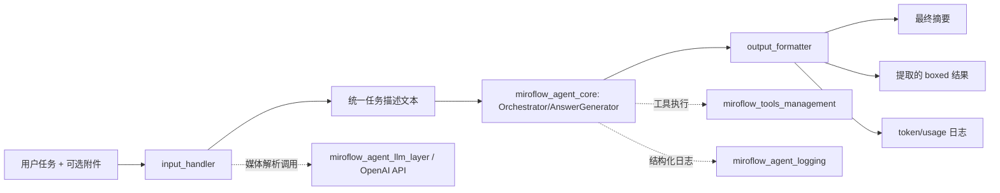
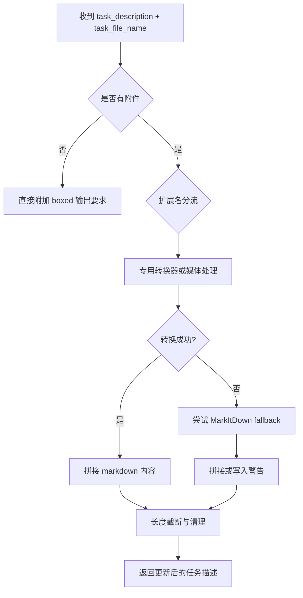
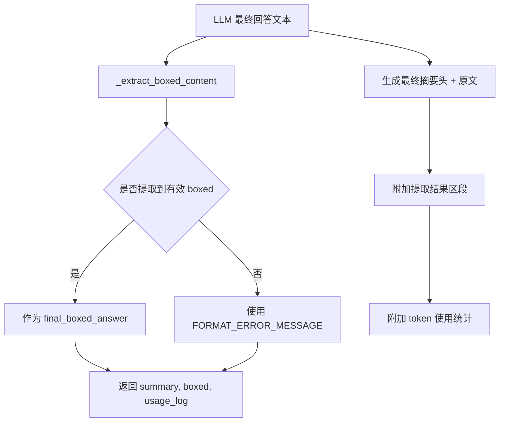

# miroflow_agent_io 模块文档

## 1. 模块简介

`miroflow_agent_io` 是 MiroFlow Agent 在“输入进入智能体”和“结果离开智能体”两端的关键桥接层。它解决的是一个很实际的问题：用户给出的任务通常伴随多种异构附件（文本、Office 文档、图片、音频、视频、压缩包等），而 LLM 主流程更擅长消费规范化的文本上下文。该模块通过输入标准化和输出收口，把复杂、松散、不可控的原始数据，转化为可在编排器中稳定流转的消息结构。

从系统设计角度看，这个模块存在的价值有三点。第一，降低上游编排逻辑复杂度：`Orchestrator` 不需要了解每种文件格式细节，只需调用统一入口即可（见 [miroflow_agent_core.md](miroflow_agent_core.md)）。第二，增强多模态任务可执行性：在输入阶段就把媒体内容转成文字描述，并补充“任务相关信息抽取”，减少后续推理负担。第三，确保输出可被自动化流程消费：通过 `\boxed{}` 提取与工具结果截断机制，使最终答案提取、日志记录和重试判断更可控。

---

## 2. 架构总览



这张图体现了模块在系统中的位置：`input_handler` 负责把输入整理成可供核心代理直接消费的上下文，`output_formatter` 负责把核心代理输出整理成可供系统和用户消费的结果。它本身不承担任务推理，而是为推理链路“清洗输入、收敛输出”。

---

## 3. 子模块与职责分工

`miroflow_agent_io` 由两个可清晰分离的子模块组成：

### 3.1 `input_handler`

`input_handler` 是输入侧统一入口，提供 `process_input` 与一组格式转换器（HTML/DOCX/XLSX/PPTX/ZIP 等），并包含图片、音频、视频的描述与任务相关信息抽取逻辑。它的核心策略是“专用解析优先 + MarkItDown 兜底 + 长内容截断”，保证即便面对未知或复杂格式，也尽量生成可用文本供 LLM 继续处理。

详细实现、函数参数、边界行为和扩展方式请见：
- [input_handler.md](input_handler.md)（子模块详细文档，推荐）
- [sub-input_handler.md](sub-input_handler.md)（补充版本）

### 3.2 `output_formatter`

`output_formatter` 负责输出阶段的结构化收口。它会把工具调用结果格式化为 LLM 可读消息、从最终回答中提取最后一个有效 `\boxed{...}`、并拼装最终摘要与 token 使用日志。该模块对“格式正确性”非常敏感，直接影响最终答案是否能被系统自动提取和下游评测。

详细实现、算法细节与调用链请见：
- [output_formatter.md](output_formatter.md)（子模块详细文档，推荐）
- [sub-output_formatter.md](sub-output_formatter.md)（补充版本）

---

## 4. 关键流程

### 4.1 输入处理流程



输入链路的设计重点不是“完美还原文件格式”，而是“以高鲁棒性获得可用信息”。因此它在很多地方采用了容错和降级策略：文件找不到、转换异常、媒体 API 失败都不会让整个任务直接中断，而是写入提示信息并继续。

### 4.2 输出格式化流程



输出侧的目标是“可判定、可记录、可重试”。当 boxed 提取失败时，系统可以依据 `FORMAT_ERROR_MESSAGE` 触发重试或失败经验总结（见 [answer_generator.md](answer_generator.md)）。

---

## 5. 对外使用方式

在核心系统中，这个模块通常不是由业务代码直接调用，而是由编排器自动接入：

1. `Orchestrator.run_main_agent` 在主循环前调用 `process_input`；
2. 工具调用后，`OutputFormatter.format_tool_result_for_user` 将结果回灌给 LLM；
3. 任务结束时，`OutputFormatter.format_final_summary_and_log` 产出最终摘要与 boxed 结果。

如果你在离线脚本中单独使用，也可以这样做：

```python
from apps.miroflow_agent.src.io.input_handler import process_input
from apps.miroflow_agent.src.io.output_formatter import OutputFormatter

prompt, _ = process_input("请根据附件给出结论", "sample.xlsx")

formatter = OutputFormatter()
summary, boxed, usage = formatter.format_final_summary_and_log(
    "最终答案是 \\boxed{42}",
    client=None,
)
```

---

## 6. 配置与运行依赖

### 环境变量

- `OPENAI_API_KEY`：媒体 caption/转录/任务相关抽取依赖该密钥。  
- `OPENAI_BASE_URL`：可选，默认 `https://api.openai.com/v1`。

### 核心第三方依赖

- 文档解析：`pdfminer`、`mammoth`、`markdownify`、`beautifulsoup4`  
- Office 解析：`openpyxl`、`python-pptx`  
- 兜底转换：`markitdown`  
- 多模态/语音能力：`openai`

---

## 7. 设计取舍、限制与风险

1. **媒体文件成本问题**：图片/视频通过 base64 内联上传，超大文件会明显增加延迟和 token 成本。  
2. **字符截断非 token 截断**：当前按字符长度限制内容，无法精确对齐不同模型的 token 计费粒度。  
3. **ZIP 安全与资源风险**：压缩包解压和递归处理对磁盘与 I/O 压力较大；面对不可信输入应加强安全检查。  
4. **格式保真有限**：XLSX/PPTX 的样式转换以“可读优先”，不保证视觉保真。  
5. **私有方法被跨模块使用**：`_extract_boxed_content` 虽是私有命名，但被核心流程直接调用，重构时需慎重。

---

## 8. 与其他模块关系（避免重复阅读）

- 核心编排与重试策略：见 [miroflow_agent_core.md](miroflow_agent_core.md) 与 [answer_generator.md](answer_generator.md)。  
- LLM 客户端实现与 token 统计接口：见 [miroflow_agent_llm_layer.md](miroflow_agent_llm_layer.md)、[base_client.md](base_client.md)、[openai_client.md](openai_client.md)、[anthropic_client.md](anthropic_client.md)。  
- 工具执行侧：见 [miroflow_tools_management.md](miroflow_tools_management.md)。  
- 日志模型与输出：见 [miroflow_agent_logging.md](miroflow_agent_logging.md)。

### 本模块文档索引

- 主文档（总览）：[miroflow_agent_io.md](miroflow_agent_io.md)
- 子模块详解（推荐，最新）：[input_processing.md](input_processing.md)、[output_formatting.md](output_formatting.md)
- 兼容/历史说明：[sub-input_handler.md](sub-input_handler.md)、[sub-output_formatter.md](sub-output_formatter.md)、[input_handler.md](input_handler.md)、[output_formatter.md](output_formatter.md)

若你是第一次接手该模块，建议阅读顺序：
1) 本文档；2) [input_processing.md](input_processing.md)；3) [output_formatting.md](output_formatting.md)；4) [miroflow_agent_core.md](miroflow_agent_core.md)。