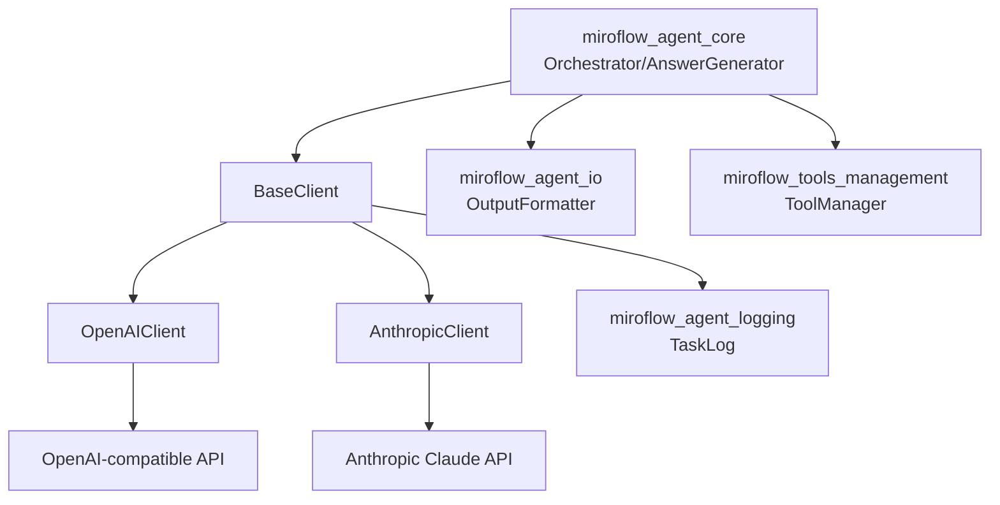
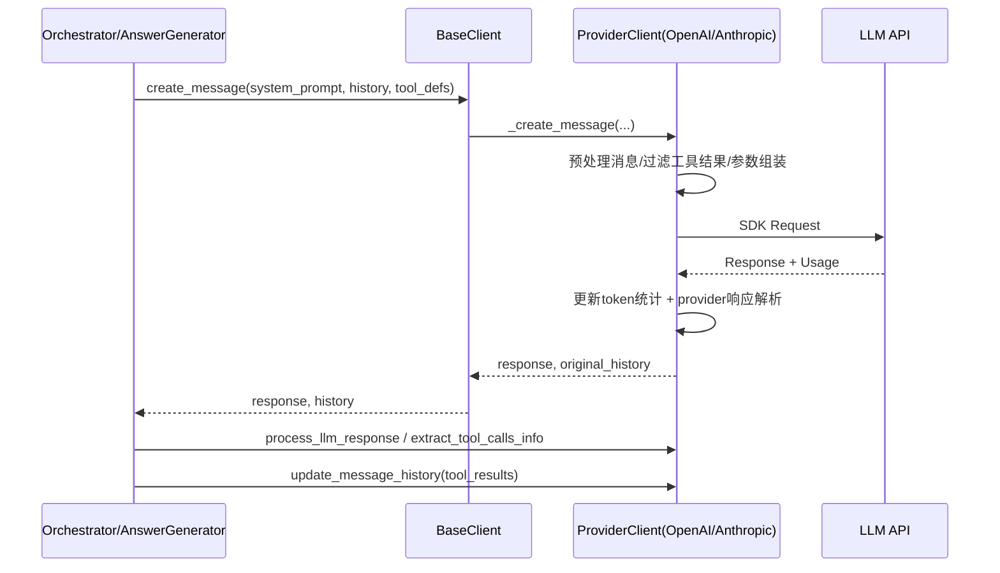
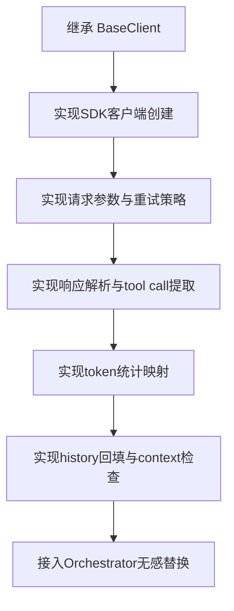

# miroflow_agent_llm_layer 模块文档

## 1. 模块简介与设计动机

`miroflow_agent_llm_layer` 是 MiroFlow Agent 的“模型适配层”。它位于任务编排与工具执行逻辑（[`miroflow_agent_core.md`](miroflow_agent_core.md)）和具体 LLM 提供商 API（OpenAI/Anthropic）之间，核心目标是把**供应商差异、消息协议差异、token 统计差异、重试策略差异**统一封装起来，让上层只关注“要问什么、工具结果怎么回填、何时结束循环”。

从工程角度看，这个模块解决了三个长期痛点。第一，不同厂商 SDK 的调用参数、返回结构、token 字段命名并不一致，如果直接在 `Orchestrator` 中分支处理会快速失控。第二，Agent 循环对稳定性要求很高，必须有统一的超时、错误兜底与重试治理，避免单次 API 抖动导致整任务失败。第三，工具型 Agent 的消息历史会增长很快，不进行上下文治理（如工具结果裁剪、总结前回滚）会频繁触发 context overflow。该模块正是围绕这三点进行抽象和实现。

## 2. 架构总览

`miroflow_agent_llm_layer` 由一个抽象基类和两个 provider 实现构成：

- `BaseClient`：统一接口、共享能力、生命周期管理。
- `OpenAIClient`：面向 OpenAI Chat Completions 及兼容端点。
- `AnthropicClient`：面向 Anthropic Claude Messages API，并支持 prompt caching。
- `TokenUsage`：统一 token 统计结构。



上图体现了职责边界：`miroflow_agent_core` 只依赖 `BaseClient` 抽象，不直接耦合任一供应商；具体 API 适配被下沉到 provider 类中。日志写入则统一通过 `TaskLog`（见 [`miroflow_agent_logging.md`](miroflow_agent_logging.md)）完成。

## 3. 关键调用链路与数据流

一次典型的主循环调用路径如下：



这里有两个容易被忽略但非常关键的设计点。其一，发送给 LLM 的历史可以是“裁剪副本”，但返回给上层的是“原始历史”，这样既节省 token 又保留完整审计轨迹。其二，上下文治理并不只在总结阶段做一次，而是每轮工具执行后都可通过 `ensure_summary_context` 预判风险并回滚最近 assistant-user 对，给总结留出足够上下文空间。

## 4. 子模块说明与文档索引

为避免在总览文档重复实现细节，`miroflow_agent_llm_layer` 已拆分为两个“结构化子模块文档”（由当前模块核心组件聚合而成），建议先按这两个文档阅读，再按需深入到单文件文档：

### 4.1 `llm_client_foundation`（基础抽象层）

该子模块聚焦 `BaseClient` 与 `TokenUsage`，解释了统一调用入口、配置注入、超时治理、消息裁剪、日志格式化与 token 口径归一化等“跨 provider 公共能力”。如果你需要理解“为什么上层可以无感切换 OpenAI / Anthropic”，这份文档是首选入口。详见 [`llm_client_foundation.md`](llm_client_foundation.md)。

### 4.2 `provider_implementations`（供应商实现层）

该子模块聚焦 `OpenAIClient` 与 `AnthropicClient` 的实现差异，包括请求参数构造、重试策略、上下文保护、cache 统计与消息回填格式。它回答的是“统一接口之下，两个 provider 实际行为哪里不同”。详见 [`provider_implementations.md`](provider_implementations.md)。

### 4.3 单文件实现文档（按类精读）

如果你需要逐个类阅读源码级细节，可继续查看：[`base_client.md`](base_client.md)、[`openai_client.md`](openai_client.md)、[`anthropic_client.md`](anthropic_client.md)。

## 5. 与其他模块的协作关系

本模块不是独立运行单元，而是与系统其他模块共同构成闭环：

- 与 [`miroflow_agent_core.md`](miroflow_agent_core.md) 的关系：`Orchestrator` 和 `AnswerGenerator` 通过 `BaseClient` 发起推理、解析响应、推进 ReAct 循环。
- 与 [`miroflow_tools_management.md`](miroflow_tools_management.md) 的关系：工具定义由 ToolManager 提供，LLM 层负责把工具结果回填到消息历史，驱动下一轮决策。
- 与 [`miroflow_agent_io.md`](miroflow_agent_io.md) 的关系：工具执行结果会先经 `OutputFormatter` 规整，再由 provider 客户端以自身格式写回历史。
- 与 [`miroflow_agent_logging.md`](miroflow_agent_logging.md) 的关系：token 使用、重试、错误、回滚等关键路径事件统一入 `TaskLog`，便于诊断与成本追踪。

## 6. 典型配置与使用方式

在运行时，`BaseClient.__post_init__` 从 Hydra 配置读取核心参数，包括：`provider`、`model_name`、`temperature`、`top_p`、`top_k`、`max_context_length`、`max_tokens`、`async_client`、`keep_tool_result`、`api_key`、`base_url` 等。

```yaml
llm:
  provider: openai         # 或 anthropic
  model_name: gpt-4o-mini
  api_key: "${env:LLM_API_KEY}"
  base_url: "https://api.openai.com/v1"
  temperature: 0.2
  top_p: 0.95
  min_p: 0.0
  top_k: -1
  max_context_length: 128000
  max_tokens: 4096
  async_client: true
  repetition_penalty: 1.0

agent:
  keep_tool_result: 3      # -1 保留全部；0 仅保留初始任务
```

`keep_tool_result` 是实践中很重要的成本/效果杠杆：

- `-1`：保留全部工具结果，最完整但最耗 token。
- `0`：只保留初始任务，其余工具结果替换为占位文本，最省 token。
- `N>0`：保留最近 N 次工具结果，是推荐的折中策略。

## 7. 扩展新 Provider 的建议

若需要支持新模型供应商（例如自研网关），建议遵循现有模式：继承 `BaseClient` 并至少实现 `_create_client`、`_create_message`、`process_llm_response`、`update_message_history`、`ensure_summary_context`、`format_token_usage_summary` 等 provider 关键方法。最重要的是保持对上层的“行为契约”不变：返回值结构一致、异常策略一致、message history 更新语义一致。



## 8. 边界条件、错误场景与已知限制

该模块已覆盖大部分运行时异常，但仍有一些需要开发者关注的行为细节。

首先，`BaseClient.create_message` 会兜底捕获异常并返回 `response=None`，因此上层必须始终检查空响应。其次，`OpenAIClient.process_llm_response` 只显式支持 `stop` 和 `length`，若后端返回其他 `finish_reason` 可能抛出 `ValueError`。再次，Anthropic 路径虽然会解析 `tool_use` 块，但工具调用提取函数当前仍主要依赖文本解析协议，因此系统 prompt 中的工具调用格式约束非常重要。

此外，token 统计维度在不同 provider 之间存在天然差异：OpenAI 无 cache write 维度，Anthropic 有 read/write。当前 `OpenAIClient.format_token_usage_summary` 读取 `total_cache_input_tokens`，而统一结构实际是 `total_cache_read_input_tokens`，这会导致缓存统计展示可能不准确（实现层面的已知不一致点）。

最后，上下文估算基于 `tiktoken` 与启发式 buffer（含额外 1000 token 安全垫），它是“防超限策略”而非计费精算工具；在超长多轮任务中仍建议配合更积极的历史压缩策略。

## 9. 快速导航

- 抽象与通用能力：[`base_client.md`](base_client.md)
- OpenAI 适配实现：[`openai_client.md`](openai_client.md)
- Anthropic 适配实现：[`anthropic_client.md`](anthropic_client.md)
- 编排主流程：[`miroflow_agent_core.md`](miroflow_agent_core.md)
- 日志结构：[`miroflow_agent_logging.md`](miroflow_agent_logging.md)
- 工具管理：[`miroflow_tools_management.md`](miroflow_tools_management.md)
