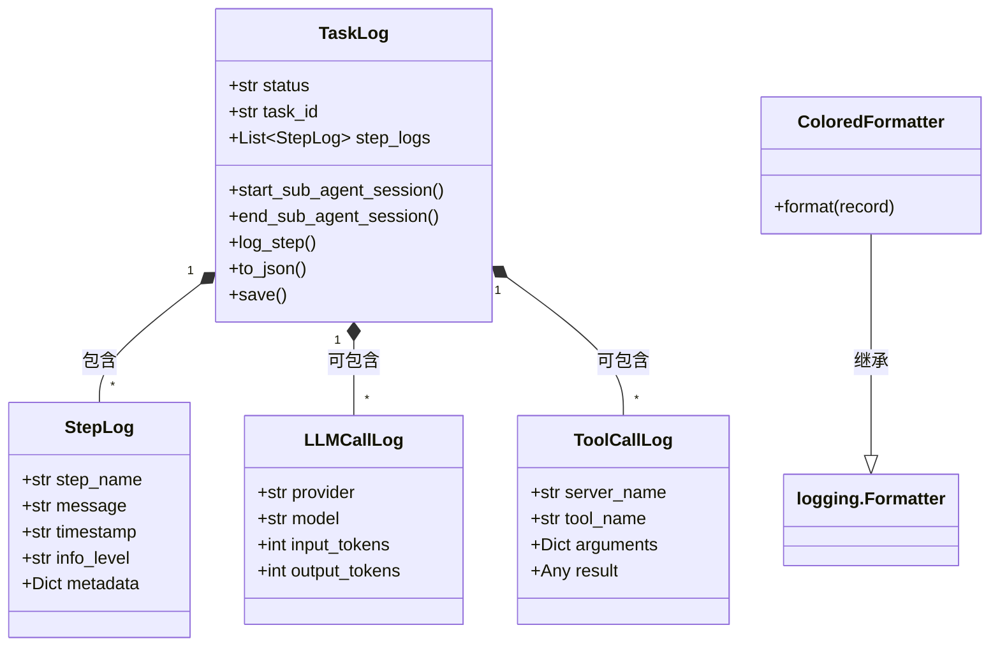
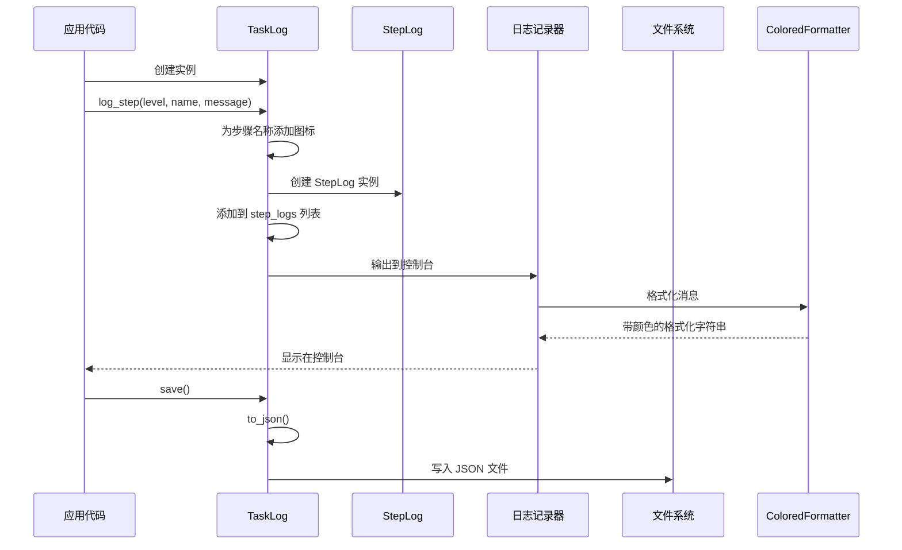
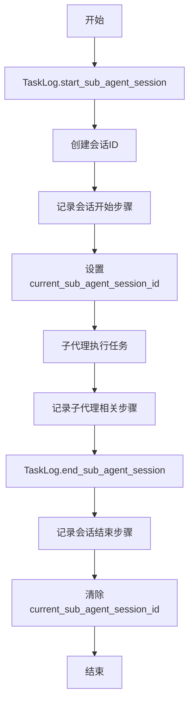

# miroflow_agent_logging 模块文档

## 概述

miroflow_agent_logging 模块是 MiroFlow Agent 系统的核心日志记录组件，专门用于任务执行过程的结构化追踪和详细记录。该模块提供了完整的日志管理功能，包括任务生命周期跟踪、执行步骤记录、LLM（大型语言模型）调用详情、工具调用信息以及彩色控制台输出格式化。

### 设计理念

本模块的设计围绕以下核心原则：
1. **结构化数据记录**：使用数据类（dataclass）提供类型安全的日志记录
2. **可视化增强**：通过彩色格式化和图标提高日志可读性
3. **持久化支持**：自动将日志序列化为 JSON 文件便于后续分析
4. **多会话管理**：支持主代理和子代理的会话分离记录
5. **时区一致性**：统一使用 UTC+8 时区确保时间戳的一致性

### 主要功能

- 任务级别的日志管理（开始、结束、状态跟踪）
- 详细的执行步骤记录（支持多种信息级别）
- LLM 调用的技术细节记录（Token 使用情况、缓存信息等）
- 工具调用的完整追踪（参数、结果、错误信息）
- 子代理会话的独立管理
- 彩色控制台输出格式化
- JSON 格式的日志持久化

---

## 核心组件详解

### 1. TaskLog 类

`TaskLog` 是整个日志系统的核心数据类，负责协调和存储所有与任务执行相关的日志信息。

#### 主要职责

- 管理任务的整体状态和生命周期
- 维护主代理和子代理的消息历史
- 记录执行步骤、LLM 调用和工具调用
- 处理日志的序列化和持久化

#### 核心属性

| 属性名 | 类型 | 描述 |
|--------|------|------|
| status | str | 任务当前状态，默认为 "running" |
| start_time | str | 任务开始时间 |
| end_time | str | 任务结束时间 |
| task_id | str | 任务唯一标识符 |
| input | Any | 任务输入数据 |
| final_boxed_answer | str | 最终的答案结果 |
| error | str | 错误信息（如果有） |
| log_dir | str | 日志保存目录，默认为 "logs" |
| step_logs | List[StepLog] | 执行步骤日志列表 |
| main_agent_message_history | List[Dict] | 主代理消息历史 |
| sub_agent_message_history_sessions | Dict[str, List[Dict]] | 子代理会话消息历史 |

#### 核心方法

##### `start_sub_agent_session(sub_agent_name: str, subtask_description: str) -> str`

启动一个新的子代理会话，为该会话创建唯一标识符并记录会话开始事件。

**参数：**
- `sub_agent_name`: 子代理的名称
- `subtask_description`: 子任务的描述

**返回值：**
- 新创建的会话 ID，格式为 `{sub_agent_name}_{counter}`

**使用示例：**
```python
task_log = TaskLog(task_id="task_001")
session_id = task_log.start_sub_agent_session("research_agent", "查找相关技术文档")
# session_id 可能为 "research_agent_1"
```

##### `end_sub_agent_session(sub_agent_name: str) -> Optional[str]`

结束当前的子代理会话，记录会话结束事件并清除当前会话 ID。

**参数：**
- `sub_agent_name`: 子代理的名称

**返回值：**
- 始终返回 None（设计上的一致性选择）

##### `log_step(info_level: Literal["info", "warning", "error", "debug"], step_name: str, message: str, metadata: Optional[Dict[str, Any]] = None)`

记录任务执行的一个步骤，这是最常用的日志记录方法。该方法会自动为步骤名称添加适当的图标，并将日志同时输出到控制台和内部存储。

**参数：**
- `info_level`: 信息级别，必须是 "info"、"warning"、"error" 或 "debug" 之一
- `step_name`: 步骤名称，会根据内容自动添加图标
- `message`: 详细的步骤描述
- `metadata`: 可选的附加元数据

**图标自动添加规则：**
- 工具调用开始：▶️
- 工具调用成功：✅
- 工具调用错误：❌
- 代理相关：🤖
- 主代理：👑
- LLM 相关：🧠
- 工具管理器：🔧
- Python 工具：🐍
- 搜索工具：🔍
- 浏览器工具：🌐

**使用示例：**
```python
task_log.log_step(
    "info",
    "Main Agent | Processing",
    "开始处理用户查询",
    {"query": "什么是机器学习？"}
)

task_log.log_step(
    "error",
    "Tool Call Error",
    "无法连接到数据库",
    {"database": "users_db", "error_code": 503}
)
```

##### `to_json() -> str`

将 TaskLog 对象序列化为格式化的 JSON 字符串。该方法会自动处理非 JSON 可序列化的对象。

**返回值：**
- 格式化的 JSON 字符串，使用 2 空格缩进

**特殊处理：**
- `Path` 对象转换为字符串
- 递归处理字典和列表
- 处理具有 `__dict__` 属性的自定义对象
- Unicode 编码失败时会回退到 ASCII 编码

##### `save()`

将 TaskLog 保存为 JSON 文件。文件会保存在 `log_dir` 指定的目录中，文件名包含任务 ID 和时间戳。

**返回值：**
- 保存的文件路径

**文件命名格式：**
```
{log_dir}/task_{task_id}_{timestamp}.json
```

##### `serialize_for_json(obj)`

递归处理对象，将其转换为 JSON 可序列化的格式。这是一个内部方法，通常不需要直接调用。

##### `from_dict(cls, d: dict) -> "TaskLog"`

从字典创建 TaskLog 实例的类方法。

**参数：**
- `d`: 包含 TaskLog 字段值的字典

**返回值：**
- 新的 TaskLog 实例

---

### 2. StepLog 类

`StepLog` 是一个数据类，用于记录单个执行步骤的详细信息。

#### 属性

| 属性名 | 类型 | 描述 |
|--------|------|------|
| step_name | str | 步骤名称（包含图标） |
| message | str | 步骤详细描述 |
| timestamp | str | UTC+8 格式的时间戳 |
| info_level | Literal["info", "warning", "error", "debug"] | 信息级别 |
| metadata | Dict[str, Any] | 附加元数据 |

#### 验证

在初始化后，`__post_init__` 方法会验证 `info_level` 是否为有效值。如果不是，会抛出 `ValueError`。

---

### 3. LLMCallLog 类

`LLMCallLog` 是一个数据类，专门用于记录 LLM 调用的技术细节。

#### 属性

| 属性名 | 类型 | 默认值 | 描述 |
|--------|------|--------|------|
| provider | str | - | LLM 提供商名称（如 "openai"、"anthropic"） |
| model | str | - | 使用的模型名称 |
| input_tokens | int | 0 | 输入 Token 数量 |
| output_tokens | int | 0 | 输出 Token 数量 |
| cache_creation_tokens | int | 0 | 缓存创建的 Token 数量 |
| cache_read_tokens | int | 0 | 缓存读取的 Token 数量 |
| error | Optional[str] | None | 错误信息（如果有） |

**使用场景：** 该类通常与 [miroflow_agent_llm_layer](miroflow_agent_llm_layer.md) 模块配合使用，记录来自 `BaseClient` 的调用详情。

---

### 4. ToolCallLog 类

`ToolCallLog` 是一个数据类，用于记录工具调用的详细信息。

#### 属性

| 属性名 | 类型 | 默认值 | 描述 |
|--------|------|--------|------|
| server_name | str | - | 工具服务器名称 |
| tool_name | str | - | 工具名称 |
| arguments | Dict[str, Any] | {} | 调用参数 |
| result | Any | None | 调用结果 |
| error | Optional[str] | None | 错误信息（如果有） |
| call_time | Optional[str] | None | 调用时间 |

**使用场景：** 该类与 [miroflow_tools_management](miroflow_tools_management.md) 模块配合使用，记录 `ToolManager` 执行的工具调用。

---

### 5. ColoredFormatter 类

`ColoredFormatter` 是一个自定义的日志格式化器，为控制台输出添加颜色编码以提高可读性。

#### 功能特性

- 根据日志级别使用不同颜色：
  - ERROR: 亮红色
  - WARNING: 亮黄色
  - INFO: 亮绿色
  - DEBUG: 亮青色
- 记录器名称使用蓝色
- 时间戳保持默认颜色

#### 输出格式

```
[时间戳][miroflow_agent][日志级别] - 带图标的消息
```

**示例输出：**
```
[2025-01-15 14:30:45][miroflow_agent][INFO] - 👑 Main Agent | Processing: 开始处理用户查询
[2025-01-15 14:30:46][miroflow_agent][INFO] - 🧠 LLM | Call: 调用 GPT-4 模型
[2025-01-15 14:30:47][miroflow_agent][ERROR] - ❌ Tool Call Error: 无法连接到数据库
```

---

## 辅助函数

### `bootstrap_logger() -> logging.Logger`

配置并初始化 `miroflow_agent` 日志记录器。该函数会确保日志记录器只被配置一次，防止重复的处理器。

**返回值：**
- 配置好的日志记录器实例

**配置内容：**
- 设置日志级别为 DEBUG
- 添加带有 `ColoredFormatter` 的流处理器
- 禁用传播以防止根日志记录器的重复日志

### `get_utc_plus_8_time() -> str`

获取当前 UTC+8 时区的时间字符串。

**返回值：**
- 格式为 "YYYY-MM-DD HH:MM:SS" 的时间字符串

**设计说明：** 统一使用 UTC+8 时区确保所有日志的时间戳一致性，无论系统所在时区如何。

### `get_color_for_level(level: str) -> str`

根据日志级别获取对应的颜色代码。这是一个内部函数，供 `ColoredFormatter` 使用。

---

## 架构与工作流程

### 组件关系图



### 日志记录工作流程



### 子代理会话管理流程



---

## 与其他模块的集成

### 与 miroflow_agent_core 的集成

[miroflow_agent_core](miroflow_agent_core.md) 模块中的 `Orchestrator` 通常会创建和管理 `TaskLog` 实例，用于记录整个任务执行流程：

```python
# Orchestrator 中的典型用法
class Orchestrator:
    def execute_task(self, task_id: str, input_data: Any):
        task_log = TaskLog(
            task_id=task_id,
            input=input_data,
            start_time=get_utc_plus_8_time()
        )
        
        task_log.log_step("info", "Orchestrator | Start", "开始执行任务")
        
        try:
            # 执行任务逻辑
            result = self._run_task(input_data, task_log)
            task_log.status = "completed"
            task_log.final_boxed_answer = result
        except Exception as e:
            task_log.status = "error"
            task_log.error = str(e)
            task_log.log_step("error", "Orchestrator | Error", f"任务执行失败: {e}")
        finally:
            task_log.end_time = get_utc_plus_8_time()
            task_log.save()
```

### 与 miroflow_agent_llm_layer 的集成

与 [miroflow_agent_llm_layer](miroflow_agent_llm_layer.md) 模块集成时，通常会记录 LLM 调用详情：

```python
# 在 LLM 客户端中记录调用
from miroflow_agent_llm_layer import BaseClient, TokenUsage

class LoggingLLMClient(BaseClient):
    def __init__(self, task_log: TaskLog):
        self.task_log = task_log
    
    def generate(self, prompt: str) -> str:
        llm_log = LLMCallLog(
            provider=self.provider,
            model=self.model
        )
        
        self.task_log.log_step(
            "info",
            "LLM | Call",
            f"调用 {self.model} 模型",
            {"prompt_length": len(prompt)}
        )
        
        try:
            result, usage = self._call_llm(prompt)
            llm_log.input_tokens = usage.input_tokens
            llm_log.output_tokens = usage.output_tokens
            
            self.task_log.log_step(
                "info",
                "LLM | Success",
                f"Token 使用: 输入 {usage.input_tokens}, 输出 {usage.output_tokens}"
            )
            return result
        except Exception as e:
            llm_log.error = str(e)
            self.task_log.log_step(
                "error",
                "LLM | Error",
                f"LLM 调用失败: {e}"
            )
            raise
```

### 与 miroflow_tools_management 的集成

与 [miroflow_tools_management](miroflow_tools_management.md) 模块集成时，记录工具调用：

```python
# 在工具管理器中记录调用
from miroflow_tools_management import ToolManagerProtocol

class LoggingToolManager(ToolManagerProtocol):
    def __init__(self, task_log: TaskLog):
        self.task_log = task_log
    
    def execute_tool(self, server_name: str, tool_name: str, arguments: dict):
        tool_log = ToolCallLog(
            server_name=server_name,
            tool_name=tool_name,
            arguments=arguments,
            call_time=get_utc_plus_8_time()
        )
        
        self.task_log.log_step(
            "info",
            f"Tool Call Start | {tool_name}",
            f"调用工具: {tool_name}",
            {"arguments": arguments}
        )
        
        try:
            result = self._actually_execute_tool(server_name, tool_name, arguments)
            tool_log.result = result
            
            self.task_log.log_step(
                "info",
                f"Tool Call Success | {tool_name}",
                f"工具执行成功"
            )
            return result
        except Exception as e:
            tool_log.error = str(e)
            self.task_log.log_step(
                "error",
                f"Tool Call Error | {tool_name}",
                f"工具执行失败: {e}"
            )
            raise
```

---

## 使用指南

### 基本使用

#### 1. 初始化日志系统

在应用启动时，首先需要初始化日志系统：

```python
from apps.miroflow-agent.src.logging.task_logger import bootstrap_logger

# 初始化日志记录器
logger = bootstrap_logger()
```

#### 2. 创建 TaskLog 实例

```python
from apps.miroflow-agent.src.logging.task_logger import TaskLog, get_utc_plus_8_time

# 创建任务日志
task_log = TaskLog(
    task_id="task_2025_001",
    input="什么是深度学习？",
    start_time=get_utc_plus_8_time(),
    log_dir="./my_logs"  # 自定义日志目录
)
```

#### 3. 记录执行步骤

```python
# 记录信息级别步骤
task_log.log_step(
    "info",
    "Main Agent | Initialize",
    "初始化主代理组件",
    {"components": ["orchestrator", "answer_generator"]}
)

# 记录警告
task_log.log_step(
    "warning",
    "Configuration",
    "使用默认配置，部分功能可能受限"
)

# 记录错误
try:
    # 某些操作
    raise ValueError("无效参数")
except ValueError as e:
    task_log.log_step(
        "error",
        "Validation",
        f"参数验证失败: {e}",
        {"parameter": "max_tokens", "value": -1}
    )

# 记录调试信息
task_log.log_step(
    "debug",
    "Data Processing",
    "处理中间数据",
    {"data_size": 1024, "processing_time_ms": 150}
)
```

#### 4. 使用子代理会话

```python
# 启动子代理会话
session_id = task_log.start_sub_agent_session(
    "research_agent",
    "查找深度学习的相关资料"
)

# 在子代理会话中记录步骤
task_log.log_step(
    "info",
    f"agent-research | Search",
    "搜索学术论文",
    {"session_id": session_id}
)

# 结束子代理会话
task_log.end_sub_agent_session("research_agent")
```

#### 5. 保存日志

```python
# 设置任务完成状态
task_log.status = "completed"
task_log.final_boxed_answer = "深度学习是机器学习的一个分支..."
task_log.end_time = get_utc_plus_8_time()

# 保存到文件
log_file = task_log.save()
print(f"日志已保存到: {log_file}")
```

### 高级用法

#### 自定义日志元数据

可以通过 `metadata` 参数传递任意结构化数据：

```python
task_log.log_step(
    "info",
    "Performance",
    "操作完成",
    metadata={
        "performance": {
            "duration_ms": 234,
            "memory_usage_mb": 128,
            "cpu_usage_percent": 45
        },
        "environment": {
            "python_version": "3.10.0",
            "platform": "Linux"
        }
    }
)
```

#### 从字典恢复 TaskLog

```python
import json

# 从文件加载
with open("logs/task_task_2025_001_2025-01-15-14-30-45.json", "r") as f:
    data = json.load(f)

# 恢复为 TaskLog 实例
restored_log = TaskLog.from_dict(data)
print(f"恢复的任务状态: {restored_log.status}")
print(f"步骤数量: {len(restored_log.step_logs)}")
```

#### 直接使用 LLMCallLog 和 ToolCallLog

虽然这些主要设计为在 TaskLog 内部使用，但也可以单独使用：

```python
# 记录 LLM 调用
llm_log = LLMCallLog(
    provider="openai",
    model="gpt-4",
    input_tokens=1500,
    output_tokens=500
)

# 记录工具调用
tool_log = ToolCallLog(
    server_name="mcp_servers",
    tool_name="web_search",
    arguments={"query": "深度学习", "num_results": 10},
    result=[...],
    call_time=get_utc_plus_8_time()
)

# 可以将它们添加到 TaskLog 的 metadata 中
task_log.log_step(
    "info",
    "LLM | Summary",
    "LLM 调用统计",
    metadata={"llm_call": asdict(llm_log)}
)
```

---

## 配置选项

### 日志目录配置

通过 `TaskLog` 的 `log_dir` 属性配置日志保存位置：

```python
# 使用默认目录 "logs"
task_log = TaskLog()

# 使用自定义目录
task_log = TaskLog(log_dir="./custom_logs")

# 后续也可以修改
task_log.log_dir = "./new_log_directory"
```

### 日志级别配置

日志记录器的级别在 `bootstrap_logger()` 中设置为 DEBUG。可以通过获取日志记录器实例来调整：

```python
import logging
from apps.miroflow-agent.src.logging.task_logger import bootstrap_logger

logger = bootstrap_logger()

# 只显示 INFO 及以上级别的日志
logger.setLevel(logging.INFO)

# 或者只显示错误
logger.setLevel(logging.ERROR)
```

### 颜色输出控制

`ColoredFormatter` 使用 `colorama` 库实现跨平台彩色输出。颜色配置在初始化时已经设置好：

```python
from colorama import Fore, Style

# 可以通过修改 get_color_for_level 函数来自定义颜色
# 或者创建自定义的 Formatter 类
```

---

## 注意事项与最佳实践

### 边缘情况处理

1. **日志保存编码问题**
   - `save()` 方法首先尝试使用 UTF-8 编码保存
   - 如果失败，会回退到系统默认编码
   - 建议确保日志消息使用兼容 UTF-8 的字符

2. **JSON 序列化限制**
   - `serialize_for_json` 方法处理常见类型，但复杂对象可能需要自定义处理
   - 对于自定义类，确保它们有 `__dict__` 属性或在记录前转换为字典

3. **时间戳一致性**
   - 所有时间戳使用 UTC+8 时区
   - 不要在不同地方混用不同时区的时间戳

4. **info_level 验证**
   - `StepLog` 在初始化时会验证 `info_level`
   - 确保只使用 "info"、"warning"、"error"、"debug" 四个值

5. **日志记录器重复配置**
   - `bootstrap_logger()` 会检查是否已配置，防止重复添加处理器
   - 但在某些复杂情况下，仍可能需要手动管理日志记录器

### 错误处理

1. **记录错误时的最佳实践**
   ```python
   try:
       # 风险操作
       risky_operation()
   except Exception as e:
       # 记录详细的错误信息
       task_log.log_step(
           "error",
           "Operation Failed",
           f"描述性错误消息: {str(e)}",
           metadata={
               "exception_type": type(e).__name__,
               "exception_details": str(e),
               "context": {...}  # 添加相关上下文
           }
       )
       # 适当处理或重新抛出
       raise
   ```

2. **日志保存失败**
   - `save()` 方法本身不处理目录创建外的异常
   - 建议在调用时添加错误处理：
   ```python
   try:
       log_file = task_log.save()
       print(f"日志已保存: {log_file}")
   except Exception as e:
       print(f"保存日志失败: {e}")
       # 可以考虑备选方案，如输出到控制台
       print(task_log.to_json())
   ```

### 性能考虑

1. **日志记录开销**
   - 频繁调用 `log_step` 可能会影响性能
   - 对于性能关键路径，考虑使用 DEBUG 级别并在生产中提高日志级别

2. **元数据大小**
   - 避免在 `metadata` 中存储过大的数据结构
   - 对于大数据，考虑存储引用或摘要信息

3. **批量保存**
   - 不需要每次记录步骤后都调用 `save()`
   - 通常在任务结束或重要检查点保存即可

### 最佳实践建议

1. **结构化日志消息**
   - 使用一致的步骤命名模式
   - 在 `metadata` 中提供结构化的上下文数据

2. **适当的信息级别**
   - `error`: 导致任务失败或严重功能受损的错误
   - `warning`: 不影响主要功能但需要注意的问题
   - `info`: 正常执行过程中的重要里程碑
   - `debug`: 详细的调试信息，开发时有用

3. **子代理会话管理**
   - 始终配对使用 `start_sub_agent_session` 和 `end_sub_agent_session`
   - 在 `finally` 块中调用 `end_sub_agent_session` 确保会话被正确关闭

4. **任务状态管理**
   - 正确设置 `status`（如 "running"、"completed"、"error"）
   - 确保设置 `start_time` 和 `end_time`
   - 适当填写 `error` 字段（即使已在步骤中记录）

5. **与监控系统集成**
   - 考虑将 TaskLog 数据发送到监控系统
   - 可以基于日志内容生成指标和警报

---

## 总结

miroflow_agent_logging 模块为 MiroFlow Agent 系统提供了强大的结构化日志记录能力。通过 TaskLog、StepLog、LLMCallLog 和 ToolCallLog 等核心组件，开发者可以全面追踪任务执行过程的每个细节。彩色控制台输出和 JSON 持久化功能使得日志既便于实时观察，又利于后续分析。

正确使用此模块可以显著提高系统的可观测性、可调试性和可维护性。建议在开发过程中充分利用其功能，记录足够详细但不过量的信息，为系统的运行和问题排查提供有力支持。
