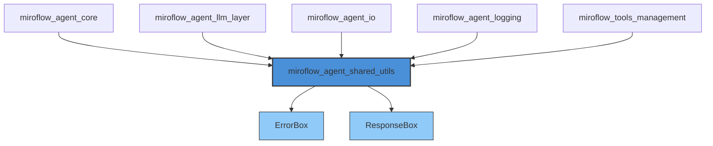
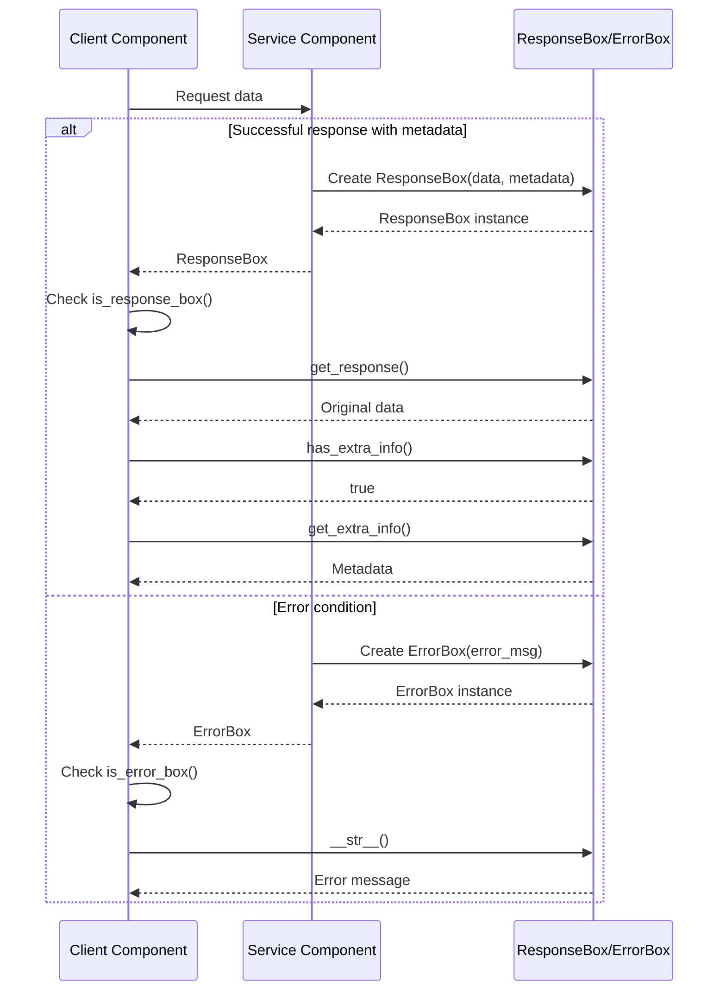

# miroflow_agent_shared_utils Module Documentation

## Module Overview

The `miroflow_agent_shared_utils` module provides foundational utility components that enable type-safe handling of responses and errors across the MiroFlow Agent system. This module serves as a shared dependency used by various other modules to maintain consistent patterns for wrapping, transporting, and distinguishing between normal responses and error conditions.

At its core, this module implements a wrapper pattern that allows data to carry additional context without altering the original data structure. This design enables components throughout the system to communicate richer information while maintaining compatibility with existing code that expects raw response values.

## Core Components

### ErrorBox

The `ErrorBox` class is a specialized wrapper for error messages that provides a clear mechanism for distinguishing error conditions from normal response values in the system.

#### Purpose and Design Rationale

The `ErrorBox` class addresses a common challenge in systems where functions may return either valid data or error information: how to clearly distinguish between these two cases without resorting to exception-based flow control for expected error conditions. By wrapping error messages in a dedicated type, the system can pass error information through normal data flow channels while still allowing recipients to easily identify and handle error states.

#### Class Definition

```python
class ErrorBox:
    """
    A wrapper class for error messages.

    Use this to wrap error messages that should be distinguishable from normal responses.
    """

    def __init__(self, error_msg: str) -> None:
        self.error_msg = error_msg
```

#### Key Methods

##### `__init__(error_msg: str)`
- **Purpose**: Constructs a new ErrorBox instance containing an error message
- **Parameters**:
  - `error_msg`: A string containing the error message to be wrapped
- **Returns**: None
- **Side Effects**: Initializes the ErrorBox with the provided error message

##### `__str__() -> str`
- **Purpose**: Provides a string representation of the ErrorBox
- **Parameters**: None
- **Returns**: The error message as a string
- **Behavior**: Allows ErrorBox instances to be printed or converted to strings directly, yielding the underlying error message

##### `__repr__() -> str`
- **Purpose**: Provides an unambiguous representation of the ErrorBox for debugging
- **Parameters**: None
- **Returns**: A string representation showing the ErrorBox type and its error message

##### `@staticmethod is_error_box(something: Any) -> bool`
- **Purpose**: Checks if a given object is an instance of ErrorBox
- **Parameters**:
  - `something`: Any object to check
- **Returns**: True if the object is an ErrorBox instance, False otherwise
- **Usage**: This static method provides a convenient way to check if a value represents an error condition

#### Usage Example

```python
# Creating an ErrorBox
error = ErrorBox("Connection failed")

# Checking if something is an ErrorBox
if ErrorBox.is_error_box(error):
    print(f"Error occurred: {error}")

# ErrorBox in conditional flow
def process_data(data):
    if not data:
        return ErrorBox("No data provided")
    # Normal processing...
    return processed_data

result = process_data(None)
if ErrorBox.is_error_box(result):
    # Handle error
    logger.error(result)
else:
    # Use result normally
    display_result(result)
```

### ResponseBox

The `ResponseBox` class is a wrapper for responses that can carry additional metadata alongside the primary response data.

#### Purpose and Design Rationale

The `ResponseBox` class addresses the need to attach supplementary information to responses without modifying the original response structure. This is particularly valuable in systems where components need to communicate metadata such as warnings, pagination information, caching details, or performance metrics alongside the main response data. By using a wrapper, the original response remains intact for code that only cares about the primary data, while components that need the additional metadata can access it.

#### Class Definition

```python
class ResponseBox:
    """
    A wrapper class for responses with optional extra information.

    Use this to wrap responses that may include additional metadata.
    """

    def __init__(
        self, response: Any, extra_info: Optional[Dict[str, Any]] = None
    ) -> None:
        self.response = response
        self.extra_info = extra_info
```

#### Key Methods

##### `__init__(response: Any, extra_info: Optional[Dict[str, Any]] = None)`
- **Purpose**: Constructs a new ResponseBox instance
- **Parameters**:
  - `response`: The primary response data to be wrapped
  - `extra_info`: Optional dictionary containing additional metadata
- **Returns**: None
- **Side Effects**: Initializes the ResponseBox with the provided response and optional extra information

##### `__str__() -> str`
- **Purpose**: Provides a string representation of the ResponseBox
- **Parameters**: None
- **Returns**: The string representation of the wrapped response
- **Behavior**: Delegates to the wrapped response's `__str__` method, allowing ResponseBox instances to be treated like the original response in string contexts

##### `__repr__() -> str`
- **Purpose**: Provides an unambiguous representation of the ResponseBox for debugging
- **Parameters**: None
- **Returns**: A string representation showing the ResponseBox type, its wrapped response, and any extra info

##### `@staticmethod is_response_box(something: Any) -> bool`
- **Purpose**: Checks if a given object is an instance of ResponseBox
- **Parameters**:
  - `something`: Any object to check
- **Returns**: True if the object is a ResponseBox instance, False otherwise

##### `has_extra_info() -> bool`
- **Purpose**: Checks if the ResponseBox has additional metadata attached
- **Parameters**: None
- **Returns**: True if extra_info is not None, False otherwise

##### `get_extra_info() -> Optional[Dict[str, Any]]`
- **Purpose**: Retrieves the extra information dictionary
- **Parameters**: None
- **Returns**: The extra info dictionary if present, None otherwise

##### `get_response() -> Any`
- **Purpose**: Retrieves the wrapped response object
- **Parameters**: None
- **Returns**: The original response data that was wrapped

#### Usage Example

```python
# Creating a ResponseBox with extra information
data = {"results": [1, 2, 3, 4, 5]}
metadata = {
    "total_count": 100,
    "page": 1,
    "per_page": 5,
    "warning_msg": "Rate limited: 90 requests remaining"
}
response = ResponseBox(data, metadata)

# Accessing the wrapped response
if ResponseBox.is_response_box(response):
    actual_data = response.get_response()
    print(f"Results: {actual_data}")
    
    # Checking for and accessing extra info
    if response.has_extra_info():
        info = response.get_extra_info()
        if "warning_msg" in info:
            print(f"Warning: {info['warning_msg']}")
            print(f"Total items: {info['total_count']}")
else:
    # Not wrapped, use directly
    print(f"Results: {response}")
```

## Architecture and Integration

The `miroflow_agent_shared_utils` module occupies a foundational position in the MiroFlow Agent system architecture. As a shared utility module, it is designed to be a dependency for other modules rather than having dependencies on them. This unidirectional dependency flow ensures that the utility classes remain stable and reusable across the system.

### Module Dependencies



The diagram above shows how `miroflow_agent_shared_utils` serves as a dependency for all other major modules in the system. This position allows the wrapper utilities to be used consistently across different components for handling responses and errors in a uniform manner.

### Interaction Patterns

The `ErrorBox` and `ResponseBox` classes are typically used in the following interaction patterns throughout the system:



This sequence diagram illustrates the typical flow of wrapped responses through the system. Service components wrap their outputs in either `ResponseBox` (for successful responses with metadata) or `ErrorBox` (for error conditions), and client components check the type of the returned value to determine how to process it.

## Best Practices and Usage Guidelines

### When to Use ErrorBox

The `ErrorBox` class is recommended in the following situations:

- When a function might return either valid data or an error message, and exceptions are not appropriate for the error handling flow
- When you need to pass error information through multiple layers of the system without unwrapping it at each layer
- When you want to maintain error context while allowing the error to be handled at a higher level in the call stack
- When implementing optional error handling where consumers may choose to ignore or defer error processing

### When to Use ResponseBox

The `ResponseBox` class is recommended in the following situations:

- When you need to attach metadata to a response without modifying the original response structure
- When you want to provide optional supplementary information that only some consumers will need
- When you need to maintain backward compatibility with code that expects the original response format
- When you want to pass through warnings, caching information, pagination details, or performance metrics alongside the main data

### Implementation Patterns

#### Pattern 1: Factory Functions

Create factory functions to standardize the creation of wrapped responses:

```python
def success_response(data: Any, **kwargs) -> ResponseBox:
    """Create a successful ResponseBox with optional extra info."""
    return ResponseBox(data, kwargs if kwargs else None)

def error_response(message: str) -> ErrorBox:
    """Create an ErrorBox with the given message."""
    return ErrorBox(message)
```

#### Pattern 2: Unwrapping Helper

Create a helper function to safely unwrap responses:

```python
def unwrap_response(wrapped: Any) -> Tuple[Any, Optional[Dict], bool]:
    """
    Unwrap a potentially wrapped response.
    
    Returns:
        Tuple of (data, extra_info, is_error)
    """
    if ErrorBox.is_error_box(wrapped):
        return (None, None, True)
    elif ResponseBox.is_response_box(wrapped):
        return (
            wrapped.get_response(),
            wrapped.get_extra_info(),
            False
        )
    else:
        return (wrapped, None, False)
```

#### Pattern 3: Pipeline Processing

Use wrapped responses in data processing pipelines:

```python
def pipeline_step1(input_data):
    if not input_data:
        return ErrorBox("Empty input")
    result = process(input_data)
    return ResponseBox(result, {"step": 1, "processed": True})

def pipeline_step2(wrapped_data):
    if ErrorBox.is_error_box(wrapped_data):
        return wrapped_data  # Pass through errors
    
    data = wrapped_data.get_response()
    result = more_processing(data)
    extra_info = wrapped_data.get_extra_info() or {}
    extra_info["step"] = 2
    return ResponseBox(result, extra_info)
```

## Edge Cases and Limitations

### Edge Cases

1. **Nested Wrapping**: While it's technically possible to wrap a ResponseBox inside another ResponseBox or ErrorBox, this is generally not recommended as it can lead to confusion. Consumers would need to unwrap multiple layers to access the original data.

2. **None as Response**: A ResponseBox can wrap a None value, which might be ambiguous in some contexts. Consider using an explicit value or additional metadata to clarify intent.

3. **Empty Extra Info**: A ResponseBox created with an empty dictionary for extra_info will return True from has_extra_info(), which might be unexpected. Consider passing None instead of empty dictionaries when there's no actual extra information.

4. **Type Checking Limitations**: The static methods is_error_box() and is_response_box() use isinstance checks, which work well in most cases but may have unexpected behavior with proxy objects or certain mocking frameworks.

### Error Conditions

1. **None Error Message**: The ErrorBox constructor accepts None for error_msg, which will cause the __str__ method to return "None". It's recommended to always provide a meaningful error message string.

2. **Modifying Extra Info**: The get_extra_info() method returns a reference to the internal dictionary, not a copy. Modifications to this dictionary will affect the ResponseBox's internal state. If you need to modify the extra info without affecting the original, create a copy first.

3. **Serialization**: ResponseBox and ErrorBox objects may not serialize directly to JSON without custom handlers. If you need to serialize these objects, you'll need to implement custom serialization logic.

### Known Limitations

1. **No Type Hints for Wrapped Data**: The ResponseBox class uses Any for the wrapped response, which means you lose type information when wrapping. Consider using generics in Python 3.9+ if you need to preserve type information.

2. **Immutable Wrappers**: The ResponseBox and ErrorBox classes don't provide methods to modify the wrapped data or extra info after creation. While this immutability can be beneficial for predictability, it might require creating new wrapper instances when changes are needed.

3. **Limited Metadata Structure**: The extra_info in ResponseBox is limited to a dictionary. For more complex metadata structures, you might need to define additional wrapper classes or extend ResponseBox.

## Future Considerations

Potential enhancements to the `miroflow_agent_shared_utils` module could include:

- Generic type support for better type safety with ResponseBox
- Built-in serialization methods for JSON and other formats
- Chaining or composition methods for combining multiple wrapped responses
- More structured error information beyond simple strings (error codes, contexts, etc.)
- Support for asynchronous operations or callbacks
- Built-in logging integration for automatic tracking of wrapped responses

However, any enhancements should maintain the module's simple, focused design and backward compatibility with existing code.

## References

- [miroflow_agent_core Module Documentation](miroflow_agent_core.md) - Uses wrapper utilities for orchestration and response handling
- [miroflow_agent_llm_layer Module Documentation](miroflow_agent_llm_layer.md) - Uses wrapper utilities for LLM responses and errors
- [miroflow_agent_io Module Documentation](miroflow_agent_io.md) - Uses wrapper utilities for input/output operations
- [miroflow_agent_logging Module Documentation](miroflow_agent_logging.md) - May log wrapped responses and errors
- [miroflow_tools_management Module Documentation](miroflow_tools_management.md) - Uses wrapper utilities for tool execution results
