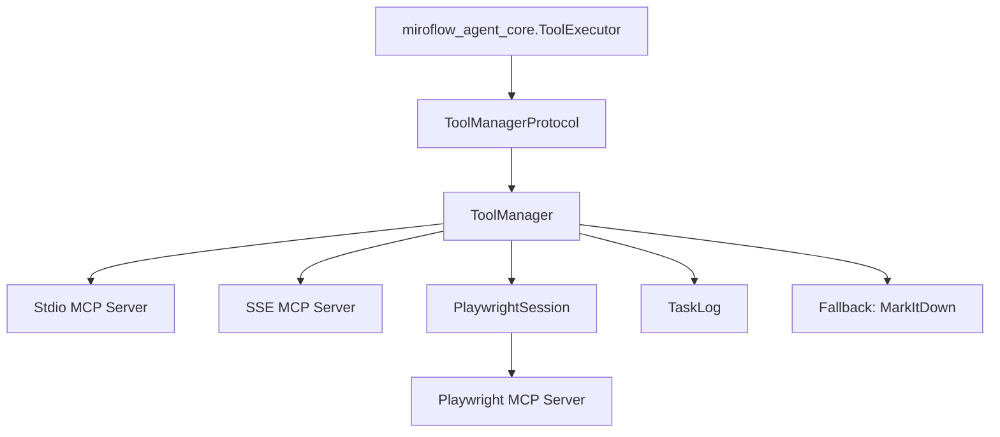
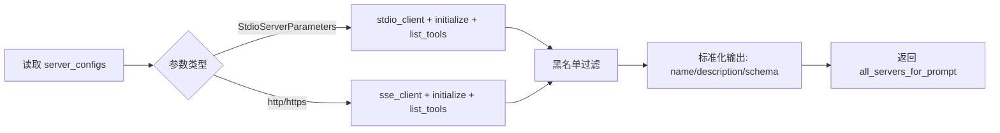
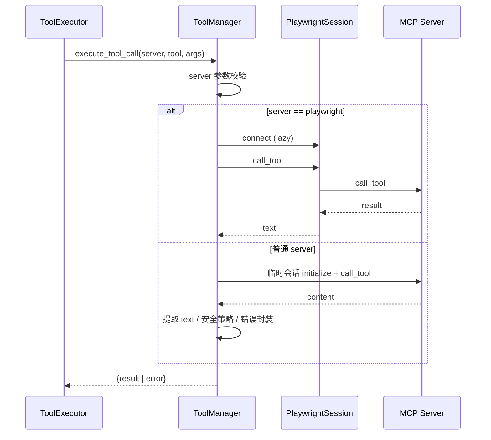

# miroflow_tools_management 模块文档

## 1. 模块简介

`miroflow_tools_management` 是 MiroFlow 中负责“工具接入、能力发现、调用执行与会话治理”的基础设施模块。它的存在是为了解决一个典型的 Agent 工程问题：上层推理组件（例如主代理或子代理）需要调用大量外部工具，但这些工具分散在不同 MCP Server 上，通信方式可能是本地 `stdio`，也可能是远端 `SSE`，并且不同工具在会话模型、错误语义和结果格式上并不一致。

该模块通过 `ToolManagerProtocol` + `ToolManager` + `PlaywrightSession` 三层组合，把这些差异收敛成统一接口。上层只需要知道 `server_name / tool_name / arguments`，无需关心底层连接类型、会话初始化、超时控制、回退逻辑或最基本的安全拦截策略。这样做的直接收益是：

1. 让 `miroflow_agent_core` 可以专注于任务规划与对话编排，而不是网络/进程通信细节；
2. 让工具调用失败路径可观测、可降级、可追踪；
3. 为后续接入更多工具生态提供稳定扩展点。

---

## 2. 架构总览

上图体现了本模块在系统中的位置：`ToolExecutor` 面向协议调用，`ToolManager` 是默认实现，负责连接不同类型 MCP 服务并统一返回结果；Playwright 走专用持久会话；日志由 `TaskLog` 记录；抓取类异常场景可触发 MarkItDown 降级。

### 2.1 组件职责关系

- **`ToolManagerProtocol`**：定义最小契约（获取工具定义、执行工具调用），用于隔离上层与实现细节。
- **`ToolManager`**：核心执行器，处理 server 配置、工具发现、调用编排、错误封装、黑名单过滤、安全规则、fallback。
- **`PlaywrightSession`**：为浏览器自动化提供持久会话，避免多步浏览操作每次重连。

若要深入查看实现细节，请阅读：

- [`tool_manager_core.md`](tool_manager_core.md)：`ToolManagerProtocol` 与 `ToolManager` 的完整行为、调用路径、错误语义与扩展建议。
- [`playwright_session_management.md`](playwright_session_management.md)：`PlaywrightSession` 的会话生命周期、连接复用、资源释放与并发注意事项。

若你需要理解本模块在全链路中的调用位置，可继续参考：[`miroflow_agent_core.md`](miroflow_agent_core.md)、[`miroflow_agent_logging.md`](miroflow_agent_logging.md)。

---

## 3. 子模块功能概览

### 3.1 `tool_manager_core`（核心调度与治理）

`tool_manager_core` 覆盖 `manager.py` 的主体逻辑，是本模块最关键的子模块。它不仅负责把“调用请求”路由到具体 server，还承担跨协议兼容、超时控制（`@with_timeout(1200)`）、工具定义聚合、错误结构标准化与基础策略治理（如 Hugging Face 数据集/Space 抓取拦截）。此外它还提供可选日志注入能力，与 `TaskLog` 形成可审计执行轨迹。

详细说明、方法级行为、边界条件与扩展建议请见 [`tool_manager_core.md`](tool_manager_core.md)。

### 3.2 `playwright_session_management`（浏览器持久会话）

`playwright_session_management` 聚焦 `PlaywrightSession`。它通过持久化 `ClientSession` 来支持连续浏览器动作（导航、抓取、截图、DOM 操作等）在同一上下文中执行，避免状态丢失和频繁握手开销。该子模块本质上是 `ToolManager` 的专门优化分支，服务于 `server_name == "playwright"` 的场景。

连接生命周期、调用流程、资源释放方式与并发注意事项请见 [`playwright_session_management.md`](playwright_session_management.md)。

---

## 4. 模块级流程与数据流

### 4.1 工具发现流程（用于提示词构建/能力暴露）

这一流程会尽量“部分成功”：某个 server 失败不会让整个发现失败，而是返回该 server 的错误占位项，便于上层感知故障范围。

### 4.2 单次工具调用流程

在系统层面，`miroflow_agent_core` 的 `ToolExecutor` 仍会对结果做策略处理（如回滚判定、重复查询检测、DEMO 模式裁剪）；而本模块专注“把调用做成、做稳、做可观测”。

---

## 5. 与其他模块的集成关系

- 与 **`miroflow_agent_core`**：`ToolExecutor` 是直接调用方，负责任务策略；本模块负责工具基础设施执行。参见 [`miroflow_agent_core.md`](miroflow_agent_core.md)。
- 与 **`miroflow_agent_logging`**：通过 `TaskLog.log_step` 记录结构化步骤日志，包含调用开始、成功、失败与 fallback。参见 [`miroflow_agent_logging.md`](miroflow_agent_logging.md)。
- 与 **`miroflow_agent_io`**：工具结果最终会被格式化并进入模型上下文或用户输出链路。参见 [`miroflow_agent_io.md`](miroflow_agent_io.md)。
- 与 **`miroflow_agent_llm_layer`**：工具定义会参与 LLM 工具调用规划，调用结果回流到模型推理环。参见 [`miroflow_agent_llm_layer.md`](miroflow_agent_llm_layer.md)。

---

## 6. 使用与配置指引

典型配置入口是构造 `ToolManager(server_configs, tool_blacklist=None)`：

- `server_configs` 支持 `StdioServerParameters` 与 `SSE URL` 两类；
- `tool_blacklist` 是 `(server_name, tool_name)` 元组集合，用于发现阶段过滤；
- 可通过 `set_task_log(task_log)` 注入日志器。

更完整示例、返回结构说明与错误语义见 [`tool_manager_core.md`](tool_manager_core.md)。

---

## 7. 风险点、限制与运维注意事项

当前实现在工程上已经可用，但仍有几个需要维护者重点关注的点：

1. **黑名单执行时机**：当前主要在“工具发现”阶段过滤，若调用方绕过发现直接执行，建议在执行路径增加二次强校验。
2. **非 Playwright 连接复用不足**：普通 server 每次调用都新建会话，高并发下有额外握手开销。
3. **结果提取策略不完全一致**：普通路径和 Playwright 路径对 `content` 索引不同，可能导致多段内容时结果差异。
4. **fallback 配置外置化不足**：MarkItDown endpoint 仍是占位硬编码，生产环境应改为环境变量或配置中心注入。
5. **持久会话清理责任**：`PlaywrightSession` 需要显式 `close()`，建议在任务结束钩子做统一资源回收。

---

## 8. 扩展建议

如果你准备扩展该模块，建议优先保持 `ToolManagerProtocol` 稳定，把增强能力做在实现层。常见扩展方向包括：

- 在 `execute_tool_call` 外层加分级重试（按工具类型与错误码）；
- 为非 Playwright server 增加连接池或短时复用；
- 把安全规则（HF 拦截等）抽象为可配置策略链；
- 增加调用指标（延迟、失败率、超时率）并接入监控系统。

这样可以在不破坏上层调用接口的前提下，持续提升稳定性与可维护性。