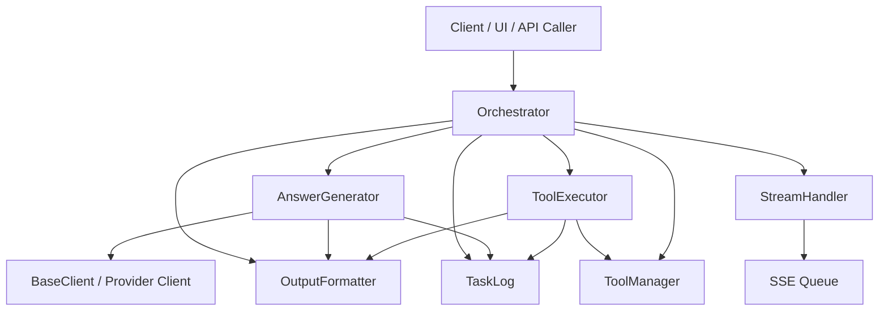
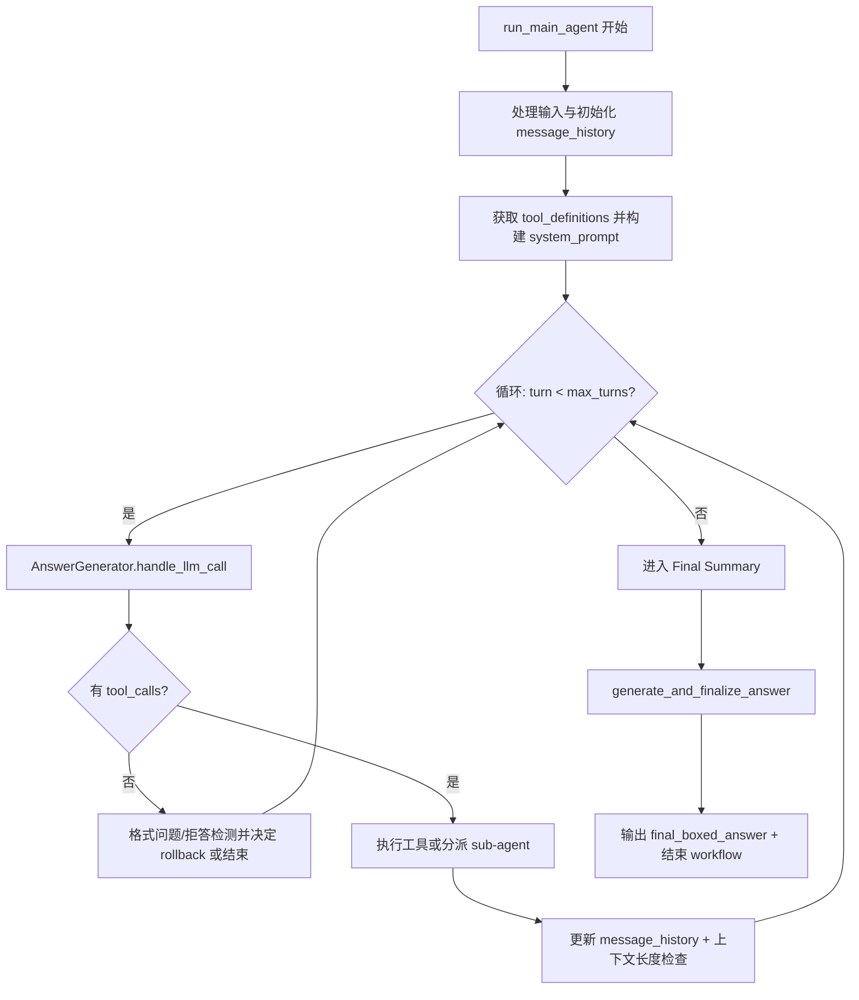
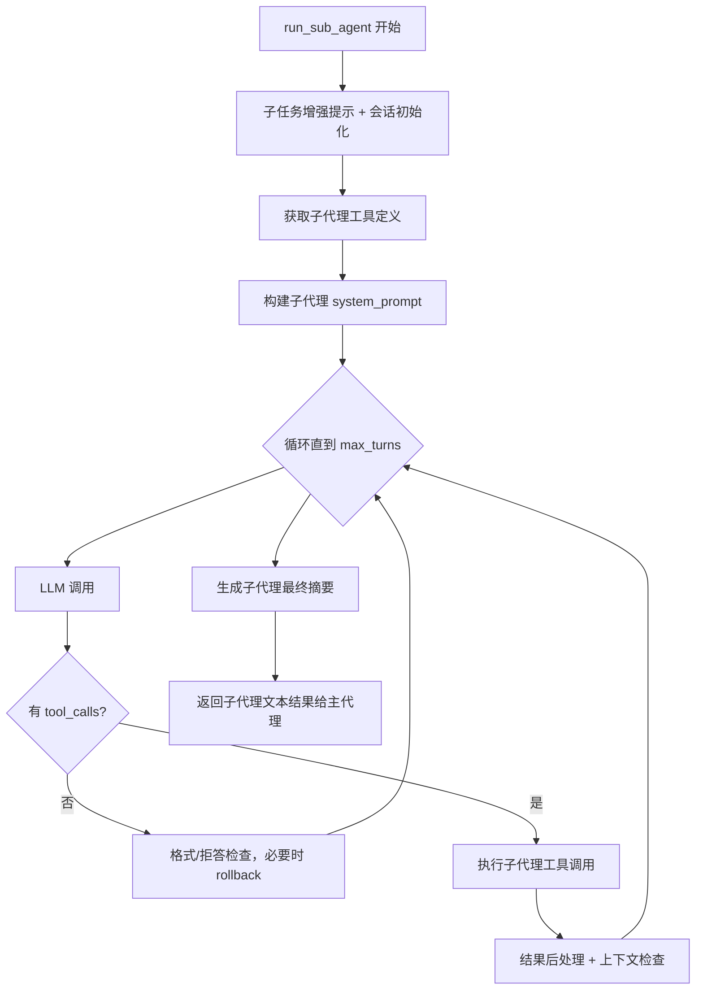
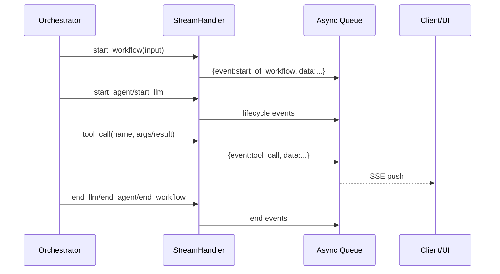
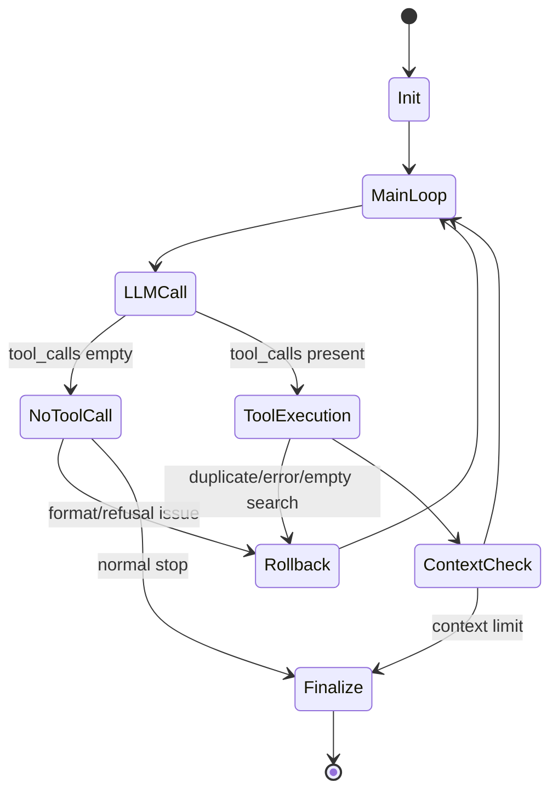
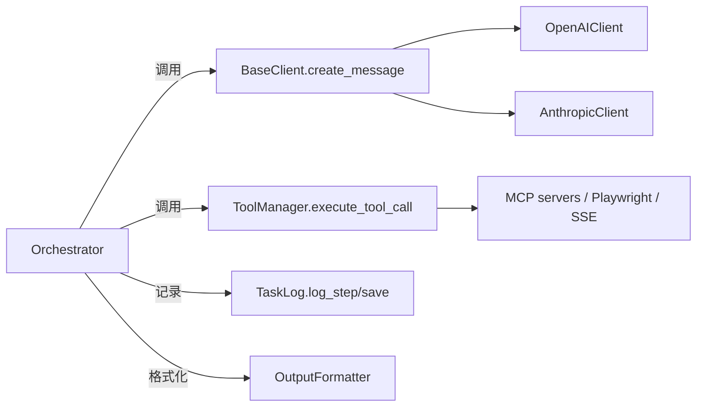

# module_name 模块文档

## 模块简介

`module_name` 是 `miroflow_agent_core` 在当前文档树中的映射模块，承载了智能体执行链路里最关键的“调度-调用-汇总”闭环。它的核心目标不是单纯地“调一次 LLM 并返回文本”，而是把一个多轮、可调用工具、可分派子代理（sub-agent）、可流式反馈、可失败恢复的复杂任务，稳定地推进到可交付结果。

从设计上看，这个模块将职责拆成四个核心部件：`Orchestrator` 负责总流程编排，`AnswerGenerator` 负责 LLM 调用与最终答案策略，`ToolExecutor` 负责工具调用结果治理，`StreamHandler` 负责对前端或调用方输出流式事件。这样的拆分使得流程控制、模型交互、工具执行和 UI 反馈可以独立演进，降低了单点复杂度，同时保留了清晰的协作边界。

如果你刚接触这个系统，可以把 `module_name` 理解为“任务执行内核”：
它连接了上游输入与配置、下游工具生态、旁路日志与流式事件，并对结果质量负责（如格式校验、重复查询抑制、失败总结与重试策略）。

### 模块树映射说明

在当前模块树中，`module_name` 的 Core components 被映射为 `miroflow_agent_core`，并展开到 `sub_modules`（`orchestrator`、`answer_generator`、`stream_handler`、`tool_executor`）与 `language`（`zh-CN`）。这意味着本文件从“聚合模块”的角度解释运行时协作关系；若你要深入某个单体组件，也可以并行查阅对应子文档（如 [orchestrator.md](orchestrator.md)、[answer_generator.md](answer_generator.md)、[stream_handler.md](stream_handler.md)）。

---

## 在整体系统中的位置

`module_name` 位于 Agent 运行时核心层，直接依赖如下模块：

- LLM 抽象与提供方实现：[`miroflow_agent_llm_layer.md`](miroflow_agent_llm_layer.md)
- 输入输出格式化：[`miroflow_agent_io.md`](miroflow_agent_io.md)
- 任务日志模型：[`miroflow_agent_logging.md`](miroflow_agent_logging.md)
- 工具管理与执行协议：[`miroflow_tools_management.md`](miroflow_tools_management.md)
- 统一响应封装：[`miroflow_agent_shared_utils.md`](miroflow_agent_shared_utils.md)

### 架构关系图



上图体现了一个核心事实：`Orchestrator` 并不“亲自做完所有事”，而是以状态机方式组织多个协同组件。`AnswerGenerator` 聚焦“如何正确地向模型提问并解析结果”；`ToolExecutor` 聚焦“工具结果是否可接受、是否需要回滚”；`StreamHandler` 负责把运行状态实时推送出去，形成可观测执行过程。

---

## 核心执行流程

### 主代理（Main Agent）流程



主循环并非简单“LLM->Tool->LLM”的线性链路，而是包含了多层保护机制：
包括连续回滚阈值（防止死循环）、重复查询检测（防止无效探索）、上下文长度守卫（防止超窗）与最终答案重试策略（提升产出稳定性）。

### 子代理（Sub-agent）流程



子代理与主代理的结构相似，但目标更专注：围绕某个 `subtask` 做局部求解，并返回结构化文本给主代理再汇总。主代理通过 `agent-*` 工具调用来触发这个过程。

---

## 组件详解

## 1) Orchestrator

`Orchestrator` 是模块入口与流程总控。它负责生命周期管理、轮次控制、异常与回滚策略、主子代理切换，以及最终结果收敛。

### 构造参数与内部状态

`__init__` 注入了运行时所需的几乎全部依赖：

- `main_agent_tool_manager`：主代理工具调用入口。
- `sub_agent_tool_managers`：按子代理名索引的工具管理器。
- `llm_client`：统一 LLM 客户端（见 [miroflow_agent_llm_layer.md](miroflow_agent_llm_layer.md)）。
- `output_formatter`：工具结果和最终答案格式化。
- `cfg`：Hydra/OmegaConf 配置对象。
- `task_log`：任务级日志实体。
- `stream_queue`：用于 SSE 事件输出的异步队列。
- `tool_definitions` / `sub_agent_tool_definitions`：可选的预取工具定义，减少运行时请求开销。

它还维护两类关键状态：

- `intermediate_boxed_answers`：主循环过程中提取到的中间 boxed answer，用于某些 fallback 场景。
- `used_queries`：去重缓存，避免重复 query 导致无效迭代。

### 关键方法

#### `run_main_agent(...)`

这是主任务执行主线，返回 `(final_summary, final_boxed_answer, failure_experience_summary)`。

内部关键步骤包括：

1. 启动 workflow 流事件，记录任务日志。
2. 调用 `process_input` 处理文本/文件输入，初始化 `message_history`。
3. 拉取可用工具定义，并在启用子代理时把子代理暴露为可调用工具。
4. 构建主代理 `system_prompt`。
5. 进入回合循环：
   - 通过 `AnswerGenerator.handle_llm_call` 发起 LLM 调用。
   - 若无工具调用，执行格式错误与拒答处理（可能回滚）。
   - 若有工具调用，执行普通工具或触发子代理。
   - 更新 `message_history` 并进行上下文长度检查。
6. 循环结束后，调用 `AnswerGenerator.generate_and_finalize_answer` 生成最终结果。
7. 发送最终流事件并返回结果。

副作用主要是：写日志、推流、更新 `message_history`、更新查询缓存、触发垃圾回收。

#### `run_sub_agent(sub_agent_name, task_description)`

用于执行一个子任务，逻辑与主代理类似但更轻量。子代理结果最终作为工具结果回流给主代理。

值得注意的是，子代理会在任务描述后自动追加“请提供详细支持信息”的要求，以提高主代理二次汇总时的可用性。

#### `_handle_response_format_issues(...)`

处理“无工具调用”的关键分支。如果响应中出现 MCP 标签残留（格式错）或拒答关键词，会触发回滚（减少 turn 并弹出最近 assistant 消息）。超过连续回滚上限后停止循环。

#### `_check_duplicate_query(...)` / `_record_query(...)`

去重控制的核心。模块按工具语义提取 query 字符串并计数，重复时可触发回滚，避免模型不断请求同一搜索/抓取操作。

---

## 2) AnswerGenerator

`AnswerGenerator` 把“LLM 调用本身”与“最终答案策略”集中起来，避免 Orchestrator 中充斥大量回答后处理分支。

### 设计重点

它不仅负责 `create_message` 调用，更负责：

- 统一处理 `ResponseBox` / `ErrorBox` 包装响应；
- 抽取工具调用信息；
- 最终答案的多次尝试；
- 在 context management 模式下生成失败经验摘要（failure experience summary），用于后续重试。

### 关键方法

#### `handle_llm_call(...)`

统一 LLM 调用入口。返回 `(assistant_response_text, should_break, tool_calls_info, message_history)`。

行为要点：

- 调用 `llm_client.create_message(...)`。
- 遇到 `ErrorBox` 会通过流事件输出错误并视为失败。
- 遇到 `ResponseBox` 会解包真实响应，并处理附带 warning。
- 使用 `llm_client.process_llm_response` 与 `extract_tool_calls_info` 完成模型响应解析。

这是主/子代理循环中最频繁调用的接口。

#### `generate_final_answer_with_retries(...)`

在总结阶段追加 summary prompt，并尝试多次生成最终答案。每次会用 `OutputFormatter.format_final_summary_and_log` 抽取 `final_summary` 与 `final_boxed_answer`。

当 boxed answer 缺失时，依据配置可能重试并移除上一次 assistant 回复，减少错误累积。

#### `generate_failure_summary(...)`

当任务在上下文限制或轮次限制下失败时，把整段历史压缩成“失败经验”。这是 context management 的关键产物，常用于下一次尝试时改善路径选择，避免重复犯错。

#### `generate_and_finalize_answer(...)`

最终决策中枢，核心受两个条件影响：

- `context_compress_limit > 0`（是否启用上下文管理）
- `reached_max_turns`（是否因轮次/上下文限制退出）

在“启用上下文管理且未最终重试但已到上限”时，会跳过“盲猜式最终回答”，直接产出失败经验摘要。这是一个偏保守、强调准确性的策略。

---

## 3) ToolExecutor

`ToolExecutor` 负责工具调用结果治理，而不是简单调用封装。它解决的是 LLM + 外部工具组合中最常见的稳定性问题。

### 关键能力

#### 参数纠错：`fix_tool_call_arguments(...)`

针对 `scrape_and_extract_info` 这类工具，自动把 LLM 常见误参名（如 `description`、`introduction`）映射为正确参数 `info_to_extract`，降低“模型语义正确但参数名错误”导致的失败率。

#### 查询抽取与去重：`get_query_str_from_tool_call(...)`

支持为搜索/抓取类工具提取标准查询键，供 Orchestrator 去重判断。

#### 结果质量检测：`should_rollback_result(...)`

以下场景会倾向触发回滚：

- 返回以 `Unknown tool:` 开头
- 返回以 `Error executing tool` 开头
- `google_search` 返回空 organic 结果

这种“结果层回滚”是对“调用成功但内容无效”的补救机制。

#### Demo 模式截断：`post_process_tool_call_result(...)`

在 `DEMO_MODE=1` 时，会截断抓取类结果长度，减少上下文占用，换取更多交互轮次。

---

## 4) StreamHandler

`StreamHandler` 是对 SSE 事件协议的轻量封装。它不参与业务决策，但对可观测性和前端体验至关重要。

### 事件类型

模块发送的主要事件包括：

- 工作流生命周期：`start_of_workflow` / `end_of_workflow`
- 代理生命周期：`start_of_agent` / `end_of_agent`
- LLM 生命周期：`start_of_llm` / `end_of_llm`
- 文本增量：`message`
- 工具调用：`tool_call`
- 错误展示：`show_error`（通过 tool_call 封装）

### 数据流图



如果 `stream_queue` 为空，所有更新都会静默跳过，这意味着该模块天然支持“无流式模式”。

---

## 组件协作与关键状态转换



这个状态机揭示了模块的实质：它是一个“允许局部回退”的对话执行引擎，而不是单向流水线。回滚机制与最终总结机制共同确保任务既能探索，也能收敛。

---

## 配置项与行为影响

以下配置对运行行为影响最大：

```yaml
agent:
  main_agent:
    max_turns: 12
  sub_agents:
    agent-research:
      max_turns: 6
  keep_tool_result: -1
  context_compress_limit: 1
```

- `main_agent.max_turns` / `sub_agents.*.max_turns` 决定探索上限。
- `keep_tool_result` 会影响 `AnswerGenerator` 的最终答案重试策略（`-1` 时允许更多重试）。
- `context_compress_limit` 决定是否启用“失败经验压缩”路线。大于 0 时，系统会更保守地避免盲猜。

---

## 使用方式示例

```python
orchestrator = Orchestrator(
    main_agent_tool_manager=main_tm,
    sub_agent_tool_managers=sub_tms,
    llm_client=llm_client,
    output_formatter=output_formatter,
    cfg=cfg,
    task_log=task_log,
    stream_queue=queue,
)

final_summary, final_boxed_answer, failure_summary = await orchestrator.run_main_agent(
    task_description="请比较 A 与 B 的技术路线并给出结论",
    task_file_name=None,
    task_id="task-001",
)
```

如果你只需要子任务执行，也可以直接调用 `run_sub_agent(...)`，但推荐仍由主代理统一分派，以保持日志和上下文一致性。

---

## 错误处理、边界条件与已知限制

该模块已经实现了较多防护，但在生产集成时仍需关注以下问题：

1. **回滚不是无限次**：连续回滚达到阈值会终止当前循环，避免死循环但也可能提前结束任务。
2. **重复查询判定依赖规则映射**：仅对已支持的工具名抽取 query；自定义工具若未扩展规则，去重将失效。
3. **拒答关键词与 MCP 标签检测是启发式**：存在误判/漏判可能。
4. **工具异常会被包装并继续流程**：调用失败通常不会直接抛出到顶层，而是进入后续 LLM 推理；上层需结合日志判断根因。
5. **DEMO_MODE 截断可能影响答案质量**：长文抓取结果被裁剪后，模型可见信息减少。
6. **流式队列失败不会中断主流程**：`StreamHandler` 只记录 warning；这有利于鲁棒性，但会掩盖前端无反馈问题。
7. **最终答案格式依赖 boxed answer 约定**：若模型长期不遵守格式，即使内容正确也可能触发格式错误路径。

---

## 扩展建议

当你要扩展 `module_name` 时，优先考虑以下切入点：

- 新增工具类型时，同步扩展 `ToolExecutor.get_query_str_from_tool_call` 与参数纠错逻辑。
- 新增模型提供方时，优先保证 `BaseClient` 协议兼容（响应解析、tool call 提取、message history 更新）。
- 调整策略时，尽量在 `AnswerGenerator` 中新增分支，而不是把策略散落到 `Orchestrator` 主循环。
- 如果前端需要更细粒度可视化，可在 `StreamHandler.tool_call(..., streaming=True)` 基础上增加增量字段约定。

---

## 关键 API 行为参考（面向维护者）

下面这部分补充了“方法级”视角，重点解释参数、返回值与副作用，帮助你在重构或扩展时快速判断改动影响面。

### `Orchestrator` 方法族

#### `run_main_agent(task_description, task_file_name=None, task_id="default_task", is_final_retry=False)`

该方法是主入口，负责完整任务生命周期。`task_description` 是用户目标，`task_file_name` 会触发输入预处理逻辑，`task_id` 用于日志与链路追踪，`is_final_retry` 会影响最终答案策略（是否允许最后一次兜底）。返回值为 `(final_summary, final_boxed_answer, failure_experience_summary)`：其中第三项只在上下文管理路径下有意义。

它的副作用包括：启动和结束 workflow/agent/llm 流事件、持续写入 `TaskLog`、更新 `message_history`、更新重复查询缓存、可能触发子代理递归执行，以及在流程结束时触发 `gc.collect()`。因此这不是纯函数，不应在无隔离的场景并发复用同一实例。

#### `run_sub_agent(sub_agent_name, task_description)`

该方法执行子任务求解。`sub_agent_name` 必须能在 `sub_agent_tool_managers` 和配置中找到对应项；`task_description` 会被自动增强（要求给出详细支撑信息）。返回值是子代理最终文本结果，供主代理作为工具结果继续推理。

该方法会创建独立的 sub-agent session，并将其历史写入 `task_log.sub_agent_message_history_sessions`。如果你在自定义子代理模板时发现“主代理摘要质量下降”，优先检查这里对任务描述的增强提示是否被误删。

#### `_handle_response_format_issues(...)`

这是“无工具调用”分支的关键守卫。输入为当前 assistant 文本、历史、轮次与回滚状态；输出是一个控制元组，告诉上层循环“继续/中断/是否回滚后重试”。

它主要拦截两类异常响应：
- 输出中混入 MCP 标签（表示模型没按预期格式输出）
- 出现拒答关键词（表示模型没有继续执行任务）

若命中且未超过连续回滚阈值，会弹出最后一条 assistant 消息并回退轮次。该策略能降低错误消息污染后续上下文的风险。

#### `_check_duplicate_query(...)` 与 `_record_query(...)`

这两个方法配合完成“执行前判重 + 成功后记账”。判重依赖 `ToolExecutor.get_query_str_from_tool_call` 的规则化字符串。如果你增加新工具但没扩展 query 提取规则，就会出现“看似启用了判重，实际不生效”的隐性问题。

### `AnswerGenerator` 方法族

#### `handle_llm_call(system_prompt, message_history, tool_definitions, step_id, purpose="", agent_type="main")`

这是统一的 LLM 调用入口。返回 `(assistant_response_text, should_break, tool_calls_info, message_history)`，其中 `should_break` 由 provider 的响应语义决定。它负责：调用 `BaseClient.create_message`、解包 `ResponseBox`、处理 `ErrorBox`、抽取工具调用信息、记录日志。

注意它在异常时返回空文本和原始历史（非抛异常）。上层必须根据返回值判定是否重试，不能只靠 try/except。

#### `generate_final_answer_with_retries(...)`

该方法在最终总结阶段实现“答案重试”。它会把 summarize prompt 追加到历史，循环调用 `handle_llm_call`，并以 `OutputFormatter.format_final_summary_and_log` 检测是否提取到合法 boxed 结果。若格式失败，会回退最后一条 assistant 内容后再试。

`max_final_answer_retries` 由配置派生：当 `keep_tool_result == -1` 时允许多次重试，否则仅一次。这是一个“准确率与成本折中”的显式开关。

#### `generate_failure_summary(...)`

当任务未收敛时，将长上下文压缩为结构化“失败经验”。返回值通常作为下一轮重试输入的一部分。该方法本质是“经验蒸馏器”，不是最终答案生成器。

#### `generate_and_finalize_answer(...)`

这是最终策略路由器。它综合三类条件：
1. 是否启用 context management
2. 主循环是否因上限结束
3. 当前是否 final retry

它决定是直接给答案、还是跳过盲猜并输出失败经验、或在最后一次重试时启用中间答案兜底。该路由设计是本模块稳定性的核心。

### `ToolExecutor` 方法族

#### `fix_tool_call_arguments(tool_name, arguments)`

对常见参数名漂移进行修复，避免模型“语义对了但键名错了”的失败。返回修正后的参数副本，不会原地修改传入字典。

#### `get_query_str_from_tool_call(tool_name, arguments)`

把不同工具的关键检索字段统一成可比较字符串，用于判重。返回 `None` 表示该工具不参与判重。

#### `post_process_tool_call_result(tool_name, tool_call_result)`

在 `DEMO_MODE=1` 下对抓取结果做截断，降低上下文压力。此行为会影响可解释性与精确度，生产环境一般建议关闭。

#### `should_rollback_result(tool_name, result, tool_result)`

判定结果是否“技术成功但语义失败”。例如 `google_search` 空 organic 列表会被视为应回滚场景。这个规则表可以按业务继续扩展。

### `StreamHandler` 方法族

`StreamHandler` 的所有方法都是“尽力而为（best effort）”语义：如果队列不可用，主流程仍继续。`start_workflow/end_workflow`、`start_agent/end_agent`、`start_llm/end_llm` 和 `tool_call` 共同组成可观测执行轨迹。`show_error` 除了发送错误事件，还会向队列推送 `None` 以提示流结束。

---

## 与外部模块的契约边界



`module_name` 并不直接关心 provider HTTP 细节，也不关心 MCP 连接细节。它依赖的是稳定抽象：`BaseClient` 的“消息收发+历史更新”协议，以及 `ToolManagerProtocol` 的“定义获取+调用执行”协议。维护时请优先保持协议稳定，而不是耦合某个 provider 的私有行为。

---

## 常见运维与调试建议

在生产排障时，建议按“流事件 → TaskLog → LLM 响应 → 工具结果”顺序定位。因为本模块对异常大量采用“记录并继续”的策略，如果只看最终返回值，往往无法发现中间回滚和判重触发点。

当你观察到“模型持续空转”时，优先检查四个点：
- `MAX_CONSECUTIVE_ROLLBACKS` 是否过小导致过早终止；
- `get_query_str_from_tool_call` 是否覆盖了当前主用工具；
- `keep_tool_result` 是否过低导致关键信息被替换为占位文本；
- `max_context_length` 与 `max_tokens` 组合是否使 `ensure_summary_context` 频繁触发回退。

---

## 基于源码的补充勘误与实现细节（2026-02 校对）

结合本次读取到的核心实现，下面补充几条对维护者非常关键、但容易被忽略的实现事实。

第一，`Orchestrator.__init__` 虽然把 `task_log` 标注为可选（`Optional[TaskLog]`），但在运行期多个路径会直接调用 `self.task_log.log_step(...)`、`self.task_log.save()`、`self.task_log.start_sub_agent_session(...)`。这意味着在真实执行路径里，`task_log` 实际上是“必需依赖”，否则会在首轮日志写入时触发 `NoneType` 异常。换句话说，类型签名偏“宽”，而运行契约偏“严”。

第二，`run_main_agent(...)` 与 `run_sub_agent(...)` 对 token 计数状态的处理略有差异：子代理循环内每轮会先清空 `llm_client.last_call_tokens`，主代理则在执行工具调用前保存 `main_agent_last_call_tokens`，在工具执行后再恢复。这种差异是为了避免子代理调用污染主代理计费统计，但也意味着如果你在 `BaseClient` 层扩展 token 聚合逻辑，需要同时验证主/子代理两条路径。

第三，`AnswerGenerator.generate_and_finalize_answer(...)` 的“上下文压缩模式”决策非常严格：当 `context_compress_limit > 0` 且本轮因 `max_turns` 或上下文限制结束、并且当前不是 final retry 时，会直接跳过最终答案生成，转而输出 failure summary。这个行为不是 bug，而是刻意避免“盲猜答案”。如果你在线上看到返回了 `Task incomplete - reached maximum turns...`，通常意味着系统在保护准确率而非失败崩溃。

第四，`StreamHandler.show_error(...)` 除了发送一次 `tool_call(show_error)`，还会向 `stream_queue` 推送 `None` 作为流结束信号。前端若把 `None` 当作普通消息而不是 EOF，会出现“报错后界面状态卡住”的兼容性问题。建议前端 SSE 消费器显式处理该哨兵值。

第五，`ToolExecutor` 中的 `is_duplicate_query(...)`、`record_query(...)` 与 `execute_single_tool_call(...)` 是可复用能力；但在当前 `Orchestrator` 主流程里，重复查询逻辑主要通过 `Orchestrator._check_duplicate_query/_record_query` 驱动，形成“编排层负责策略、执行层提供规则提取”的分工。后续重构时，不要误以为 `ToolExecutor.used_queries` 就是全局唯一判重来源。

第六，`run_sub_agent(...)` 在开始时会强制追加英文提示：`Please provide the answer and detailed supporting information...`。这条提示是主代理后续汇总质量的关键来源；如果你做多语言改造并删除该提示，常见副作用是子代理结果过短、证据不足，导致主代理最终 summary 的可解释性下降。

---


## 相关文档

- Core 总览：[`miroflow_agent_core.md`](miroflow_agent_core.md)
- LLM 层：[`miroflow_agent_llm_layer.md`](miroflow_agent_llm_layer.md)
- I/O 与格式化：[`miroflow_agent_io.md`](miroflow_agent_io.md)
- 日志体系：[`miroflow_agent_logging.md`](miroflow_agent_logging.md)
- 工具管理：[`miroflow_tools_management.md`](miroflow_tools_management.md)
- 共享工具类：[`miroflow_agent_shared_utils.md`](miroflow_agent_shared_utils.md)

本文件聚焦 `module_name` 的运行编排与执行语义；对于底层客户端协议、工具注册机制、日志落盘格式等细节，请参阅上述模块文档，避免重复维护。
