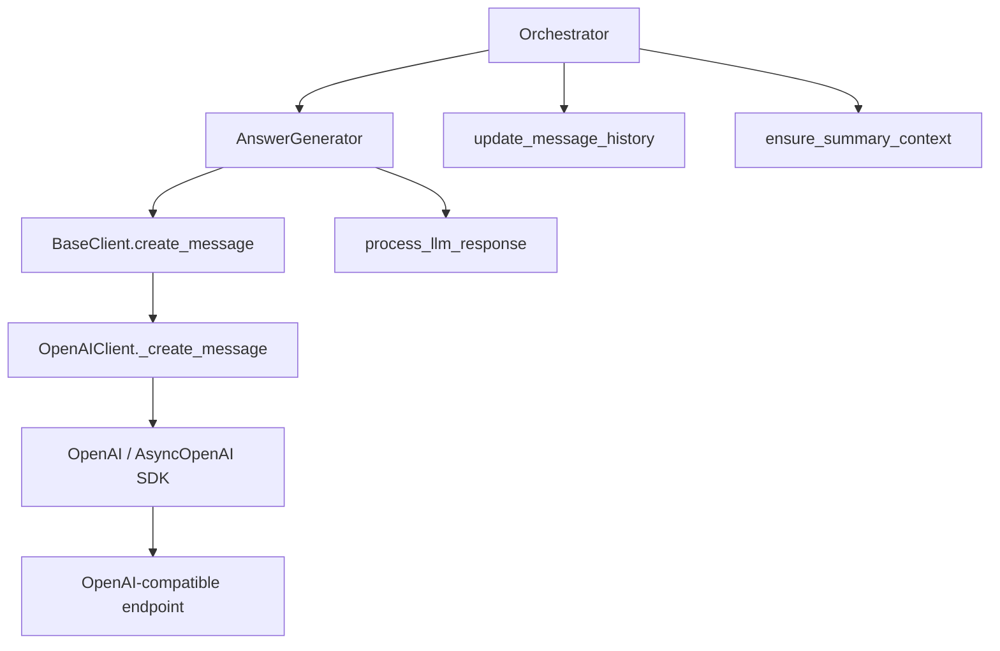
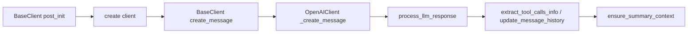
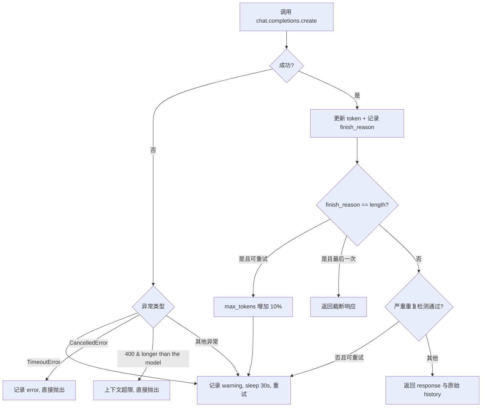
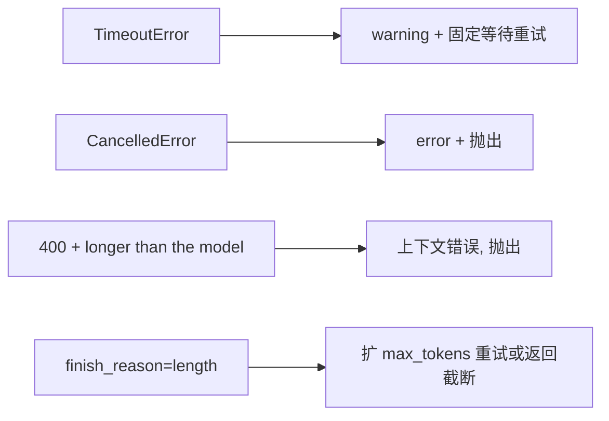
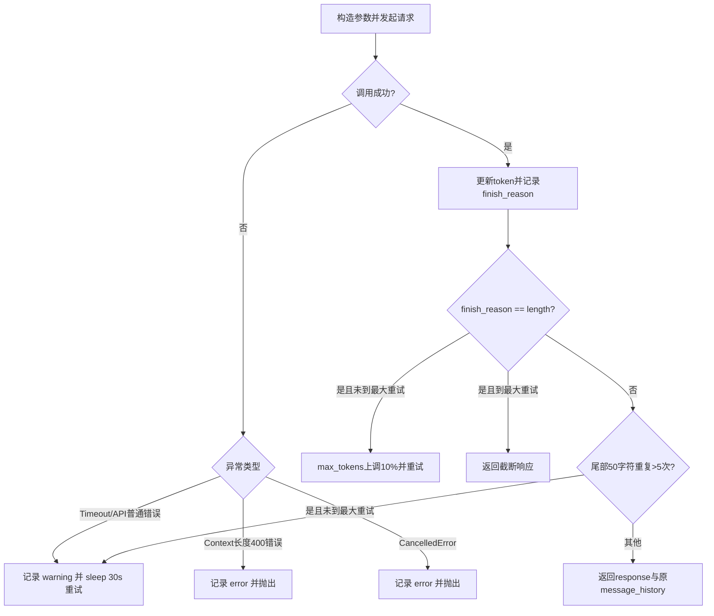
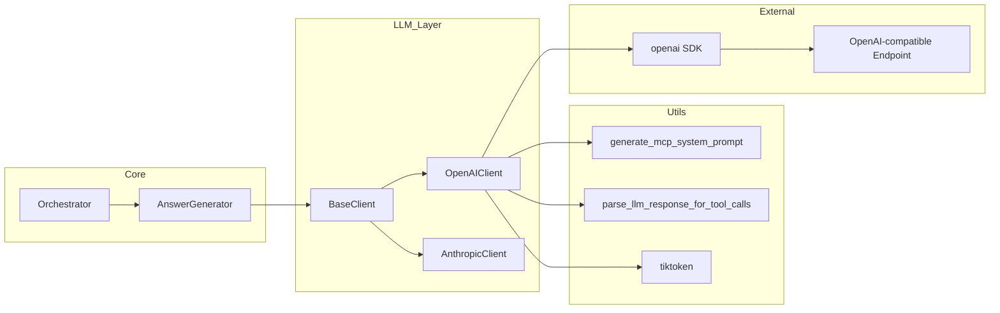
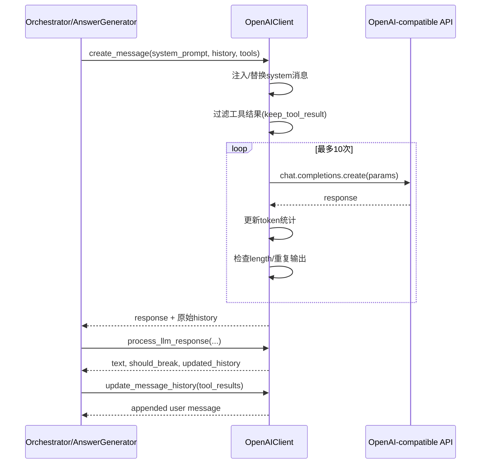
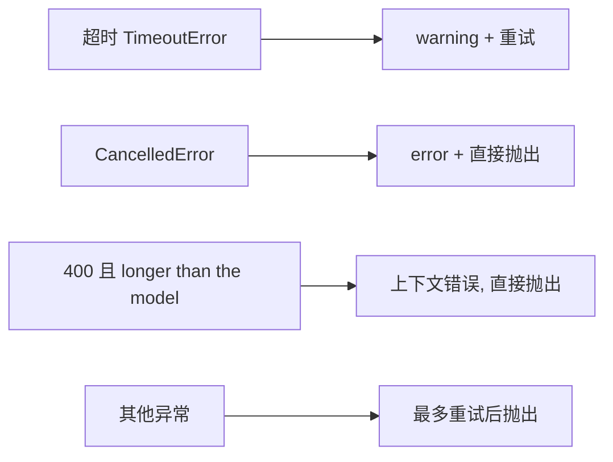

# openai_client 模块文档

## 模块简介与设计目标

`openai_client` 是 `miroflow_agent_llm_layer` 中面向 OpenAI 协议生态的 Provider 适配模块，核心实现为 `OpenAIClient`。它的核心价值不是“简单调用一次 SDK”，而是把与 OpenAI 及 OpenAI-compatible 网关相关的工程细节集中封装起来，包括请求参数映射、重试恢复、token 使用统计、消息历史维护、上下文长度保护，以及工具调用结果回灌。

在 MiroFlow Agent 架构中，上层编排组件（如 [`orchestrator.md`](orchestrator.md)、[`answer_generator.md`](answer_generator.md)）不应该关心不同模型厂商的 API 差异。`OpenAIClient` 通过继承 [`BaseClient`](base_client.md) 提供统一接口，使编排层只依赖抽象协议即可完成主循环。这种设计显著降低了替换模型后端（OpenAI / vLLM / Qwen / DeepSeek 兼容网关）的改动范围。

## 模块在系统中的位置



上图展示了清晰的职责边界：`OpenAIClient` 负责“模型通信与响应治理”，不负责“任务决策与工具执行”。工具执行和回滚策略由 `Orchestrator + ToolExecutor` 负责，最终答案整理由 `AnswerGenerator + OutputFormatter` 负责。

---

## 核心类：`OpenAIClient`

`OpenAIClient` 是 `dataclass`，继承 `BaseClient`。它依赖基类在 `__post_init__` 中注入的配置与状态，例如：`model_name`、`temperature`、`max_tokens`、`max_context_length`、`async_client`、`task_log`、`token_usage`、`last_call_tokens`。

### 生命周期概览



`create_message` 入口在基类，真正 provider-specific 请求逻辑在 `_create_message`。这种模板方法模式确保了不同 Provider 的行为统一可替换。

---

## 详细 API 与内部机制

### 1) `_create_client(self) -> Union[AsyncOpenAI, OpenAI]`

该方法根据 `self.async_client` 创建异步或同步客户端，并注入 header：`x-upstream-session-id: self.task_id`。这个 header 常用于网关链路追踪、会话关联和问题排查。

当 `base_url` 指向兼容网关时，调用路径与官方 OpenAI API 一致，因此该模块可复用到私有部署场景。

**副作用**：创建并持有 `self.client`（由基类初始化流程调用）。

### 2) `_update_token_usage(self, usage_data) -> None`

该方法消费 OpenAI 返回的 `usage` 对象并更新累计统计。

- 输入 token：`prompt_tokens`
- 输出 token：`completion_tokens`
- 缓存读取 token：`prompt_tokens_details.cached_tokens`（若存在）

同时会更新 `self.last_call_tokens`，供 `ensure_summary_context` 做上下文预测。

**副作用**：
- 修改 `self.last_call_tokens`
- 累加 `self.token_usage`
- 写入 `task_log` 的 token 统计日志

### 3) `_create_message(...)`

签名要点：
- `system_prompt: str`
- `messages_history: List[Dict[str, Any]]`
- `tools_definitions`（当前实现未直接传给 OpenAI `tools` 字段）
- `keep_tool_result: int = -1`

这是本模块最关键的方法，负责一轮完整调用：消息预处理 → 参数构建 → 请求发送 → 重试恢复 → 输出校验。

#### 3.1 消息预处理

函数先复制 `messages_history` 得到 `messages_for_llm`，避免污染原始历史。若传入 `system_prompt`，会确保它成为第一条 system 消息：如果首条 role 为 `system/developer` 则覆盖，否则插入首位。

随后调用基类的 `_remove_tool_result_from_messages`，按 `keep_tool_result` 对历史工具结果进行“内容瘦身”，以降低 token 消耗。注意这里只处理发送副本，不影响原始历史回放。

#### 3.2 参数构建规则

基础参数：`model / temperature / messages / stream=False / top_p / extra_body={}`。

模型差异规则：
- `model_name` 包含 `gpt-5` 时使用 `max_completion_tokens`
- 其他模型使用 `max_tokens`

附加规则：
- `repetition_penalty != 1.0` 时写入 `extra_body.repetition_penalty`
- `deepseek-v3-1` 时启用 `extra_body.thinking = {"type": "enabled"}`
- 若最后一条消息是 `assistant`，自动设置
  - `continue_final_message=True`
  - `add_generation_prompt=False`

#### 3.3 重试与恢复

当前实现是“固定等待重试”（30 秒），最多 10 次；并非指数退避。



“严重重复”检测逻辑是：取响应末尾 50 个字符，若在全文出现次数 > 5，则判定为劣化重复并重试。

#### 3.4 返回值

返回 `(response, messages_history)`；第二项始终是“原始历史对象语义”，保证日志存档不受 token 瘦身影响。

### 4) `process_llm_response(self, llm_response, message_history, agent_type="main")`

此方法把 OpenAI 响应转换为上层统一格式：

- 返回：`(assistant_response_text, should_break, updated_message_history)`

行为分支：
- `finish_reason == "stop"`：正常追加 assistant 文本
- `finish_reason == "length"`：追加截断文本；若文本包含 `Context length exceeded`，返回 `should_break=True`
- 其他 finish reason：抛 `ValueError`

**风险点**：某些后端可能返回 `content_filter`、`tool_calls` 等 finish reason，当前逻辑会抛异常，需要上层重试路径兜底。

### 5) `extract_tool_calls_info(self, llm_response, assistant_response_text)`

该方法委托 `parse_llm_response_for_tool_calls` 从文本中解析工具调用信息，说明当前 OpenAI 分支主要采用“文本协议解析”而非原生 `message.tool_calls` 结构。

### 6) `update_message_history(self, message_history, all_tool_results_content_with_id)`

会把多个工具结果中的 text 合并为单条 `user` 消息追加到历史中。该策略减少消息条目数，利于控制上下文长度，但也会降低单次 tool call 的结构化可追溯性。

### 7) `generate_agent_system_prompt(self, date, mcp_servers)`

直接调用 `generate_mcp_system_prompt` 生成系统提示词。模板策略不在本模块重复，详见其他文档。

### 8) `_estimate_tokens(self, text)`

优先使用 `tiktoken` 的 `o200k_base`，失败回退 `cl100k_base`。若编码失败，降级为经验估算 `len(text)//4`。

**副作用**：首次调用时懒加载并缓存 `self.encoding`。

### 9) `ensure_summary_context(self, message_history, summary_prompt)`

该方法用于“是否还能安全进入总结阶段”的预测检查。它使用上一次调用 token 信息（`last_call_tokens`）+ summary prompt 估算总量：

`prompt + completion + last_user + summary + max_tokens + 1000(buffer)`

若估算超过 `max_context_length`，会回滚最近一组 `assistant/user`（通常是“工具请求 + 工具结果”）并返回 `(False, new_history)`，提示上层尽快收敛。

### 10) `format_token_usage_summary()` / `get_token_usage()`

- `format_token_usage_summary()` 返回 `(summary_lines, log_string)`，用于最终总结展示与日志写入。
- `get_token_usage()` 返回 usage 副本，避免外部直接修改内部状态。

---

## 与其它模块的交互关系

### 与 `AnswerGenerator` 的关系

`AnswerGenerator.handle_llm_call` 通过 `BaseClient.create_message` 调用本模块，并在响应后调用：
1. `process_llm_response` 提取文本并更新历史
2. `extract_tool_calls_info` 解析工具调用

因此，`OpenAIClient` 的输出格式稳定性直接决定主循环是否可持续。

### 与 `Orchestrator` 的关系

`Orchestrator` 在每轮工具执行后调用 `update_message_history` 写回工具结果，再调用 `ensure_summary_context` 做上下文安全检查。这两个方法决定了长任务场景下系统是否会因上下文爆炸而失败。

### 与 `AnthropicClient` 的关系

二者接口对齐，但内部语义不同。OpenAI 分支按 `prompt_tokens/completion_tokens` 统计，Anthropic 分支按 `input/output/cache_*` 统计并支持显式 cache control。若进行跨 Provider 成本比较，必须先统一统计口径。

---

## 配置说明（常用）

```yaml
llm:
  provider: openai
  model_name: gpt-4o-mini        # 也可为 gpt-5、deepseek-v3-1 等兼容模型
  api_key: ${env:OPENAI_API_KEY}
  base_url: https://api.openai.com/v1   # 可替换为兼容网关
  async_client: true
  temperature: 0.2
  top_p: 0.95
  max_tokens: 4096
  max_context_length: 128000
  repetition_penalty: 1.0

agent:
  keep_tool_result: 3            # -1 保留全部；0 仅保留初始用户任务
```

---

## 使用示例

```python
from apps.miroflow_agent.src.llm.providers.openai_client import OpenAIClient

client = OpenAIClient(task_id="task-001", cfg=cfg, task_log=task_log)

history = [{"role": "user", "content": "请总结这份周报并提取风险项"}]

response, history = await client.create_message(
    system_prompt="你是严谨的项目分析助手。",
    message_history=history,
    tool_definitions=[],
    keep_tool_result=cfg.agent.keep_tool_result,
)

assistant_text, should_break, history = client.process_llm_response(response, history)

if not should_break:
    tool_calls = client.extract_tool_calls_info(response, assistant_text)
```

工具结果回写与上下文检查示例：

```python
history = client.update_message_history(history, all_tool_results_content_with_id)
ok, history = client.ensure_summary_context(history, summary_prompt)
if not ok:
    # 触发上层总结/压缩逻辑
    pass
```

---

## 边界条件、错误处理与已知限制



需要重点关注的约束：
- 重试为固定 30s 间隔，非指数退避。
- `tools_definitions` 在 `_create_message` 中目前未直接映射到 OpenAI `tools` 参数，工具调用依赖文本解析。
- `process_llm_response` 仅显式支持 `stop/length`；新增 finish reason 时需扩展兼容。
- 重复检测是启发式规则，可能误判（尤其模板化文本）。
- `format_token_usage_summary` 中读取 `total_cache_input_tokens`，而统一 usage 结构是 `total_cache_read_input_tokens`，存在展示偏差风险（维护时建议统一字段名）。

---

## 扩展与维护建议

如果你要扩展该模块（例如引入原生 function calling、JSON schema 输出、流式响应），建议优先保持 `BaseClient` 接口不变，只在 `OpenAIClient` 内新增 provider 映射与解析逻辑，避免影响编排层。

建议改进方向：
- 将重试策略升级为指数退避 + jitter。
- 增加 finish reason 的兼容分支与降级行为。
- 把“文本工具调用解析”与“原生 tool_calls 解析”做双栈兼容。
- 把 token 统计字段做跨 provider 统一映射，避免前端展示误解。

---

## 参考文档

- 抽象基类与通用调用入口：[`base_client.md`](base_client.md)
- 主循环编排与回滚策略：[`orchestrator.md`](orchestrator.md)
- LLM 调用封装与最终答案生成：[`answer_generator.md`](answer_generator.md)
- 同层 Provider 对照：[`anthropic_client.md`](anthropic_client.md)

`OpenAIClient` 的本质是“把模型供应商差异与不稳定性吸收在单点”，从而让上层 Agent 工作流保持稳定、可替换、可观察。这也是该模块在整个系统中最核心的工程价值。



该流程中有两个“软恢复”机制：

1. **长度截断恢复**：若 `finish_reason == "length"`，尝试增加 `max_tokens` 后重试。
2. **重复输出恢复**：若文本尾部 50 字符在全响应中出现超过 5 次，判定为严重重复并重试。

#### 3.4 返回值语义

返回 `(response, messages_history)`，其中历史返回的是**原始未裁剪对象**，用于保持日志完整性和回放一致性。

### 4) `process_llm_response(self, llm_response, message_history, agent_type="main")`

该方法将 OpenAI response 转换为上层可消费结构：`(assistant_text, should_break, updated_history)`。

支持的 `finish_reason`：

- `stop`：正常完成，追加 assistant 文本
- `length`：截断完成，仍追加文本；若包含 `Context length exceeded`，返回 `should_break=True`

其他 `finish_reason` 会抛出 `ValueError`。这意味着如果后端返回如 `tool_calls`、`content_filter` 等未覆盖值，上层会进入异常路径。

### 5) `extract_tool_calls_info(...)`

该方法委托 `parse_llm_response_for_tool_calls` 从 assistant 文本中提取工具调用信息（server/tool/arguments/id）。这说明当前工具调用解析仍以文本协议为主，而非直接消费 OpenAI 原生 `message.tool_calls` 字段。

### 6) `update_message_history(...)`

将所有工具结果的 `text` 内容合并为单条 `user` 消息写回历史。这种“压缩回填”策略能减少消息条目数量，但也会弱化每次工具调用与结果的一一对应结构。

### 7) `generate_agent_system_prompt(...)`

直接调用 `generate_mcp_system_prompt(date, mcp_servers)`，用于为主/子 agent 生成统一系统提示。具体模板逻辑见其他模块文档，不在本模块重复。

### 8) `_estimate_tokens(text)` 与 `ensure_summary_context(...)`

`_estimate_tokens` 使用 `tiktoken`（优先 `o200k_base`，失败回落 `cl100k_base`）估算 token；编码失败时退化为“每 4 字符约 1 token”。

`ensure_summary_context` 通过以下估算判断是否接近上下文上限：

`last_prompt + last_completion + last_user + summary_prompt + self.max_tokens + 1000`

若超限，会回滚最近一对 assistant/user（通常是“工具请求 + 工具结果”）并返回 `False`，通知上层触发总结收敛。

### 9) `format_token_usage_summary()` 与 `get_token_usage()`

`format_token_usage_summary` 生成两种输出：

- `summary_lines`：用于最终答案附加统计段落
- `log_string`：用于日志

`get_token_usage` 返回 usage 的副本，防止调用方直接篡改内部状态。

## 组件关系与依赖细化

`OpenAIClient` 的直接父类是 [`BaseClient`](base_client.md)，因此它复用了基类定义的标准调用入口 `create_message(...)`、工具结果裁剪 `_remove_tool_result_from_messages(...)`、超时装饰器、连接关闭语义等能力。换句话说，`OpenAIClient` 只关心“OpenAI 协议特有部分”，而不会重复实现通用生命周期逻辑。与同层的 [`AnthropicClient`](anthropic_client.md) 对比时可以看到二者在方法名上高度一致，这种一致性正是编排层可以热切换 provider 的关键。



上图强调了三层依赖方向：编排层只面对基类抽象，Provider 实现向下依赖 SDK 与外部 API，解析与 prompt 生成等横切能力则放在 utils。这个边界能显著降低“引入新模型后端”带来的改动面。

## Provider 行为差异（与 AnthropicClient 对照）

虽然 `OpenAIClient` 与 `AnthropicClient` 暴露同名接口，但运行时行为并不完全等价。`OpenAIClient` 使用 `chat.completions.create`，并根据模型名在 `max_tokens` / `max_completion_tokens` 之间切换；`AnthropicClient` 使用 `messages.create`，并支持更细粒度的 cache control 注入。token 统计方面，OpenAI 分支主要关心 `prompt_tokens` 与 `completion_tokens`，缓存写入 token 通常不可见；Anthropic 分支则同时统计 cache creation/read。

这种差异意味着，当你在运维层比较两个 provider 的“同任务 token 成本”时，不能简单按字段名横向比对，而应先统一口径（例如是否把缓存相关 token 计入 input 预算）。


## 关键交互流程



这个流程体现了本模块在“请求侧（鲁棒调用）”和“历史侧（上下文治理）”两端的双重职责。

## 配置与运行参数

`OpenAIClient` 依赖 `cfg.llm` 与 `cfg.agent`。常用配置含义如下（字段定义源于 `BaseClient`）：

```yaml
llm:
  provider: openai
  model_name: gpt-4o-mini   # 或 gpt-5 / deepseek-v3-1 / 其他兼容模型
  api_key: "${env:OPENAI_API_KEY}"
  base_url: "https://api.openai.com/v1"  # 可替换为兼容网关
  temperature: 0.2
  top_p: 0.95
  max_context_length: 128000
  max_tokens: 4096
  async_client: true
  repetition_penalty: 1.0

agent:
  keep_tool_result: 3   # -1保留全部；0只保留初始任务和最新结构
```

## 使用示例

### 示例 1：最小化调用

```python
from apps.miroflow_agent.src.llm.providers.openai_client import OpenAIClient

client = OpenAIClient(task_id="task-123", cfg=cfg, task_log=task_log)

history = [{"role": "user", "content": "请总结这份报告的重点"}]
response, history = await client.create_message(
    system_prompt="你是严谨的研究助理。",
    message_history=history,
    tool_definitions=[],
    keep_tool_result=cfg.agent.keep_tool_result,
)

text, should_break, history = client.process_llm_response(response, history)
```

### 示例 2：工具结果回填后的上下文检查

```python
history = client.update_message_history(history, all_tool_results_content_with_id)
ok, history = client.ensure_summary_context(history, summary_prompt)
if not ok:
    # 触发总结逻辑，避免超上下文
    pass
```

## 设计细节与实现注意点（开发者必读）

1. `tools_definitions` 参数在 `_create_message` 中当前未直接传给 OpenAI `tools` 字段。这意味着本实现的工具调用更偏“文本协议解析”路线，而不是 OpenAI 原生 function calling。
2. 重试等待时间是固定 `30s`，并非指数退避；若你希望高并发更友好，建议改为指数或抖动退避。
3. `finish_reason` 仅支持 `stop/length`，对其他值容错较弱。
4. `ensure_summary_context` 依赖 `last_call_tokens`，如果上一次调用失败或未更新 usage，估算可能偏差较大。
5. token 汇总中 `format_token_usage_summary` 读取了 `total_cache_input_tokens`，而统一结构字段是 `total_cache_read_input_tokens`，存在字段命名不一致风险（可能导致展示为 0）。

## 边界条件、错误处理与限制



主要约束如下：

- 当响应持续 `length` 截断时，最终会返回截断文本，而不是无限重试。
- 检测“严重重复”使用字符串启发式规则，可能出现误判（尤其短格式、模板输出）。
- system prompt 注入策略会覆盖第一条 `system/developer` 消息，若上层有多 system 设计需谨慎。
- 该模块不计算成本（pricing disabled），仅统计 token。

## 扩展建议

如果你要基于 `OpenAIClient` 扩展新能力（例如原生 function calling、JSON schema 输出、流式输出），建议遵循以下方向：

- 在 `_create_message` 中新增 provider 参数映射层，不破坏 `BaseClient` 接口。
- 将“响应解析”与“重试策略”进一步拆分，降低单方法复杂度。
- 为 `finish_reason` 增加兼容分支与降级行为，避免抛异常中断主流程。
- 若要统一多 provider 的 tool call 语义，可抽象到 `BaseClient` 或独立 parser 模块。

## 关联文档

- 基类与通用抽象：[`base_client.md`](base_client.md)
- 主流程编排：[`orchestrator.md`](orchestrator.md)
- LLM 调用与最终答案生成：[`answer_generator.md`](answer_generator.md)
- 事件流传输：[`stream_handler.md`](stream_handler.md)
- 同层对比实现：`anthropic_client.md`（若仓库后续补齐）

---

该模块的核心价值在于“把 OpenAI 及兼容协议的工程复杂度收敛在单点”，让上层 Agent 逻辑保持稳定且可移植。对于维护者而言，最需要重点关注的不是单次 API 调用本身，而是重试、上下文治理、消息历史一致性与日志可追溯性这四条主线。