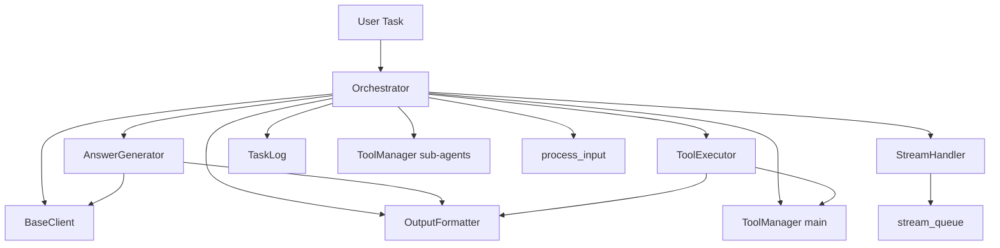
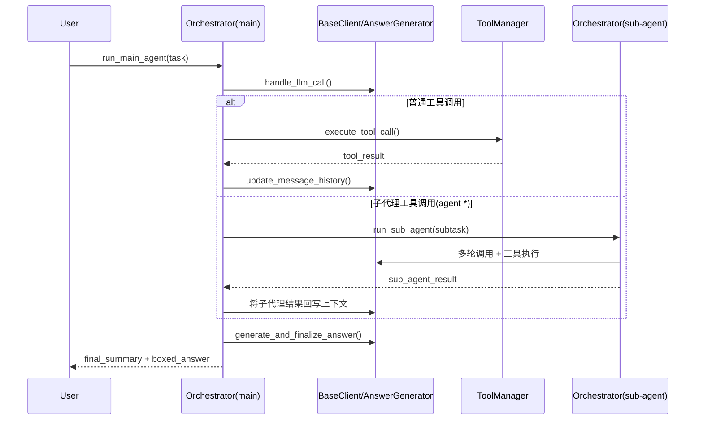
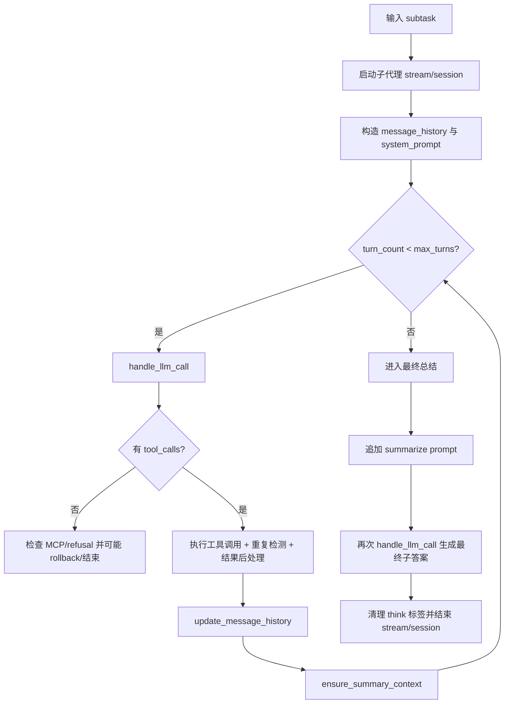
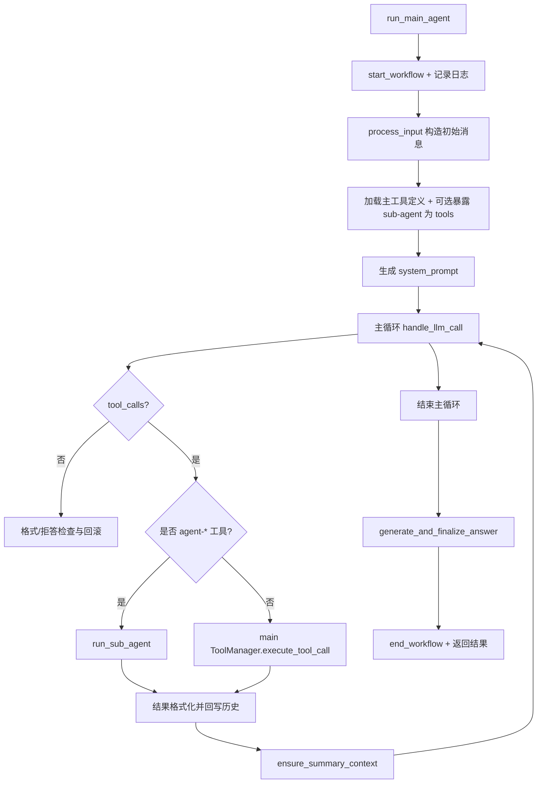

# orchestration_runtime 模块文档

## 模块概述

`orchestration_runtime` 是 `miroflow_agent_core` 中负责“运行时编排”的核心模块，其实现主体是 `apps.miroflow-agent.src.core.orchestrator.Orchestrator`。如果把整个 Agent 系统理解为一个多组件协作流水线，那么该模块就是调度中枢：它在单次任务执行期间串联 LLM 推理、工具调用、子代理（sub-agent）协作、消息历史维护、流式事件上报以及最终答案收敛。

该模块存在的根本原因，是将“策略层能力”与“执行层复杂性”解耦。上层只需要提交任务描述，`Orchestrator` 即可在内部完成多轮循环、故障回滚、上下文控制与总结收尾，最终给出结构化输出。这使得主流程对外呈现出稳定的调用接口，同时在内部允许复杂策略演进（例如重复查询拦截、格式错误回滚、上下文触顶总结）。

在模块树中，`orchestration_runtime` 是 `miroflow_agent_core` 的当前文档对象，依赖并协调：

- `answer_lifecycle`（`AnswerGenerator`）处理 LLM 调用与最终答案生成。
- `tool_and_stream_integration`（`ToolExecutor`、`StreamHandler`）处理工具调用后处理、回滚判定、流式事件。
- `miroflow_agent_llm_layer`（`BaseClient` 及 provider 实现）提供模型调用、token 使用记录、消息历史更新。
- `miroflow_agent_io`（`process_input`、`OutputFormatter`）负责输入预处理与工具/文本输出格式化。
- `miroflow_tools_management`（`ToolManager`）提供工具定义检索与执行。
- `miroflow_agent_logging`（`TaskLog`）提供全流程审计与调试日志。

---

## 设计目标与运行时职责

`Orchestrator` 的核心设计目标不是“直接回答问题”，而是“可靠地驱动回答产生过程”。它承担以下职责：

1. **任务级生命周期管理**：从 workflow 开始，到主循环执行、最终总结、workflow 结束。
2. **多代理协同调度**：主代理在需要时将子任务派发给 sub-agent，并在返回后继续主流程整合。
3. **工具执行控制**：识别 LLM 工具调用意图、参数修复、执行、结果后处理与回写。
4. **鲁棒性控制**：处理 MCP 标签格式错误、拒答关键词、重复查询、工具异常，并通过受控 rollback 防止死循环。
5. **上下文治理**：在上下文长度逼近限制时触发总结策略，避免超窗导致任务失败。
6. **可观测性**：通过 `TaskLog` 与 `StreamHandler` 同步记录机器可读日志与用户可感知实时事件。

---

## 核心组件与依赖关系

### 架构关系图



该图展示了 `Orchestrator` 的中枢位置。它并不替代下游组件能力，而是将这些能力按时序拼接为一个可恢复、可追踪、可扩展的运行时过程。`AnswerGenerator` 负责“问模型”，`ToolExecutor` 负责“工具调用策略和结果裁决”，`StreamHandler` 负责“实时事件”，`TaskLog` 负责“离线审计与诊断”。

### 主/子代理交互图



子代理不是独立进程调度器，而是由同一个 `Orchestrator` 实例以递归式调用 `run_sub_agent` 完成。主代理与子代理共享一套回滚/上下文/日志理念，但在配置和工具集合上相互隔离。

---

## 顶层常量与辅助函数

### 常量

- `DEFAULT_LLM_TIMEOUT = 600`：定义了默认 LLM 超时值，但在当前文件中未被直接使用（属于保留/扩展位）。
- `DEFAULT_MAX_CONSECUTIVE_ROLLBACKS = 5`：连续回滚上限，超过后强制中断当前代理循环。
- `EXTRA_ATTEMPTS_BUFFER = 200`：总尝试次数缓冲，限制 `turn_count` 之外的额外重试行为，避免异常情况下无限循环。

### `_list_tools(sub_agent_tool_managers)`

该函数返回一个**带缓存的异步闭包**。第一次调用会并发语义上顺序遍历所有子代理 `ToolManager` 并拉取工具定义，之后直接返回缓存结果。它的价值在于降低重复获取工具定义的开销，尤其在多次子代理调用中避免重复 IO/网络请求。

---

## `Orchestrator` 详解

## 初始化与内部状态

### `__init__(...)`

构造函数接收主/子工具管理器、LLM 客户端、输出格式化器、配置对象、日志对象、流式队列以及可选预加载工具定义。初始化后创建三个关键协作器：

- `self.stream = StreamHandler(stream_queue)`
- `self.tool_executor = ToolExecutor(...)`
- `self.answer_generator = AnswerGenerator(...)`

并维护若干运行态状态：

- `intermediate_boxed_answers`：主循环中提取到的中间 boxed 内容，用于最终答案阶段参考。
- `used_queries`：重复查询检测缓存，按 `cache_name -> query_str -> count` 计数。
- `MAX_CONSECUTIVE_ROLLBACKS`：当前实例级回滚上限。
- `context_compress_limit`：从配置读取的上下文压缩阈值（本文件未直接使用，可能由其他组件协作生效）。

**副作用**：若同时提供 `llm_client` 与 `task_log`，会将 `task_log` 注入到 `llm_client`（`self.llm_client.task_log = task_log`），让 LLM 层可写入统一任务日志。

---

## 日志保存回调

### `_save_message_history(system_prompt, message_history)`

这是一个小型回调函数，用于将主代理消息历史写入 `task_log` 并 `save()`。它在最终答案生成阶段通过 `generate_and_finalize_answer(..., save_callback=...)` 被调用，使回答收尾阶段也具备可追踪性。

---

## 异常响应与回滚控制

### `_handle_response_format_issues(...)`

该方法在“LLM 本轮没有工具调用”时执行额外检查，重点识别两类问题：

1. 响应文本中含有 `mcp_tags`（工具调用格式污染）。
2. 响应文本中命中 `refusal_keywords`（模型拒答）。

若命中且未超过回滚上限，则执行回滚：`turn_count -= 1`、`consecutive_rollbacks += 1`、必要时弹出最后 assistant 消息。否则终止当前代理循环。

返回值是五元组：
`(should_continue, should_break, turn_count, consecutive_rollbacks, message_history)`。

这套设计避免了“模型格式偏差导致流程提前结束”，也避免了“持续格式错误导致永不收敛”。

### `_check_duplicate_query(...)`

此方法通过 `ToolExecutor.get_query_str_from_tool_call()` 生成可比较 query 字符串，并在 `used_queries[cache_name]` 中检查计数。若发现重复且回滚预算未耗尽，则回滚当前轮；若预算耗尽则允许重复执行并记录 warning。

返回值为：
`(is_duplicate, should_rollback, turn_count, consecutive_rollbacks, message_history)`。

### `_record_query(cache_name, tool_name, arguments)`

在工具调用成功后记录 query 命中次数，为后续重复检测提供数据基础。

---

## 子代理执行流程

### `run_sub_agent(sub_agent_name, task_description)`

该方法用于执行一个完整子任务，会自动拼接“请提供详细支撑信息”的附加说明，随后进入子代理独立多轮循环。

### 子代理流程图



### 关键行为说明

子代理与主代理使用相同的核心调用器（`AnswerGenerator`、`ToolExecutor`），但工具定义来自 `sub_agent_tool_managers[sub_agent_name]`，且 `max_turns` 来自 `cfg.agent.sub_agents[sub_agent_name].max_turns`。

当工具执行发生异常，方法会捕获异常写入日志，并将错误包装为可返回给 LLM 的工具结果。若结果被 `ToolExecutor.should_rollback_result` 判定为应回滚，则进行受控回退。

收尾阶段会强制触发一次“Partial Summary”提示，然后执行最终 LLM 调用生成子代理答案。最终返回前会粗粒度移除 `<think>` / `</think>` 后的显示污染片段。

**返回值**：`final_answer_text: str`。

---

## 主代理执行流程

### `run_main_agent(task_description, task_file_name=None, task_id="default_task", is_final_retry=False)`

该方法是模块最重要的对外入口，执行完整端到端任务，并返回三元组：

- `final_summary`
- `final_boxed_answer`
- `failure_experience_summary`

### 主流程图



### 内部工作机制（按阶段）

主代理先通过 `process_input` 处理用户输入与附件，再获取工具定义。若配置存在子代理，会调用 `expose_sub_agents_as_tools` 将子代理能力暴露为“可调用工具”，使模型可在同一工具调用协议下调度子代理。

循环中每轮先调用 `answer_generator.handle_llm_call` 获取文本与工具调用，再根据是否需要工具执行分流。普通工具调用路径使用 `main_agent_tool_manager.execute_tool_call`；子代理调用路径先关闭 main stream，再运行 `run_sub_agent`，随后以 “Summarizing” 身份恢复 main stream 继续整合。

每轮成功执行后，使用 `llm_client.update_message_history` 写回工具结果，并调用 `ensure_summary_context` 检测上下文窗口。如果长度超限则提前结束主循环并进入最终总结阶段。

最后调用 `answer_generator.generate_and_finalize_answer` 生成最终输出，并将 boxed answer 通过 stream 展示，记录 usage log，返回三元组结果。

---

## 关键参数、配置与可扩展点

`Orchestrator` 行为高度依赖 `cfg`：

- `cfg.agent.main_agent.max_turns`：主循环最大轮数。
- `cfg.agent.sub_agents[<name>].max_turns`：各子代理轮数上限。
- `cfg.agent.sub_agents`：是否启用并暴露子代理能力。
- `cfg.agent.context_compress_limit`：上下文压缩相关阈值（当前类中仅读取）。

常见扩展方向：

- 扩展 `ToolExecutor.should_rollback_result` 策略，实现更精细错误恢复。
- 扩展 query 提取逻辑（`get_query_str_from_tool_call`），提升重复检测准确率。
- 在 `AnswerGenerator` 中调整最终总结模板和 retry 策略。
- 在 `StreamHandler` 中增加更丰富事件类型（例如 token 流、阶段耗时指标）。

---

## 错误处理、边界条件与已知限制

### 回滚相关

系统使用“连续回滚计数器”防止坏状态无限重试。注意回滚发生时会修改 `turn_count`，因此日志中的回合数字可能出现重复或回退，这是设计行为而非日志错误。

### 重复查询检测

重复检测基于 query 字符串抽取，不是语义等价检测。不同参数顺序、同义改写可能绕过判重；相反，过于粗糙的 query 提取也可能误判。

### 工具与 LLM 的双重失败

当 LLM无响应或工具异常时系统倾向重试并等待（如 `asyncio.sleep(5)`）。在上游服务长期不可用场景下，任务仍会消耗较长时间直至达到尝试上限。

### 上下文限制

上下文检查依赖 `llm_client.ensure_summary_context`。一旦返回不通过，主/子代理会提前终止循环并进入总结阶段，可能导致“探索不充分但必须收束”的结果。

### 结果清洗的局限

子代理返回时仅通过字符串 `split` 去除 `<think>` 标签，若模型输出变体标签或嵌套结构，可能清洗不彻底。

### 未直接使用的常量

`DEFAULT_LLM_TIMEOUT` 在当前文件中未直接生效，如需超时治理应确认 LLM client 层是否实现实际超时控制。

---

## 典型调用示例

```python
orchestrator = Orchestrator(
    main_agent_tool_manager=main_tool_manager,
    sub_agent_tool_managers=sub_tool_managers,
    llm_client=llm_client,
    output_formatter=output_formatter,
    cfg=cfg,
    task_log=task_log,
    stream_queue=stream_queue,
)

final_summary, final_boxed_answer, failure_experience_summary = await orchestrator.run_main_agent(
    task_description="请分析这个需求并给出实施方案",
    task_file_name="requirements.md",
    task_id="task-2026-001",
)
```

如果只想执行某个子代理能力（通常用于内部测试），可直接调用：

```python
sub_result = await orchestrator.run_sub_agent(
    sub_agent_name="agent-research",
    task_description="调研竞品在多语言检索方面的最佳实践",
)
```

---

## 与其他文档的关系

为避免重复，以下主题请参考对应模块文档：

- LLM 客户端抽象、token 统计、provider 行为：[`miroflow_agent_llm_layer.md`](miroflow_agent_llm_layer.md)、[`base_client.md`](base_client.md)
- 回答生成与收尾细节：[`answer_generator.md`](answer_generator.md)
- 工具执行后处理与回滚判定：[`tool_executor.md`](tool_executor.md)
- 流式事件协议与展示：[`stream_handler.md`](stream_handler.md)
- 输入输出处理：[`input_handler.md`](input_handler.md)、[`output_formatter.md`](output_formatter.md)
- 任务日志结构：[`miroflow_agent_logging.md`](miroflow_agent_logging.md)
- 工具管理器能力：[`tool_manager.md`](tool_manager.md)

---

## 维护者建议

维护该模块时，请优先保持“状态转换一致性”：每次新增分支都要明确是否影响 `turn_count`、`consecutive_rollbacks`、`message_history` 和 stream 生命周期（start/end 对称）。`Orchestrator` 的复杂度主要来自跨组件时序与失败恢复，而不是单点算法；因此高价值测试应覆盖“失败路径”和“恢复路径”，而不仅是 happy path。
