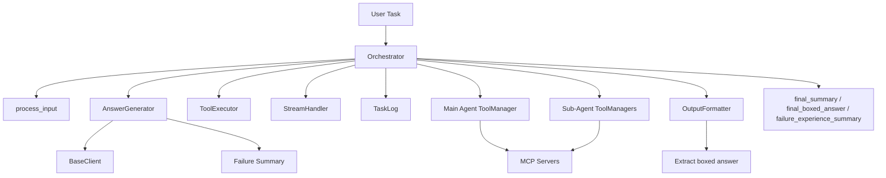
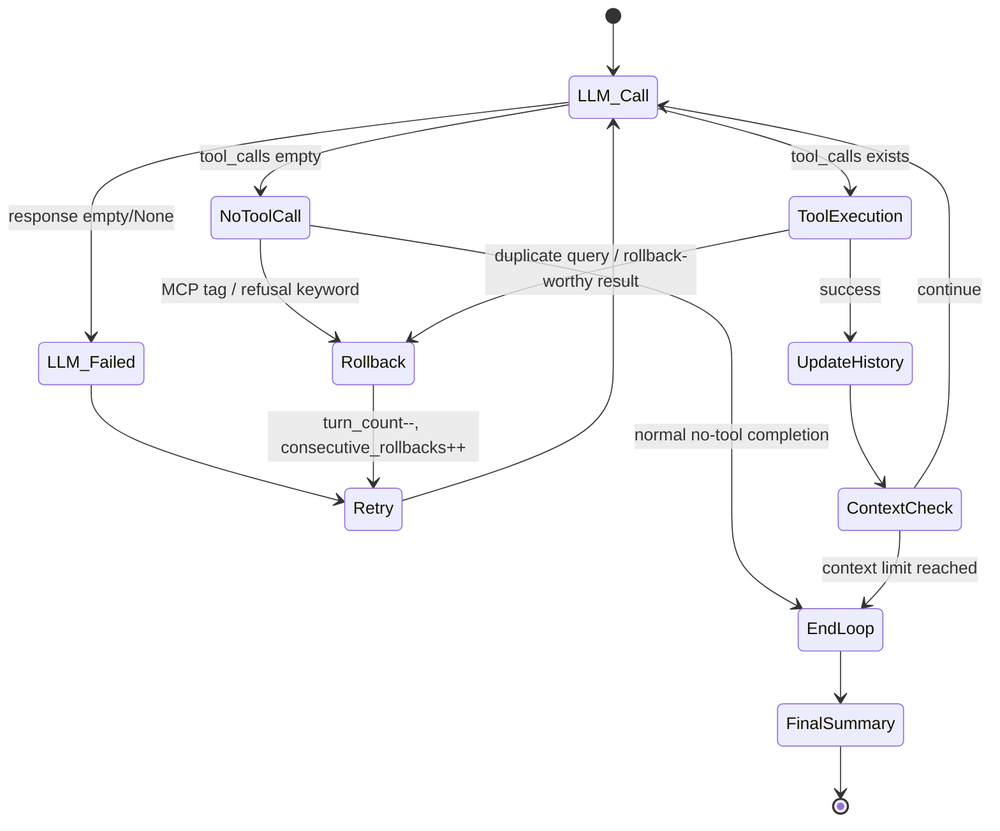

# orchestrator 模块文档

## 模块定位与设计目标

`orchestrator` 是 `miroflow_agent_core` 的执行中枢，它把“LLM 推理”“工具调用”“子代理协作”“流式可观测性”“日志持久化”五条链路串成一个完整闭环。你可以把它理解为一个任务级状态机：接收用户任务后，持续驱动主代理迭代（LLM -> 工具 -> 回写上下文），在必要时把子任务委托给子代理，并在达到结束条件后生成最终答案与失败经验摘要。

这个模块存在的核心原因，是把复杂的多组件协作逻辑从单一 LLM 客户端里抽离出来。LLM 只负责“生成”，`ToolManager` 只负责“执行”，而 `Orchestrator` 负责“何时调用谁、调用后如何更新系统状态、出错后如何回滚与重试”。这种分层使系统在可维护性上更强：你可以独立替换模型供应商、替换工具后端，或新增子代理，而不需要重写主流程。

从架构风格上看，`Orchestrator` 采用了“主循环 + 防御式回滚 + 最终总结”的设计：在主循环中尽可能获取外部信息并推进任务；在遇到格式错误、拒答、重复查询或无效工具结果时进行有限回滚；在循环终止后统一进入总结阶段，确保对外输出始终有结构化结果。

---

## 核心组件与职责边界

当前模块的核心类是 `apps.miroflow-agent.src.core.orchestrator.Orchestrator`。它直接依赖以下组件，并把它们组合为执行引擎：

- `AnswerGenerator`：统一封装 LLM 调用、最终答案生成与失败经验摘要生成。详见 [answer_generator.md](answer_generator.md)。
- `StreamHandler`：发送 workflow/agent/llm/tool_call 事件，支持 SSE 风格流式前端。详见 [stream_handler.md](stream_handler.md)。
- `ToolExecutor`：参数纠错、重复查询键提取、工具结果后处理与回滚判定。详见 [tool_executor.md](tool_executor.md)。
- `BaseClient`：抽象 LLM 客户端，提供 `create_message`、上下文长度检查、消息历史更新等能力。详见 [base_client.md](base_client.md)。
- `ToolManager`：与 MCP server 通信，拉取工具定义并执行工具调用。详见 [tool_manager.md](tool_manager.md)。
- `OutputFormatter`：工具结果格式化、`\boxed{}` 提取、最终 summary 组装。详见 [output_formatter.md](output_formatter.md)。
- `TaskLog`：步骤日志与消息历史持久化。详见 [miroflow_agent_logging.md](miroflow_agent_logging.md)。

这些依赖都不是“可选功能”，而是执行闭环中的角色分工。`Orchestrator` 的价值正是把它们按严格顺序串联起来。

---

## 架构关系图



这张图表达了一个关键点：`Orchestrator` 并不直接“理解”业务内容，它理解的是流程编排。语义推理来自 `LLM`，外部能力来自 `ToolManager`，可观测性来自 `TaskLog + StreamHandler`，输出规范来自 `OutputFormatter`。

---

## 主流程：`run_main_agent` 的执行生命周期

`run_main_agent(...)` 是系统端到端入口。它的返回值是：

```python
(final_summary, final_boxed_answer, failure_experience_summary)
```

### 1) 工作流初始化

方法首先通过 `stream.start_workflow(task_description)` 发出工作流开始事件，然后写入任务日志。接着调用 `process_input(task_description, task_file_name)`，把文件内容（如果有）并入用户输入，并附加“最终答案需使用 `\boxed{}` 包裹”的硬性格式要求。

### 2) 工具定义构建

若调用方未预传 `tool_definitions`，`Orchestrator` 会向主 `ToolManager` 拉取工具定义，并在配置存在 `sub_agents` 时调用 `expose_sub_agents_as_tools(...)` 把子代理暴露为“可调用工具”。这一步是“主代理调用子代理”的桥梁：在 LLM 看来，子代理就像普通函数工具。

### 3) System Prompt 生成

通过 `llm_client.generate_agent_system_prompt(...)` 生成基础系统提示，再拼接 `generate_agent_specific_system_prompt(agent_type="main")`。这意味着主代理与子代理虽然共享底层模型接口，但拥有不同的行为约束。

### 4) 主循环（Turn Loop）

循环边界并不只看 `max_turns`，还有 `EXTRA_ATTEMPTS_BUFFER`。这是一个安全阀：即使发生多次回滚，系统仍可在一定额外尝试内自愈，而不是过早退出。

每一轮都会做四件事：

1. 调用 `answer_generator.handle_llm_call(...)` 获取 `assistant_response_text`、`tool_calls` 等。
2. 若有自然语言文本，发送 `show_text` 流式事件，并提取中间 `\boxed{}` 内容到 `intermediate_boxed_answers`。
3. 若无工具调用，进入格式与拒答检查（见后文回滚策略）。
4. 若有工具调用，逐条执行并回写结果到 `message_history`。

### 5) 工具执行与子代理委托

当工具调用的 `server_name` 以 `agent-` 开头且子代理配置存在时，主代理会暂停自身流式上下文（结束当前 main agent/llm 流事件），调用 `run_sub_agent(...)` 完成子任务，再以 “Summarizing” 身份恢复主代理上下文。

如果是普通工具，则通过主 `ToolManager.execute_tool_call(...)` 执行。执行后会调用 `tool_executor.post_process_tool_call_result(...)`（例如 DEMO_MODE 下截断抓取结果），并使用 `output_formatter.format_tool_result_for_user(...)` 生成可回灌 LLM 的消息内容。

### 6) 上下文长度控制

每轮工具结果回写后，都会调用 `llm_client.ensure_summary_context(...)` 检查上下文是否还能继续扩展。若超限，会强制跳出主循环并进入总结阶段。

### 7) 最终总结

主循环结束后，`Orchestrator` 调用 `answer_generator.generate_and_finalize_answer(...)`。该方法会根据 `context_compress_limit`、`reached_max_turns`、`is_final_retry` 决定是直接产出答案、使用中间答案回退，还是生成失败经验摘要供下一次重试使用。

最后发送最终文本流事件，结束 workflow，记录 usage 与完成日志并 `gc.collect()`。

---

## 子流程：`run_sub_agent` 的执行机制

`run_sub_agent(sub_agent_name, task_description)` 的行为与主代理类似，但有三个明显差异。

第一，子代理会在任务描述后追加一段固定指令，要求“给出答案与详细支撑信息”，强化子任务可用性。第二，子代理使用独立的 `max_turns`（来自 `cfg.agent.sub_agents[<name>]`），防止子流程无限膨胀。第三，子代理结束后会强制生成 partial summary，再把结果返回主代理。

子代理循环也包含重复查询检测、工具结果回滚判定、上下文长度检查等机制。最终返回前会清理 `<think>...</think>` 内容，避免把推理链暴露给上游。

---

## 关键内部方法深度解析

### `_list_tools(sub_agent_tool_managers)`

这是一个返回 async 闭包的工厂函数，核心价值是“懒加载 + 缓存”。首次调用时并发（语义上）获取每个子代理的工具定义并缓存，后续直接复用，避免每次子代理调用都重新连 MCP 拉 schema，显著降低延迟与外部依赖波动影响。

### `_handle_response_format_issues(...)`

这个方法处理“LLM 没有发起工具调用”的分支，但会进一步识别两类应回滚情况：

1. 输出中包含 `mcp_tags`，说明模型把协议标签错误地写到自然语言里。
2. 输出中包含 `refusal_keywords`，说明模型拒答或策略性回避。

若未超过最大连续回滚次数，就撤销本轮 assistant 消息、`turn_count -= 1` 并继续；否则终止当前 agent 循环。该策略使模型能在轻微偏航时自修复，同时防止死循环。

### `_check_duplicate_query(...)` / `_record_query(...)`

`_check_duplicate_query` 借助 `ToolExecutor.get_query_str_from_tool_call(...)` 对特定工具提取“查询指纹”（如 `google_search_q`、`scrape_website_url`），并按 `cache_name` 统计调用次数。若重复且仍可回滚，则撤销该轮并要求模型改写查询；若已接近回滚上限，则允许重复执行，优先保证流程可推进。

`_record_query` 则在工具成功后更新计数，保证重复检测建立在“已成功执行”的事实上。

### `_save_message_history(...)`

这是一个轻量但实用的回调接口：把 `system_prompt + message_history` 快照写回 `TaskLog`，供 `AnswerGenerator.generate_and_finalize_answer(...)` 在关键阶段触发保存。对于离线复盘和问题追踪非常关键。

---

## 主循环状态与回滚流程图



这个状态机展示了 `Orchestrator` 的核心哲学：它不是“失败即退出”，而是“可恢复错误优先回滚，致命趋势再退出”。

---

## 与其他模块的协作细节

`orchestrator` 与外围模块是强耦合协作关系，但职责清晰。

在 LLM 层，`BaseClient` 负责模型调用与 provider 适配，`Orchestrator` 只依赖统一接口，不依赖 OpenAI/Anthropic 细节。详细 provider 差异见 [miroflow_agent_llm_layer.md](miroflow_agent_llm_layer.md)。

在 IO 层，`process_input` 会把附件内容嵌入初始提示，`OutputFormatter` 负责工具结果缩写和最终 `\boxed{}` 提取。详见 [miroflow_agent_io.md](miroflow_agent_io.md)。

在工具管理层，`ToolManager` 处理 server 连接与执行错误封装，`Orchestrator` 再在更高层做回滚决策。详见 [miroflow_tools_management.md](miroflow_tools_management.md)。

在日志与可观测层，`TaskLog` 记录完整步骤，`StreamHandler` 面向实时 UI 推送事件。详见 [miroflow_agent_logging.md](miroflow_agent_logging.md)。

---

## 配置项与行为影响

以下配置对编排行为影响最大：

```yaml
agent:
  main_agent:
    max_turns: 30
  sub_agents:
    agent-browsing:
      max_turns: 12
  keep_tool_result: -1
  context_compress_limit: 0

llm:
  provider: openai   # or anthropic
  model_name: gpt-4o
  max_context_length: 128000
  max_tokens: 4096
```

`max_turns` 决定探索预算，`context_compress_limit` 决定是否启用“失败经验摘要”的多次尝试路径，`keep_tool_result` 决定历史中保留多少工具结果（影响 token 成本与可追溯性）。

代码内还定义了三个关键常量：`DEFAULT_LLM_TIMEOUT=600`、`DEFAULT_MAX_CONSECUTIVE_ROLLBACKS=5`、`EXTRA_ATTEMPTS_BUFFER=200`。它们共同决定系统在异常情况下的耐受程度。

---

## 典型调用示例

```python
orchestrator = Orchestrator(
    main_agent_tool_manager=main_tool_manager,
    sub_agent_tool_managers={"agent-browsing": browsing_tool_manager},
    llm_client=llm_client,
    output_formatter=output_formatter,
    cfg=cfg,
    task_log=task_log,
    stream_queue=stream_queue,
)

final_summary, final_boxed_answer, failure_experience_summary = await orchestrator.run_main_agent(
    task_description="请比较 2024-2025 主流开源多模态模型的推理成本",
    task_file_name=None,
    task_id="task-2026-001",
)
```

如果你希望预热并缓存工具 schema，减少首轮延迟，可以在实例化时直接注入 `tool_definitions` 与 `sub_agent_tool_definitions`。

---

## 扩展与二次开发建议

扩展新的子代理，推荐优先走“把子代理暴露成工具”这一路径，也就是复用 `expose_sub_agents_as_tools(...)` 的策略。这样主代理无需知道子代理内部实现，只需会发起工具调用。

扩展新的回滚规则时，建议集中在两个点：`_handle_response_format_issues`（面向 LLM 文本层异常）与 `ToolExecutor.should_rollback_result`（面向工具结果层异常）。保持规则分层，避免在主循环里堆叠 if/else。

若要优化成本，可从 `keep_tool_result` 与工具结果截断策略入手；若要优化稳定性，可增加 query 指纹维度，避免“语义相同但字符串不同”绕过重复检测。

---

## 边界条件、错误场景与限制

该模块做了大量防御性处理，但仍有一些必须关注的行为边界。

当 LLM 连续输出格式错误或拒答时，系统会通过回滚自愈；但一旦达到最大连续回滚次数，会直接终止循环，这可能导致任务提前结束。你需要在稳定性与探索深度之间权衡 `MAX_CONSECUTIVE_ROLLBACKS`。

重复查询检测依赖 `get_query_str_from_tool_call` 的规则化提取，目前仅覆盖少量工具（如 `google_search`、`scrape_website` 等）。新增工具若未实现 query 提取，将不会受重复检测保护。

子代理工具定义读取中使用了缓存闭包 `_list_tools`。这提升性能，但也意味着运行期如果远端工具 schema 变更，当前 orchestrator 实例不会自动感知。

当上下文过长时，系统会提早结束循环并总结。若 `context_compress_limit>0`，在“达到最大轮次且非最终重试”场景下会跳过最终答案直接生成失败摘要，这是有意设计，目的是避免盲猜答案。

`run_sub_agent` 在返回前会粗粒度移除 `<think>` 标签内容，但若模型输出包含非常规思维标记格式，仍可能有泄漏风险，需要在上游模型策略层进一步约束。

---

## 排障建议

如果你看到任务“反复回滚不前进”，优先检查三件事：模型是否频繁输出 MCP 标签、工具是否持续返回空结果（尤其 `google_search`）、以及 query 指纹是否导致误判重复。

如果你看到“主代理调用子代理后流式显示异常”，重点检查 `start_agent/end_agent` 与 `start_llm/end_llm` 事件是否成对出现。`run_main_agent` 在委托子代理前后会切换流上下文，前端若依赖严格配对，任何中断都可能导致 UI 状态错乱。

如果最终没有 `\boxed{}`，先看 [answer_generator.md](answer_generator.md) 的最终答案重试逻辑，再看 [output_formatter.md](output_formatter.md) 的提取规则是否与模型输出风格匹配。

---

## 相关文档

- [answer_generator.md](answer_generator.md)
- [stream_handler.md](stream_handler.md)
- [tool_executor.md](tool_executor.md)
- [base_client.md](base_client.md)
- [output_formatter.md](output_formatter.md)
- [tool_manager.md](tool_manager.md)
- [miroflow_agent_llm_layer.md](miroflow_agent_llm_layer.md)
- [miroflow_agent_io.md](miroflow_agent_io.md)
- [miroflow_agent_logging.md](miroflow_agent_logging.md)
