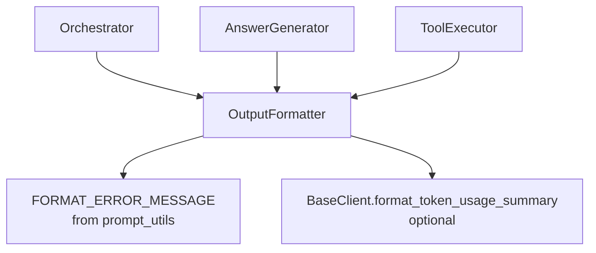
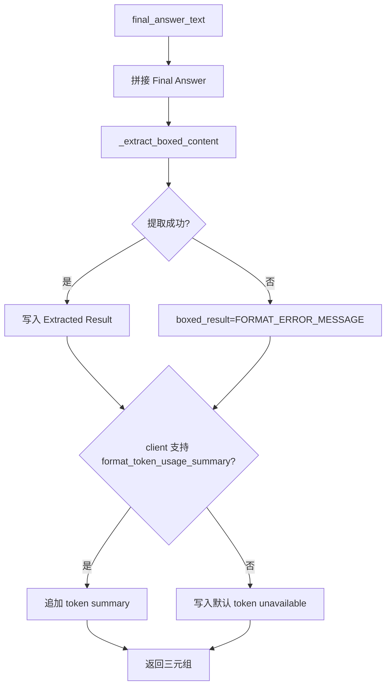
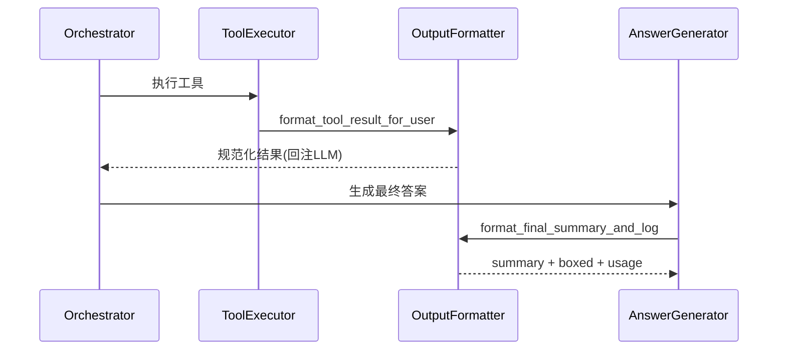

# output_formatter 模块文档（重构版）

## 1. 模块简介与设计动机

`output_formatter` 是 `miroflow_agent_io` 子系统中负责“输出收敛（output normalization）”的关键模块。它的职责不是生成答案本身，而是将来自不同阶段的原始输出（例如工具调用返回、LLM 最终回复）转换成系统可消费、可记录、可复用的统一结构。这个模块存在的核心原因是：在多轮 agent + tool 的执行链路中，输出如果不统一，会直接影响后续推理质量、上下文长度控制、最终答案提取准确性以及日志可审计性。

在当前实现中，`OutputFormatter` 聚焦三个场景：第一，将工具调用结果压缩为适合再次喂给 LLM 的文本消息；第二，从最终回答中稳健提取最后一个 `\\boxed{...}`；第三，生成最终总结文本，并拼接 token 使用信息（若客户端支持），形成面向日志与运维的闭环输出。

---

## 2. 模块边界与系统定位

`OutputFormatter` 被上层核心编排链路（`Orchestrator` / `AnswerGenerator` / `ToolExecutor`）共同依赖，因此它在系统里是一个“无状态工具型服务对象”。它不持久化数据，不发起网络调用，不依赖具体 LLM SDK；输入输出都是 Python 原生类型（`str` / `dict` / `tuple`）。



为了避免重复，以下模块可交叉阅读：
- [orchestrator.md](orchestrator.md)
- [answer_generator.md](answer_generator.md)
- [tool_executor.md](tool_executor.md)
- [base_client.md](base_client.md)

---

## 3. 核心组件

### 3.1 常量：`TOOL_RESULT_MAX_LENGTH = 100_000`

该常量用于限制单次工具结果回注到 LLM 的最大字符数。超过阈值会被截断并附加 `... [Result truncated]`，以保护上下文窗口并显式提示模型“内容已裁剪”。

### 3.2 类：`OutputFormatter`

`OutputFormatter` 当前提供三项核心能力：
1. `\\boxed{}` 提取（`_extract_boxed_content`）
2. 工具结果标准化（`format_tool_result_for_user`）
3. 最终摘要与 usage 日志生成（`format_final_summary_and_log`）

---

## 4. 关键方法详解

### 4.1 `_extract_boxed_content(text: str) -> str`

该方法提取**最后一个** `\\boxed{...}` 内容。实现采用“正则定位 + 手动括号解析”，支持嵌套大括号、转义大括号、`\\boxed` 与 `{` 之间空白、不完整表达式兜底提取。

它的语义不是“找所有候选答案”，而是“返回最终答案候选（最后一次 boxed）”。另外，方法内置黑名单（如 `?`、`...`、`unknown`），命中后返回空字符串，避免把占位噪声当成有效答案。

```python
formatter = OutputFormatter()
assert formatter._extract_boxed_content(r"\\boxed{1} ... \\boxed{2}") == "2"
assert formatter._extract_boxed_content(r"x=\\boxed{abc") == "abc"  # 不完整表达式兜底
assert formatter._extract_boxed_content(r"\\boxed{???}") == ""       # 黑名单过滤
```

### 4.2 `format_tool_result_for_user(tool_call_execution_result: dict) -> dict`

该方法把工具执行结果转成统一消息片段：`{"type": "text", "text": ...}`。输入需包含 `server_name`、`tool_name`，并包含 `result` 或 `error`。

如果是错误分支，会生成简洁失败描述；如果是成功分支，会透传 `result`，并在超长时按 `TOOL_RESULT_MAX_LENGTH` 截断；若两者都没有，则返回“已完成但无明确输出”的兜底文本。

```python
formatter = OutputFormatter()
msg = formatter.format_tool_result_for_user({
    "server_name": "browser",
    "tool_name": "scrape_website",
    "result": "<html>...</html>"
})
```

### 4.3 `format_final_summary_and_log(final_answer_text: str, client=None) -> Tuple[str, str, str]`

该方法返回 `(summary_text, boxed_result, usage_log)`，用于最终收尾。其核心流程如下：



如果没有提取到有效 boxed，`boxed_result` 会被设置为 `FORMAT_ERROR_MESSAGE`。这对上层 `AnswerGenerator` 的“是否重试”决策非常关键。

---

## 5. 与核心流程的交互

在主流程里，`OutputFormatter` 同时服务“中间循环”和“最终收敛”两个阶段：



这也是该模块虽然代码短，但对系统稳定性影响很大的原因：它是执行层和总结层之间的格式契约。

---

## 6. 使用、配置与扩展

通常以依赖注入方式创建一次并复用：

```python
from apps.miroflow-agent.src.io.output_formatter import OutputFormatter
output_formatter = OutputFormatter()
```

可配置项主要是：

```python
import apps.miroflow-agent.src.io.output_formatter as m
m.TOOL_RESULT_MAX_LENGTH = 50_000
```

扩展建议优先通过继承：

```python
class CustomOutputFormatter(OutputFormatter):
    def format_tool_result_for_user(self, tool_call_execution_result: dict) -> dict:
        out = super().format_tool_result_for_user(tool_call_execution_result)
        out["text"] = "[custom] " + out["text"]
        return out
```

---

## 7. 边界条件、错误与限制

1. `format_tool_result_for_user` 假设输入包含 `server_name/tool_name`，缺失会触发 `KeyError`，因此输入校验应在上游。
2. 截断按“字符数”而非 token 数进行，和真实上下文占用存在偏差。
3. 只提取最后一个 `\\boxed`，多答案场景会忽略前面的结果。
4. 黑名单会过滤 `unknown/...` 等占位符，极少数场景可能误伤真实文本。
5. 无 token 客户端能力时，usage 会降级为默认文案，不影响主流程但会降低可观测性。

---

## 8. 结论

`output_formatter` 是典型的“高杠杆小模块”：代码量不大，却承担了工具结果回注、最终答案判定、日志归档三条关键链路的统一出口。维护或扩展该模块时，建议始终优先保护其输入输出契约，尤其是 `FORMAT_ERROR_MESSAGE` 的失败语义与 `\\boxed` 提取规则，这两者直接决定上层流程的稳定性与可恢复性。

---


