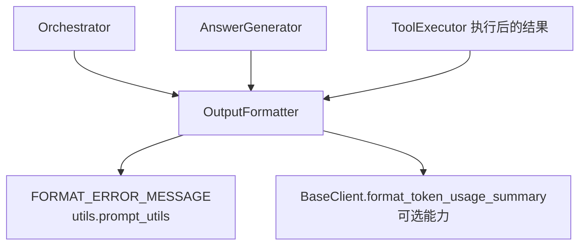
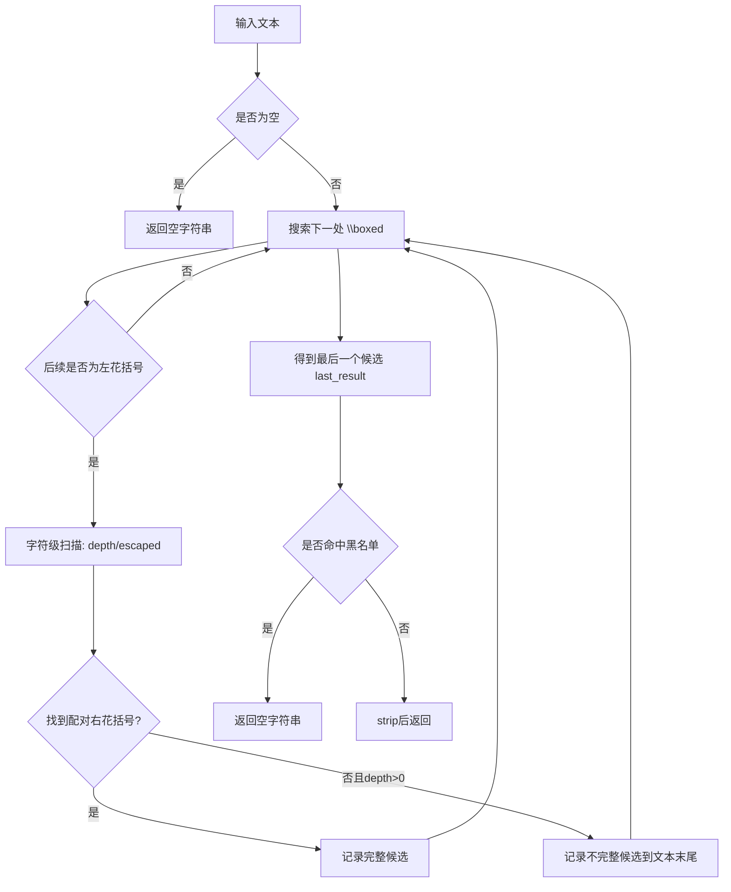
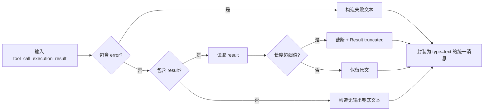
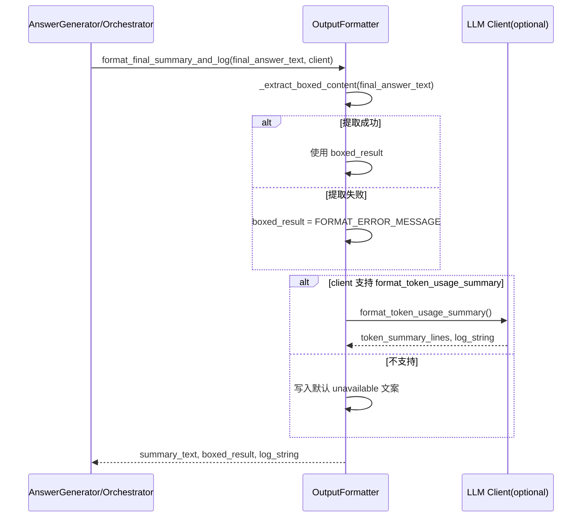
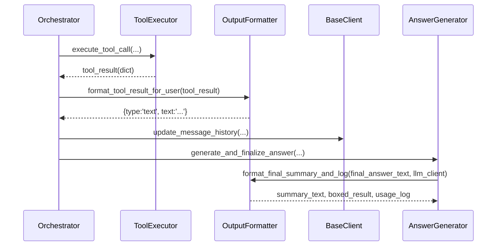
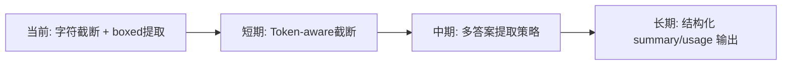

# output_formatting 模块文档

## 1. 模块概述：它解决了什么问题，为什么存在

`output_formatting` 是 `miroflow_agent_io` 下负责“输出收口（output normalization & finalization）”的子模块，核心实现为 `OutputFormatter`。在 MiroFlow Agent 的主流程中，LLM 与工具调用会产生大量中间文本：有的用于继续推理，有的用于最终答案交付，有的用于成本与可观测性日志。若这些输出不经过统一格式化，系统会遇到三个典型问题：其一，工具返回内容可能过长导致上下文溢出；其二，最终答案格式不稳定，无法可靠提取；其三，结束阶段缺乏统一摘要与 usage 记录，调试和审计困难。

这个模块因此被设计为“轻量但高杠杆”的基础能力层：它不参与任务推理，不调用外部服务，也不持有复杂状态；它只做格式契约和结果规整，却直接影响 `Orchestrator` 的循环稳定性、`AnswerGenerator` 的最终判定准确率、以及 `BaseClient` usage 信息的落盘可读性。简言之，`output_formatting` 的职责不是“让输出好看”，而是“让输出可被系统稳定消费”。

---

## 2. 在系统中的位置与依赖关系

从模块边界看，`output_formatting` 处在“工具执行结果 → LLM回灌”和“最终答案 → 提取与日志”两条链路的交汇点。它向上被核心编排模块调用，向下只依赖标准库与一个提示常量。



上图反映了一个关键设计：`OutputFormatter` 本身不关心“谁生成了内容”，只关心“内容是否符合可消费契约”。因此它可以被主 Agent、子 Agent、离线脚本共用，具备很好的复用性。

如需理解其上游调用语义，可参考：
- [orchestrator.md](orchestrator.md)
- [answer_generator.md](answer_generator.md)
- [tool_executor.md](tool_executor.md)
- [base_client.md](base_client.md)

---

## 3. 组件总览

`output_formatting` 当前仅包含一个核心类和一个关键常量。

### 3.1 常量：`TOOL_RESULT_MAX_LENGTH = 100_000`

该阈值用于限制单次工具结果回灌到 LLM 的最大字符长度。超过阈值时，内容会被截断并添加 `... [Result truncated]` 提示。注释中给出的估算是 `100k chars ≈ 25k tokens`，属于经验级近似值，主要用于降低上下文爆炸风险。

### 3.2 核心类：`OutputFormatter`

`OutputFormatter` 提供三类能力：

1. `_extract_boxed_content(text)`：从文本中提取最后一个 `\\boxed{...}`；
2. `format_tool_result_for_user(result_dict)`：将工具执行结果转换为 LLM 可消费消息；
3. `format_final_summary_and_log(final_answer_text, client)`：构建最终摘要、抽取答案、拼装 token usage 日志。

类本身无内部可变状态，所有行为都由传入参数决定，便于单元测试与行为替换。

---

## 4. 关键实现详解

## 4.1 `_extract_boxed_content(text: str) -> str`

这是模块中最“算法化”的方法。它的目标并非通用 LaTeX 解析，而是高鲁棒地提取最终答案约定格式 `\\boxed{...}`，并且**优先最后一次出现**（last-one-wins）。

实现分两层：第一层用正则 `r"\\boxed\\b"` 定位候选起点；第二层进入手写字符扫描器，逐字符维护括号深度 `depth` 和转义状态 `escaped`，从而支持嵌套花括号、`\\{`/`\\}` 转义、`\\boxed` 与 `{` 间空白等场景。若 boxed 不完整（未闭合），会退化为“提取到文本末尾”作为候选。最终返回最后一个候选，并做黑名单过滤。



该方法的输入输出语义：
- 输入参数：`text`，任意字符串（可能含多段 boxed、格式噪声、转义符）；
- 返回值：提取后的字符串；若未命中或被判定无效，返回空字符串；
- 副作用：无；
- 错误行为：不会抛异常处理格式问题，倾向容错返回。

黑名单包含 `?`、`??`、`...`、`unknown`、`None` 等占位词，属于“减少误提取”的启发式规则。它能避免模型在不确定时输出的占位符被误判为答案，但也存在少量误杀风险（例如业务上确实需要输出 `...`）。

---

## 4.2 `format_tool_result_for_user(tool_call_execution_result: dict) -> dict`

该方法将工具执行结果标准化为固定协议：

```python
{"type": "text", "text": "..."}
```

它按三条分支处理：

- 若存在 `error` 字段，生成简洁失败文案，包含 `tool_name` 与 `server_name`；
- 若存在 `result` 字段，透传结果文本，必要时依据 `TOOL_RESULT_MAX_LENGTH` 截断；
- 若两者都没有，返回“已完成但无明确输出”的兜底描述。



参数与返回：
- 输入参数：包含 `server_name`、`tool_name`，以及 `result` 或 `error` 的字典；
- 返回值：供 LLM message content 复用的字典；
- 副作用：无；
- 可能异常：若缺失 `server_name`/`tool_name`，会触发 `KeyError`（需上游保障）。

此处的设计重点是**协议稳定优先于内容丰富**：它故意不携带过多元信息，以降低 message history 的形态复杂度。

---

## 4.3 `format_final_summary_and_log(final_answer_text: str, client=None) -> Tuple[str, str, str]`

该方法构建任务“收尾三件套”：

1. `summary_text`：可读性摘要，包含 Final Answer、Extracted Result、Token Usage 区段；
2. `boxed_result`：抽取后的最终答案；
3. `log_string`：token/cost 统计字符串（供日志系统使用）。

核心流程是先拼接答案，再提取 boxed，再拼 usage。若提取失败且 `final_answer_text` 非空，会把 `boxed_result` 置为 `FORMAT_ERROR_MESSAGE`（来自 `prompt_utils`）。这一定义对上游重试逻辑非常关键：`AnswerGenerator` 会据此判断是否需要重试或进入失败经验总结。



参数与返回：
- 输入参数：`final_answer_text`（LLM 最终回答文本），`client`（可选，需具备 `format_token_usage_summary`）；
- 返回值：`Tuple[str, str, str]`；
- 副作用：无；
- 异常：正常流程下无显式抛错，采用降级文案保证可用性。

---

## 5. 与上游核心模块的真实交互方式

在实际运行中，`Orchestrator` 会在工具调用后把 `tool_result` 交给 `format_tool_result_for_user`，然后通过 LLM client 的 `update_message_history` 回注对话；在主循环或收尾阶段，`AnswerGenerator` 再调用 `format_final_summary_and_log` 输出最终摘要和 boxed 结果。



特别注意：`Orchestrator` 在主循环中还会直接调用私有方法 `_extract_boxed_content` 抓取中间答案。虽然这是可行的，但在工程规范上属于“跨越封装边界”的耦合点，后续重构需谨慎。

---

## 6. 使用方式与示例

最常见用法是由依赖注入框架在启动时实例化一次，然后在编排链路复用。

```python
from apps.miroflow-agent.src.io.output_formatter import OutputFormatter

formatter = OutputFormatter()

tool_msg = formatter.format_tool_result_for_user({
    "server_name": "browser",
    "tool_name": "search_web",
    "result": "Top results ..."
})

summary, boxed, usage = formatter.format_final_summary_and_log(
    final_answer_text="结论是 \\boxed{42}",
    client=None,
)
```

如需定制，可通过继承覆盖行为。例如你希望把超长结果改为“头尾保留”而不是“纯前截断”。

```python
class CustomOutputFormatter(OutputFormatter):
    def format_tool_result_for_user(self, tool_call_execution_result: dict) -> dict:
        out = super().format_tool_result_for_user(tool_call_execution_result)
        # 自定义后处理（示例）
        return out
```

在运行时动态调整截断阈值也可行，但建议通过集中配置管理，避免多处修改全局常量导致行为漂移。

---

## 7. 配置与行为约束

`output_formatting` 的直接配置面很小，核心只有 `TOOL_RESULT_MAX_LENGTH`。但它的行为同时受两个外部契约影响。

第一，答案格式契约：上游 prompt 通常要求模型输出 `\\boxed{}`，否则会触发 `FORMAT_ERROR_MESSAGE` 路径。该常量定义在 `prompt_utils`，文案为 `No \\boxed{} content found in the final answer.`。

第二，usage 能力契约：若传入的 `client` 实现了 `format_token_usage_summary`，就能输出真实 token/cost 汇总；否则自动降级为“Token usage information not available.”。这使得模块可兼容简化 client 或测试桩对象。

---

## 8. 边界条件、错误条件与已知限制

本模块的鲁棒性较高，但仍有若干必须了解的工程边界。

首先，`format_tool_result_for_user` 对输入字典键名有硬依赖，缺少 `server_name` 或 `tool_name` 会 `KeyError`。这不是模块内部 bug，而是接口契约要求上游保证字段完整。

其次，工具结果截断按“字符数”而不是“token 数”执行，因此与真实模型上下文占用并非严格一致。对于中英文混排、特殊编码符号、代码块等内容，字符-Token 比例可能波动较大。

再次，`_extract_boxed_content` 使用启发式黑名单过滤占位答案，能减少“伪答案”污染，但也可能在特定业务下误过滤真实文本。若你的任务允许 `unknown`/`...` 作为合法输出，需评估并调整策略。

另外，该提取器只返回“最后一个” boxed。若业务要求多答案或步骤化答案聚合，需要在上层添加多候选提取逻辑，而不是直接复用当前返回值。

最后，`_extract_boxed_content` 虽命名为私有，但已被核心模块直接访问，这是当前实现中的现实耦合点。修改其签名或语义前，应同步检查 `Orchestrator` 与 `AnswerGenerator` 路径。

---

## 9. 扩展建议（面向维护者）

如果你要扩展 `output_formatting`，建议优先保持“输出契约稳定”，再增加能力。实践中常见的三个方向是：

- 增加多格式答案提取：在 `\\boxed{}` 之外支持 JSON tag / XML tag / YAML block；
- 增加 token-aware 截断：引入 tokenizer 估算后再截断，以更准确控制上下文；
- 增加结构化摘要返回：在保留字符串摘要的同时返回 machine-readable dict，方便监控系统统计。

可行的演进思路如下。



---

## 10. 关联文档与阅读路径

为避免重复，这里不展开上游流程细节。建议按如下顺序阅读：

1. 本文档（`output_formatting` 本身）；
2. [miroflow_agent_io.md](miroflow_agent_io.md)（I/O 总览）；
3. [orchestrator.md](orchestrator.md)（主循环如何消费格式化输出）；
4. [answer_generator.md](answer_generator.md)（最终答案重试与失败总结）；
5. [base_client.md](base_client.md)（token usage 与消息历史机制）。

如果你仅需快速定位“为什么最终没有 boxed 结果”，重点看第 4.3 节和第 8 节，再结合 `prompt_utils.py` 中 `FORMAT_ERROR_MESSAGE` 与总结 prompt 约束排查即可。
