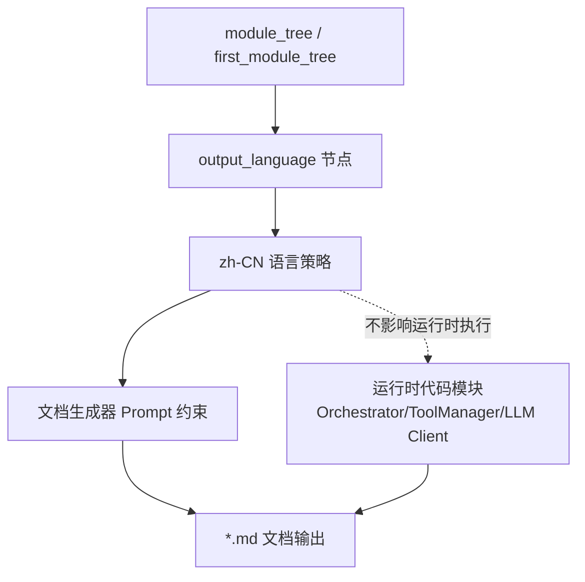
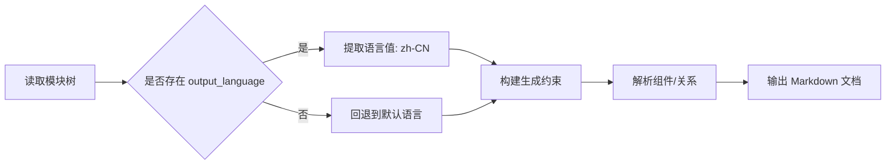
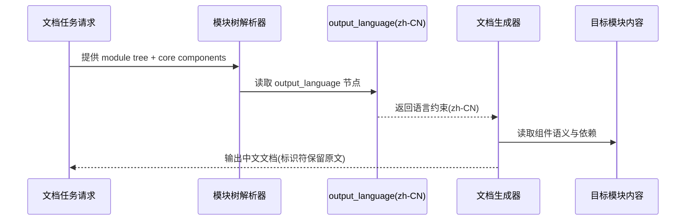

# output_language 模块文档

## 1. 模块概述

`output_language` 是 `miroflow_tools_management` 文档树中的一个“语言策略子模块”，其核心组件为 `zh-CN`。这个模块与 `ToolManager`、`PlaywrightSession` 这类运行时代码模块不同，它不直接参与工具注册、连接或执行，也不负责请求处理逻辑。它的职责更偏向**文档与生成流程治理**：明确当前文档输出语言为简体中文，确保同一批次文档在语言风格、术语呈现和可读性上保持一致。

从设计角度看，这个模块存在的价值在于把“输出语言”从隐式约定变成显式配置。如果没有这样的显式节点，文档生成工具通常只能依赖全局提示词或人工习惯，容易出现多语言混杂、术语翻译不一致、模块间描述风格漂移等问题。通过 `output_language -> zh-CN` 的结构化表达，生成器可以在处理任意模块时统一采用中文叙述，同时保留代码标识符、类名、函数名等技术元素的原文形式。

换句话说，`output_language` 不是业务逻辑模块，而是**文档系统的质量控制模块**。它服务于可维护性，而不是直接服务于运行时功能。

---

## 2. 在整体系统中的位置

在当前模块树中，`output_language` 位于：

- 父模块：`miroflow_tools_management`
- 当前节点：`output_language`
- 核心组件：`zh-CN`

它的作用范围是“文档产出层”，而非“Agent 运行时层”。如果你在阅读系统主链路（如 `Orchestrator`、`AnswerGenerator`、`ToolManager`），这些模块描述的是程序如何执行任务；而 `output_language` 描述的是**文档应该以什么语言表达这些执行逻辑**。



上图强调了一个关键边界：`zh-CN` 会影响文档文本，但不会改变 Python 代码行为、工具执行结果或模型调用路径。它是“表达层配置”，不是“执行层配置”。

---

## 3. 核心组件详解

当前 `output_language` 只有一个核心组件：`zh-CN`。由于该模块在你提供的上下文中没有对应可执行代码实体（没有 class/function 源码），它应被理解为一个**约定型配置标识**。

### 3.1 `zh-CN` 的语义

`zh-CN` 表示文档主体叙述应使用简体中文。实践中通常包含三条隐含规则：

1. 解释性文本（概述、原理、流程说明、注意事项）使用中文。
2. 技术标识符（类名、方法名、文件名、配置键、环境变量）保留原文英文，避免二次翻译导致歧义。
3. 代码片段中的语法与关键字保持原语言（例如 Python、YAML、JSON 的关键字不翻译）。

这种规则组合能同时兼顾“可读性”和“可检索性”。开发者在阅读中文说明时，仍可以直接按原始标识符在代码库中搜索定位。

### 3.2 参数、返回值与副作用说明

由于 `zh-CN` 在当前树中不是函数或类，因此不存在传统意义上的参数列表与返回值。它的“输入输出”更适合按策略视角理解：

- 输入：文档生成上下文（模块树、组件代码、生成指令）
- 输出：中文叙述的文档文本
- 副作用：统一术语风格，降低跨文档语言不一致风险

---

## 4. 处理流程与数据流

`output_language` 的生效方式一般是：生成器在读取模块树后识别语言节点，将语言约束注入生成提示，再输出对应语言的文档。



这个流程的关键不是“翻译代码”，而是“约束解释语言”。因为代码标识符通常不变，真正变化的是说明文字、术语组织和示例讲解风格。

再从交互角度看，它与其他模块关系如下：



---

## 5. 与其他模块的关系（避免重复）

`output_language` 主要影响文档表达，不重述其他模块的运行机制。具体技术细节请直接参考对应文档：

- 工具管理体系：[`miroflow_tools_management.md`](miroflow_tools_management.md)
- 工具管理器细节：[`tool_manager.md`](tool_manager.md)
- 浏览器会话管理：[`browser_session.md`](browser_session.md)
- Agent 核心编排：[`miroflow_agent_core.md`](miroflow_agent_core.md)
- LLM 客户端抽象：[`miroflow_agent_llm_layer.md`](miroflow_agent_llm_layer.md)

在文档体系中，它像一个“全局语言开关”。上述模块是“讲什么”，`output_language` 是“用什么语言讲”。

---

## 6. 使用与配置方式

### 6.1 在模块树中声明语言

可通过类似结构声明当前文档语言：

```json
{
  "miroflow_tools_management": {
    "children": {
      "output_language": {
        "components": ["zh-CN"],
        "children": {}
      }
    }
  }
}
```

这类配置并不要求语言节点具备源码文件，它本身就是约定入口。

### 6.2 在生成指令中保持一致

如果系统还支持提示词约束，建议与模块树配置同时使用，形成双保险：

```text
Write ALL documentation content in Chinese (Simplified).
Keep code snippets, identifiers, filenames, and technical keywords in original language.
```

模块树负责结构化声明，提示词负责执行层约束，两者同时存在时，语言一致性通常更高。

### 6.3 扩展到多语言

如果后续需要支持英语、日语等，可复用同一模式，把 `components` 从单值改为目标语言标签（例如 `en-US`、`ja-JP`），并在生成器里增加语言映射表与术语表。

---

## 7. 边界条件、错误场景与已知限制

`output_language` 虽然简单，但在工程落地中有一些常见坑位。

首先，语言约束只作用于说明文本，不会自动翻译代码注释、第三方错误信息或日志原文。如果来源内容本身是英文，文档可能出现“中文解释 + 英文原始片段”的混排，这通常是预期行为，不应被视为错误。

其次，当模块缺少核心组件源码（当前场景即如此）时，文档会偏重“语义约定与系统角色”而不是“函数级实现细节”。这不是文档缺失，而是输入信息边界决定的结果。

另外，如果不同层级同时出现冲突语言指令（例如模块树写 `zh-CN`，外部任务又要求英文），需要在生成器侧定义优先级策略。常见做法是“任务指令优先于树配置”或“子模块配置覆盖父模块配置”，但必须固定规则，否则会造成批量文档风格漂移。

最后，`zh-CN` 只定义语言，不定义术语词典。没有术语表时，同一概念可能出现多种中文译法（如“回滚 / 撤销 / 退回”），建议在文档系统中增加术语标准化层。

---

## 8. 维护与扩展建议

从维护角度，建议把 `output_language` 视为文档平台能力的一部分，而不是一次性配置。你可以考虑以下演进方向：

- 增加语言优先级规则，明确“全局默认、模块覆盖、任务临时覆盖”的决策顺序。
- 引入术语表（glossary），让 `zh-CN` 不仅控制语言，还控制关键术语统一译法。
- 为多语言输出增加一致性校验，例如检查同一模块在不同语言版本中的标题结构是否一致。
- 在 CI 中加入文档语言检测，避免中文文档中混入大段英文叙述。

这些改进不会改变运行时代码，但会显著提升文档体系的可维护性和团队协作效率。

---

## 9. 小结

`output_language`（`zh-CN`）模块的本质是一个轻量但关键的文档治理节点。它通过显式声明输出语言，把“语言一致性”从人工习惯提升为系统约束。虽然它没有复杂代码实现，但在跨模块、跨团队、长期维护的文档场景下，它能有效降低理解成本、减少歧义，并为后续多语言扩展打下结构化基础。
