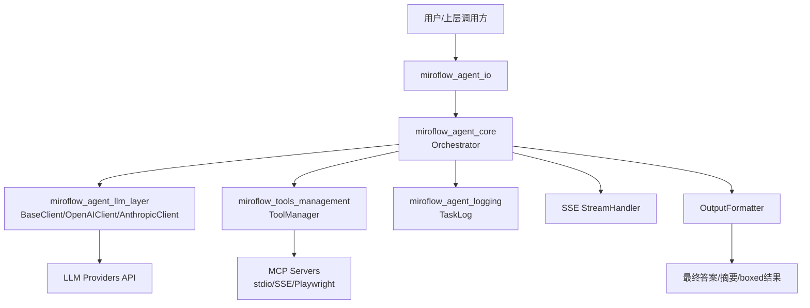
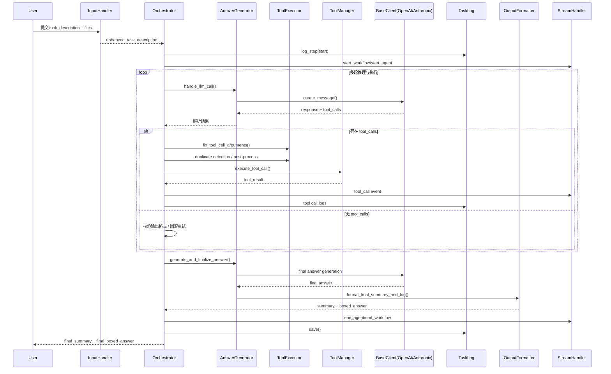
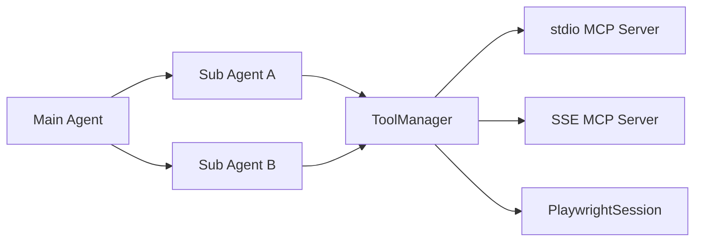

# MiroThinker 仓库总览

## 1. 仓库目的（Purpose）

`MiroThinker` 是一个面向智能体（Agent）的任务执行与编排仓库，核心目标是：

- 将用户任务（含多模态输入）转换为可执行的智能体工作流；
- 通过统一的 LLM 抽象层支持多模型提供商（如 OpenAI / Anthropic）；
- 通过工具管理层连接和执行外部工具（MCP servers）；
- 提供全链路日志、SSE 流式事件与结构化输出；
- 支持主代理-子代理的分层协作、失败重试和上下文压缩。

可以把它理解为一个“**可扩展的智能体操作系统内核**”，由编排层、模型层、I/O 层、工具层、日志层和共享工具类共同组成。

---

## 2. 仓库结构（核心部分）

> 以下结构基于你提供的核心模块清单整理：

```text
MiroThinker
├─ apps/
│  └─ miroflow-agent/
│     └─ src/
│        ├─ core/                        # 任务编排核心
│        │  ├─ orchestrator.Orchestrator
│        │  ├─ answer_generator.AnswerGenerator
│        │  ├─ stream_handler.StreamHandler
│        │  └─ tool_executor.ToolExecutor
│        ├─ llm/                         # LLM 抽象与提供商实现
│        │  ├─ base_client.BaseClient
│        │  ├─ base_client.TokenUsage
│        │  ├─ providers.openai_client.OpenAIClient
│        │  └─ providers.anthropic_client.AnthropicClient
│        ├─ io/                          # 输入处理与输出格式化
│        │  ├─ input_handler.DocumentConverterResult
│        │  ├─ input_handler._CustomMarkdownify
│        │  └─ output_formatter.OutputFormatter
│        ├─ logging/                     # 结构化日志系统
│        │  ├─ task_logger.TaskLog
│        │  ├─ task_logger.StepLog
│        │  ├─ task_logger.LLMCallLog
│        │  ├─ task_logger.ToolCallLog
│        │  └─ task_logger.ColoredFormatter
│        └─ utils/                       # 共享工具类
│           └─ wrapper_utils.ResponseBox (含 ErrorBox 相关设计)
└─ libs/
   └─ miroflow-tools/
      └─ src/miroflow_tools/
         ├─ manager.ToolManagerProtocol
         ├─ manager.ToolManager
         └─ mcp_servers/browser_session.PlaywrightSession
```

---

## 3. 端到端架构（End-to-End Architecture）

### 3.1 分层架构图



---

### 3.2 主流程时序图（任务执行主链路）



---

### 3.3 子代理与工具生态（补充视图）



---

## 4. 核心模块说明与文档索引

## 4.1 `miroflow_agent_core`（编排核心）
- **路径**：`apps/miroflow-agent/src/core`
- **核心职责**：
  - 主/子代理生命周期管理
  - LLM 调用与工具调用协调
  - 错误恢复、回滚、重试
  - 上下文压缩与失败经验总结
  - SSE 事件推送
- **关键组件**：
  - `Orchestrator`
  - `AnswerGenerator`
  - `ToolExecutor`
  - `StreamHandler`
- **文档**：`miroflow_agent_core.md`，子文档：
  - `orchestrator.md`
  - `answer_generator.md`
  - `stream_handler.md`
  - `tool_executor.md`

---

## 4.2 `miroflow_agent_llm_layer`（LLM 抽象层）
- **路径**：`apps/miroflow-agent/src/llm`
- **核心职责**：
  - 统一 LLM 调用接口（屏蔽不同供应商 API 差异）
  - Token 使用统计与上下文管理
  - 重试、截断、缓存策略（含 Anthropic prompt caching）
- **关键组件**：
  - `BaseClient`
  - `TokenUsage`
  - `OpenAIClient`
  - `AnthropicClient`
- **文档**：`miroflow_agent_llm_layer.md`，子文档：
  - `base_client.md`
  - `openai_client.md`
  - `anthropic_client.md`

---

## 4.3 `miroflow_agent_io`（输入输出层）
- **路径**：`apps/miroflow-agent/src/io`
- **核心职责**：
  - 多格式输入解析（PDF/DOCX/PPTX/XLSX/HTML/ZIP/媒体）
  - 转换为 LLM 友好的文本/Markdown
  - 最终结果格式化与 `\boxed{}` 提取
- **关键组件**：
  - `DocumentConverterResult`
  - `_CustomMarkdownify`
  - `OutputFormatter`
- **文档**：`miroflow_agent_io.md`，子文档：
  - `input_handler.md`
  - `output_formatter.md`

---

## 4.4 `miroflow_agent_logging`（日志与可观测性）
- **路径**：`apps/miroflow-agent/src/logging`
- **核心职责**：
  - 任务级与步骤级结构化日志
  - LLM/工具调用细节追踪
  - 主子代理会话日志隔离
  - JSON 持久化与彩色控制台输出
- **关键组件**：
  - `TaskLog`
  - `StepLog`
  - `LLMCallLog`
  - `ToolCallLog`
  - `ColoredFormatter`
- **文档**：`miroflow_agent_logging.md`

---

## 4.5 `miroflow_tools_management`（工具管理层）
- **路径**：`libs/miroflow-tools/src/miroflow_tools`
- **核心职责**：
  - MCP 工具发现、注册、执行
  - stdio/SSE 工具协议统一
  - 特殊会话型工具（如 Playwright）持久化管理
  - 黑名单与访问限制等安全控制
- **关键组件**：
  - `ToolManagerProtocol`
  - `ToolManager`
  - `PlaywrightSession`
- **文档**：`miroflow_tools_management.md`，子文档：
  - `tool_manager.md`
  - `browser_session.md`

---

## 4.6 `miroflow_agent_shared_utils`（共享包装工具）
- **路径**：`apps/miroflow-agent/src/utils`
- **核心职责**：
  - 统一响应包装（`ResponseBox`）
  - 错误包装（`ErrorBox`，在文档中定义）
  - 在模块间传递“数据 + 元信息/错误状态”
- **关键组件**：
  - `ResponseBox`（以及 ErrorBox 模式）
- **文档**：`miroflow_agent_shared_utils.md`

---

## 5. 模块协作关系（简述）

- `core` 是“大脑”，编排全流程；
- `llm_layer` 是“推理引擎适配层”；
- `tools_management` 是“外部能力执行层”；
- `io` 是“输入理解 + 输出标准化”；
- `logging` 是“可观测性与审计”；
- `shared_utils` 是“跨模块响应/错误契约”。

---

## 6. 快速文档导航（References）

- `miroflow_agent_core.md`
- `miroflow_agent_llm_layer.md`
- `miroflow_agent_io.md`
- `miroflow_agent_logging.md`
- `miroflow_tools_management.md`
- `miroflow_agent_shared_utils.md`

---

整体上，`MiroThinker` 体现的是一个**可插拔、可追踪、可扩展**的 Agent 工程化架构：  
既能在复杂任务中通过多轮 LLM + 工具调用完成目标，也能通过日志、流式事件和结构化输出保障可观测性与稳定性。