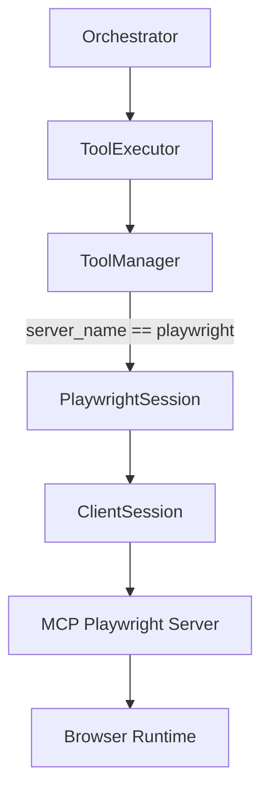
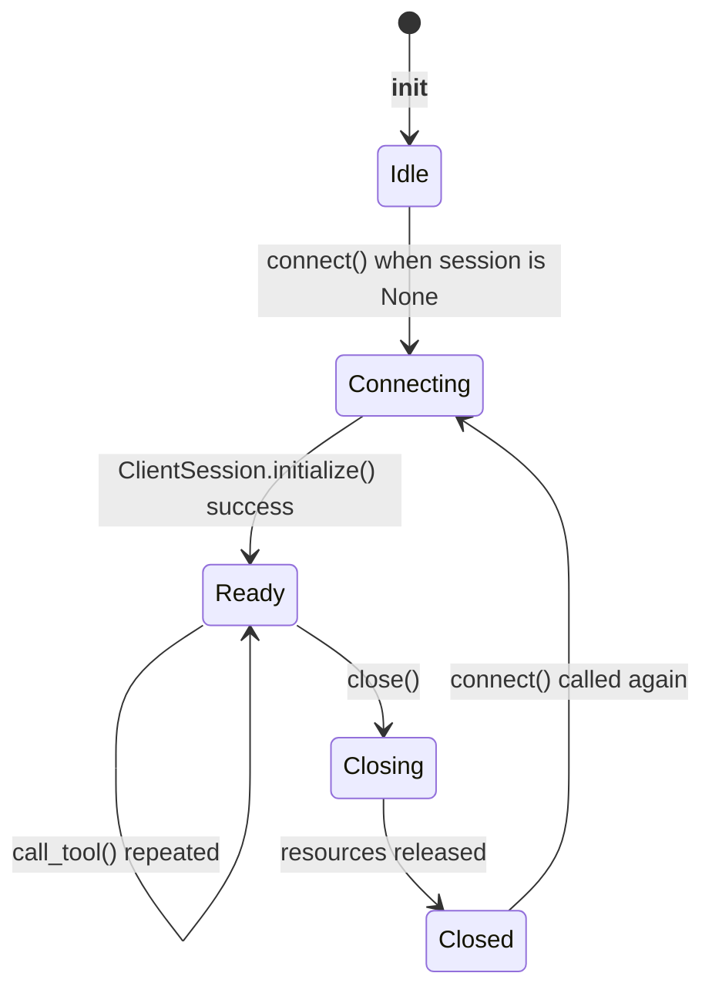
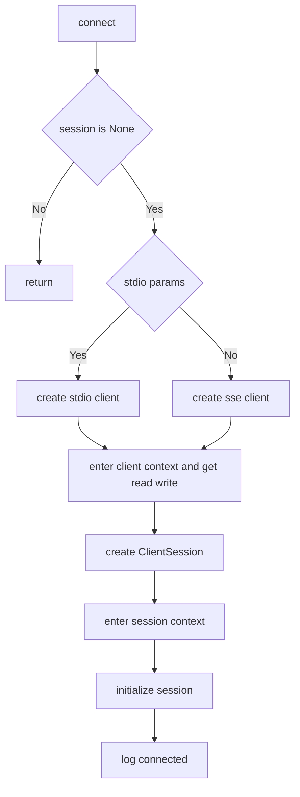
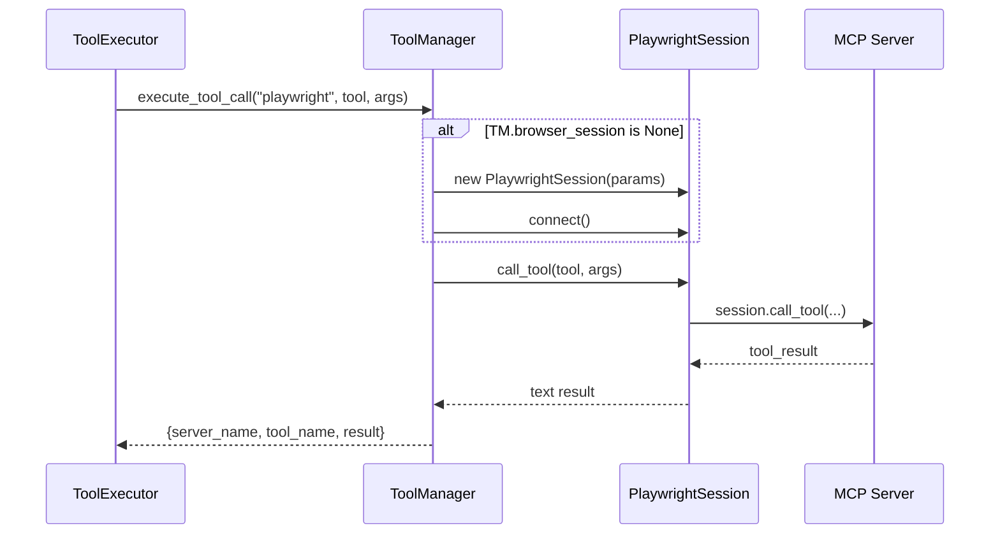
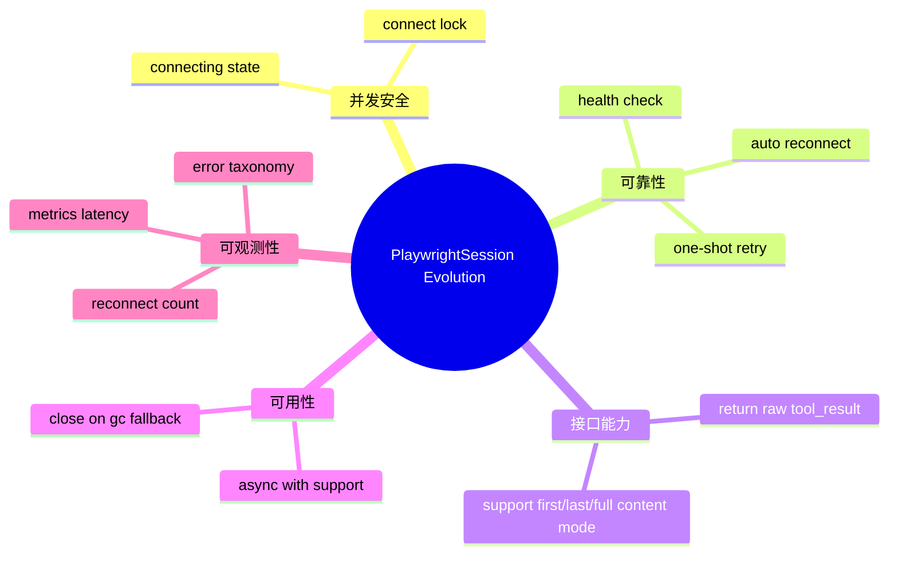

# playwright_session_management 模块文档

## 模块概述：为什么存在、解决什么问题

`playwright_session_management` 是 `miroflow_tools_management` 下的会话管理子模块，核心实现位于 `libs/miroflow-tools/src/miroflow_tools/mcp_servers/browser_session.py`，唯一核心组件是 `PlaywrightSession`。这个模块的职责非常聚焦：为 Playwright MCP Server 提供**可复用的持久连接会话**，使多次浏览器工具调用（例如导航、截图、页面快照）能够在同一会话上下文中连续执行。

这个模块存在的根本原因是浏览器类工具天然是“状态化”的。一次任务经常不是单次调用，而是多个有依赖关系的步骤：先打开页面，再等待加载，再提取内容。如果每次都重新建链，除了连接握手和初始化开销，还可能导致上下文连续性变差（例如页面状态重置、会话上下文丢失）。`PlaywrightSession` 通过懒加载连接与显式关闭机制，将 MCP 连接生命周期从“每次调用一个短连接”转为“任务级长连接”，从而提高效率并增强稳定性。

在系统分层中，这个模块不是策略层，也不是编排层，而是底层的协议会话基础设施。上层由 `ToolManager` 决定何时使用它（当前是 `server_name == "playwright"` 的专门分支），再由 `ToolExecutor` 和 `Orchestrator` 驱动任务流程。有关这些上层行为，请分别参考 [tool_manager.md](tool_manager.md)、[tool_executor.md](tool_executor.md)、[orchestrator.md](orchestrator.md)。

---

## 核心组件与源码定位

- 模块文件：`libs/miroflow-tools/src/miroflow_tools/mcp_servers/browser_session.py`
- 核心类：`PlaywrightSession`
- 关键依赖：
  - `mcp.StdioServerParameters`
  - `mcp.client.stdio.stdio_client`
  - `mcp.client.sse.sse_client`
  - `mcp.client.session.ClientSession`

`PlaywrightSession` 支持两种传输模型：

1. **stdio 模式**：当 `server_params` 是 `StdioServerParameters` 时使用；常见于本地子进程方式运行 MCP Server。
2. **SSE 模式**：其他参数类型默认走 `sse_client`；通常是 `http(s)` 地址形式的远端 MCP endpoint。

---

## 架构位置与依赖关系



从依赖方向看，`PlaywrightSession` 是 `ToolManager` 的下游组件，主要提供连接建立、会话初始化、工具调用和释放能力。它不负责工具发现、黑名单过滤、异常包装或业务策略（这些在 `ToolManager` 层）。这种设计让职责边界清晰：会话模块专注“怎么连、怎么复用、怎么关”，管理模块专注“何时调、调哪个、失败怎么包装”。

---

## PlaywrightSession 设计与内部机制

### 生命周期与状态模型

`PlaywrightSession` 在实例化时不会立即连接，而是首次调用工具时自动触发连接（lazy connect）。这减少了无用连接占用，同时保留了会话复用收益。



这个状态机对应四类关键字段：

- `server_params`：连接参数（stdio 参数或 SSE endpoint）
- `_client`：底层 client context（`stdio_client` 或 `sse_client`）
- `read` / `write`：双向通信句柄
- `session`：`ClientSession` 实例，执行 `initialize` 与 `call_tool`

### 初始化：`__init__(self, server_params)`

构造函数只做字段初始化，不做任何 I/O。

```python
def __init__(self, server_params):
    self.server_params = server_params
    self.read = None
    self.write = None
    self.session = None
    self._client = None
```

这是一种典型的资源延迟申请策略：把失败时机延后到真正需要会话时，更贴合按需调用链路。

### 建立连接：`connect(self)`

`connect` 的语义是“仅当尚未建立 session 时才连接并初始化”。其内部先选 transport，再手动进入异步上下文，随后创建 `ClientSession` 并执行 `initialize()`。



值得注意的是，这里没有使用局部 `async with`，而是通过 `__aenter__`/`__aexit__` 手动管理上下文，使会话生命周期绑定到 `PlaywrightSession` 对象本身。这正是“持久会话”能力的实现基础。

### 调用工具：`call_tool(self, tool_name, arguments=None)`

该方法是外部最常用 API：

1. 若尚未连接则自动 `connect()`；
2. 调用 `session.call_tool(tool_name, arguments=arguments)`；
3. 将 MCP 返回规约为文本：`tool_result.content[0].text`，若无 content 则返回空串。

```python
async def call_tool(self, tool_name, arguments=None):
    if self.session is None:
        await self.connect()

    tool_result = await self.session.call_tool(tool_name, arguments=arguments)
    result_content = tool_result.content[0].text if tool_result.content else ""
    return result_content
```

这个接口设计让上层调用者几乎不必理解 MCP 响应结构，但也带来信息裁剪（见“限制与注意事项”章节）。

### 关闭资源：`close(self)`

`close` 会按顺序释放 `session` 与底层 `_client`，然后清空句柄字段。若字段为空则跳过，行为接近幂等。

```python
async def close(self):
    if self.session:
        await self.session.__aexit__(None, None, None)
        self.session = None

    if self._client:
        await self._client.__aexit__(None, None, None)
        self._client = None
        self.read = None
        self.write = None
```

由于该类未实现 `__aenter__/__aexit__`，调用方必须主动在任务结束时执行 `close()`，推荐用 `try/finally` 强制保障。

---

## 与 ToolManager / ToolExecutor 的交互过程

`PlaywrightSession` 不直接暴露给编排层，典型调用链是 `ToolExecutor -> ToolManager -> PlaywrightSession`。其中 `ToolManager.execute_tool_call` 对 `playwright` 服务器有专门分支：首次调用时创建并连接 `PlaywrightSession`，后续复用同一会话。



这意味着 `playwright_session_management` 的行为会直接影响浏览器类工具的性能与稳定性：连接是否复用、异常是否穿透、释放是否及时，都会传导到上层执行体验。

---

## 使用方式与示例

### 示例 1：SSE endpoint（远端服务）

```python
import asyncio
from miroflow_tools.mcp_servers.browser_session import PlaywrightSession

async def run():
    session = PlaywrightSession("http://localhost:8931")
    try:
        await session.call_tool("browser_navigate", {"url": "https://example.com"})
        snapshot = await session.call_tool("browser_snapshot", {})
        print(snapshot)
    finally:
        await session.close()

asyncio.run(run())
```

### 示例 2：stdio（本地进程）

```python
from mcp import StdioServerParameters
from miroflow_tools.mcp_servers.browser_session import PlaywrightSession

params = StdioServerParameters(
    command="npx",
    args=["-y", "@modelcontextprotocol/server-playwright"],
)

session = PlaywrightSession(params)
```

### 示例 3：解析工具 JSON 返回

```python
import json

result = await session.call_tool("browser_snapshot", {})
data = json.loads(result)
print(data.get("url"), data.get("title"))
```

请注意：只有当工具确实返回 JSON 字符串时，上述解析才成立；否则会触发 `json.JSONDecodeError`。

---

## 配置与行为说明

当前模块没有复杂配置项，主要由 `server_params` 决定连接方式。实际部署中建议遵循以下实践：

- 当使用 `StdioServerParameters` 时，确保命令可执行且依赖已安装。
- 当使用 SSE URL 时，确保 endpoint 可达、协议兼容、超时策略由上层兜底。
- 统一由上层（如 `ToolManager` 生命周期钩子）管理 `close()` 调用，避免泄漏。

在系统级配置上，`ToolManager` 维护 `browser_session` 单例式字段，因此一个 `ToolManager` 实例通常只维护一个 Playwright 会话。这种方式简单且高效，但也意味着该会话是共享资源。

---

## 错误处理、边界条件与已知限制

### 并发首连竞态

`call_tool` 内部仅通过 `if self.session is None` 判断是否连接，未加锁。若多个协程并发首次调用，可能同时进入 `connect()`，导致重复初始化或状态覆盖风险。对于高并发场景，建议在类内加入 `asyncio.Lock` 或连接中状态保护。

### 异常恢复能力有限

当前实现未包含自动重连逻辑。网络抖动、服务端重启、连接被远端关闭后，异常会直接抛出到上层。`ToolManager` 会将其包装为错误响应，但默认不会自动重试。

### 返回值被简化为首段文本

`call_tool` 仅返回 `content[0].text`，会丢失：

- 多段内容（只保留第一段）
- 结构化附加字段
- 非文本内容

这对“快速接入”友好，但对“精细处理响应结构”不够。若后续需要完整元信息，建议扩展接口返回原始 `tool_result` 或支持可配置提取策略。

### 资源释放依赖调用方纪律

如果调用路径中遗漏 `close()`，连接会保持占用。长生命周期服务中，这会逐步积累资源（连接、句柄、子进程）。建议在上层任务结束、服务 shutdown 或异常处理路径中统一回收。

### 参数校验前置不足

`connect()` 仅区分 `StdioServerParameters` 与“其他参数”，后者全部按 SSE 处理。若传入非法对象，报错通常发生在更深层调用。工程上可在实例化时进行类型与格式校验，提升可诊断性。

---

## 扩展与演进建议

如果要增强该模块，建议优先考虑以下方向：



这些改造不会改变模块职责边界，但会明显提升线上稳定性与运维友好度。

---

## 与其他文档的关系（避免重复阅读）

- `playwright_session_management` 仅解释 Playwright 会话维护本身。
- 工具发现、路由、黑名单、统一错误包装，请看 [tool_manager.md](tool_manager.md)。
- 工具调用在代理执行阶段如何被触发与后处理，请看 [tool_executor.md](tool_executor.md)。
- 任务级编排与主流程生命周期，请看 [orchestrator.md](orchestrator.md)。
- `miroflow_tools_management` 的整体分层定位，请看 [miroflow_tools_management.md](miroflow_tools_management.md)。

---

## 总结

`playwright_session_management` 模块虽然实现简洁，但在系统中是高价值基础设施：它把 MCP Playwright 连接从一次性调用升级为可复用会话，为多步浏览器自动化提供稳定上下文。理解这个模块的关键不在 API 数量，而在**生命周期管理**：何时连接、如何复用、何时释放。只要上层正确管理资源并补充并发与重连策略，这个模块能够在复杂工具链路中提供可靠、可维护的会话底座。
