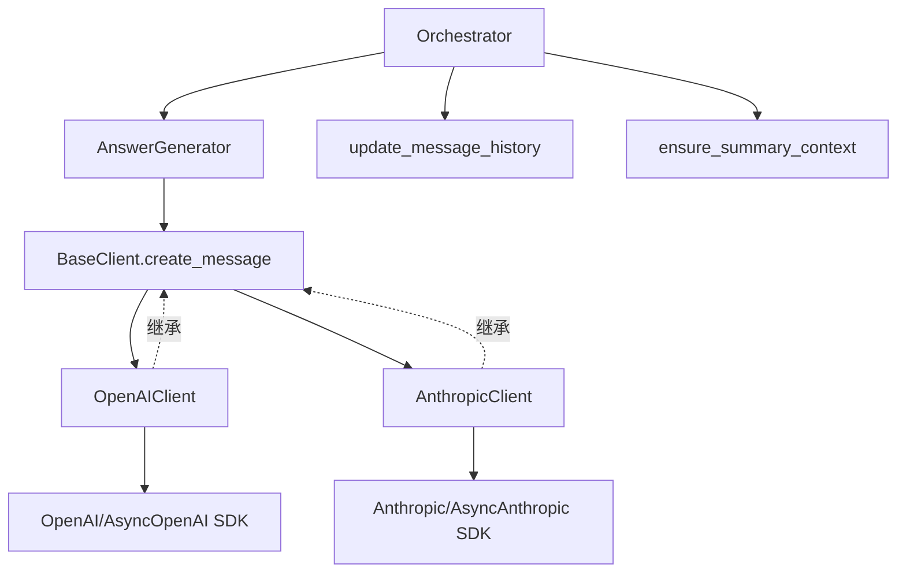
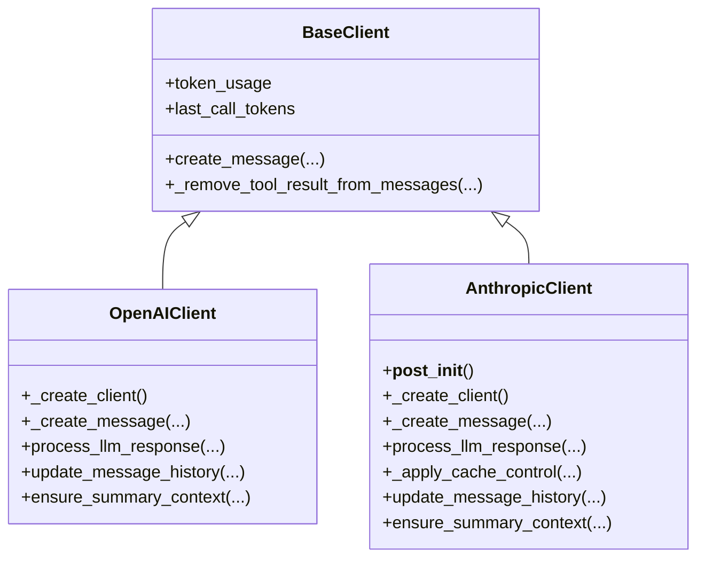
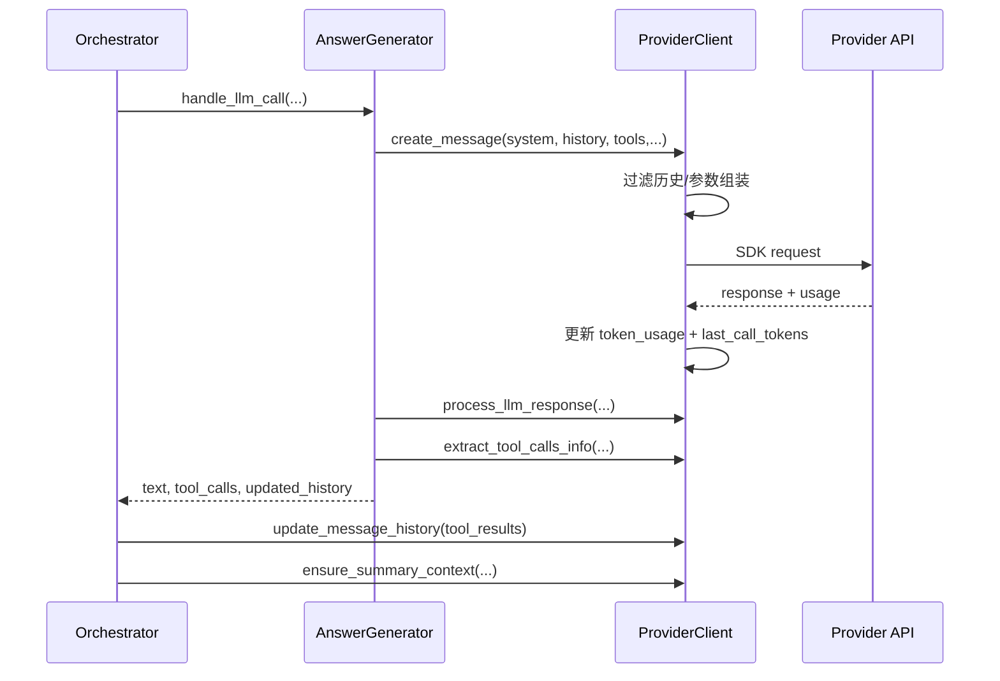
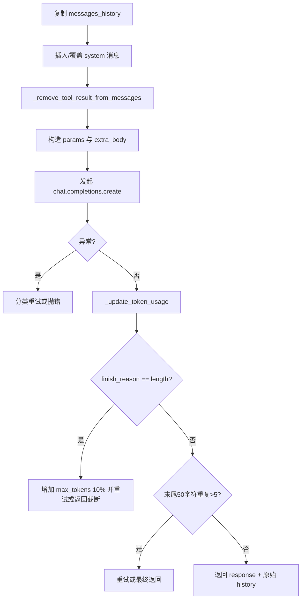
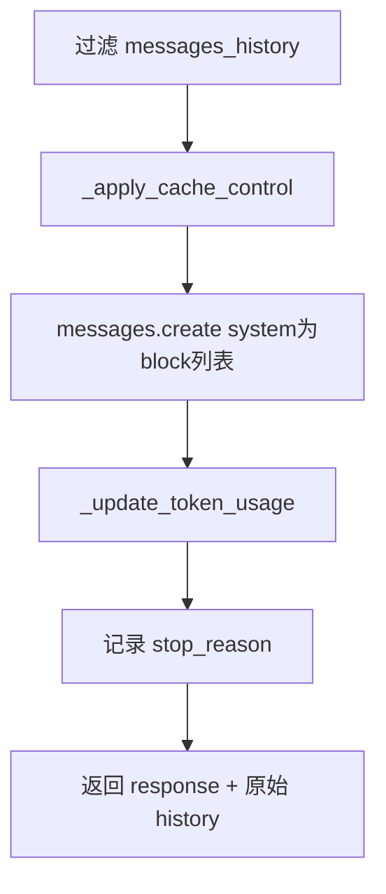
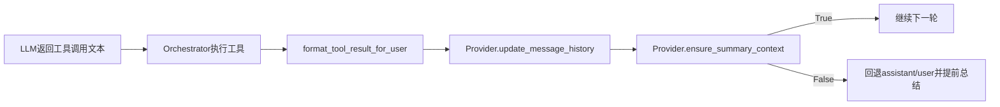

# provider_implementations 模块文档

## 模块定位与设计目标

`provider_implementations` 是 `miroflow_agent_llm_layer` 中真正与外部模型服务发生通信的实现层，当前包含两个核心实现：`AnthropicClient` 与 `OpenAIClient`。如果把 [`llm_client_foundation.md`](llm_client_foundation.md) 理解为“统一接口与治理约束”，那么本模块就是“把抽象接口落地为具体 Provider 行为”的执行层。它存在的核心原因是将供应商差异局部化，避免这些差异蔓延到编排层（`Orchestrator`、`AnswerGenerator`）造成系统耦合。

在 Miroflow 的主循环里，LLM 不只是一次问答调用，而是嵌入 ReAct 工具迭代、上下文压缩、失败回滚与最终总结的长流程组件。`provider_implementations` 因此不仅负责“发请求并收响应”，还负责 token 统计口径对齐、上下文边界预判、历史消息回填格式、异常恢复与可观测日志语义。你可以把它看成“协议适配器 + 运行时护栏”的组合。

---

## 在系统中的架构位置



这个架构的关键在于：上层只依赖 `BaseClient` 契约，不依赖某个 Provider 的 SDK 细节。Provider 切换主要发生在配置层与实例化阶段，而不是编排逻辑重写。关于基类职责与字段来源，请优先阅读 [`llm_client_foundation.md`](llm_client_foundation.md)。关于调用方主循环，请参考 [`orchestration_runtime.md`](orchestration_runtime.md) 与 [`answer_lifecycle.md`](answer_lifecycle.md)。

---

## 组件关系与职责分层



两者对外接口看起来一致，但内部语义并不相同，主要差异集中在四个方面：消息格式（OpenAI string vs Anthropic content block）、重试策略（OpenAI 内部循环 vs Anthropic tenacity 装饰器）、缓存 token 统计来源字段、以及工具结果回填格式。

---

## 统一调用流程（跨 Provider）



这个流程体现了本模块与编排层的契约边界。Provider 负责把“请求与响应”变成“编排层能继续跑下一轮”的结构化产物；编排层负责决定是否执行工具、是否回滚、何时终止。

---

## OpenAIClient 深度说明

### 设计意图

`OpenAIClient` 面向 OpenAI 协议生态，包括官方 OpenAI 与兼容网关（vLLM/Qwen/DeepSeek 等）。它的重点是在不破坏统一接口的前提下，吸收不同模型方言的参数差异，例如 `gpt-5` 的 `max_completion_tokens`、兼容模型 `extra_body` 扩展字段，以及“继续最后 assistant 输出”的自动参数注入。

### 核心方法行为

#### `_create_client(self)`

根据 `self.async_client` 生成 `AsyncOpenAI` 或 `OpenAI` 实例，并注入请求头 `x-upstream-session-id = task_id`。这使链路追踪可以在网关与日志间对齐任务维度。

#### `_update_token_usage(self, usage_data)`

该方法从 OpenAI usage 中提取：

- `prompt_tokens` → 输入 token
- `completion_tokens` → 输出 token
- `prompt_tokens_details.cached_tokens` → cache read token（若存在）

它会更新 `self.last_call_tokens = {"prompt_tokens", "completion_tokens"}`，并累计写入 `self.token_usage`。这个 `last_call_tokens` 是后续 `ensure_summary_context` 的估算基线。

#### `_create_message(...)`

这是最复杂的方法，包含消息预处理、重试与劣化检测。



参数构造细节有几个关键点。第一，若模型名包含 `gpt-5`，使用 `max_completion_tokens`，否则使用 `max_tokens`。第二，`repetition_penalty != 1.0` 时写入 `extra_body`。第三，`deepseek-v3-1` 时启用 `thinking` 扩展。第四，若最后一条消息是 `assistant`，自动设置 `continue_final_message=True`，用于续写场景。

重试机制采用“最多 10 次、每次固定等待 30 秒”，并不是指数退避。`TimeoutError` 与一般 API 异常会进入重试；`CancelledError` 直接抛出；明确的上下文超限（错误文本包含 `longer than the model`）直接抛出。

#### `process_llm_response(...)`

将 provider 响应归一为 `(assistant_response_text, should_break, message_history)`。它只显式处理 `finish_reason in {"stop", "length"}`。`length` 分支仍会写入 assistant 文本；若文本中出现 `Context length exceeded`，返回 `should_break=True` 让上层结束当前循环。

#### `extract_tool_calls_info(...)`

当前逻辑委托文本解析器 `parse_llm_response_for_tool_calls`。这意味着工具调用解析主要依赖文本协议，而不是直接消费 OpenAI 原生 `tool_calls` 字段。

#### `update_message_history(...)`

把多工具结果的 text 合并为一条 `user` string 消息，降低消息条目数量，帮助控制上下文增长。

#### `ensure_summary_context(...)`

使用 `last_call_tokens + summary_prompt估算 + 最后一条user估算 + max_tokens + 1000 buffer` 进行上下文预判。超过上限时回退最近的 `assistant/user` 对，并返回 `False`。

#### `format_token_usage_summary()`

生成展示行与日志串。但当前实现读取的是 `total_cache_input_tokens`，而基类统一结构字段是 `total_cache_read_input_tokens/total_cache_write_input_tokens`。这会导致 cache 显示为 0（或缺失），属于口径映射缺陷，建议修复。

---

## AnthropicClient 深度说明

### 设计意图

`AnthropicClient` 针对 Claude messages API 的 block 协议与 prompt caching 语义做了专门适配。它不仅支持同步/异步调用，还显式对 system 与最后一条 user 文本施加 `ephemeral` cache control，以便减少重复上下文开销。

### 核心方法行为

#### `__post_init__(self)`

先执行父类初始化，再初始化 Anthropic 侧扩展计数器字段。主统计仍由 `self.token_usage` 承担。

#### `_create_client(self)`

根据 async 配置返回 `AsyncAnthropic` 或 `Anthropic`，同样附带 `x-upstream-session-id` header，并支持自定义 `base_url`。

#### `_update_token_usage(self, usage_data)`

映射 Anthropic usage 字段：

- `cache_creation_input_tokens` → `total_cache_write_input_tokens`
- `cache_read_input_tokens` → `total_cache_read_input_tokens`
- `input_tokens` → `total_input_tokens`
- `output_tokens` → `total_output_tokens`

同时设置 `last_call_tokens` 为 `input + cache_creation + cache_read` 与 `output`，用于上下文估算。

#### `_create_message(...)`

该方法由 `@retry(wait=10s, stop=5)` 包装，具备自动重试。流程上与 OpenAI 分支最大的差异是消息结构与缓存策略。



system 提示词被包装为 block，并加 `cache_control: {type: "ephemeral"}`。另外，`top_p == 1.0` 与 `top_k == -1` 时使用 `NOT_GIVEN`，避免把默认值强传给 API。

#### `_apply_cache_control(messages)`

从后向前扫描，只对“最近一条 user 消息的第一个非空 text block”添加 `cache_control`。如果 user content 是 string，会先转成 list block；如果结构异常，则仅告警并原样返回。

#### `process_llm_response(...)`

遍历 `llm_response.content`：

- `text` block：拼接文本
- `tool_use` block：保留 `id/name/input` 到 assistant content

然后把 Anthropic 风格 assistant 消息追加到历史。

#### `update_message_history(...)`

把工具结果合并后，按 Anthropic 消息结构写入：

```python
{"role": "user", "content": [{"type": "text", "text": merged_text}]}
```

#### `ensure_summary_context(...)`

与 OpenAI 分支逻辑一致，但读取的 `last_call_tokens` 键为 `input_tokens/output_tokens`。

#### `format_token_usage_summary()`

会分别展示 non-cache input、cache creation、cache read 与 output，口径与 Anthropic usage 字段一致，完整度高于 OpenAI 当前实现。

---

## Provider 关键差异对照

| 维度 | OpenAIClient | AnthropicClient |
|---|---|---|
| SDK | `OpenAI` / `AsyncOpenAI` | `Anthropic` / `AsyncAnthropic` |
| 请求接口 | `chat.completions.create` | `messages.create` |
| system 注入 | 作为首条 `system` 消息 | 独立 `system` block 列表 |
| 历史消息格式 | `content` 通常为 string | `content` 为 block list |
| 内建重试 | 方法内部 for-loop（10 次） | tenacity 装饰器（5 次） |
| length 截断处理 | 动态增大 `max_tokens` 重试 | 依赖通用重试，不做 max_tokens 自增 |
| cache 控制 | 读取 cached_tokens，但不主动写 cache_control | 显式写 `ephemeral` cache_control |
| 工具结果回填 | user string | user block list |
| 上下文估算键 | prompt/completion | input/output |

这个对照说明了一个维护原则：接口统一不等于行为一致。上层组件不能假设两个 Provider 的 token 口径与恢复策略完全等价。

---

## 配置与使用模式

典型配置示例（Hydra 风格）：

```yaml
llm:
  provider: openai          # or anthropic
  model_name: gpt-4o-mini
  api_key: ${oc.env:LLM_API_KEY}
  base_url: null
  async_client: true
  temperature: 0.2
  top_p: 0.95
  top_k: -1
  max_context_length: 128000
  max_tokens: 4096
  repetition_penalty: 1.0

agent:
  keep_tool_result: 3
```

最常见的使用方式不是直接调用 provider 类，而是交给 `Orchestrator` 注入并通过 `AnswerGenerator` 间接调用。若你只做联调，也可直接调用：

```python
client = OpenAIClient(task_id="t-001", cfg=cfg, task_log=task_log)
resp, history = await client.create_message(
    system_prompt="You are helpful.",
    message_history=[{"role": "user", "content": "hello"}],
    tool_definitions=[],
    keep_tool_result=cfg.agent.keep_tool_result,
)
text, should_break, history = client.process_llm_response(resp, history)
```

如果切换 Anthropic，只需要更换 provider 类与配置，调用契约不变。

---

## 过程流：工具结果回填与上下文压缩



这个流程决定了长任务的稳定性。`keep_tool_result` 越小，单轮输入越轻；`ensure_summary_context` 越保守，越容易提前触发总结。两者组合是成本与完整性之间的权衡旋钮。

---

## 边界条件、错误语义与已知限制

本模块在工程上是“尽量可恢复”的设计，但仍存在若干需要维护者关注的行为约束。

首先，OpenAI 分支只支持 `finish_reason` 为 `stop` 或 `length`。如果兼容网关返回其他原因（例如 `content_filter`），`process_llm_response` 会抛 `ValueError`，需要上层重试或新增分支。

其次，两个 Provider 都声明 `tools_definitions` 参数，但在当前请求实现中并未真正传入 SDK 的 `tools` 字段。工具调用依赖的是文本协议解析，这要求提示词与模型输出严格遵循 MCP 标签约定，否则可能“有工具意图但解析为空”。

再次，`ensure_summary_context` 使用估算值而非真实 tokenizer 计费值，且有固定 buffer（1.5 倍 + 1000）。它能防止大多数上下文爆炸，但也可能在某些模型上偏保守，导致过早回退。

另外，OpenAI `format_token_usage_summary` 的 cache 字段读取存在键名不一致问题（`total_cache_input_tokens`），会影响统计展示准确性。

最后，Anthropic 的 `_create_message` 同时受到 tenacity 重试与基类超时装饰器约束，极端情况下可能出现“单次请求成功但总超时被触发”的交互行为，排障时需要同时查看超时日志与重试日志。

---

## 扩展新 Provider 的实现建议

如果你要新增 `XXXClient`（例如 Gemini/自研网关），建议严格复用当前接口族：`_create_client`、`_update_token_usage`、`_create_message`、`process_llm_response`、`update_message_history`、`ensure_summary_context`、`format_token_usage_summary`。这样上层编排无需改动。

扩展时最容易出错的是三点：token usage 字段映射、消息历史结构一致性、以及 `last_call_tokens` 键名与 `ensure_summary_context` 的匹配关系。务必保证这三者闭环，否则会在长任务中表现为“统计正常但上下文判断失效”或“上下文判断正常但历史格式崩坏”。

---

## 与其他文档的阅读顺序建议

为了避免在本文件重复讲解上层行为，建议按照以下顺序阅读：先看 [`llm_client_foundation.md`](llm_client_foundation.md) 理解抽象契约，再看 [`answer_lifecycle.md`](answer_lifecycle.md) 理解一次 LLM 调用如何被消费，最后看 [`orchestration_runtime.md`](orchestration_runtime.md) 理解主/子 Agent 回路中的工具执行与回滚策略。这样可以把本模块放回完整运行语境中理解。
