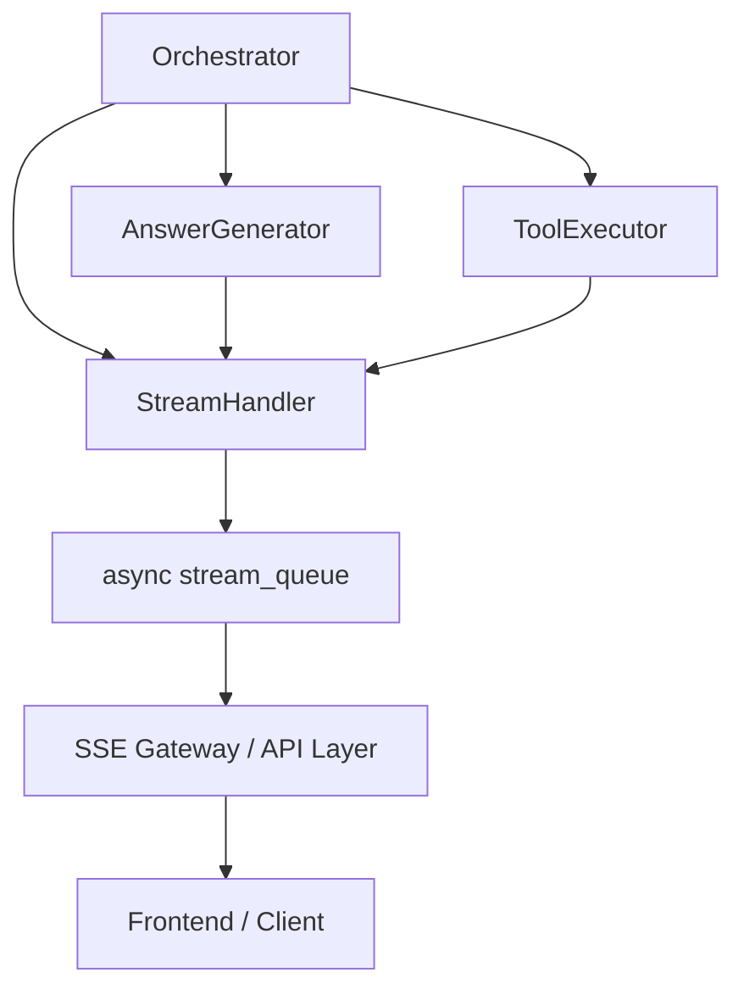
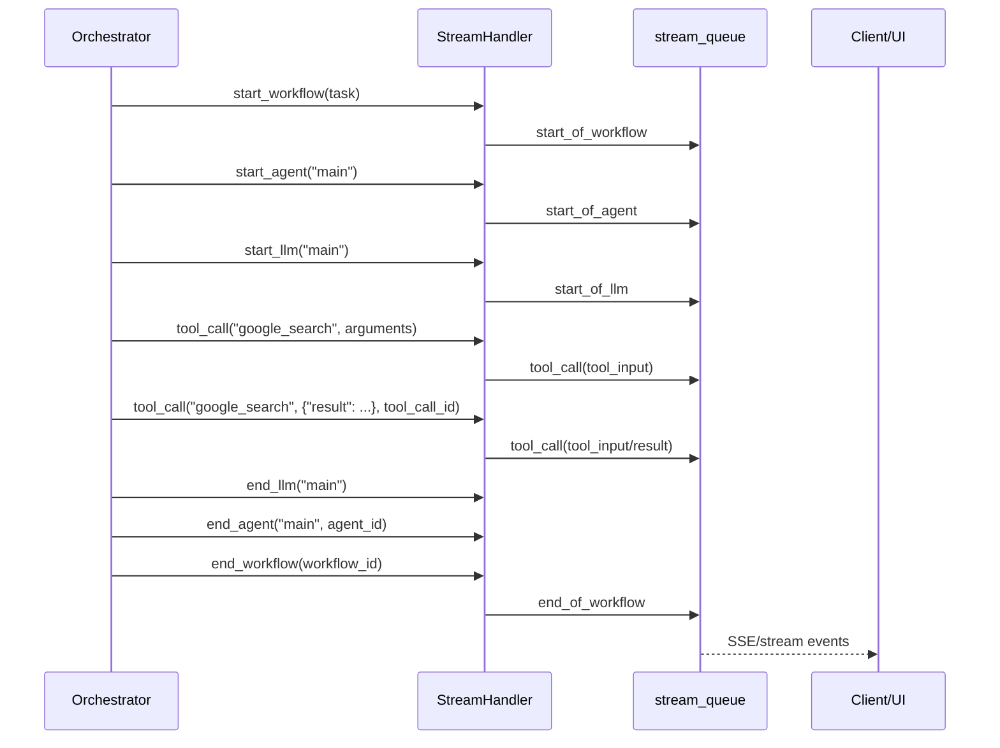

# stream_handler 模块文档

## 1. 模块定位与设计动机

`stream_handler` 是 `miroflow_agent_core` 中的实时事件输出模块，核心是 `StreamHandler` 类。它的职责不是“执行任务”，而是把任务执行过程中的关键状态（工作流开始/结束、Agent 生命周期、LLM 调用阶段、工具调用过程、错误信息）以统一事件协议推送给外部消费者（通常是 SSE 网关、前端 UI 或任务监控服务）。

这个模块存在的根本原因是：在一个多轮、可调用工具、可能跨子代理（sub-agent）的 Agent 系统里，任务通常持续较长时间。如果没有流式事件层，调用方只能“等待最终结果”，会造成不可观测、交互体验差、排障困难。`StreamHandler` 将内部执行轨迹转成可消费的事件流，让上层系统可以实时感知“系统正在做什么”。

从设计上看，`StreamHandler` 刻意保持极简：只负责事件组装与推送，不承担业务判断，不做重试编排，不管理会话上下文。这样可以把流式协议职责与核心推理逻辑解耦，降低 `Orchestrator`、`AnswerGenerator`、`ToolExecutor` 的耦合复杂度。关于任务编排和工具执行本身，请参考 [orchestrator.md](orchestrator.md) 与 [tool_executor.md](tool_executor.md)。

---

## 2. 在系统中的位置

`StreamHandler` 由 `Orchestrator` 在初始化时创建并持有，随后被注入给 `ToolExecutor` 和 `AnswerGenerator`，因此流式事件是跨核心执行链路共享的基础设施。



上图体现了一个重要边界：`StreamHandler` 只把消息放进 `stream_queue`，并不直接管理网络连接。这意味着 SSE 编码、HTTP 连接生命周期、重连策略通常在更外层处理（例如 API 网关或 Web 层）。

---

## 3. 事件协议与数据模型

### 3.1 统一消息封装

所有事件最终都会通过 `update(event_type, data)` 输出为统一结构：

```json
{
  "event": "<event_type>",
  "data": { "...": "..." }
}
```

这种统一 envelope 设计让消费端可以先按 `event` 路由，再按 `data` 结构解析，避免每种事件单独设计顶层 schema。

### 3.2 事件类型总览

`StreamHandler` 当前内建事件语义如下（事件名由方法封装）：

- `start_of_workflow` / `end_of_workflow`
- `start_of_agent` / `end_of_agent`
- `start_of_llm` / `end_of_llm`
- `message`（增量文本）
- `tool_call`（工具参数或工具结果）

此外，`show_error` 并不是单独事件名，而是通过 `tool_call("show_error", {...})` 来表达错误，再追加一个 `None` 作为流结束信号。

### 3.3 `tool_call` 的双模式

`tool_call()` 支持两种发送方式：

1. **完整模式**（`streaming=False`）

```json
{
  "event": "tool_call",
  "data": {
    "tool_call_id": "uuid",
    "tool_name": "google_search",
    "tool_input": {"q": "..."}
  }
}
```

2. **增量模式**（`streaming=True`）

```json
{
  "event": "tool_call",
  "data": {
    "tool_call_id": "uuid",
    "tool_name": "google_search",
    "delta_input": {"q": "..."}
  }
}
```

增量模式会遍历 `payload.items()`，逐 key 发送多条事件。消费端应按 `tool_call_id` 聚合。

---

## 4. 核心类：`StreamHandler`

### 4.1 构造函数

```python
StreamHandler(stream_queue: Optional[Any] = None)
```

`stream_queue` 预期是具备异步 `put()` 能力的队列对象。若传入 `None`，模块进入“无流式输出模式”：所有发送调用都会被静默跳过。这个行为是有意设计，用于支持不需要实时推送的运行场景（如离线批处理）。

### 4.2 方法级内部机制详解

#### `async update(event_type: str, data: dict)`

这是所有事件的底层发送入口。它会先检查 `self.stream_queue` 是否存在，然后将 `{event, data}` 放入队列。若 `put()` 失败，异常会被捕获并记录 warning，不向上传播。

- 参数：
  - `event_type`：事件类型字符串。
  - `data`：事件负载字典。
- 返回值：无。
- 副作用：向异步队列写入一条消息。
- 失败语义：**吞异常，仅日志告警**。

这种“失败不打断主流程”的策略提升了任务执行韧性，但也意味着流式层故障可能被主流程掩盖，必须依赖日志监控发现。

#### `async start_workflow(user_input: str) -> str`

方法会生成 `workflow_id = uuid4()`，发送 `start_of_workflow` 事件，并把用户输入封装为消息数组：

```json
"input": [{"role": "user", "content": "..."}]
```

返回值是 workflow ID，调用者需要在工作流结束时传给 `end_workflow()` 完成配对。

#### `async end_workflow(workflow_id: str)`

发送 `end_of_workflow` 事件，语义上标记一个任务流闭环结束。

#### `async show_error(error: str)`

先通过 `tool_call("show_error", {"error": error})` 输出错误可视化事件，再向队列写入 `None` 作为结束信号。该模式依赖消费端遵循“`None` 即流结束”的协议约定。

注意这不是标准 SSE 规范字段，而是本系统内部队列协议。若你在 Web 层做协议转换，需要显式处理 `None`。

#### `async start_agent(agent_name: str, display_name: str = None) -> str`

发送 `start_of_agent`，并生成 `agent_id` 返回。`display_name` 可用于 UI 展示友好名（例如在 `Orchestrator` 里用于 `Summarizing` 阶段标识）。

#### `async end_agent(agent_name: str, agent_id: str)`

发送 `end_of_agent`，通常与 `start_agent` 的 `agent_id` 成对出现。消费端应使用 `agent_id` 而非仅 `agent_name` 做状态收敛，以避免同名多实例冲突。

#### `async start_llm(agent_name: str, display_name: str = None)` / `async end_llm(agent_name: str)`

这对事件用于描述“某 Agent 进入/退出 LLM 调用阶段”。在长任务中，这能帮助前端区分“工具执行中”和“模型推理中”。

#### `async message(message_id: str, delta_content: str)`

输出文本增量事件，数据结构为 `{"delta": {"content": ...}}`。通常用于 token-by-token 或 chunk-by-chunk 展示。

#### `async tool_call(tool_name: str, payload: dict, streaming: bool = False, tool_call_id: str = None) -> str`

这是工具事件总入口。若未传 `tool_call_id` 会自动生成 UUID，并返回给调用方。常见模式是：

1) 先发送工具调用参数（start/input）。
2) 工具执行结束后，用同一个 `tool_call_id` 发送结果（result）。

`Orchestrator` 正是这样使用该方法来让前端将“请求”和“结果”串联为一条工具调用记录。

---

## 5. 与 Orchestrator 的交互过程

`StreamHandler` 最关键的价值体现在主流程编排中。下面是典型主任务流（简化版）：



当执行 sub-agent 时，`Orchestrator` 会在主 Agent 与子 Agent 之间切换并发出相应 start/end 事件，使前端可展示“主代理暂停 → 子代理执行 → 主代理恢复总结”的过程。详细编排逻辑请参考 [orchestrator.md](orchestrator.md)。

---

## 6. 使用与集成示例

### 6.1 最小集成

```python
from apps.miroflow-agent.src.core.stream_handler import StreamHandler

stream = StreamHandler(stream_queue=my_async_queue)

workflow_id = await stream.start_workflow("请总结这份报告")
agent_id = await stream.start_agent("main", display_name="Main Agent")
await stream.start_llm("main")

call_id = await stream.tool_call("google_search", {"q": "latest ai benchmark"})
await stream.tool_call("google_search", {"result": "..."}, tool_call_id=call_id)

await stream.end_llm("main")
await stream.end_agent("main", agent_id)
await stream.end_workflow(workflow_id)
```

### 6.2 禁用流式输出（离线模式）

```python
stream = StreamHandler(stream_queue=None)
# 所有事件调用都不会抛错，也不会输出
```

这对测试或批处理模式很有用，但你将失去实时可观测性。

### 6.3 扩展新事件类型

推荐新增语义化方法而非在业务层到处裸调 `update()`。示例：

```python
class StreamHandler:
    ...
    async def custom_checkpoint(self, checkpoint_name: str, detail: dict):
        await self.update("custom_checkpoint", {
            "checkpoint": checkpoint_name,
            "detail": detail,
        })
```

这样做可以把协议定义集中管理，避免前后端字段漂移。

---

## 7. 配置、约定与行为细节

`StreamHandler` 自身几乎没有配置项，主要行为由是否传入 `stream_queue` 决定。但在工程实践中，以下约定很关键：

1. 队列项协议：正常项是 `{"event": ..., "data": ...}`，结束项是 `None`（当前仅 `show_error` 显式写入）。
2. ID 协议：`workflow_id`、`agent_id`、`tool_call_id` 全部是 UUID 字符串，由发送端生成，消费端应透传并按 ID 聚合。
3. 顺序语义：模块不做重排，默认依赖“单队列先进先出 + 单生产者调用顺序”。如果上层有多生产者并发写同一队列，消费端需自行处理乱序风险。

---

## 8. 边界条件、错误处理与限制

### 8.1 错误吞噬策略

`update()` 和 `show_error()` 在队列写入失败时只记录 warning，不抛异常。优点是不会拖垮主流程；代价是流式链路失效可能不易被立刻发现。生产环境建议对 logger 做告警采集。

### 8.2 `show_error` 的结束信号局限

`show_error()` 会 push `None` 作为终止标记，但 `end_workflow()` 不会自动 push `None`。因此如果你的消费端以 `None` 作为唯一结束条件，正常完成场景可能无法自动终止读取。应在接入层明确“正常结束”和“异常结束”两类策略。

### 8.3 `streaming=True` 的粒度和原子性

增量模式按 payload 的 key 粒度发送，不保证字段级事务原子性。例如 payload 包含多个字段时，消费端可能先收到部分字段，需要自行拼装完整状态。

### 8.4 `display_name` 可空

`start_agent()` 和 `start_llm()` 的 `display_name` 可为 `None`。前端若直接渲染应提供回退值（如使用 `agent_name`），避免空标签。

### 8.5 线程/协程安全边界

该类不维护锁，不做并发保护。若多个协程共享同一实例并并发调用，事件顺序只受底层队列调度影响；需要严格顺序时应在调用侧串行化。

---

## 9. 开发与维护建议

在维护本模块时，应优先保持“协议稳定性”而非“实现花样”。因为它是前后端、编排层和可观测层之间的契约点。新增字段时尽量向后兼容；更改事件名或字段名前，应同步更新消费端解析逻辑与文档。

建议配套以下测试：

- 单元测试：验证各方法输出事件名、字段结构、ID 生成和异常吞噬行为。
- 集成测试：联动 `Orchestrator` 执行一次完整主流程，校验事件序列闭环。
- 协议测试：校验 `show_error` 分支下 `None` 终止信号是否被正确消费。

---

## 10. 相关文档

- 核心编排逻辑：[`orchestrator.md`](orchestrator.md)
- LLM 调用与最终答案生成：[`answer_generator.md`](answer_generator.md)
- 工具执行与结果处理：[`tool_executor.md`](tool_executor.md)
- Core 模块总览：[`miroflow_agent_core.md`](miroflow_agent_core.md)

通过这些文档配合阅读，可以从“事件输出层”逐步上钻到“执行决策层”。