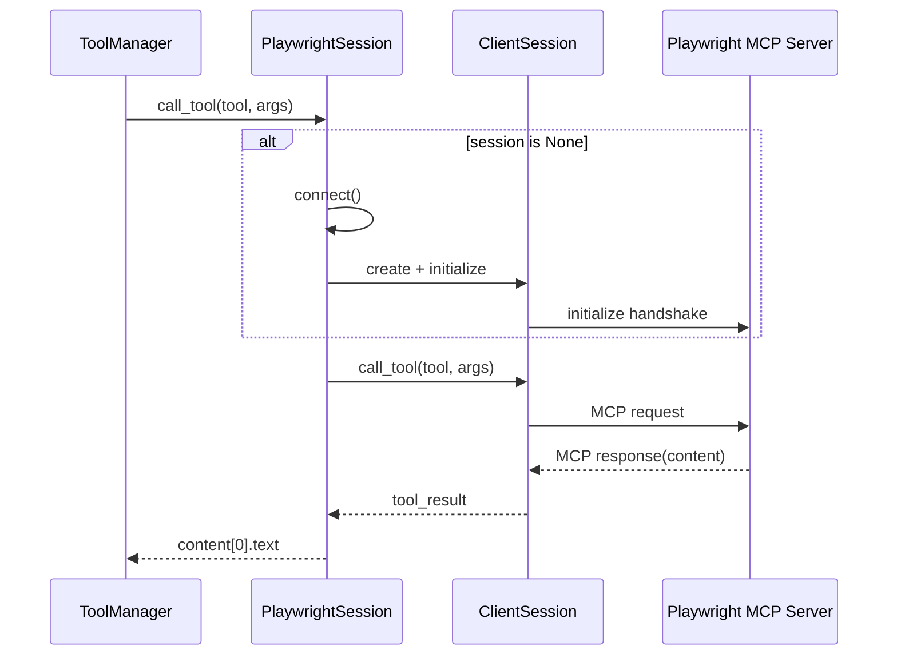

# sub-browser_session：浏览器持久会话子模块文档

## 1. 子模块定位

`sub-browser_session` 对应 `libs/miroflow-tools/src/miroflow_tools/mcp_servers/browser_session.py`，提供 `PlaywrightSession` 类，用于维护与 Playwright MCP 服务器的**持久连接**。其核心价值是“跨多次工具调用复用同一会话上下文”，从而保留浏览器状态并减少重复建连开销。

在实际 Agent 场景中，这一点非常关键：导航、点击、截图、DOM 抽取通常是连续动作，如果每一步都新建会话，状态会丢失且耗时显著增加。

---

## 2. 核心类：`PlaywrightSession`

### 2.1 构造函数

```python
PlaywrightSession(server_params)
```

- `server_params` 支持两种类型：
  1. `StdioServerParameters`：本地子进程 stdio 通信；
  2. `str`：SSE endpoint（`http://` / `https://`）。

构造时不会立即连接，只做状态初始化（延迟连接）：

- `read` / `write`: 传输流句柄；
- `session`: `ClientSession` 对象；
- `_client`: 底层 async client 上下文对象。

### 2.2 `connect()`

```python
async def connect(self)
```

该方法负责建立连接并初始化 MCP session，且具备幂等性：若 `self.session` 已存在则直接返回。

内部步骤：

1. 判断参数类型，选择 `stdio_client` 或 `sse_client`；
2. 手动进入 `_client.__aenter__()` 获取读写流；
3. 构造 `ClientSession(read, write, sampling_callback=None)`；
4. 手动进入 `session.__aenter__()`；
5. 调用 `session.initialize()` 完成握手。

这种手动 `__aenter__` 管理方式，是为了把上下文生命周期绑定到对象实例上，而不是局部 `async with` 代码块。

### 2.3 `call_tool(tool_name, arguments=None)`

```python
async def call_tool(self, tool_name, arguments=None)
```

这是对外主接口：

- 若还未连接，会先自动 `connect()`；
- 调用 `self.session.call_tool(...)`；
- 从返回中提取 `tool_result.content[0].text` 作为最终文本结果。

返回值是字符串（或空字符串）。该实现假设调用方主要消费文本内容，而非完整结构化内容对象。

### 2.4 `close()`

```python
async def close(self)
```

负责释放资源，顺序为：

1. 关闭 `session`（`__aexit__`）；
2. 关闭 `_client`（`__aexit__`）；
3. 把 `session/_client/read/write` 置 `None`。

如果不主动关闭，长生命周期服务可能出现连接泄漏或浏览器实例悬挂。

---

## 3. 交互与数据流



这条链路的关键特征是：**同一个 `PlaywrightSession` 可以承载多次 `call_tool`，共享浏览器上下文**。

---

## 4. 与 `ToolManager` 的协作方式

在 `ToolManager.execute_tool_call` 中，当 `server_name == "playwright"`：

1. 若 `browser_session` 为空则创建 `PlaywrightSession(server_params)` 并连接；
2. 后续调用复用同一对象；
3. 返回结构由 `ToolManager` 包装为统一字典。

也就是说，`PlaywrightSession` 本身只关心“如何维护会话并调用工具”，而“统一返回格式、日志、错误语义”由 `ToolManager` 负责。

---

## 5. 使用示例

### 5.1 独立使用

```python
import asyncio
from miroflow_tools.mcp_servers.browser_session import PlaywrightSession

async def run_demo():
    session = PlaywrightSession("http://localhost:8931")
    try:
        await session.call_tool("browser_navigate", {"url": "https://example.com"})
        snap = await session.call_tool("browser_snapshot", {})
        print(snap)
    finally:
        await session.close()

asyncio.run(run_demo())
```

### 5.2 stdio 模式

```python
from mcp import StdioServerParameters
from miroflow_tools.mcp_servers.browser_session import PlaywrightSession

params = StdioServerParameters(
    command="npx",
    args=["-y", "@modelcontextprotocol/server-playwright"],
)

session = PlaywrightSession(params)
```

---

## 6. 错误处理与边界条件

1. **连接失败传播**：
   `connect()` 未做内部吞错，异常会直接抛到调用方；在系统主链路中由 `ToolManager` 捕获并转为 `error` 字段。

2. **结果提取策略固定**：
   仅取 `content[0].text`。若工具返回多段 content，后续段会被忽略。

3. **并发访问风险**：
   当前类没有显式锁。如果同一实例被多个协程并发首次调用，可能出现竞争初始化。实践中通常通过上层串行调用或封装锁解决。

4. **生命周期由外部负责**：
   类不提供自动超时关闭和析构清理，调用方应在任务结束时显式 `close()`。

---

## 7. 已知限制与改进建议

- 目前缺少重连机制：连接中断后需要外部捕获异常并决定是否重建会话；
- 缺少心跳与健康检查：无法提前发现 session 已失效；
- 缺少统一指标：可补充调用次数、耗时、失败率监控；
- 返回值过于文本化：若后续要支持 richer 内容，建议返回完整 MCP content 并由上层格式化。

---

## 8. 相关文档

- 模块总览与架构：[`miroflow_tools_management.md`](miroflow_tools_management.md)
- 工具管理实现细节：[`sub-tool_manager.md`](sub-tool_manager.md)
- 日志体系：[`miroflow_agent_logging.md`](miroflow_agent_logging.md)
