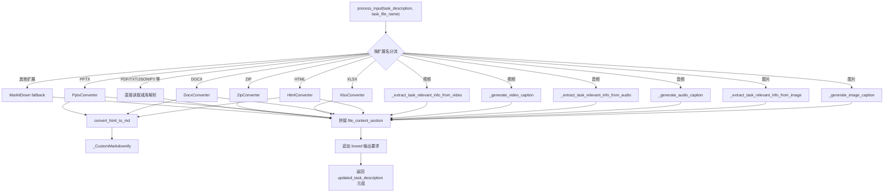
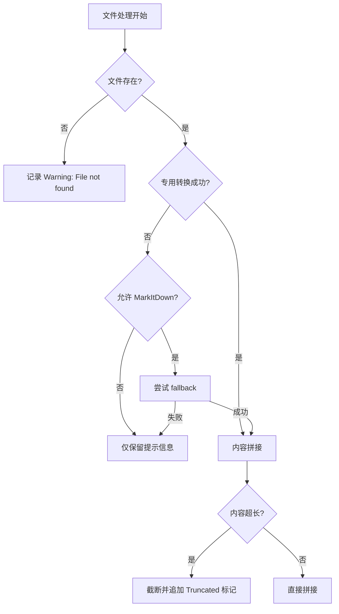

# sub-input_handler：输入处理子模块详解

## 1. 子模块定位与设计目标

`input_handler` 是 `miroflow_agent_io` 中最靠近“用户原始输入”的一层。它的核心职责不是简单地“读文件”，而是把异构输入（文档、表格、演示文稿、图片、音频、视频、压缩包）转换为可直接拼接进提示词（prompt）的结构化文本，让上游编排器（见 [miroflow_agent_core.md](miroflow_agent_core.md)）能够把任务交给 LLM 时，携带足够上下文。

该模块的设计重点是三件事：第一，尽可能覆盖常见文件格式并提供专用解析路径；第二，在专用解析失败或不适用时，使用 `MarkItDown` 兜底；第三，对于多模态媒体，除通用 caption/transcription 外，再补一层“面向当前任务”的信息抽取，降低模型在后续推理阶段的无关信息负担。

---

## 2. 架构与处理流程



从流程上看，`process_input` 是单入口函数；它先建立 `file_content_section`，再根据扩展名分支处理，最后统一拼接到任务描述后返回。由于上游核心链路（`Orchestrator.run_main_agent`）直接调用此函数，输入处理的成败会显著影响后续工具调用策略与最终答案质量。

---

## 3. 核心数据结构

### 3.1 `DocumentConverterResult`

`DocumentConverterResult` 是统一转换结果对象，包含两个字段：

- `title: Union[str, None]`
- `text_content: str`

这个结构被 HTML/DOCX/XLSX/PPTX/ZIP 等转换器共用，避免不同转换路径返回类型不一致。`process_input` 会优先读取 `title`，若存在则以“Title + Content”形式组织；否则直接写入 `text_content`。

---

## 4. 核心类：`_CustomMarkdownify`

`_CustomMarkdownify` 继承自 `markdownify.MarkdownConverter`，是 HTML 转 Markdown 的关键增强层。它并不是“功能扩展很多”，但每个改动都针对 LLM 输入稳定性：

1. **标题风格固定为 ATX**（`#`, `##`），利于一致的分段结构。  
2. **过滤危险或无意义链接**：`convert_a` 中只允许 `http/https/file` scheme，`javascript:` 等被降级为纯文本。  
3. **URI path 转义**：通过 `quote/unquote` 避免 URL 与 Markdown 语法冲突。  
4. **Data URI 图片截断**：`convert_img` 遇到 `data:` 只保留头部前缀，防止超长 base64 污染上下文。  
5. **标题行前换行控制**：`convert_hn` 保证块级标题前有换行，提高可读性与分块一致性。

这类处理虽然“看起来细节”，但直接决定了长文档转换后的 token 消耗、格式稳定性和下游摘要质量。

---

## 5. 关键函数详解

## 5.1 `process_input(task_description: str, task_file_name: str) -> Tuple[str, str]`

这是模块最重要的公开入口。它的内部策略可以概括为“专用优先、兜底补位、统一拼接”。

### 参数

- `task_description`：用户原始任务描述。
- `task_file_name`：关联文件路径，可为空字符串。

### 返回值

- 返回一个二元组，两个元素当前实现**相同**，都为拼接后的任务描述。  
  这意味着调用方无需区分第一个和第二个值，但该签名保留了未来扩展空间。

### 内部关键行为

1. 若有附件，按扩展名进入不同解析路径。  
2. 对图片/音频/视频，生成两类文本：
   - unconditional caption/transcription（通用描述）
   - task-relevant info（基于任务描述的相关信息抽取）
3. 对文档类文件，优先走专用转换器（PDF、DOCX、XLSX、PPTX、HTML、ZIP 等）。
4. 若前述都未命中，且扩展名不在 `SKIP_MARKITDOWN_EXTENSIONS`，尝试 `MarkItDown` 兜底。
5. 文本统一放入代码块，并限制最大长度（默认 200,000 字符）。
6. 无论是否有附件，都会在任务尾部追加：
   `You should follow the format instruction in the request strictly and wrap the final answer in \boxed{}.`

### 副作用

- 可能发起 OpenAI 网络请求（媒体解析）。
- 控制台输出 `print` 日志与警告。
- ZIP 处理中创建临时目录并清理。

### 使用示例

```python
from apps.miroflow-agent.src.io.input_handler import process_input

task = "请根据附件总结风险点，并给出优先级"
updated, _ = process_input(task, "risk_report.pdf")
print(updated[:1200])
```

---

## 5.2 多模态生成函数

### `_generate_image_caption(image_path: str) -> str`
### `_generate_audio_caption(audio_path: str) -> str`
### `_generate_video_caption(video_path: str) -> str`

这三类函数共同特点是：

- 使用环境变量 `OPENAI_API_KEY`、`OPENAI_BASE_URL` 初始化 `OpenAI` 客户端。
- 失败时不抛异常到上层，而是返回可读的占位文本（例如 `[Caption generation failed: ...]`）。
- 模型侧分别使用 `gpt-4o`（图像/视频）和 `gpt-4o-transcribe`（音频转录）。

注意，图像/视频走的是 base64 内联 data URL，这对大文件会造成明显延迟与成本上涨。

---

## 5.3 任务相关信息提取函数

### `_extract_task_relevant_info_from_image(...) -> str`
### `_extract_task_relevant_info_from_audio(...) -> str`
### `_extract_task_relevant_info_from_video(...) -> str`

与通用 caption 的区别在于：它们会把 `task_description` 合并到提示词中，要求模型只输出与任务直接相关的信息。失败时返回空字符串（而不是错误文本），避免污染主提示词。

这套机制在复杂任务里很有价值：它把“感知”与“任务意图”绑定在输入阶段完成，减少主模型在后续推理时需要自行筛噪的负担。

---

## 5.4 文档转换函数族

### `convert_html_to_md(html_content)` + `HtmlConverter(local_path)`

先用 `BeautifulSoup` 移除 `script/style`，优先抽取 `<body>`，再交给 `_CustomMarkdownify`。返回 `DocumentConverterResult`，并尝试携带 `title`。

### `DocxConverter(local_path)`

用 `mammoth` 把 DOCX 转 HTML，再复用 HTML 转换链路。该设计避免重复维护 DOCX 与 HTML 两套 markdown 逻辑。

### `XlsxConverter(local_path)`

这是最复杂的转换器之一。它基于 `openpyxl` 逐 sheet 构建 Markdown 表格，并尝试保留样式信息（背景色、字体色、粗体、斜体、下划线），通过内联 HTML `<span>` 表达。若检测到样式，会附加说明段，提示“并非所有 Markdown 渲染器都支持”。

### `PptxConverter(local_path)`

处理 slide 文本、表格、图片和备注：

- 标题形状映射为 Markdown `#` 标题。
- 表格先转 HTML，再复用 HTML->MD。
- 图片输出为 `` 占位。
- `notes_slide` 作为 `### Notes` 附加。

### `ZipConverter(local_path)`

解压到临时目录后递归处理每个文件，基本复用 `process_input` 的分流策略。每个文件内容单独截断（默认 50,000 字符），最终合并为一份总览 Markdown。

---

## 6. 错误处理、边界条件与限制



需要重点关注以下行为：

1. **强制输出格式注入**：函数始终追加 `\boxed{}` 要求；如果上游任务不希望此行为，需要在更高层改造。  
2. **返回值重复**：当前返回 `(x, x)`，调用方如果误以为二者语义不同可能产生困惑。  
3. **媒体处理依赖外网与密钥**：无 `OPENAI_API_KEY` 时，caption 返回占位文本或空串。  
4. **大媒体文件成本高**：图片/视频使用 base64 全量传输，可能触发超时、限流或高成本。  
5. **ZIP 安全性与资源占用**：`extractall` 对不可信压缩包存在路径穿越风险；超大 ZIP 可能导致 I/O 与磁盘压力。  
6. **Excel 格式兼容性**：样式通过内联 HTML 表示，在纯文本 Markdown 环境可能不可见。  
7. **MarkItDown 插件不确定性**：兜底成功率取决于运行环境插件支持，需做兼容测试。

---

## 7. 扩展与维护建议

如果你要新增文件类型（例如 `rtf`、`odt`），推荐遵循现有模式：

1. 在 `process_input` 中新增扩展名分支。  
2. 优先实现专用转换器，返回 `DocumentConverterResult`。  
3. 明确“提示模板”段落（`Note: ...` + `## File Type`）。  
4. 设定合理截断策略，防止上下文膨胀。  
5. 在 ZIP 分支里同步添加该扩展名处理逻辑，保持行为一致。

简化示例：

```python
elif file_extension == "rtf":
    parsing_result = RtfConverter(local_path=task_file_name)
    file_content_section += "\n\nNote: An RTF file ...\n\n"
    file_content_section += f"## RTF File\nFile: {task_file_name}\n\n"
```

---

## 8. 与其他模块的关系

- 与 [miroflow_agent_core.md](miroflow_agent_core.md)：`Orchestrator.run_main_agent` 在主循环开始前调用 `process_input`，它是任务上下文的入口。  
- 与 [miroflow_agent_llm_layer.md](miroflow_agent_llm_layer.md)：媒体 caption/抽取通过 OpenAI SDK 触发模型能力。  
- 与 [miroflow_agent_logging.md](miroflow_agent_logging.md)：当前模块主要 `print`，并未深度接入结构化日志；如需可观测性增强可考虑统一接入 `TaskLog`。
