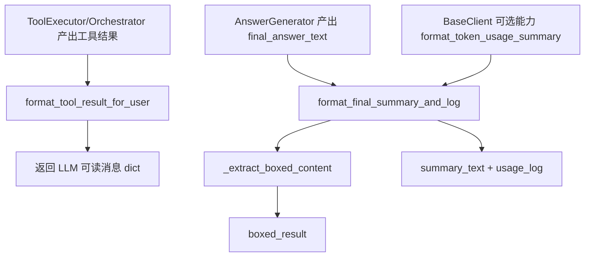
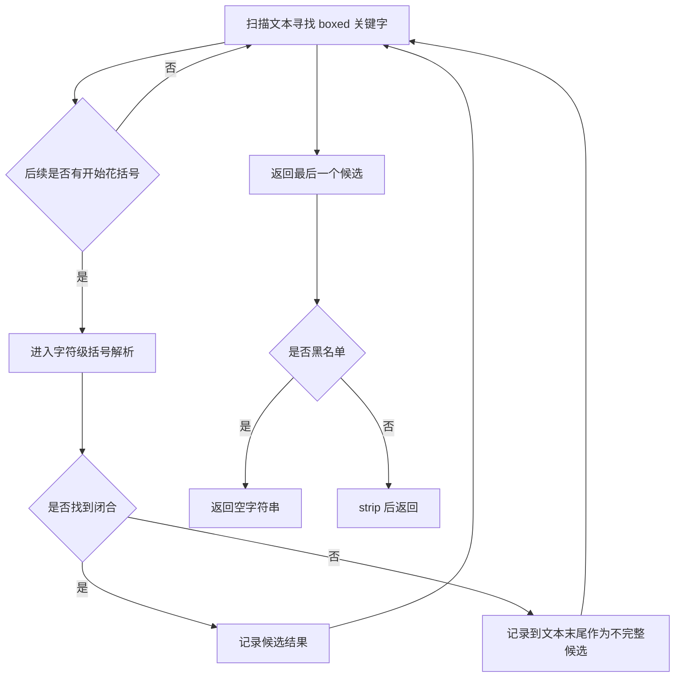
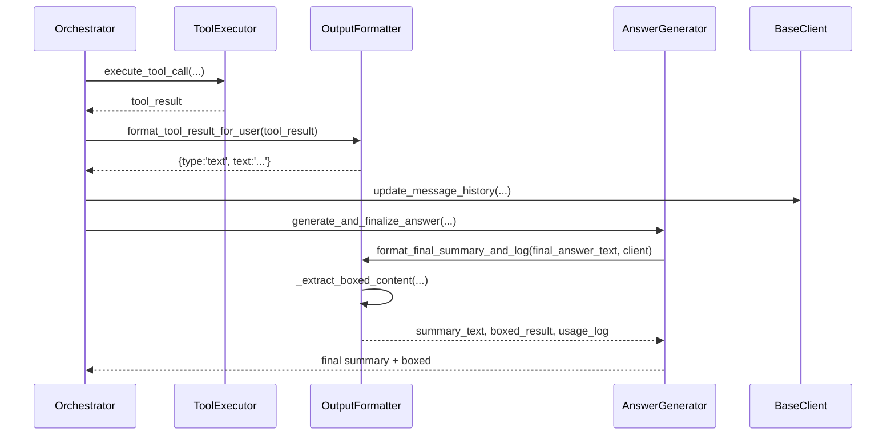

# sub-output_formatter：输出格式化子模块详解

## 1. 子模块定位

`output_formatter` 是 `miroflow_agent_io` 的“输出收口层”。在主流程中，LLM 原始响应、工具调用结果、最终摘要和可提取答案（`\boxed{}`）都要经过它统一处理。它的目标并不是让输出“更漂亮”，而是让输出“可被后续流程稳定消费”：

- 给 LLM 回灌工具结果时，结构统一且长度可控；
- 最终答案阶段，稳定提取最后一个有效 `\boxed{...}`；
- 与 token 统计能力协作，生成可审计的总结日志。

在系统层面，`Orchestrator` 与 `AnswerGenerator` 会频繁调用本模块（可参考 [miroflow_agent_core.md](miroflow_agent_core.md) 与 [answer_generator.md](answer_generator.md)）。

---

## 2. 架构与交互



这个模块几乎不持有状态，核心是纯函数式处理，因此测试和替换成本较低。除 `TOOL_RESULT_MAX_LENGTH` 外，没有复杂配置。

---

## 3. 核心常量与类

### 3.1 `TOOL_RESULT_MAX_LENGTH = 100_000`

该阈值用于防止工具结果直接塞满上下文窗口。当工具输出超过阈值时，会截断并追加 `... [Result truncated]`。这在网页抓取、日志检索、批量数据查询等场景尤为重要。

### 3.2 `OutputFormatter`

`OutputFormatter` 提供三个核心方法：

1. `_extract_boxed_content`：从文本中提取最后一个 `\boxed{...}` 内容。  
2. `format_tool_result_for_user`：把工具执行结果转成 LLM 消息片段。  
3. `format_final_summary_and_log`：汇总最终回答、提取结果、token/cost 统计。

---

## 4. 关键方法详解

### 4.1 `_extract_boxed_content(text: str) -> str`

这是一个“手写解析器”，不是简单正则替换。它通过字符级扫描处理复杂情况：

- 支持多层嵌套大括号；
- 支持转义花括号（`\{` / `\}`）；
- 支持 `\boxed` 与 `{` 之间存在空白；
- 支持不完整表达式（缺少闭合 `}`）时回退提取到文本末尾；
- 总是返回**最后一个** boxed 结果（而不是第一个）。

此外，它内置一个黑名单（如 `?`、`...`、`unknown` 等），命中后返回空字符串，以减少“形式正确但语义无效”的提取误报。



**实践意义**：这使得 `AnswerGenerator` 可以在多轮回复、链式思考片段、格式噪声混杂时，尽量拿到稳定答案。

---

### 4.2 `format_tool_result_for_user(tool_call_execution_result: dict) -> dict`

该方法输入是工具执行结果字典，通常包含：

- `server_name`
- `tool_name`
- `result` 或 `error`

输出固定为：

```python
{"type": "text", "text": "..."}
```

处理分支：

1. 有 `error`：构造简洁失败信息（保留工具名与服务名）；
2. 有 `result`：直接透传文本，必要时截断；
3. 都没有：给出“完成但无可用输出”的兜底提示。

这种格式约束与上游 LLM 客户端消息协议保持一致，避免回灌消息结构漂移。

示例：

```python
formatter = OutputFormatter()

tool_ok = {
    "server_name": "browser",
    "tool_name": "search_web",
    "result": "Top 5 results: ..."
}
print(formatter.format_tool_result_for_user(tool_ok))

tool_err = {
    "server_name": "python",
    "tool_name": "run_code",
    "error": "Timeout after 30s"
}
print(formatter.format_tool_result_for_user(tool_err))
```

---

### 4.3 `format_final_summary_and_log(final_answer_text: str, client=None) -> Tuple[str, str, str]`

该方法负责构建“任务结束态”输出，返回三元组：

1. `summary_text`：包含最终答案原文、提取结果区段、token 统计区段；
2. `boxed_result`：从 `final_answer_text` 提取的结果；
3. `usage_log`：用于日志记录的 token/cost 文本。

关键逻辑：

- 若未提取到有效 boxed 内容，则 `boxed_result` 会被设为 `FORMAT_ERROR_MESSAGE`（来自 `prompt_utils`）；
- 若 `client` 提供 `format_token_usage_summary`，使用其真实统计；否则给出“不可用”默认文案。

这让上游编排器无论成功或失败都能拿到结构稳定的收尾信息，便于日志与重试决策。

---

## 5. 典型调用链（与核心模块关系）



---

## 6. 边界条件与注意事项

1. **`_extract_boxed_content` 是私有方法但被外部直接调用**：例如 `Orchestrator` 会直接访问它，这意味着未来重构时要注意兼容性。  
2. **黑名单策略是启发式**：可能把极短但合法答案误判为空；可按业务调整。  
3. **截断基于字符数，不是 token 数**：对多字节语言或混合文本，token 控制并不精确。  
4. **`format_tool_result_for_user` 假定 `result` 为字符串**：若上游传入结构化对象，应先序列化。  
5. **缺失 token 统计接口时不报错**：会降级为默认文案，便于离线/测试环境运行。

---

## 7. 扩展建议

如果要增强该子模块，通常有三条路径：

- **更强答案提取**：在 `\boxed{}` 之外增加 JSON schema 或 XML tag 提取器；
- **自适应截断**：按模型上下文容量动态设置 `TOOL_RESULT_MAX_LENGTH`；
- **结构化日志输出**：新增 machine-readable 摘要（如 dict），降低日志解析成本。

简化示例（新增 JSON 回退提取思路）：

```python
# 伪代码
boxed = self._extract_boxed_content(text)
if not boxed:
    boxed = try_extract_json_answer(text)  # 自定义策略
```
