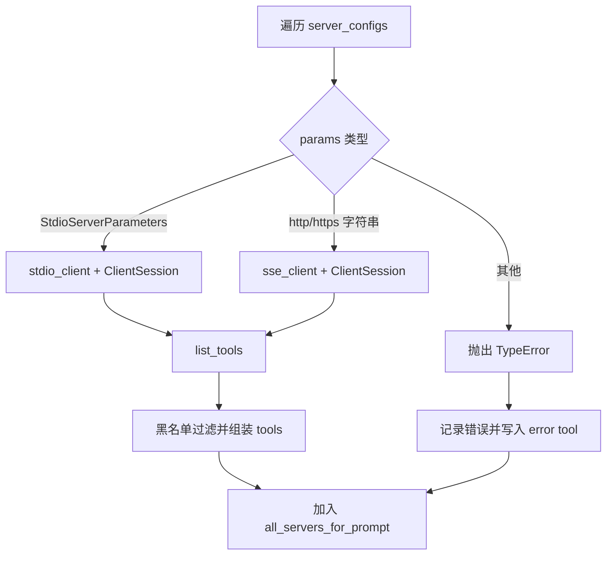
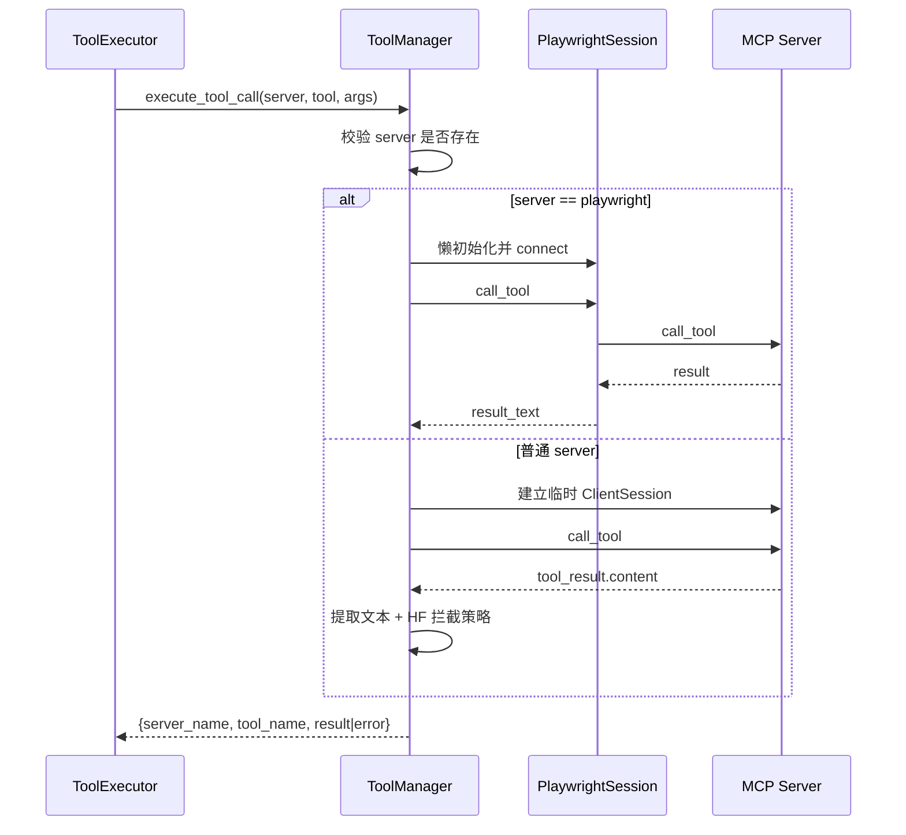

# sub-tool_manager：工具管理子模块文档

## 1. 子模块定位

`sub-tool_manager` 对应代码文件 `libs/miroflow-tools/src/miroflow_tools/manager.py`，是 `miroflow_tools_management` 的调度中枢。它解决的核心问题不是“如何实现某个具体工具”，而是“如何以统一方式接入并调用多种 MCP 工具服务”，并把连接方式差异、异常处理、超时控制、日志接入和基础安全策略收敛到一个组件内。

在 MiroFlow 的运行链路中，上层 `miroflow_agent_core` 的 `ToolExecutor` 只关心“调用哪个 server 的哪个 tool，以及参数是什么”。`ToolManager` 把这些高层意图翻译为具体的 MCP 会话操作，并返回稳定结构的执行结果，使 Agent 主流程与工具基础设施解耦。

---

## 2. 核心组件与职责

### 2.1 `with_timeout(timeout_s: float = 300.0)`

这是一个面向异步函数的装饰器工厂，内部通过 `asyncio.wait_for` 为协程增加超时边界。模块中 `execute_tool_call` 使用了 `@with_timeout(1200)`，因此默认单次工具调用最大运行 1200 秒。

它的设计价值在于：

1. 避免远端工具服务无响应导致主流程永久阻塞；
2. 把“超时”作为横切能力复用，而不是在每个调用分支重复写 `wait_for`。

> 行为说明：超时会抛出 `asyncio.TimeoutError`，在 `execute_tool_call` 的外层异常捕获中被统一包装为 `{"error": ...}` 结构返回。

---

### 2.2 `ToolManagerProtocol`

`ToolManagerProtocol` 定义了工具管理器的最小契约：

- `get_all_tool_definitions()`：获取所有可用于提示词构建/规划的工具定义；
- `execute_tool_call(server_name, tool_name, arguments)`：执行一次工具调用。

这使得上层（如 `ToolExecutor`）可以面向接口编程。如果未来接入不同的工具后端（例如非 MCP 的内部插件系统），只要实现同样协议，就能保持调用方代码基本不变。

---

### 2.3 `ToolManager`

`ToolManager` 是协议的默认实现，承担以下职责：

1. **服务器注册视图**：在初始化时把 `server_configs` 转为 `server_dict`，支持 O(1) 查询 server 参数；
2. **工具目录聚合**：遍历所有 server，拉取工具定义并标准化结构；
3. **工具执行编排**：按 server 参数类型（stdio / SSE）建立 MCP 会话并调用工具；
4. **特殊 server 优化**：对 `playwright` 使用持久化 `PlaywrightSession`；
5. **安全与治理**：黑名单过滤、Hugging Face 数据集/Space 抓取拦截；
6. **容错降级**：特定抓取错误触发 MarkItDown fallback；
7. **结构化日志接入**：通过 `set_task_log` 注入 `TaskLog`，记录关键步骤。

---

## 3. 内部数据结构

### 3.1 初始化参数

```python
ToolManager(server_configs, tool_blacklist=None)
```

- `server_configs`: 服务器配置列表，每项形如：
  - `{"name": str, "params": StdioServerParameters}`，或
  - `{"name": str, "params": "https://..."}`（SSE endpoint）。
- `tool_blacklist`: 可选集合，元素为 `(server_name, tool_name)` 元组。

### 3.2 实例状态

- `self.server_configs`: 原始配置列表，用于枚举遍历；
- `self.server_dict`: `{server_name: server_params}` 索引；
- `self.browser_session`: `PlaywrightSession | None`，仅在 `server_name == "playwright"` 时使用；
- `self.tool_blacklist`: 黑名单集合；
- `self.task_log`: 外部注入日志器。

---

## 4. 关键方法详解

### 4.1 `set_task_log(task_log)` 与 `_log(...)`

`set_task_log` 注入日志对象后，`ToolManager` 会通过 `_log` 统一写入结构化步骤日志。

- `_log` 参数：`level`, `step_name`, `message`, `metadata`；
- 如果未注入日志器，方法静默跳过，不影响主流程。

这是一种“可选依赖”设计：在轻量环境可无日志运行，在生产环境可完整追踪。

---

### 4.2 安全判断：`_is_huggingface_dataset_or_space_url` 与 `_should_block_hf_scraping`

这两个方法构成了一个轻量策略层：

- URL 命中 `huggingface.co/datasets` 或 `huggingface.co/spaces`；
- 且工具名为 `scrape` / `scrape_website`；
- 则在执行后覆盖返回内容为提示文本，阻止把 HF 数据集当“答案库”直接抓取。

该策略属于 **post-hoc 内容拦截**（执行后替换结果）。它不阻止请求发送，但阻止有效结果返回给上游。

---

### 4.3 `get_all_tool_definitions()`

该方法会遍历每个 server 并尝试获取工具列表，返回统一结构：

```json
[
  {
    "name": "server_name",
    "tools": [
      {"name": "...", "description": "...", "schema": {...}}
    ]
  }
]
```

#### 执行流程



#### 错误行为

如果某个 server 连接失败，不会中断整体，而是返回该 server 的占位错误项：

```json
{"name": "xxx", "tools": [{"error": "Unable to fetch tools: ..."}]}
```

这让上层仍能看到“有哪些 server 失败了”，而不是整个工具发现流程直接失败。

---

### 4.4 `execute_tool_call(server_name, tool_name, arguments)`

该方法是工具调用主入口，带 1200 秒超时保护。

#### 总体流程



#### 主要分支说明

1. **server 不存在**：直接返回错误结构；
2. **playwright 专线**：复用 `self.browser_session`，避免重复建连；
3. **stdio 分支**：每次调用创建临时连接并初始化会话；
4. **SSE 分支**：逻辑与 stdio 类似，仅传输层不同；
5. **未知参数类型**：抛出 `TypeError`。

#### 返回值结构

- 成功：
```json
{"server_name": "...", "tool_name": "...", "result": "..."}
```
- 失败：
```json
{"server_name": "...", "tool_name": "...", "error": "..."}
```

#### Fallback 逻辑（抓取工具）

当满足以下条件时会尝试 MarkItDown：

- `tool_name` 是 `scrape` 或 `scrape_website`；
- 错误信息包含 `unhandled errors`；
- `arguments["url"]` 存在。

成功则返回 `result.text_content`，失败则记录 fallback 失败并返回原始外层错误。

---

## 5. 与系统其他模块的协作

### 5.1 与 `miroflow_agent_core` 的协作

`ToolExecutor` 负责策略层（参数修复、重复查询检测、回滚判定、结果后处理），并把“真正的工具调用”下沉到 `ToolManager.execute_tool_call`。这是一种明确的职责分离：

- `ToolExecutor`: 任务级编排和对话策略；
- `ToolManager`: 工具基础设施接入与执行。

### 5.2 与 `miroflow_agent_logging` 的协作

通过注入 `TaskLog`，`ToolManager` 可以把“获取工具定义”“调用开始/成功/失败”“fallback 尝试”等步骤写入统一日志流水，便于审计与问题定位。日志对象细节见 [miroflow_agent_logging.md](miroflow_agent_logging.md)。

### 5.3 与 `sub-browser_session` 的协作

`ToolManager` 对 Playwright server 走专门分支并复用会话对象。`PlaywrightSession` 的生命周期管理和连接细节见 [sub-browser_session.md](sub-browser_session.md)。

---

## 6. 使用示例

### 6.1 初始化与工具发现

```python
from mcp import StdioServerParameters
from miroflow_tools.manager import ToolManager

server_configs = [
    {
        "name": "tool-search",
        "params": StdioServerParameters(command="python", args=["-m", "search_server"]),
    },
    {
        "name": "playwright",
        "params": "http://localhost:8931",
    },
]

tool_blacklist = {("tool-search", "debug_internal")}

tm = ToolManager(server_configs, tool_blacklist=tool_blacklist)
all_defs = await tm.get_all_tool_definitions()
```

### 6.2 执行工具调用

```python
result = await tm.execute_tool_call(
    server_name="tool-search",
    tool_name="google_search",
    arguments={"q": "MCP protocol"},
)

if "error" in result:
    print("failed:", result["error"])
else:
    print("ok:", result["result"])
```

---

## 7. 边界条件、错误与限制

1. **`tool_result.content` 索引不一致**：
   - `ToolManager` 普通分支取 `content[-1].text`；
   - `PlaywrightSession` 取 `content[0].text`。  
   如果服务器返回多段内容，两个路径可能得到不同文本片段。

2. **连接开销**：
   除 Playwright 外，调用是“每次新建会话”，高频场景会有握手成本。

3. **fallback 配置硬编码**：
   MarkItDown 使用 `docintel_endpoint="<document_intelligence_endpoint>"`，生产建议改为配置注入。

4. **黑名单仅作用于工具发现**：
   代码中黑名单过滤发生在 `get_all_tool_definitions`，并未在 `execute_tool_call` 再次强校验。若上层绕过发现流程直接调用，理论上仍可能触发被屏蔽工具。

5. **资源清理责任**：
   `ToolManager` 没有统一 `close()`。对于 `playwright` 持久会话，通常应由上层在任务结束时调用 `browser_session.close()` 或增加统一清理钩子。

---

## 8. 扩展建议

如果你希望扩展能力（例如增加重试、熔断、连接池、权限模型），优先保持 `ToolManagerProtocol` 不变，这样不会影响 `ToolExecutor` 等上游调用方。常见扩展路径包括：

- 在 `execute_tool_call` 外层加统一重试策略（按工具类型/错误类型分级）；
- 对非 Playwright server 引入连接复用池；
- 在执行前加入黑名单强校验与参数白名单；
- 将 HF 拦截策略抽象为可配置策略引擎。
