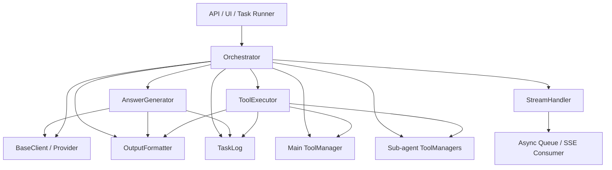
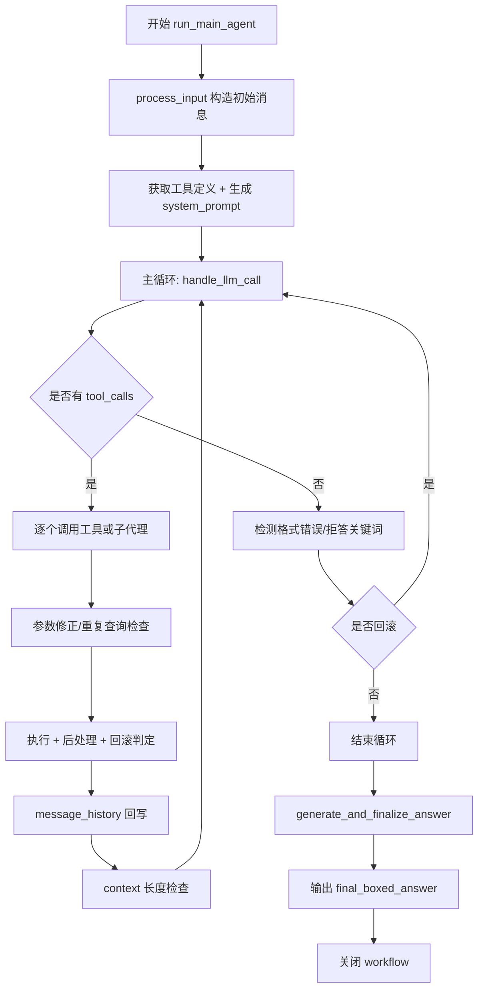
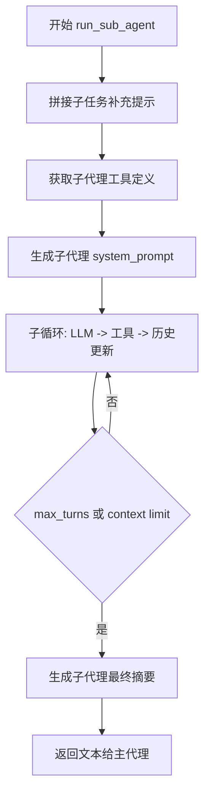
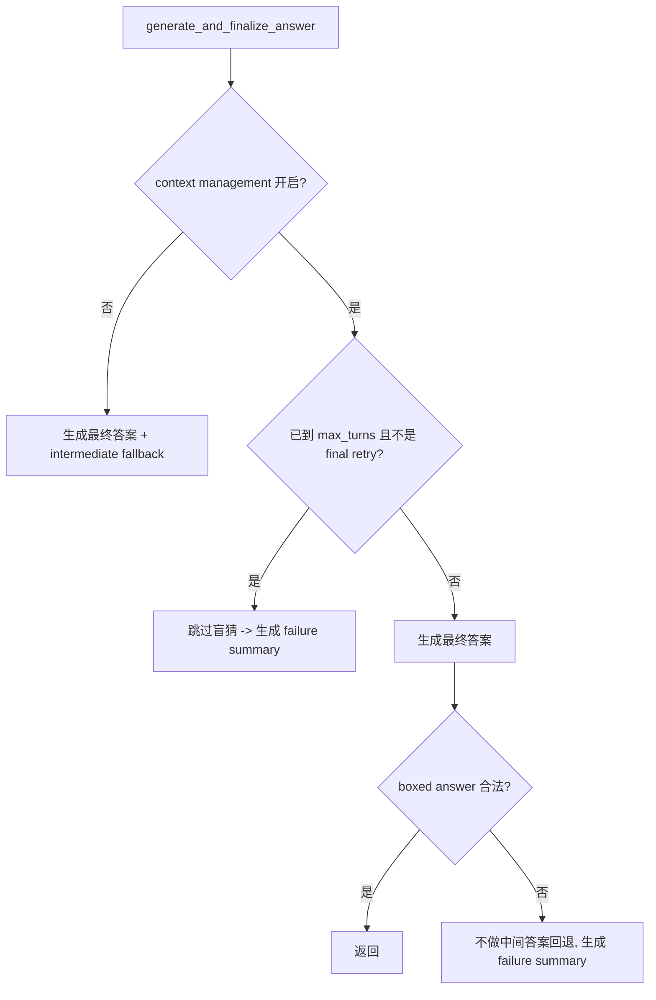
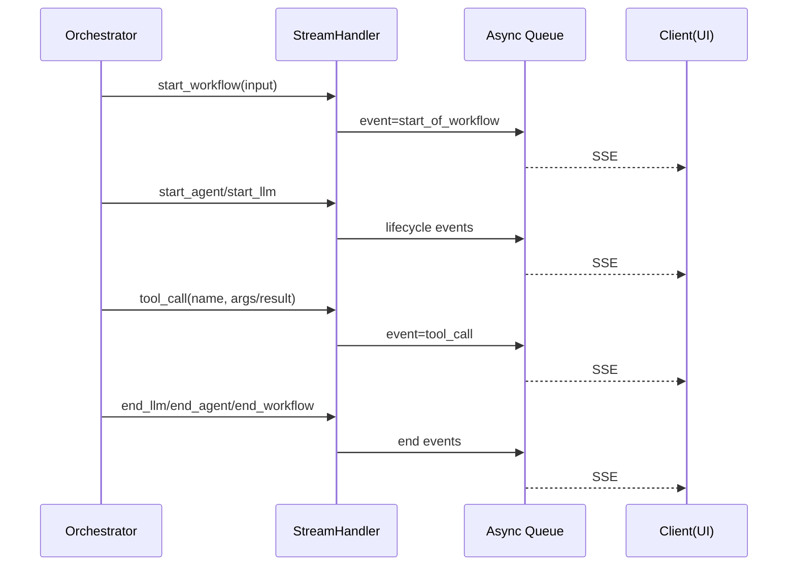
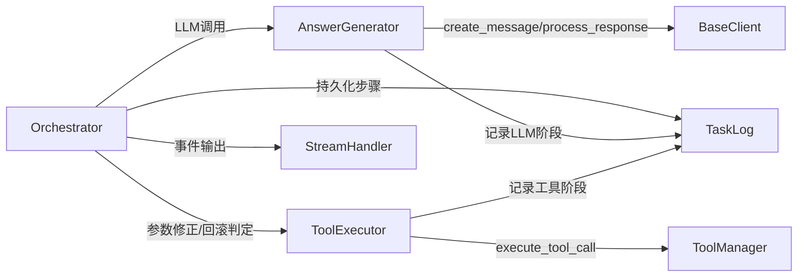

# sub_modules 模块文档

## 模块简介与设计目标

`sub_modules` 是 `miroflow_agent_core` 的执行中枢子模块，聚合了四个运行时核心组件：`Orchestrator`、`AnswerGenerator`、`StreamHandler`、`ToolExecutor`。它的存在并不是为了“多封装一层”，而是为了解决 Agent 系统在真实任务中的核心难点：多轮推理、工具调用不稳定、上下文长度受限、子代理协同、最终答案格式约束，以及失败可恢复性。

在这个模块中，系统把“能跑起来”与“稳定产出正确答案”分开处理。`Orchestrator` 负责流程状态机，`AnswerGenerator` 负责 LLM 调用与收尾策略，`ToolExecutor` 负责工具调用治理，`StreamHandler` 负责运行态可观测事件。四者组合形成一个“可回滚、可重试、可观测”的 Agent 执行引擎。

如果你首次接触该模块，可以把它理解为：**Miroflow Agent 的任务执行 runtime**。它上接 LLM 能力和输入任务，下接工具系统和日志系统，横向覆盖主代理与子代理，最终对答案质量与执行鲁棒性负责。

---

## 模块在系统中的位置

建议结合以下文档阅读，避免重复理解底层定义：

- LLM 抽象与 Provider 行为：[`miroflow_agent_llm_layer.md`](miroflow_agent_llm_layer.md)
- I/O 结果格式化：[`miroflow_agent_io.md`](miroflow_agent_io.md)
- 任务日志与结构化记录：[`miroflow_agent_logging.md`](miroflow_agent_logging.md)
- 工具管理与 MCP 执行协议：[`miroflow_tools_management.md`](miroflow_tools_management.md)
- 统一响应封装（`ResponseBox` / `ErrorBox`）：[`miroflow_agent_shared_utils.md`](miroflow_agent_shared_utils.md)
- Core 总览：[`miroflow_agent_core.md`](miroflow_agent_core.md)



这张图的关键含义是：`sub_modules` 并不承载业务工具本身，也不承载模型 SDK 本身，而是做“执行协调层”。因此它是稳定性治理、可观测性治理和答案收敛策略的集中点。

---
## 与模块树节点的对应关系

为了便于维护者在跨文档阅读时快速定位，本模块在模块树中的定位为：`miroflow_agent_core -> sub_modules`，其核心组件与源码路径映射如下：`orchestrator -> apps.miroflow-agent.src.core.orchestrator.Orchestrator`、`answer_generator -> apps.miroflow-agent.src.core.answer_generator.AnswerGenerator`、`stream_handler -> apps.miroflow-agent.src.core.stream_handler.StreamHandler`、`tool_executor -> apps.miroflow-agent.src.core.tool_executor.ToolExecutor`。

这意味着 `sub_modules.md` 关注的是“运行时协同逻辑”，而不是单个 Provider SDK 细节或单个工具实现细节。前者在本文件展开，后者请分别参考 [`miroflow_agent_llm_layer.md`](miroflow_agent_llm_layer.md) 与 [`miroflow_tools_management.md`](miroflow_tools_management.md)。

---


## 核心执行流程

### 主代理流程（`run_main_agent`）



主循环并非简单 while，而是带回滚机制的受限状态机。它通过 `max_turns + extra buffer` 约束总尝试次数，并通过连续回滚阈值防止“模型错误输出—系统回退—再次错误输出”的死循环。

### 子代理流程（`run_sub_agent`）



当主代理遇到 `server_name` 以 `agent-` 开头的工具调用时，会把该调用视为“委托子代理执行子任务”。这是一种“工具化子代理”的实现方式，避免主循环与子循环模型分离导致状态不一致。

---

## 组件详解

## 1) `Orchestrator`

`Orchestrator` 是该模块的流程总控。它负责初始化依赖、维持会话状态、调度主/子代理、执行回滚策略、触发最终总结，并将全程行为记录到日志与流事件。

### 构造函数与状态

`__init__(main_agent_tool_manager, sub_agent_tool_managers, llm_client, output_formatter, cfg, task_log=None, stream_queue=None, tool_definitions=None, sub_agent_tool_definitions=None)`

核心输入包括工具管理器、LLM 客户端、输出格式器和配置对象。`task_log` 与 `stream_queue` 让该类具备可观测能力；`tool_definitions` 与 `sub_agent_tool_definitions` 支持预取定义，减少运行时额外 IO。

初始化阶段会创建三个子组件：

- `StreamHandler`：封装 SSE 事件发送。
- `ToolExecutor`：封装工具调用后处理与回滚判定。
- `AnswerGenerator`：封装 LLM 调用及最终答案策略。

同时会建立两个关键运行状态：`intermediate_boxed_answers`（中间答案缓存）和 `used_queries`（重复查询计数缓存）。

### 关键方法

`run_main_agent(task_description, task_file_name=None, task_id='default_task', is_final_retry=False)` 是主入口，返回 `(final_summary, final_boxed_answer, failure_experience_summary)`。该方法会在执行中进行输入处理、工具定义拼装、系统提示词生成、主循环推进、工具调用、上下文检查，以及最终答案生成。

`run_sub_agent(sub_agent_name, task_description)` 负责执行特定子代理，返回子任务文本结果。它会补充“请提供详细支持信息”的提示，以提高后续主代理汇总质量。

`_handle_response_format_issues(...)` 在 LLM 未产生 tool calls 时执行异常分支判断。如果响应中包含 MCP 标签或拒答关键词，会尝试回滚本轮并重试；超过连续回滚上限后终止循环。

`_check_duplicate_query(...)` / `_record_query(...)` 形成查询去重闭环。系统会按工具与参数生成 query key，识别重复后优先回滚，从而减少无效查询造成的 token 浪费。

`_save_message_history(system_prompt, message_history)` 用于最终阶段保存主会话历史，支持失败重试或离线问题分析。

### 主要副作用

`Orchestrator` 会持续修改 `message_history`，调用 `task_log.save()` 持久化，向 `stream_queue` 发送运行事件，并更新 `llm_client.last_call_tokens`。这些副作用是预期行为，不应视为“污染状态”。

---

## 2) `AnswerGenerator`

`AnswerGenerator` 负责“如何向 LLM 要答案，如何判断答案有效，如何在失败时安全收敛”。它的重点是结果策略，而非流程编排。

### 构造函数

`__init__(llm_client, output_formatter, task_log, stream_handler, cfg, intermediate_boxed_answers)`

构造时读取两个关键配置：

- `context_compress_limit`：是否启用上下文压缩/失败经验机制。
- `keep_tool_result`：影响最终答案重试次数（`-1` 时允许更多重试）。

### 关键方法

`handle_llm_call(system_prompt, message_history, tool_definitions, step_id, purpose='', agent_type='main')`

这是统一 LLM 调用入口。它调用 `llm_client.create_message(...)`，处理 `ErrorBox/ResponseBox`，再通过客户端抽象方法解析文本与工具调用信息。返回值为 `(assistant_response_text, should_break, tool_calls_info, message_history)`。若发生异常或无响应，会返回空响应并保留原始历史，供上层重试。

`generate_final_answer_with_retries(...)` 会注入总结提示词并进行有限重试，目标是拿到可解析的 boxed answer。若某次输出不符合格式，会弹出最后 assistant 消息再重试，避免历史污染。

`generate_failure_summary(...)` 在任务未完成或答案格式无效时，压缩当前会话为结构化失败经验（失败类型、经过、可复用发现），用于下一次 retry 提升成功率。

`generate_and_finalize_answer(...)` 是最终策略决策点。它根据 `context_compress_limit`、`reached_max_turns`、`is_final_retry` 决定是直接产出答案、使用 fallback，还是跳过猜测直接生成失败经验。



这个机制保证了在可重试模式下系统更偏向“保守正确”，而非“激进猜测”。

---

## 3) `ToolExecutor`

`ToolExecutor` 是工具执行治理层，核心价值是把“模型可能错误调用工具”的不确定性压缩到可控范围。

### 构造函数

`__init__(main_agent_tool_manager, sub_agent_tool_managers, output_formatter, task_log, stream_handler, max_consecutive_rollbacks=5)`

它持有工具管理器、日志与流对象，并维护内部 `used_queries` 计数器。需要注意：`Orchestrator` 也维护了去重状态，当前主流程主要使用 `Orchestrator` 侧计数。

### 关键方法

`fix_tool_call_arguments(tool_name, arguments)`

用于修正常见参数名错误。当前已对 `scrape_and_extract_info` 的 `description/introduction -> info_to_extract` 做映射。新增工具时建议同步补全此规则。

`get_query_str_from_tool_call(tool_name, arguments)`

提取查询唯一键，支持 `search_and_browse`、`google_search`、`sogou_search`、`scrape_website`、`scrape_and_extract_info`。未覆盖工具会返回 `None`，意味着不会进入去重机制。

`post_process_tool_call_result(tool_name, tool_call_result)`

当 `DEMO_MODE=1` 且工具是抓取类（`scrape` / `scrape_website`）时，会把抓取文本截断到 `DEMO_SCRAPE_MAX_LENGTH`，以降低上下文占用。

`should_rollback_result(tool_name, result, tool_result)`

用于判定工具结果是否触发回滚。典型条件包括：未知工具、工具执行错误前缀，以及 `google_search` 返回空 `organic` 列表。

`execute_single_tool_call(...)`

封装单次工具调用，返回 `(tool_result, duration_ms, tool_calls_data)`。即使抛异常也会返回结构化错误，保障上层循环可继续推进。

---

## 4) `StreamHandler`

`StreamHandler` 负责把运行时状态映射为 SSE 风格事件，供 UI 或调用方实时消费。它不参与业务决策，但直接决定前端是否能“看见”系统在做什么。

### 事件接口

`start_workflow/end_workflow` 管理工作流生命周期；`start_agent/end_agent` 与 `start_llm/end_llm` 管理执行节点生命周期；`message` 支持增量文本；`tool_call` 发送工具输入/输出；`show_error` 发送错误并尝试以 `None` 结束流。

`tool_call(tool_name, payload, streaming=False, tool_call_id=None)` 支持两种发送模式：

- 非流式：一次性发送完整 `tool_input`。
- 流式：按键发送 `delta_input`，适合增量展示。



---

## 组件协作关系



协作边界很清晰：`Orchestrator` 决定“下一步做什么”，`AnswerGenerator` 决定“模型输出是否可接受”，`ToolExecutor` 决定“工具结果是否可信”，`StreamHandler` 决定“外部如何观察执行进度”。

---

## 配置与行为说明

典型配置如下：

```yaml
agent:
  main_agent:
    max_turns: 12
  sub_agents:
    agent-research:
      max_turns: 6
  keep_tool_result: -1
  context_compress_limit: 1
```

`main_agent.max_turns` 与 `sub_agents.*.max_turns` 控制探索上限；`keep_tool_result` 影响最终答案重试策略；`context_compress_limit` 控制是否启用“失败经验压缩 + 再尝试”机制。若更强调准确率与保守收敛，建议开启 context management；若更强调“本次调用尽量返回答案”，可关闭并允许中间答案 fallback。

---

## 使用与扩展示例

### 基础调用

```python
orchestrator = Orchestrator(
    main_agent_tool_manager=main_tool_manager,
    sub_agent_tool_managers=sub_tool_managers,
    llm_client=llm_client,
    output_formatter=output_formatter,
    cfg=cfg,
    task_log=task_log,
    stream_queue=stream_queue,
)

final_summary, final_boxed_answer, failure_experience_summary = await orchestrator.run_main_agent(
    task_description="请比较方案A与方案B并给出建议",
    task_id="task-001",
)
```

### 子代理直调（测试场景）

```python
sub_result = await orchestrator.run_sub_agent(
    sub_agent_name="agent-research",
    task_description="收集并整理近一年公开资料",
)
```

### 扩展建议

新增工具时，不应只在 ToolManager 注册，还应同步更新本模块三处策略：

- 参数纠错（`fix_tool_call_arguments`）
- 查询抽取（`get_query_str_from_tool_call`）
- 回滚判定（`should_rollback_result`）

否则会出现“能调用但不稳定”的隐性问题，例如重复查询失效、错误结果不回滚、上下文被无效内容填满。

---

## 关键边界条件与注意事项

1. 连续回滚达到阈值会强制结束循环。这能避免死循环，但也可能让复杂任务提前终止。
2. 重复查询检测依赖工具白名单提取逻辑。未适配的新工具不会自动去重。
3. 无 tool calls 时的格式错误/拒答检测基于关键词启发式，存在误判与漏判风险。
4. 工具调用异常通常会被封装为错误结果继续流程，而不是直接抛出顶层异常；问题定位应以 `TaskLog` 为准。
5. `DEMO_MODE` 截断抓取内容可提升轮数，但可能丢失关键证据，影响最终答案质量。
6. 最终答案强依赖 boxed 格式。语义正确但格式不合法时，仍可能进入失败分支。
7. `stream_queue` 发送失败不会中断主流程，只会 warning；这保证执行韧性，但可能导致前端“静默失联”。
8. 子代理切换时会显式结束/重启主代理流事件，接入侧应按 agent_id 处理 UI 状态，避免展示串线。

---

## 相关文档

- [`miroflow_agent_core.md`](miroflow_agent_core.md)
- [`orchestrator.md`](orchestrator.md)
- [`answer_generator.md`](answer_generator.md)
- [`stream_handler.md`](stream_handler.md)
- [`miroflow_agent_llm_layer.md`](miroflow_agent_llm_layer.md)
- [`miroflow_agent_io.md`](miroflow_agent_io.md)
- [`miroflow_agent_logging.md`](miroflow_agent_logging.md)
- [`miroflow_tools_management.md`](miroflow_tools_management.md)
- [`miroflow_agent_shared_utils.md`](miroflow_agent_shared_utils.md)


## 附录：关键方法行为速查（参数、返回、状态影响）

### `Orchestrator` 方法

`run_main_agent(task_description, task_file_name=None, task_id="default_task", is_final_retry=False)` 是系统主入口。`task_description` 是用户任务原文；`task_file_name` 是可选附件文件名；`task_id` 用于日志关联；`is_final_retry` 用于上下文压缩重试链路中的“最后一次”标记。返回值是 `(final_summary, final_boxed_answer, failure_experience_summary)`。该方法会产生大量副作用：更新 `TaskLog`、推送 SSE 事件、改变 `message_history`、可能触发子代理执行，并在末尾主动 `gc.collect()`。

`run_sub_agent(sub_agent_name, task_description)` 接收子代理名与子任务描述，返回子代理最终文本答案。执行期间会创建子代理会话、记录子会话消息历史、调用对应子工具管理器、并在结束时发送 `end_llm/end_agent`。该方法会主动清理 `<think>...</think>` 片段，避免把推理标签回传给主代理。

`_handle_response_format_issues(...)` 只在“本轮无工具调用”时触发。它检查 MCP 标签污染和拒答关键词，命中后可能回滚（`turn_count -= 1` + 弹出最后 assistant 消息）。达到连续回滚上限后会要求上层中断循环。

`_check_duplicate_query(...)` 与 `_record_query(...)` 组成去重机制。前者判断某工具参数是否已重复调用，必要时触发回滚；后者在成功执行后增加计数。该机制可显著降低 token 浪费，但依赖 `ToolExecutor.get_query_str_from_tool_call` 的工具覆盖范围。

### `AnswerGenerator` 方法

`handle_llm_call(system_prompt, message_history, tool_definitions, step_id, purpose="", agent_type="main")` 是统一调用封装。它会处理 `ResponseBox/ErrorBox`，调用 `BaseClient.process_llm_response` 和 `extract_tool_calls_info`，返回 `(assistant_response_text, should_break, tool_calls_info, message_history)`。异常时不会抛出到上层，而是返回空响应并维持原历史，调用方应按“可重试”路径处理。

`generate_final_answer_with_retries(...)` 用总结提示词驱动最终回答，并按配置进行重试。若 boxed 答案不合规，会回退本轮 assistant 消息再试，避免坏格式污染最终上下文。

`generate_failure_summary(...)` 会把完整会话压缩为“失败经验摘要”，用于后续 retry。其输出不是最终答案，而是下一轮任务的高信息密度上下文。

`generate_and_finalize_answer(...)` 是最终决策器：在 `context_compress_limit > 0` 且到达回合上限时（且非 final retry）会直接跳过盲猜；在非上下文管理模式或 final retry 模式会允许 intermediate boxed answer 作为保底。

### `ToolExecutor` 方法

`fix_tool_call_arguments(tool_name, arguments)` 用于纠正常见参数名错配，目前重点覆盖 `scrape_and_extract_info`。如果你新增工具，建议同时扩展这层映射，否则模型“语义正确但参数名错误”会导致隐藏失败。

`get_query_str_from_tool_call(tool_name, arguments)` 抽取去重键。返回 `None` 代表该工具当前不参与去重。

`post_process_tool_call_result(tool_name, tool_call_result)` 在 `DEMO_MODE=1` 时截断抓取文本，降低上下文负担。生产排障时若发现证据缺失，请先确认是否开启了 demo 截断。

`should_rollback_result(tool_name, result, tool_result)` 用于识别“值得回滚重试”的结果。它偏保守，避免把明显失败结果继续喂给模型。

`execute_single_tool_call(...)` 返回 `(tool_result, duration_ms, tool_calls_data)`。即使异常也返回结构化错误对象，不中断主流程。

### `StreamHandler` 方法

`update(event_type, data)` 是底层统一入口；当 `stream_queue is None` 时会静默降级（不抛错）。

`start_workflow/end_workflow/start_agent/end_agent/start_llm/end_llm` 分别表示工作流、代理、LLM 生命周期事件。

`message(message_id, delta_content)` 发送增量文本；`tool_call(tool_name, payload, streaming=False, tool_call_id=None)` 发送工具输入/输出，支持整包和按字段 delta 两种模式，返回可追踪的 `tool_call_id`。

`show_error(error)` 除发送错误事件外，还会尝试向队列写入 `None` 作为结束信号。消费端应正确处理该终止标记。
