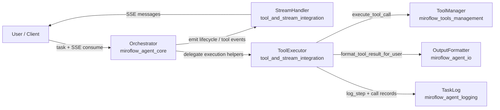
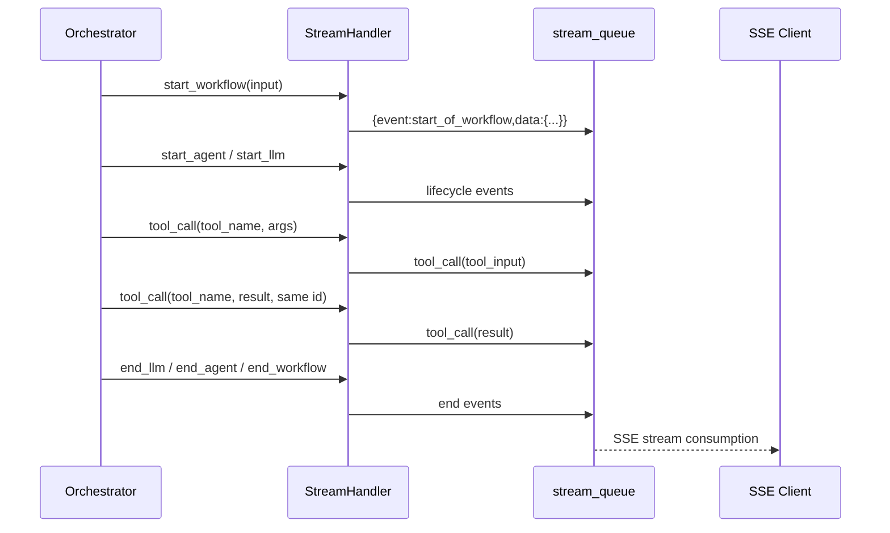
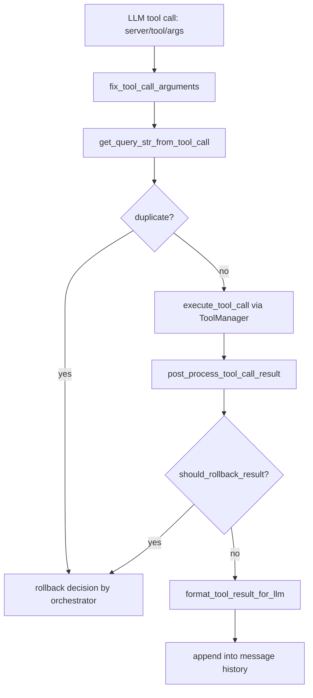
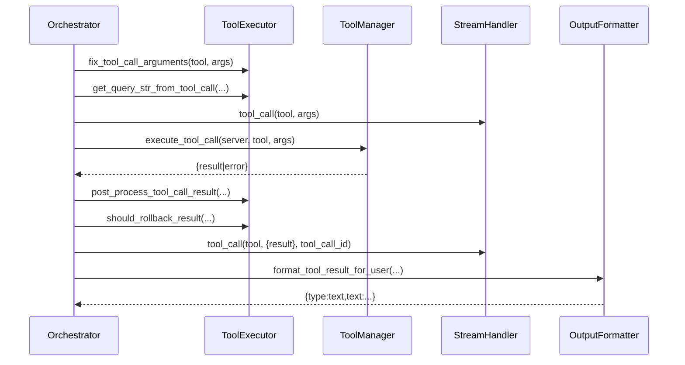

# tool_and_stream_integration 模块文档

## 1. 模块定位与设计目标

`tool_and_stream_integration` 是 `miroflow_agent_core` 内连接“工具执行层”和“实时流式反馈层”的关键子模块，核心由 `StreamHandler` 与 `ToolExecutor` 两个组件组成。它的存在并不是为了实现复杂的推理策略，而是为整个 Agent 运行时提供一个稳定、可观测、可恢复的执行闭环：一端负责把工具调用过程和阶段性结果及时推送给前端（SSE 事件流），另一端负责把 LLM 发出的工具调用请求真正执行、记录、修正并做结果后处理。

从架构职责上看，该模块承担的是**执行编排中的“中间层能力”**。上游的 `Orchestrator` 决定“什么时候调用工具、调用哪个工具”，下游的 `ToolManager` 负责“如何与 MCP/远程工具通信”，而本模块专注于“把这件事执行得更稳、更可用、更可追踪”。这也解释了为什么 `ToolExecutor` 内包含参数修复、重复查询检测、错误触发回滚判定、Demo 模式截断等逻辑：这些逻辑与业务目标强相关，却不应该污染 LLM 调度与工具通信底层本身。

如果你刚接触本系统，可以把本模块理解为：

- `StreamHandler`：面向客户端体验（实时可视化）的事件发射器；
- `ToolExecutor`：面向工具执行稳定性（健壮性与可观测性）的执行器与结果处理器。

---

## 2. 在整体系统中的位置

`tool_and_stream_integration` 与 `orchestration_runtime`、`answer_lifecycle` 紧密协作，其中最核心调用关系来自 `Orchestrator`。`Orchestrator` 在初始化时创建 `StreamHandler` 与 `ToolExecutor`，并在每轮循环中调用它们发送事件、执行工具、判定是否回滚。



这张图体现了一个关键事实：`StreamHandler` 和 `ToolExecutor` 本身并不决定推理逻辑，而是被编排器调用。它们关注的是执行质量与反馈质量，因此是系统可维护性和可观测性的“基础设施层”。

相关模块可参考：

- 编排主流程：[orchestration_runtime.md](orchestration_runtime.md)
- 输出格式策略：[miroflow_agent_io.md](miroflow_agent_io.md)
- 工具管理与 MCP 通信：[miroflow_tools_management.md](miroflow_tools_management.md)
- 结构化日志体系：[miroflow_agent_logging.md](miroflow_agent_logging.md)

---

## 3. 核心组件一：`StreamHandler`

### 3.1 角色与职责

`StreamHandler` 是一个轻量异步事件适配器，用于把内部执行状态转换成 SSE 风格消息（`{"event": ..., "data": ...}`）并推送到 `stream_queue`。它封装了统一事件格式、事件类型命名和一些常见生命周期事件（workflow/agent/llm/tool/message/error）。

它的设计非常“薄”：不做状态机，不做复杂缓存，不抛出上层异常（失败时仅 warning 日志），目的是确保流式输出失败不会阻断主流程。

### 3.2 关键数据结构

每个事件消息遵循统一包装：

```python
{
  "event": "event_type",
  "data": {...}
}
```

其中 `event_type` 由具体方法固定，例如 `start_of_workflow`、`tool_call`、`message` 等。客户端只要按 `event` 分发即可。

### 3.3 方法级说明

#### `__init__(stream_queue: Optional[Any] = None)`

初始化时可传入异步队列对象（通常是 `asyncio.Queue`）。若为 `None`，模块进入“静默模式”：所有事件调用都会直接跳过，不输出流。

#### `update(event_type: str, data: dict)`

基础发送方法。它负责把任意事件封装后 `await stream_queue.put(...)`。如果队列不可用或 put 失败，只记录 warning。

- 输入：`event_type`（事件名），`data`（事件 payload）。
- 副作用：向队列写入消息。
- 失败行为：吞异常，仅日志告警。

#### `start_workflow(user_input: str) -> str` / `end_workflow(workflow_id: str)`

分别发送工作流开始/结束事件。开始时自动生成 UUID 作为 `workflow_id` 并返回，便于后续链路关联。

#### `start_agent(agent_name, display_name=None) -> str` / `end_agent(agent_name, agent_id)`

用于 UI 展示某个 Agent 生命周期。`display_name` 提供展示友好的别名，不影响内部路由。

#### `start_llm(agent_name, display_name=None)` / `end_llm(agent_name)`

用于标记某个 Agent 的 LLM 调用开始与结束，帮助前端实现“正在思考/已完成”状态灯。

#### `message(message_id: str, delta_content: str)`

发送增量文本消息，格式采用 `delta` 容器：

```json
{
  "message_id": "...",
  "delta": {"content": "..."}
}
```

这使客户端能够按 token/chunk 逐步拼接内容。

#### `tool_call(tool_name, payload, streaming=False, tool_call_id=None) -> str`

用于发送工具调用输入或结果。若 `streaming=True`，会把 payload 拆成多个 `delta_input` 事件逐项发送；否则一次发送完整 `tool_input`。

- 未传 `tool_call_id` 时自动生成 UUID；
- 返回值始终是 `tool_call_id`，便于调用方在“开始调用”和“返回结果”之间关联同一条工具链路。

#### `show_error(error: str)`

发送 `show_error`（通过 `tool_call("show_error", {...})` 实现）并尝试向队列写入 `None` 作为流结束信号。该方法体现了约定式语义：客户端若收到 `None`，可主动关闭 SSE 消费循环。

### 3.4 StreamHandler 事件流程图



该流程展示了它在“可视化执行过程”中的作用：即便工具调用很慢，客户端也能持续看到阶段状态，显著提升交互透明度。

### 3.5 行为边界与注意事项

`StreamHandler` 没有内建事件校验，也不保证事件一定投递成功。换句话说，它是“尽力而为”的 IO 通道，不是事务系统。如果上层逻辑需要强一致审计，应依赖 `TaskLog`（持久化日志）而非流式事件。

---

## 4. 核心组件二：`ToolExecutor`

### 4.1 角色与职责

`ToolExecutor` 封装了工具调用相关的“增强逻辑”，包括：参数名修复、查询指纹提取、重复查询检测与记录、结果后处理（Demo 截断）、错误结果回滚判定、单次调用执行与时长统计、结果格式化给 LLM。

这类逻辑抽离后，`Orchestrator` 保持流程可读性，而策略细节在一个地方统一维护。

### 4.2 构造参数与依赖

```python
ToolExecutor(
    main_agent_tool_manager,
    sub_agent_tool_managers,
    output_formatter,
    task_log,
    stream_handler,
    max_consecutive_rollbacks=5,
)
```

其中：

- `ToolManager` 系列对象负责真实工具执行；
- `OutputFormatter` 负责将工具结果整理为可回填 LLM 的消息结构；
- `TaskLog` 提供结构化日志与时间记录；
- `StreamHandler` 用于工具事件流输出（虽然当前 `execute_single_tool_call` 未直接发流，但实例被保留给编排层和扩展点使用）。

### 4.3 内部状态

`used_queries: Dict[str, Dict[str, int]]` 用于重复查询检测。第一层 key 通常是缓存名（如 `main_google_search`），第二层 key 是归一化后的 query 字符串，value 为出现次数。

### 4.4 方法级说明

#### `fix_tool_call_arguments(tool_name, arguments) -> dict`

用于修正 LLM 常见参数命名错误。当前仅对 `scrape_and_extract_info` 生效：若缺少 `info_to_extract`，会尝试把 `description` 或 `introduction` 映射过去。

这是一种“模型容错胶水层”，可以显著减少因 schema 近义词偏差导致的无意义失败。

#### `get_query_str_from_tool_call(tool_name, arguments) -> Optional[str]`

根据工具类型提取用于去重的查询指纹，支持：

- `search_and_browse` -> `subtask`
- `google_search` -> `q`
- `sogou_search` -> `Query`
- `scrape_website` -> `url`
- `scrape_and_extract_info` -> `url + info_to_extract`

不在名单内的工具返回 `None`，表示不参与重复检测。

#### `is_duplicate_query(cache_name, query_str) -> (bool, int)` 与 `record_query(...)`

前者返回是否重复及历史次数，后者增加计数。二者是回滚策略的基础。通常流程是：先查重，成功执行后再 record。

#### `is_google_search_empty_result(tool_name, tool_result) -> bool`

检测 `google_search` 返回中 `organic` 列表是否为空（支持 result 为 JSON 字符串或 dict）。空结果会被视作“低质量搜索词”，可触发重试/回滚。

#### `get_scrape_result(result: str) -> str`

处理抓取文本并做截断。若 `result` 是 JSON 且含 `text` 字段，截断 `text` 后重新序列化；若非 JSON 字符串，则直接按长度截断。最大长度由常量 `DEMO_SCRAPE_MAX_LENGTH=20000` 控制。

#### `post_process_tool_call_result(tool_name, tool_call_result) -> dict`

后处理入口。仅当环境变量 `DEMO_MODE=1` 时，对 `scrape` / `scrape_website` 的 `result` 做截断，以降低上下文占用，支持更长对话回合。

#### `should_rollback_result(tool_name, result, tool_result) -> bool`

统一回滚判定，满足任一条件即返回 `True`：

- 结果以 `Unknown tool:` 开头；
- 结果以 `Error executing tool` 开头；
- 属于 `google_search` 且结果 `organic` 为空。

#### `execute_single_tool_call(...) -> (tool_result, duration_ms, tool_calls_data)`

执行单次工具调用并记录耗时。成功与异常都会产出结构化 `tool_calls_data`，其中包含 `server_name/tool_name/arguments/result|error/duration_ms/call_time`。

异常时不会抛出，而是返回 `{"error": ...}` 结构并写 `TaskLog` error。

#### `format_tool_result_for_llm(tool_result) -> dict`

调用 `OutputFormatter.format_tool_result_for_user`，将工具结果转换为可注入消息历史的 `{type:"text", text:"..."}` 结构。

### 4.5 ToolExecutor 内部处理流程



这条链路体现了该组件的设计哲学：先“防呆”，再执行，后“净化结果”，最后以 LLM 可消费格式回填，从而让后续推理更稳定。

---

## 5. 组件协作细节：与 `Orchestrator` 的关系

虽然 `ToolExecutor` 暴露了 `execute_single_tool_call`，但当前 `Orchestrator` 主流程里多数时候直接调用 `ToolManager.execute_tool_call`，并复用 `ToolExecutor` 的辅助方法（参数修复、后处理、回滚判定、query key 提取）。这意味着本模块既是“可独立复用的执行器”，也是“编排器的策略工具箱”。



从可维护性角度，这种方式便于后续逐步把主流程中的执行片段进一步收敛到 `ToolExecutor`，减少重复代码。

---

## 6. 典型使用方式

### 6.1 初始化示例

```python
stream = StreamHandler(stream_queue=queue)
executor = ToolExecutor(
    main_agent_tool_manager=main_tm,
    sub_agent_tool_managers=sub_tms,
    output_formatter=output_formatter,
    task_log=task_log,
    stream_handler=stream,
    max_consecutive_rollbacks=5,
)
```

在真实系统中通常由 `Orchestrator` 统一初始化，不建议在业务层反复 new。

### 6.2 执行单个工具调用（推荐封装调用）

```python
args = executor.fix_tool_call_arguments(tool_name, raw_args)
query = executor.get_query_str_from_tool_call(tool_name, args)

if query:
    dup, count = executor.is_duplicate_query("main_" + tool_name, query)
    if not dup:
        executor.record_query("main_" + tool_name, query)

tool_result, duration_ms, call_logs = await executor.execute_single_tool_call(
    tool_manager=main_tm,
    server_name=server_name,
    tool_name=tool_name,
    arguments=args,
    agent_name="Main Agent",
    turn_count=3,
)

llm_content = executor.format_tool_result_for_llm(tool_result)
```

这个模式适合你在扩展自定义编排器时重用模块能力。

### 6.3 流式事件发射示例

```python
workflow_id = await stream.start_workflow(user_input)
agent_id = await stream.start_agent("main")
await stream.start_llm("main")

tool_call_id = await stream.tool_call("google_search", {"q": "MiroMind"})
await stream.tool_call("google_search", {"result": "..."}, tool_call_id=tool_call_id)

await stream.end_llm("main")
await stream.end_agent("main", agent_id)
await stream.end_workflow(workflow_id)
```

---

## 7. 配置项与运行时行为

本模块自身配置项不多，主要受外部运行时环境与上层参数驱动：

- `DEMO_MODE=1`：启用抓取结果截断，限制 `scrape/scrape_website` 返回大小；
- `max_consecutive_rollbacks`：由 `ToolExecutor` 持有，但当前回滚主流程由 `Orchestrator` 控制，二者应保持一致策略；
- `stream_queue is None`：禁用流式输出，不影响主执行。

如果你发现“前端没有实时事件但任务还能跑完”，第一排查点通常是 `stream_queue` 是否为空或消费端是否正确读取队列。

---

## 8. 错误处理、边界条件与已知限制

该模块的错误处理策略偏向“不中断主流程”，因此要理解其副作用。

`StreamHandler.update` 失败只会 warning，不会抛异常。这在生产上是合理的（避免 UI 通道故障拖垮推理链路），但代价是你不能依赖流事件做关键审计。审计必须看 `TaskLog`。

`ToolExecutor.fix_tool_call_arguments` 当前只覆盖一个工具的少量参数别名，属于点状补丁，不是通用 schema 对齐器。如果接入新工具，建议同步扩展该方法，否则 LLM 参数轻微偏移仍会造成失败。

重复查询检测依赖字符串拼接，不做归一化语义去重。例如大小写差异、URL 参数顺序变化、空白差异可能绕过去重。若业务对去重敏感，应引入更强规范化策略（如 URL canonicalization 或 query hash）。

`is_google_search_empty_result` 假设返回结构包含 `organic`。若搜索服务响应 schema 变化，该判定可能失效，导致该类“弱错误”不再触发回滚。

Demo 截断只在环境变量开启时生效，且只处理特定工具。若你在非 Demo 场景也遇到上下文爆炸，需要在更上层（如 `OutputFormatter` 或历史压缩策略）做统一治理。

---

## 9. 扩展建议

当你要扩展本模块时，建议遵循“策略集中、接口稳定”的原则。

如果新增工具且需要去重，请在 `get_query_str_from_tool_call` 增加该工具的查询指纹提取规则，并确保主流程在成功调用后 `record_query`。如果新增的是高噪声工具（例如抓取、搜索聚合），通常也应在 `should_rollback_result` 中补充质量判定。

如果需要更细粒度的实时体验，可在 `StreamHandler` 中增加新事件类型，但保持统一 envelope（`event + data`）不变，这样客户端兼容成本最低。

如果你希望把当前 `Orchestrator` 中重复的“执行+回滚+日志”片段彻底收敛，可以优先增强 `execute_single_tool_call`，让其直接产出“是否建议回滚”“格式化后结果”等复合结构，再由编排层消费。

---

## 10. 与其他文档的关系（避免重复）

本文档聚焦在工具执行与流事件集成本身，不展开以下主题的实现细节：

- LLM 调用与回复解析生命周期：见 [answer_lifecycle.md](answer_lifecycle.md)
- 主/子 Agent 全流程编排与回合控制：见 [orchestration_runtime.md](orchestration_runtime.md)
- ToolManager 的 MCP 连接、fallback 和黑名单逻辑：见 [miroflow_tools_management.md](miroflow_tools_management.md)
- 结构化日志字段与落盘机制：见 [miroflow_agent_logging.md](miroflow_agent_logging.md)
- 工具结果如何截断/格式化供 LLM 消费：见 [miroflow_agent_io.md](miroflow_agent_io.md)

通过这些文档组合阅读，你可以完整建立“编排决策 → 工具执行 → 流式反馈 → 日志追踪”的端到端理解。
