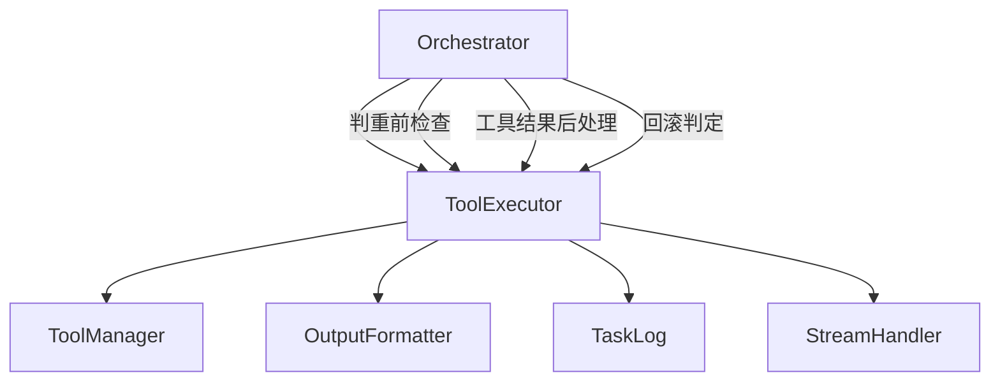
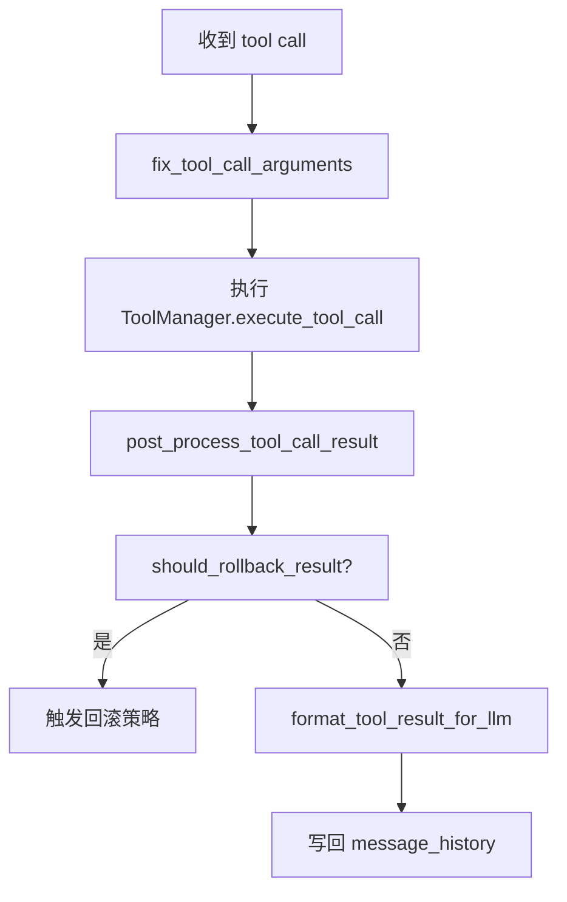
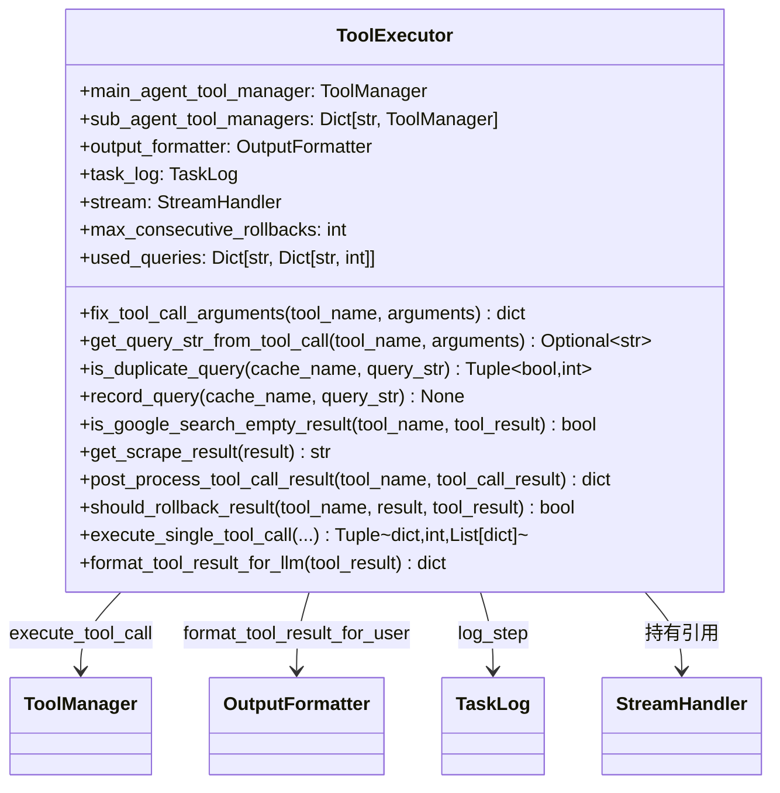
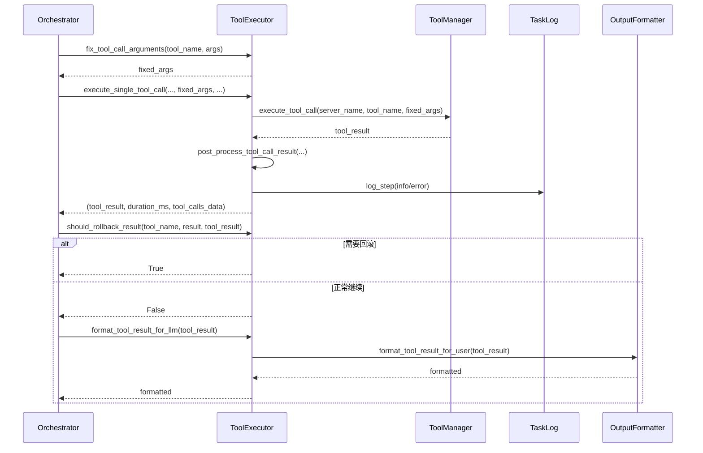
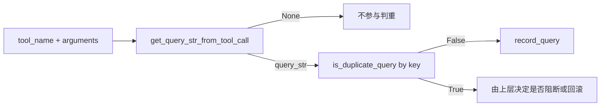
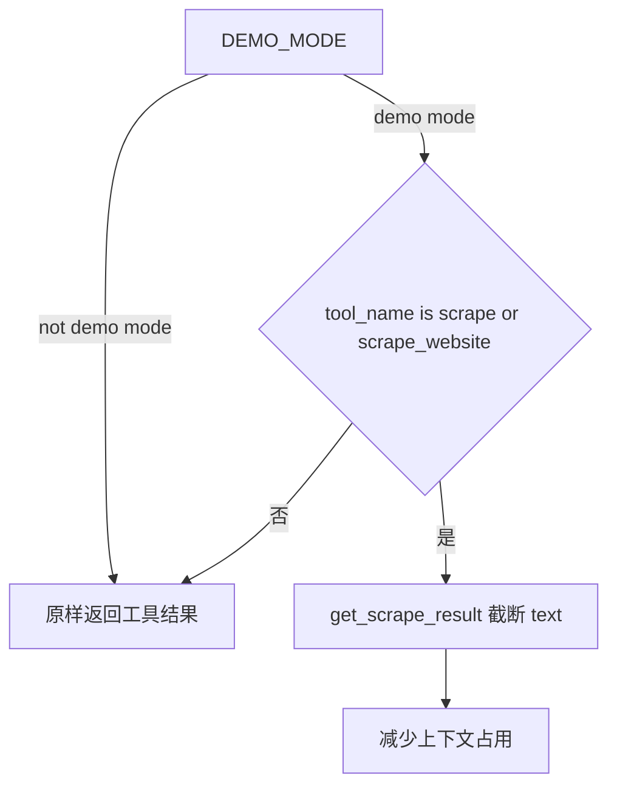

# ToolExecutor 子模块文档

## 模块定位

`ToolExecutor` 是 `miroflow_agent_core` 的“工具执行治理层”。它并不负责主循环调度（那是 `Orchestrator` 的职责），也不直接决定最终答案（那是 `AnswerGenerator` 的职责），而是专注解决 **LLM 调用工具时最常见的质量问题**：参数名错误、重复查询、结果过长、结果质量低、工具错误信号识别等。

在真实任务中，很多失败并不是模型完全不会做，而是工具调用细节不稳定。`ToolExecutor` 的存在就是为了把这些“不稳定细节”转化成可控策略，从而减少无效轮次和上下文污染。

---

## 在系统中的协作关系



`ToolExecutor` 在代码结构上是独立类，但在运行时主要由 `Orchestrator` 调用。主/子代理的每一次工具调用，通常都会经过：参数修复 -> 执行 -> 结果后处理 -> 回滚判定 -> 格式化回灌 LLM。

---

## 核心能力与设计动机

### 1) 参数修复：容错 LLM 的“近似正确输出”

`fix_tool_call_arguments(tool_name, arguments)` 会修正常见参数名错误。例如 `scrape_and_extract_info` 工具期望 `info_to_extract`，但模型可能输出 `description` 或 `introduction`。该方法会自动映射，避免“语义正确但键名错误”导致的失败。

### 2) 查询标准化：为重复检测提供统一键

`get_query_str_from_tool_call(tool_name, arguments)` 会把不同工具的关键字段映射成可比较字符串，比如：

- `google_search` -> `google_search_<q>`
- `sogou_search` -> `sogou_search_<Query>`
- `scrape_website` -> `scrape_website_<url>`
- `scrape_and_extract_info` -> `scrape_and_extract_info_<url>_<info_to_extract>`

这使得上层能检测“模型是否在反复请求同一查询”。

### 3) 结果质量判定：识别“调用成功但结果无效”

`should_rollback_result(tool_name, result, tool_result)` 不只关注异常，还关注低质量结果。例如 `google_search` 返回的 `organic` 为空时，会判定应回滚重试，因为这通常代表查询语句质量差。

### 4) Demo 截断：用上下文换轮次

当 `DEMO_MODE=1` 时，`post_process_tool_call_result(...)` 会截断抓取类结果文本（默认上限 20,000 字符），避免单次抓取占满上下文窗口，提升多轮交互能力。

---

## 关键方法详解

## `fix_tool_call_arguments(tool_name: str, arguments: dict) -> dict`

该方法返回修复后的参数副本，不原地修改入参。当前内建规则集中在抓取类工具，适合放置更多“高频错误映射”。

**参数**
- `tool_name`: 工具名称
- `arguments`: 模型产出的原始参数

**返回值**
- `dict`: 修复后的参数

**副作用**
- 无外部副作用（纯函数风格）

---

## `get_query_str_from_tool_call(tool_name: str, arguments: dict) -> Optional[str]`

提取判重键。若工具不在支持列表中，返回 `None`，表示不参与重复查询检测。

**适用场景**
- 主/子代理调用搜索类或抓取类工具前
- 需要统计某类查询是否被重复执行时

**注意事项**
- 新增工具后若不扩展该方法，判重机制会“静默失效”。

---

## `is_google_search_empty_result(tool_name: str, tool_result: dict) -> bool`

专门识别 `google_search` 的空结果（`organic == []`）。此类结果通常值得回滚，让模型改写 query 再试。

**边界处理**
- 支持 `result` 为 JSON 字符串或字典
- 解析失败时返回 `False`（不误判）

---

## `get_scrape_result(result: str) -> str`

解析抓取结果并按 `DEMO_SCRAPE_MAX_LENGTH` 截断。

**行为细节**
- 若输入是 JSON 且包含 `text` 字段，则仅截断 `text`
- 若输入非 JSON 文本，直接按长度截断

该设计尽量保留结构信息，避免简单截断破坏 JSON 外层结构。

---

## `post_process_tool_call_result(tool_name: str, tool_call_result: dict) -> dict`

工具执行后统一后处理入口。当前主要逻辑是 Demo 模式下处理抓取结果长度。

**条件触发**
- 环境变量 `DEMO_MODE == "1"`
- 工具名属于 `scrape` / `scrape_website`

---

## `should_rollback_result(tool_name: str, result: Any, tool_result: dict) -> bool`

判断当前工具结果是否应触发回滚。当前内置条件：

- `result` 以 `Unknown tool:` 开头
- `result` 以 `Error executing tool` 开头
- `google_search` 返回空 `organic`

这类规则建议持续按业务数据迭代，不应视为“固定且完整”。

---

## `execute_single_tool_call(...) -> Tuple[dict, int, List[dict]]`

封装单次工具执行与日志记录，返回：
1. `tool_result`：执行结果或结构化错误
2. `duration_ms`：耗时
3. `tool_calls_data`：用于写日志的标准结构

**异常策略**
- 捕获异常并返回 `{error: ...}`，而不是抛到上层中断全流程。
- 始终记录耗时和错误，保证可观测性。

---

## `format_tool_result_for_llm(tool_result: dict) -> dict`

把工具结果转换为可回灌模型的统一格式，本质上委托 `OutputFormatter.format_tool_result_for_user`。

**设计意义**
- 把“工具结果如何写回消息历史”的策略集中在格式层，降低 orchestrator 分支复杂度。

---

## 处理流程示意



---

## 使用示例

```python
# 在 orchestrator 中的典型使用方式
arguments = tool_executor.fix_tool_call_arguments(tool_name, arguments)
tool_result = await main_tool_manager.execute_tool_call(
    server_name=server_name,
    tool_name=tool_name,
    arguments=arguments,
)

tool_result = tool_executor.post_process_tool_call_result(tool_name, tool_result)
result = tool_result.get("result") or tool_result.get("error")

if tool_executor.should_rollback_result(tool_name, result, tool_result):
    # 让上层执行 turn rollback
    pass

tool_result_for_llm = tool_executor.format_tool_result_for_llm(tool_result)
```

---

## 错误条件、边界与限制

`ToolExecutor` 已覆盖常见问题，但仍有几个现实限制需要注意。第一，参数修复规则目前是“显式白名单”，不会自动泛化到新工具。第二，判重键提取依赖工具名与字段名约定，若下游工具协议变化，可能出现误判或漏判。第三，`should_rollback_result` 是启发式策略，不一定适用于所有业务域；某些场景下空搜索结果可能是合理结果。第四，Demo 截断策略会减少模型可见证据，可能降低精确度。

因此在扩展时建议：先观测日志数据，再决定是否新增规则；并在新增工具时同步更新参数修复、判重键提取和回滚策略三个入口。

---

## 内部架构拆解：`ToolExecutor` 如何组织职责

从实现上看，`ToolExecutor` 是一个“无外部 I/O 权限的业务策略层”：真正执行工具的是 `ToolManager`，真正定义输出协议的是 `OutputFormatter`，真正把事件推向前端的是 `StreamHandler`（本类当前代码中仅持有引用，实际是否发送由上层编排控制），而它自己负责把这些能力编排成“可回滚、可观测、可恢复”的调用单元。



上图反映出一个关键设计取舍：`ToolExecutor` 不企图吞并所有逻辑，而是将“策略”和“能力”分开。这样做的好处是扩展性更高，例如你可以在不改 `ToolManager` 的前提下新增回滚规则，也可以在不改 `ToolExecutor` 的前提下替换输出格式器。

## 端到端时序：一次工具调用的完整生命周期

`execute_single_tool_call` 是运行时最核心的方法，但它通常不单独使用，而是和参数修复、回滚判定、格式化回灌串成流水线。下面是更贴近真实 orchestrator 调用的时序。



这个时序里最容易被忽略的一点是：`ToolExecutor` 通过“结构化返回值 + 错误不抛出”来保证主循环可持续。也就是说，即便工具失败，系统仍然能进入下一步决策（例如让模型换工具、换查询、或结束任务），而不是因为异常直接崩溃。

## 状态与缓存：重复查询检测的行为边界

`used_queries` 的结构是 `Dict[str, Dict[str, int]]`。第一层 key 是缓存命名空间（例如主代理和子代理可分开），第二层 key 是 query string，value 是命中次数。这是一种非常轻量但高效的会话态缓存。



需要注意两个限制。第一，判重是**内存态**的，进程重启后会丢失；第二，判重键构造是硬编码规则，不是 schema 驱动。如果新增工具但没更新 `get_query_str_from_tool_call`，该工具不会被检测为重复。

## 配置项与运行开关

这个模块的显式配置项不多，但每个都直接影响行为：

- 构造参数 `max_consecutive_rollbacks`：用于约束连续回滚上限。当前代码片段中该值被保存但未在本类内部消费，通常由上层编排器读取并执行业务策略。
- 环境变量 `DEMO_MODE`：仅当值为字符串 `"1"` 时启用抓取结果截断。
- 常量 `DEMO_SCRAPE_MAX_LENGTH = 20_000`：Demo 模式下抓取文本最大长度。



该策略的本质是“吞吐优先”。在演示场景中，它可以显著减少 token 消耗并提高多轮稳定性，但代价是模型可见证据变少。生产模式通常应关闭此开关，或根据业务定义更精细的摘要/切片策略。

## 错误模型与回滚触发条件

当前 `should_rollback_result` 采用启发式规则，不是统一异常类型体系。它把三种信号视为“应重试或应回滚”：未知工具、执行报错前缀、Google 空 organic 结果。这种写法非常实用，但也意味着你需要根据业务数据持续维护关键字规则。

更具体地说，`execute_single_tool_call` 和 `should_rollback_result` 分别解决两个不同层级的问题。前者解决“调用有没有炸掉”（transport/执行层），后者解决“结果值不值得继续用”（语义质量层）。这两层分离是本模块设计中最值得保留的部分。

## 扩展指南：新增工具或新增策略时应改哪些地方

当你接入新工具（例如 `bing_search` 或 `scrape_pdf`）时，建议按下面顺序扩展，而不是只改一处：

1. 在 `fix_tool_call_arguments` 增加该工具常见参数别名映射，减少 LLM 轻微拼写/命名偏差带来的失败。
2. 在 `get_query_str_from_tool_call` 补充判重键提取规则，避免同一查询在多轮里反复执行。
3. 在 `should_rollback_result` 增加该工具的质量判定逻辑（如空结果、无正文、被反爬拦截提示等）。
4. 如果新工具可能返回超大文本，考虑在 `post_process_tool_call_result` 中按环境开关做可控截断或摘要。

下面给出一个最小扩展示例（示意代码）：

```python
# 示例：为 bing_search 增加判重 + 空结果回滚

def get_query_str_from_tool_call(self, tool_name: str, arguments: dict) -> Optional[str]:
    if tool_name == "bing_search":
        return tool_name + "_" + arguments.get("q", "")
    ...

def should_rollback_result(self, tool_name: str, result: Any, tool_result: dict) -> bool:
    if tool_name == "bing_search":
        data = tool_result.get("result") or {}
        if isinstance(data, str):
            try:
                data = json.loads(data)
            except Exception:
                data = {}
        if not data.get("webPages", {}).get("value"):
            return True
    return super_logic
```

## 与其他模块的边界说明（避免重复阅读）

为了避免文档重复，这里只说明边界，不复述实现细节：`ToolExecutor` 如何被多轮调度、如何应用回滚上限，请参考 [orchestrator.md](orchestrator.md)；工具结果如何转成最终自然语言答案，请参考 [answer_generator.md](answer_generator.md)；输出结构的字段细节请参考 [output_formatter.md](output_formatter.md)；工具发现、MCP server 路由和底层执行协议请参考 [tool_manager.md](tool_manager.md) 与 [miroflow_tools_management.md](miroflow_tools_management.md)。

## 运维与排障建议

在排查“模型一直搜不到结果”或“反复调用同一工具”时，优先检查 `tool_calls_data` 和 `TaskLog`。如果你看到调用层成功但频繁触发回滚，通常是查询质量问题或回滚规则过严；如果调用层本身报错，则应先看 `server_name/tool_name/arguments` 是否匹配工具注册信息。

一个常见误区是把所有失败都归因于 LLM。实际上这个模块已经提供了参数纠错、空结果识别、长度治理三层兜底；当失败仍然高发时，更可能是工具协议漂移（字段改名、返回结构变化）或外部站点行为变化（反爬、限流、地区差异）。

---

## 相关文档

- 总览：[`miroflow_agent_core.md`](miroflow_agent_core.md)
- 主编排：[`orchestrator.md`](orchestrator.md)
- 答案策略：[`answer_generator.md`](answer_generator.md)
- 流式协议：[`stream_handler.md`](stream_handler.md)
- 工具管理实现：[`miroflow_tools_management.md`](miroflow_tools_management.md)
