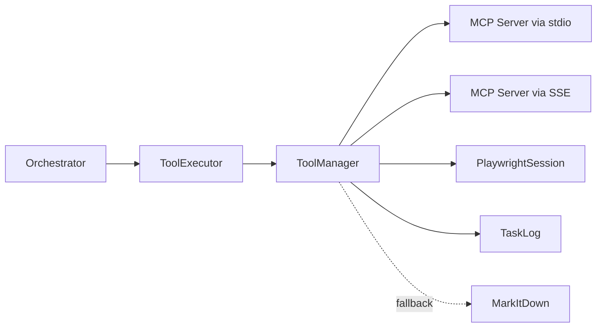
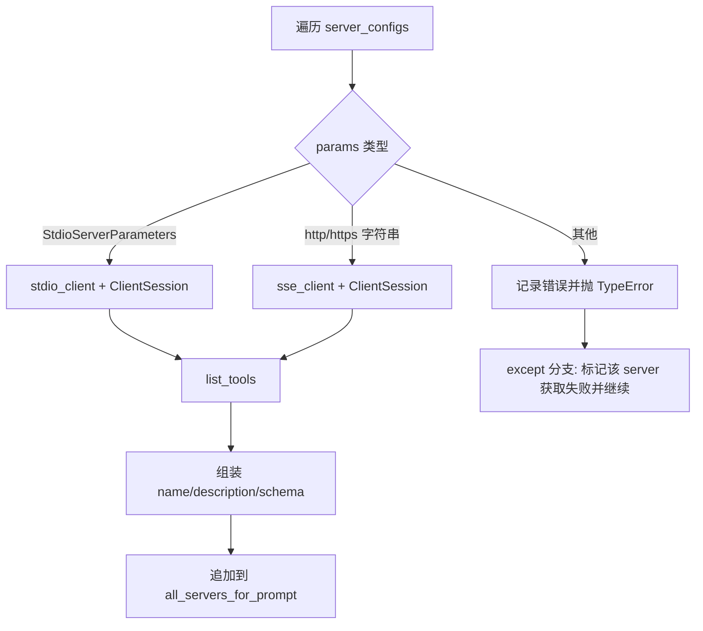
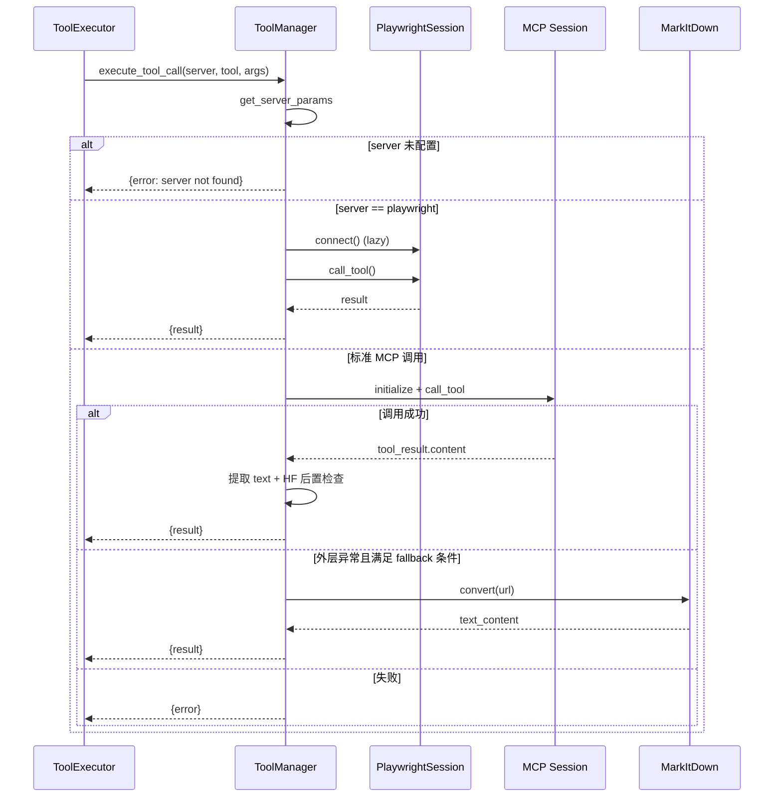

# tool_manager 模块文档

## 模块简介与设计动机

`tool_manager` 是 `miroflow_tools_management` 中连接 Agent 与外部 MCP 工具生态的执行中枢。它解决的核心问题是：上层智能体（如 `ToolExecutor`）不应关心某个工具到底是通过本地 `stdio` 启动，还是通过远端 `SSE` 暴露；它只需要“发现工具定义”和“执行一次工具调用”这两个稳定能力。`ToolManager` 正是为此提供统一抽象。

从系统职责看，这个模块位于“推理决策”与“外部能力调用”之间。上游由 LLM 推理链路决定调用哪个工具，下游则由 MCP 协议与具体服务完成执行。模块通过协议化接口（`ToolManagerProtocol`）、统一返回结构、可选结构化日志、超时保护以及有限的安全兜底，尽量把外部工具的不稳定性隔离在边界层内。

如果你第一次接触该模块，可以把它理解成：

- 一个支持多传输层（`StdioServerParameters` / HTTP SSE URL）的 MCP 客户端调度器；
- 一个工具目录聚合器（把多个 server 的 tool schema 汇总给 prompt 层）；
- 一个带有“特例策略”的执行器（Playwright 持久会话、Hugging Face 抓取提示、MarkItDown fallback）。

---

## 在整体系统中的位置

`tool_manager` 本身不做任务规划，也不生成最终答案，它服务于 Agent 核心流程。建议结合以下文档阅读：

- 与工具执行编排关系：[`tool_executor.md`](tool_executor.md)
- 与主流程协调关系：[`orchestrator.md`](orchestrator.md)
- 与日志模型关系：[`miroflow_agent_logging.md`](miroflow_agent_logging.md)
- Playwright 持久会话细节：[`browser_session.md`](browser_session.md)
- 上层模块概览：[`miroflow_tools_management.md`](miroflow_tools_management.md)

### 架构关系图



这个关系里，`ToolExecutor` 是直接调用方，`ToolManager` 是“协议适配 + 错误边界 + 策略控制”层；日志通过 `TaskLog.log_step` 上报；当某些网页抓取异常触发特定条件时，才会进入 MarkItDown 回退路径。

---

## 核心组件详解

## 1. `with_timeout(timeout_s=300.0)`

`with_timeout` 是一个异步装饰器工厂，本质上把目标协程包装进 `asyncio.wait_for`。模块内它用于 `execute_tool_call`，设置为 `@with_timeout(1200)`，也就是单次工具调用最大 20 分钟。

其行为非常直接：超时会抛出 `asyncio.TimeoutError`，异常不会在装饰器内吞掉，而是向上传递给调用方。由于超时包裹的是整个 `execute_tool_call`，所以它覆盖：连接建立、工具调用、以及可能的 fallback 分支。

```python
@with_timeout(1200)
async def execute_tool_call(...):
    ...
```

设计价值在于避免“外部工具卡死”拖垮回合推进，但也意味着长任务工具必须在 20 分钟内完成，或由上层做拆分调用。

---

## 2. `ToolManagerProtocol`

`ToolManagerProtocol` 定义了最小能力契约：

- `get_all_tool_definitions()`：拉取所有 server 可用工具定义
- `execute_tool_call(server_name, tool_name, arguments)`：执行一次工具调用

这个协议的意义在于支持替换实现。只要新实现遵守该接口，`ToolExecutor` 层就不需要修改。对于测试场景，你可以注入一个 mock manager；对于生产场景，你也可以实现带缓存、带重试、带熔断的新版本。

---

## 3. `ToolManager`

`ToolManager` 是默认实现，包含配置管理、工具发现、调用执行、特例策略和日志输出。

### 3.1 初始化与内部状态

```python
def __init__(self, server_configs, tool_blacklist=None):
    self.server_configs = server_configs
    self.server_dict = {config["name"]: config["params"] for config in server_configs}
    self.browser_session = None
    self.tool_blacklist = tool_blacklist if tool_blacklist else set()
    self.task_log = None
```

关键状态说明：

- `server_configs`：原始配置列表，供遍历拉取工具定义。
- `server_dict`：按 `name -> params` 建索引，供执行期快速定位。
- `browser_session`：Playwright 专用持久连接对象，懒初始化。
- `tool_blacklist`：黑名单集合，元素格式 `(server_name, tool_name)`。
- `task_log`：可选日志句柄，未设置时 `_log` 静默跳过。

### 3.2 日志注入：`set_task_log` 与 `_log`

`set_task_log(task_log)` 会绑定 `TaskLog` 对象，并立即记录初始化日志；`_log` 是统一辅助函数，只有 `task_log` 存在时才调用 `task_log.log_step(...)`。这使得模块在无日志环境下也可独立运行。

---

### 3.3 安全相关辅助方法

#### `_is_huggingface_dataset_or_space_url(url)`

通过子串匹配识别 URL 是否指向：

- `huggingface.co/datasets`
- `huggingface.co/spaces`

#### `_should_block_hf_scraping(tool_name, arguments)`

当 `tool_name` 属于 `scrape` / `scrape_website` 且 URL 命中上述路径时返回 `True`。需要注意这里是“结果后置处理”，不是调用前硬拦截。

---

### 3.4 获取 server 参数：`get_server_params(server_name)`

通过 `server_dict` 直接查表。不存在时返回 `None`，并在执行调用时转换成标准错误结构返回。

---

### 3.5 工具发现：`get_all_tool_definitions()`

该方法会遍历所有 server 配置，分别建立连接并调用 `session.list_tools()`，产出给 prompt 层使用的工具目录。

返回结构示例：

```python
[
  {
    "name": "tool-google-search",
    "tools": [
      {
        "name": "google_search",
        "description": "...",
        "schema": {...}
      }
    ]
  }
]
```

#### 数据流图



实现细节里有两个重要点：

第一，`stdio` 分支会应用 `tool_blacklist` 过滤；SSE 分支当前未应用黑名单过滤。这意味着同样在黑名单中的工具，如果来自 SSE server，仍会出现在工具定义结果里。

第二，单个 server 失败不会中断整体流程。异常会被捕获，并将该 server 的 `tools` 设置为 `[{"error": ...}]` 后继续处理其他 server。这对系统可用性友好，但上游在消费工具目录时要兼容这种“错误条目”。

---

### 3.6 工具执行：`execute_tool_call(server_name, tool_name, arguments)`

这是模块最核心的方法，受 1200 秒超时保护。其返回是统一字典：

- 成功：`{"server_name", "tool_name", "result"}`
- 失败：`{"server_name", "tool_name", "error"}`

#### 执行时序图



#### 内部执行逻辑拆解

执行分三层判断：

1. **server 是否存在**：不存在直接返回错误，不抛异常。
2. **是否 `playwright` 特例**：走持久 `PlaywrightSession`，避免每次新建会话。
3. **普通 server 调用**：根据参数类型走 stdio 或 SSE 短连接调用流程。

对于普通分支，`session.call_tool` 的返回内容会被抽取为文本：

```python
result_content = tool_result.content[-1].text if tool_result.content else ""
```

随后才执行 Hugging Face 抓取后置检查：如果命中条件，用固定提示语覆盖 `result_content`。也就是说远端抓取动作本身已经发生，只是返回给上游时改写了内容。

#### fallback 触发条件（非常关键）

MarkItDown fallback 不是普适重试，只在以下条件全部满足时触发：

- `tool_name` 是 `scrape` 或 `scrape_website`
- 外层异常信息包含字符串 `"unhandled errors"`
- `arguments` 含非空 `url`

满足后执行：

```python
from markitdown import MarkItDown
md = MarkItDown(docintel_endpoint="<document_intelligence_endpoint>")
result = md.convert(arguments["url"])
```

若 fallback 成功，返回 `result.text_content`；若失败，则回到常规错误返回。

---

## 配置与使用指南

### 基础初始化

```python
from mcp import StdioServerParameters
from miroflow_tools.manager import ToolManager

server_configs = [
    {
        "name": "playwright",
        "params": StdioServerParameters(command="npx", args=["@playwright/mcp"]) 
    },
    {
        "name": "tool-google-search",
        "params": "https://example.com/mcp/sse"
    }
]

tool_blacklist = {
    ("tool-google-search", "debug_tool")
}

manager = ToolManager(server_configs, tool_blacklist=tool_blacklist)
```

### 注入任务日志

```python
from apps.miroflow-agent.src.logging.task_logger import TaskLog

task_log = TaskLog(task_id="demo")
manager.set_task_log(task_log)
```

### 拉取工具定义

```python
tool_catalog = await manager.get_all_tool_definitions()
```

这个结果通常会被上层 prompt 组装器消费，用于让 LLM 知道可调用工具及其 schema。

### 执行工具

```python
result = await manager.execute_tool_call(
    server_name="tool-google-search",
    tool_name="google_search",
    arguments={"q": "MCP protocol"}
)

if "error" in result:
    ...
else:
    text = result["result"]
```

---

## 与 `ToolExecutor` 的协作语义

在主系统里，`ToolExecutor` 负责“何时调用、参数纠错、去重、回滚策略、结果后处理”，`ToolManager` 负责“如何连接并调用”。这是一种明确分层：

- `ToolExecutor` 更偏业务控制平面（例如检测重复 query、demo 截断）。
- `ToolManager` 更偏工具基础设施平面（协议适配、连接、返回标准化）。

因此扩展时建议保持该边界：不要把回合策略塞进 `ToolManager`，也不要把传输细节泄漏给 `ToolExecutor`。

---

## 可扩展性与二次开发建议

如果你要扩展该模块，优先考虑通过实现 `ToolManagerProtocol` 创建新实现，而不是直接在当前类中堆积条件分支。典型扩展方向包括：

- 对 SSE 分支补齐黑名单过滤，与 stdio 行为对齐。
- 增加连接池/会话复用，降低高频调用下连接开销。
- 对 `execute_tool_call` 增加可配置重试策略（按异常类型重试）。
- 将 MarkItDown 的 `docintel_endpoint` 外部配置化。
- 提供统一 `close()` 生命周期，显式关闭 `browser_session`。

协议实现示例：

```python
class CachedToolManager:
    async def get_all_tool_definitions(self):
        ...

    async def execute_tool_call(self, *, server_name, tool_name, arguments):
        ...
```

---

## 边界条件、错误场景与已知限制

该模块在工程上可用，但有一些非常值得提前知晓的行为细节。

第一，黑名单并非全链路生效。当前仅在 `get_all_tool_definitions` 的 `stdio` 分支过滤，SSE 分支不滤，`execute_tool_call` 阶段也不做黑名单强制拦截。这意味着“被隐藏但仍可调用”在某些路径上可能发生。

第二，Hugging Face 抓取保护属于“后置覆盖返回值”，不是“前置禁止执行”。如果你有严格合规要求，应在调用前增加硬拦截。

第三，fallback 条件较脆弱，依赖异常字符串包含 `"unhandled errors"`。只要底层报错文案变化，就可能导致 fallback 永不触发。

第四，返回文本提取策略在不同路径不一致：普通分支取 `content[-1].text`，而 `PlaywrightSession` 内部示例实现常取 `content[0].text`。当工具返回多段内容时，可能出现语义差异。

第五，`browser_session` 是懒加载持久对象，但 `ToolManager` 本身没有公开 `close()` 来释放它。长生命周期进程需要自行管理资源，避免会话泄漏。

第六，`execute_tool_call` 有总超时保护，但没有内建重试、退避和熔断。若外部工具波动明显，建议在上层调用处增加重试策略。

---

## 运维与调试建议

在生产环境中，建议至少做三件事。第一，始终注入 `TaskLog`，这样可以通过步骤日志快速定位是“连接失败”“工具执行失败”还是“fallback 失败”。第二，把 server 配置做启动时健康检查，提前发现不可达服务。第三，对关键工具调用记录参数快照并做脱敏，以便复现问题同时避免泄露敏感信息。

如果你正在排查“LLM 明明选了工具但结果异常”，优先按以下顺序检查：server 配置是否命中、工具名是否正确、参数 schema 是否匹配、是否触发了 HF 覆盖逻辑、是否进入了 fallback 分支。

---

## 总结

`tool_manager` 的核心价值是把多种 MCP 连接方式和工具调用细节折叠成统一接口，使上层 Agent 可以稳定地“看见工具并调用工具”。它的实现已经覆盖了常见工程需求（日志、超时、部分安全策略、异常兜底），但在黑名单一致性、资源生命周期和 fallback 鲁棒性方面仍有改进空间。对于维护者来说，最重要的是守住其“边界层”定位：保持接口稳定、错误语义清晰、策略行为可预测。