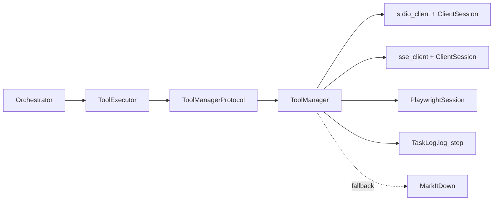
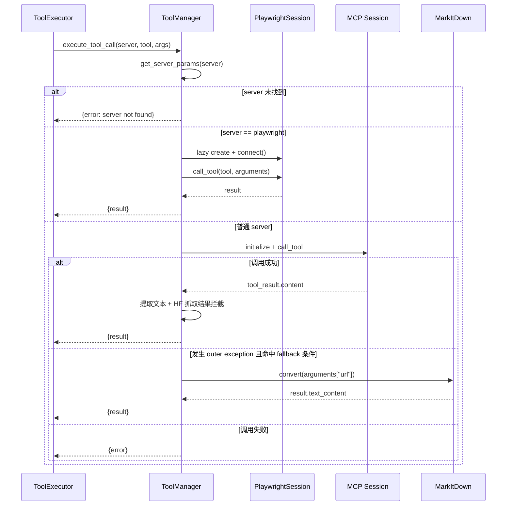
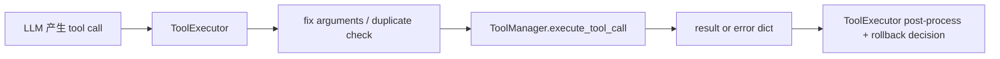

# tool_manager_core 模块文档

## 模块定位与设计动机

`tool_manager_core` 对应 `libs/miroflow-tools/src/miroflow_tools/manager.py`，核心目标是把“工具调用基础设施”从 Agent 推理主流程中剥离出来，形成统一的 MCP（Model Context Protocol）工具接入层。它存在的价值不在于实现某个具体工具能力，而在于统一处理多种工具服务接入方式（`stdio` 与 `SSE`）、工具元数据发现、调用执行、异常封装、超时控制、基础治理策略与日志打点。

在 MiroFlow 架构里，上层 `ToolExecutor` 关心的是“调用哪个 server 的哪个 tool，以及参数是什么”；而 `ToolManager` 负责把这些高层意图翻译为真实 MCP 会话操作，并把结果规范成可被上游消费的稳定字典结构。这个分层让推理策略层和工具连接层解耦：即使未来替换协议、接入新的后端或改变连接策略，也可以尽量不影响 `miroflow_agent_core` 的主逻辑。

如果你是第一次阅读该模块，可以把它理解为：一个**面向 Agent 的工具网关**。它向上暴露很小的接口（发现工具、调用工具），向下隐藏传输细节与容错路径。

---

## 在系统中的位置与依赖关系

`tool_manager_core` 是 `miroflow_tools_management` 的核心子模块，直接服务于 `miroflow_agent_core`。建议先阅读本文件，再结合以下文档获取全貌：

- 调用方策略层：[`tool_executor.md`](tool_executor.md)
- Playwright 持久会话实现：[`browser_session.md`](browser_session.md)
- 日志模型与结构化步骤：[`miroflow_agent_logging.md`](miroflow_agent_logging.md)
- 管理模块总览：[`miroflow_tools_management.md`](miroflow_tools_management.md)

### 架构图（模块级）



这张图表达的是职责边界：`ToolExecutor` 面向协议接口调用，`ToolManager` 负责协议适配与执行细节。`PlaywrightSession` 是特化路径，`TaskLog` 是可选注入的观测能力，`MarkItDown` 是特定错误场景下的降级分支。

---

## 核心组件详解

## 1. `with_timeout(timeout_s: float = 300.0)`

`with_timeout` 是一个异步装饰器工厂，用 `asyncio.wait_for` 包裹任意 async 函数。模块内将其应用在 `execute_tool_call` 上，并设置为 `1200` 秒。

```python
@with_timeout(1200)
async def execute_tool_call(...):
    ...
```

### 工作机制

装饰后的函数调用会被强制限制在 `timeout_s` 内；超时时 `asyncio.wait_for` 会抛 `asyncio.TimeoutError`。该装饰器本身不吞异常，也不转译错误结构，因此超时异常会向调用方传播。

### 参数与返回

- 参数：`timeout_s`，浮点秒数。
- 返回：一个装饰器，接收并返回同签名 async 函数。

### 行为注意点

- 超时边界覆盖整个函数生命周期（包含内部 fallback 分支）。
- 在当前代码里，`execute_tool_call` 内部并未显式捕获 `TimeoutError`，所以调用方（如 `ToolExecutor.execute_single_tool_call`）需要兜底处理异常。

---

## 2. `ToolManagerProtocol`

`ToolManagerProtocol` 提供了最小能力契约，使上层可“面向接口编程”。协议定义如下：

- `get_all_tool_definitions() -> Any`
- `execute_tool_call(*, server_name: str, tool_name: str, arguments: dict[str, Any]) -> Any`

### 设计意义

这个协议让 `ToolExecutor` 不必绑死在某个具体实现上。你可以替换成：

- 带缓存和重试的实现；
- 只允许白名单工具的安全实现；
- 非 MCP 协议实现（只要接口兼容）。

从可测试性角度看，也可以在单元测试注入一个 fake manager，避免真实网络与外部服务依赖。

---

## 3. `ToolManager`

`ToolManager` 是协议默认实现，也是本模块最关键的类。其职责包括：服务配置索引、工具定义拉取、工具调用执行、特例会话管理、日志记录与少量策略控制。

### 3.1 构造函数与内部状态

```python
def __init__(self, server_configs, tool_blacklist=None):
    self.server_configs = server_configs
    self.server_dict = {config["name"]: config["params"] for config in server_configs}
    self.browser_session = None
    self.tool_blacklist = tool_blacklist if tool_blacklist else set()
    self.task_log = None
```

#### 参数说明

- `server_configs`：server 配置列表，元素通常形如：
  - `{"name": "xxx", "params": StdioServerParameters(...)}`，或
  - `{"name": "xxx", "params": "https://..."}`（SSE endpoint）。
- `tool_blacklist`：可选集合，元素是 `(server_name, tool_name)` 元组。

#### 状态说明

- `server_dict` 用于 O(1) 查询 server 参数。
- `browser_session` 仅在 `server_name == "playwright"` 时懒初始化。
- `task_log` 默认为 `None`，可按需注入。

---

### 3.2 `set_task_log(task_log)` 与 `_log(...)`

`set_task_log` 用于注入结构化日志对象（通常是 `TaskLog`），并记录初始化信息。`_log` 是内部日志代理：只有 `task_log` 存在时才实际写日志。

#### 参数与行为

- `set_task_log(task_log)`：无返回值，设置实例字段并输出一条初始化日志。
- `_log(level, step_name, message, metadata=None)`：无返回值，调用 `task_log.log_step(...)`。

#### 副作用

- 有 `task_log` 时会产生步骤日志，进入统一任务日志流水；
- 无 `task_log` 时完全静默，不影响主流程。

---

### 3.3 安全辅助方法

#### `_is_huggingface_dataset_or_space_url(url)`

基于简单子串匹配判断 URL 是否指向 Hugging Face datasets 或 spaces。

- 输入：`url`（可空）
- 输出：`bool`

#### `_should_block_hf_scraping(tool_name, arguments)`

判断是否应对抓取请求做“结果拦截”：

- `tool_name` 在 `['scrape', 'scrape_website']`
- 参数中存在 `url`
- URL 命中 HF datasets/spaces

命中后并不会阻止实际调用，而是在结果阶段覆盖输出文本提示。

---

### 3.4 `get_server_params(server_name)`

通过 `server_dict` 获取 server 参数。

- 输入：`server_name: str`
- 输出：server 参数对象（`StdioServerParameters` 或 URL 字符串），找不到返回 `None`

该方法本身不抛错；错误转译在 `execute_tool_call` 中完成。

---

### 3.5 `get_all_tool_definitions()`

该方法连接所有配置 server，调用 `list_tools()`，并返回可供上层 prompt/规划层使用的统一工具定义结构。

#### 返回结构

```json
[
  {
    "name": "server_name",
    "tools": [
      {"name": "tool", "description": "...", "schema": {...}}
    ]
  }
]
```

#### 处理流程图

```mermaid
flowchart TD
    A[for config in server_configs] --> B{params 类型}
    B -->|StdioServerParameters| C[stdio_client + ClientSession]
    B -->|http/https 字符串| D[sse_client + ClientSession]
    B -->|其他| E[TypeError]

    C --> F[session.initialize]
    D --> F
    F --> G[list_tools]
    G --> H[映射为 name/description/schema]
    H --> I[加入 one_server_for_prompt]
    I --> J[append 到 all_servers_for_prompt]

    E --> X[except: tools=[{"error":...}]]
    X --> J
```

#### 关键实现特征

`ToolManager` 在此方法里强调“部分可用性”：单个 server 失败不会中断总流程。异常会被捕获并转成错误占位项，因此上游永远拿到完整 server 列表（成功或失败状态均可见）。

另外，黑名单过滤只出现在 `stdio` 分支；SSE 分支当前没有同等过滤。这是一个行为不一致点，扩展时建议统一。

#### 典型错误场景

- server 参数类型不受支持（既不是 `StdioServerParameters` 也不是 URL）
- server 连接失败/初始化失败
- `list_tools()` 抛错

上述场景都会以 `{"tools": [{"error": "..."}]}` 的形式落地，而不是抛给上层。

---

### 3.6 `execute_tool_call(server_name, tool_name, arguments)`

这是工具执行主入口，受 `@with_timeout(1200)` 保护。该方法输出统一字典：

- 成功：`{"server_name": ..., "tool_name": ..., "result": ...}`
- 失败：`{"server_name": ..., "tool_name": ..., "error": ...}`

#### 交互时序图



#### 内部分支说明

普通 server 分支根据 `server_params` 类型建立短生命周期连接：

- `StdioServerParameters` → `stdio_client`
- `http(s)://...` → `sse_client`

调用成功后会提取 `tool_result.content[-1].text` 作为返回文本。若命中 HF 抓取策略，会覆盖为警示文本。

`playwright` 分支是特化路径：复用持久 `PlaywrightSession`，避免每次重建浏览器会话。

#### 参数

- `server_name: str`：目标 server 名称
- `tool_name: str`：工具名称
- `arguments: dict`：工具参数

#### 返回

`dict[str, Any]`，最外层保证包含 `server_name` 与 `tool_name`，再二选一包含 `result` 或 `error`。

#### 副作用

- 可能发起网络/进程连接；
- 可能写结构化日志；
- 首次 Playwright 调用会创建并持有持久会话对象；
- fallback 分支会动态导入 `markitdown` 并调用外部服务。

---

## 数据结构与契约约定

### 工具定义契约（面向规划层）

`get_all_tool_definitions` 的每个 tool 条目具有如下字段：

- `name`
- `description`
- `schema`（MCP 输入 schema）

如果 server 异常，则 tools 列表会放入 error 条目而非空列表。这要求调用方在消费前检查 `tool` 是否为错误对象。

### 工具执行结果契约（面向 ToolExecutor）

无论成功失败，返回结构均是字典，避免把异常直接暴露给 LLM 回路。

```python
# success
{"server_name": "tool-browser", "tool_name": "scrape_website", "result": "..."}

# error
{"server_name": "tool-browser", "tool_name": "scrape_website", "error": "Tool call failed: ..."}
```

这与 `ToolExecutor.execute_single_tool_call()` 的处理方式配套：它假定 manager 层尽量返回结构化结果，只有极端异常（如装饰器超时向外抛出）才进入 `except`。

---

## 与其他核心模块的协作细节

### 与 `ToolExecutor` 的边界

`ToolExecutor` 负责策略性动作（参数修正、重复查询检测、回滚触发判定、结果格式化），`ToolManager` 负责“把调用执行出来”。



这意味着当你要调整“业务策略”时，通常改 `ToolExecutor`；当你要调整“连接、协议、错误边界”时，应改 `ToolManager`。

### 与 `PlaywrightSession` 的关系

对于 `server_name == "playwright"`，`ToolManager` 不走短连接，而是使用 `PlaywrightSession` 维持持久会话以降低交互成本。`PlaywrightSession` 细节见 [`browser_session.md`](browser_session.md)。

### 与 `TaskLog` 的关系

`ToolManager` 仅通过 `task_log.log_step()` 写步骤日志，不持有 logger 全局状态。日志结构与序列化细节见 [`miroflow_agent_logging.md`](miroflow_agent_logging.md)。

---

## 配置与使用指南

### 1) 基础初始化

```python
from mcp import StdioServerParameters
from miroflow_tools.manager import ToolManager

server_configs = [
    {
        "name": "tool-google-search",
        "params": StdioServerParameters(
            command="python",
            args=["-m", "my_google_server"],
            env={},
        ),
    },
    {
        "name": "tool-browser",
        "params": "https://my-mcp-server.example.com/sse",
    },
    {
        "name": "playwright",
        "params": "http://localhost:3001/sse",
    },
]

blacklist = {("tool-google-search", "dangerous_tool")}
manager = ToolManager(server_configs, tool_blacklist=blacklist)
```

### 2) 注入日志并发现工具

```python
# task_log: TaskLog
manager.set_task_log(task_log)
all_defs = await manager.get_all_tool_definitions()
```

### 3) 执行工具调用

```python
result = await manager.execute_tool_call(
    server_name="tool-browser",
    tool_name="scrape_website",
    arguments={"url": "https://example.com"},
)

if "error" in result:
    ...
else:
    text = result["result"]
```

### 4) 面向扩展的替换实现（协议注入）

```python
class CachedToolManager:
    async def get_all_tool_definitions(self):
        ...

    async def execute_tool_call(self, *, server_name, tool_name, arguments):
        ...
```

只要满足 `ToolManagerProtocol` 的方法签名，上层 `ToolExecutor` 就可以替换使用。

---

## 设计取舍、边界条件与已知限制

本模块当前实现偏“务实可用”，也存在一些需要维护者了解的边界与风险。

首先，黑名单过滤在 `get_all_tool_definitions` 中只覆盖 `stdio` 分支，SSE 分支未统一处理。结果是同一黑名单策略在不同 server 类型下行为不一致，可能导致被屏蔽工具仍进入 prompt。

其次，HF 抓取限制是 post-hoc 结果覆盖，而不是 pre-call 拦截。请求已经发出，外部副作用（访问、计费、限流）仍可能发生，只是返回内容被替换为提示。

再次，`execute_tool_call` 对普通分支提取 `tool_result.content[-1].text`，而 `PlaywrightSession.call_tool` 提取的是 `content[0].text`。如果某些工具返回多段 content，这两个路径可能得到不同文本片段，造成行为差异。

此外，`ToolManager` 未暴露显式 `close()` 去释放 `browser_session`。若进程生命周期较长且会话频繁重建/替换，可能出现资源管理隐患。建议在上层应用退出阶段显式管理 `PlaywrightSession.close()`（目前需自行拿到并调用）。

fallback 路径（MarkItDown）包含硬编码 `docintel_endpoint="<document_intelligence_endpoint>"` 占位符，若未替换真实配置将导致降级不可用。并且 fallback 触发条件依赖错误字符串包含 `"unhandled errors"`，这是一种脆弱的文本匹配策略，容易因下游错误消息格式变化而失效。

最后，超时由装饰器统一施加，`TimeoutError` 可能直接抛到调用方。虽然 `ToolExecutor` 已有异常兜底，但如果你在其它上下文直接调用 `ToolManager.execute_tool_call`，需要自己处理超时异常。

---

## 扩展建议（面向维护者）

如果你计划扩展该模块，建议优先考虑以下方向：

- 统一黑名单策略到所有传输分支，并支持白名单模式。
- 把 HF 规则升级为可配置策略引擎（按域名/路径/工具名/agent 角色组合控制）。
- 为 `ToolManager` 增加生命周期方法（如 `async close()`）以释放持久会话。
- 对 `get_all_tool_definitions` 增加缓存与失效机制，减少重复建连开销。
- 标准化 `tool_result.content` 解析策略，避免 `[0]` vs `[-1]` 差异。
- 将 fallback 条件改为结构化错误码匹配，避免字符串脆弱性。

---

## 小结

`tool_manager_core` 的核心价值是把复杂、易变且不稳定的外部工具调用问题压缩到一个清晰边界内，让上层 Agent 保持简洁。它通过协议化接口、统一返回契约、可选日志、超时保护和特例分支，构成了 MiroFlow 工具链路的基础设施层。

对新开发者来说，理解这个模块最重要的三点是：第一，它不是“智能决策层”，而是“执行与适配层”；第二，`ToolExecutor` 与它是明确分工关系；第三，当前实现已经可用，但在策略一致性、资源生命周期和错误语义方面仍有明显可演进空间。
