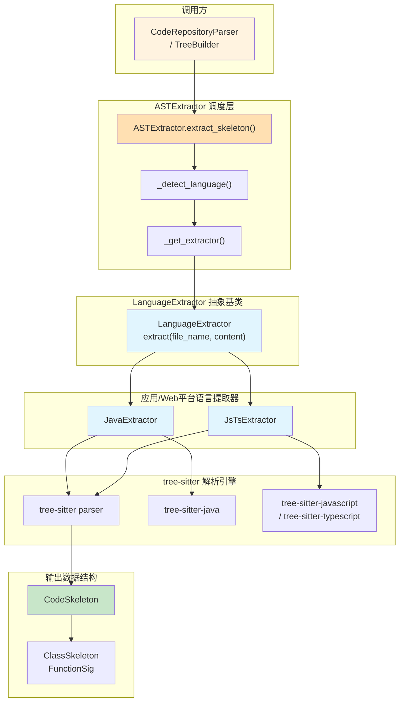
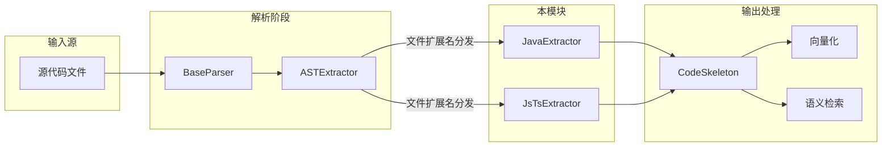

# application_and_web_platform_ast_extractors 模块技术文档

## 概述

**application_and_web_platform_ast_extractors** 模块为 **Java** 和 **JavaScript/TypeScript** 提供语言特定的 AST 提取器。该模块是OpenViking代码语义索引系统的核心组件，负责将源代码转换为结构化的 `CodeSkeleton` 格式，用于代码理解、检索和语义嵌入。

### 解决的问题

在大型代码库中进行语义检索时，直接将整个源代码文件作为输入传给 LLM 或 embedding 模型是不现实的——一个 Java 文件可能有上万行，一个复杂的 React 项目可能有数千个模块。解决方案是将代码**结构化**为精简的"骨架"（skeleton），只保留关键的语义元素：

- **类/接口/枚举的定义**（名称、父类、接口实现）
- **方法的签名**（名称、参数、返回类型）
- **模块级导入**（dependencies）
- **文档注释**（Javadoc/JSDoc）

这样做有两个目的：
1. **Embedding**：将代码骨架转换为向量，用于语义相似度检索
2. **LLM 理解**：为 LLM 提供代码的精简摘要，帮助其理解代码结构

### 为什么要用AST而不是正则表达式？

你可能会问：为什么不简单地用正则表达式提取函数名和类名？答案是：**正则表达式无法可靠地处理嵌套结构**。

想象一下解析这段Java代码：
```java
public class UserService {
    public void save(User user) { /* ... */ }
    
    public List<Order> getOrders(String userId) {
        return orderRepository.findByUserId(userId);
    }
}
```

正则表达式可能匹配到第一个 `public` 和第一个 `{`，但它无法可靠地判断这个类的范围在哪里，也无法处理可能出现的内部类、枚举类型，或者判断 `getOrders` 方法的参数列表在哪里开始和结束。AST解析则能精确理解代码的语法结构，因为tree-sitter已经按照语言的语法规则构建了解析树。

### 设计决策：为什么选择 tree-sitter？

市场上有很多 AST 解析方案（如 Python 的 `ast` 模块、Java 的 ANTLR）。选择 tree-sitter 是因为：

- **多语言统一接口**：Python、Java、JavaScript、Go、Rust 等都使用同一个解析库，这意味着整个代码解析层可以用一致的架构处理不同语言
- **增量解析支持**：虽然当前版本没有使用这个特性，但它为未来的实时编辑场景提供了可能
- **确定性解析**：同样的输入总是产生同样的 AST（无歧义），这对测试和调试至关重要
- **活跃的社区**：主流语言都有官方 grammar 支持，且grammar质量较高

### 架构设计

该模块采用**策略模式**（Strategy Pattern）：每个语言有一个独立的 `LanguageExtractor` 实现，由上层的 `ASTExtractor` 根据文件扩展名动态分发。



## 核心组件详解

### JavaExtractor

**设计意图**：JavaExtractor专门用于解析Java源代码。Java是一种强类型、面向对象的语言，其语法结构相对固定——类必须在文件中定义，方法必须在类内部。这使得AST提取变得较为直接。设计者选择让JavaExtractor处理class、interface和enum三种声明类型，因为这是Java代码组织的基本单元。

**内部机制**：

```python
class JavaExtractor(LanguageExtractor):
    def __init__(self):
        import tree_sitter_java as tsjava
        from tree_sitter import Language, Parser

        self._language = Language(tsjava.language())
        self._parser = Parser(self._language)
```

初始化时延迟导入tree-sitter语言绑定，这种设计避免了在模块加载时就必须准备好所有语言绑定的问题。解析器实例被保存在对象状态中，因为tree-sitter的Parser可以高效地重用于同一个语言的多次解析。

**extract方法的工作流程**：

1. 将输入内容编码为UTF-8字节串（tree-sitter要求字节输入）
2. 调用parser解析生成语法树
3. 遍历根节点的直接子节点，识别import声明和类型声明
4. 对每个类型声明，提取类名、基类（extends）、接口实现（implements）、方法列表
5. 对于每个方法，提取方法名、参数列表、返回类型和前置的Javadoc注释

**关键设计决策**：JavaExtractor使用`_preceding_doc`函数查找Javadoc注释。这个函数通过检查当前节点前一个兄弟节点是否是`block_comment`类型来判断。这种方法比维护一个全局注释映射更简单，但也意味着只能处理紧邻类型或方法声明的注释。对于更复杂的文档提取需求，这种权衡是合理的——它保持了代码的简洁性，同时覆盖了最常见的用法。

**支持的节点类型**：

- `import_declaration`：导入语句
- `class_declaration`：类声明
- `interface_declaration`：接口声明
- `enum_declaration`：枚举声明
- `method_declaration`：方法声明
- `constructor_declaration`：构造器声明

### JsTsExtractor

**设计意图**：JsTsExtractor需要同时支持JavaScript和TypeScript这两种密切相关但有微妙差异的语言。设计者选择使用同一个类通过构造函数参数区分语言，而不是创建两个独立类，因为这两种语言共享绝大部分语法结构，只是在类型注解方面有所不同。

**内部机制**：

```python
class JsTsExtractor(LanguageExtractor):
    def __init__(self, lang: str):
        """lang: 'javascript' or 'typescript'"""
        self._lang_name = "JavaScript" if lang == "javascript" else "TypeScript"
        if lang == "javascript":
            import tree_sitter_javascript as tsjs
            from tree_sitter import Language, Parser
            self._language = Language(tsjs.language())
        else:
            import tree_sitter_typescript as tsts
            from tree_sitter import Language, Parser
            self._language = Language(tsts.language_typescript())
        from tree_sitter import Parser
        self._parser = Parser(self._language)
```

**与JavaExtractor的对比**：

| 特性 | JavaExtractor | JsTsExtractor |
|------|---------------|---------------|
| 语言支持 | 仅Java | JavaScript + TypeScript |
| 构造函数参数 | 无 | lang: str |
| 模块级函数声明 | 不支持 | 支持（箭头函数、export） |
| 文档注释 | Javadoc（/** */） | JSDoc + 行内注释 |

**extract方法的特点**：

JsTsExtractor需要处理更多样化的函数定义方式，这源于JavaScript/TypeScript的动态特性：

1. **函数声明**：`function foo() {}`
2. **箭头函数表达式**：`const foo = () => {}`
3. **方法定义**：`class Foo { bar() {} }`
4. **导出声明**：`export default function foo() {}`

这种多样性使得提取逻辑比Java更复杂。设计者通过遍历不同类型的顶层节点来覆盖这些场景：

- `import_statement`：ES6模块导入
- `class_declaration`：类声明
- `function_declaration`：函数声明
- `generator_function_declaration`：生成器函数
- `export_statement`：导出声明（处理默认导出和命名导出）
- `lexical_declaration`：const/let声明的箭头函数

**TypeScript特有的处理**：当检测到`type_annotation`节点时，提取器会解析类型注解作为返回类型。这是TypeScript区别于JavaScript的关键特性——静态类型系统：

```python
elif child.type == "type_annotation":
    # TypeScript return type annotation
    for sub in child.children:
        if sub.type not in (":", ):
            return_type = _node_text(sub, content_bytes).strip()
            break
```

**类体内的处理**也更为复杂，因为JavaScript/TypeScript支持：
- 普通方法定义（`method_definition`）
- 箭头函数字段（`public_field_definition` + `arrow_function`）

### 共享的辅助函数

两个提取器都使用了几个关键的辅助函数，理解它们有助于理解整体设计：

**`_node_text(node, content_bytes)`**：

```python
def _node_text(node, content_bytes: bytes) -> str:
    return content_bytes[node.start_byte:node.end_byte].decode("utf-8", errors="replace")
```

这个函数将tree-sitter节点的位置信息（字节偏移量）转换为实际的文本内容。使用字节偏移量而不是字符偏移量，这是因为tree-sitter内部使用字节位置。这种设计确保了即使源代码包含多字节Unicode字符，解析仍然是正确的。`errors="replace"`参数确保了遇到无效UTF-8序列时不会崩溃，而是用替换字符填充。

**`_parse_block_comment` / `_parse_jsdoc`**：

这些函数负责清理文档注释的标记。tree-sitter返回的注释文本包含`/** */`或`/* */`本身，提取器需要去除这些标记并处理每行开头的`*`字符：

```python
def _parse_block_comment(raw: str) -> str:
    """Strip /** ... */ markers and leading * from each line."""
    raw = raw.strip()
    if raw.startswith("/**"):
        raw = raw[3:]
    elif raw.startswith("/*"):
        raw = raw[2:]
    if raw.endswith("*/"):
        raw = raw[:-2]
    lines = [l.strip().lstrip("*").strip() for l in raw.split("\n")]
    return "\n".join(l for l in lines if l).strip()
```

这是JavaDoc和JSDoc格式化的标准处理方式。

**`_preceding_doc`**：这是一个关键的设计模式——通过检查前一个兄弟节点来关联文档注释：

```python
def _preceding_doc(siblings: list, idx: int, content_bytes: bytes) -> str:
    """Return Javadoc block comment immediately before siblings[idx], or ''."""
    if idx == 0:
        return ""
    prev = siblings[idx - 1]
    if prev.type == "block_comment":
        return _parse_block_comment(_node_text(prev, content_bytes))
    return ""
```

这种方法假设文档注释与被描述的代码元素紧密相邻。虽然不是最健壮的方法（注释可能被其他声明打断），但它简单有效，覆盖了绝大多数实际代码中的情况。

## 依赖分析与契约

### 上游依赖（谁调用这个模块）

1. **ASTExtractor**（`openviking.parse.parsers.code.ast.extractor`）：这是直接的调度者，通过`_EXTRACTOR_REGISTRY`注册表将文件扩展名映射到具体的提取器实现：
   ```python
   _EXTRACTOR_REGISTRY: Dict[str, tuple] = {
       "java": ("openviking.parse.parsers.code.ast.languages.java", "JavaExtractor", {}),
       "javascript": ("openviking.parse.parsers.code.ast.languages.js_ts", "JsTsExtractor", {"lang": "javascript"}),
       "typescript": ("openviking.parse.parsers.code.ast.languages.js_ts", "JsTsExtractor", {"lang": "typescript"}),
   }
   ```

2. **CodeRepositoryParser**和**TreeBuilder**：这些是更高级别的解析组件，它们处理代码仓库的完整流程，包括文件扫描、解析和索引构建

### 下游依赖（这个模块依赖什么）

1. **tree-sitter语言绑定**：
   - `tree_sitter_java`
   - `tree_sitter_javascript`
   - `tree_sitter_typescript`（包括`language_typescript()`和`language_typescript_tsx()`）

2. **tree-sitter核心库**：提供`Language`和`Parser`类

3. **基础数据类**（来自`openviking.parse.parsers.code.ast.skeleton`）：
   - `CodeSkeleton`：文件级别的结构容器
   - `ClassSkeleton`：类/接口/枚举的结构
   - `FunctionSig`：函数签名的结构化表示

### 数据契约

**输入契约**：
- `file_name: str`：源文件的完整路径或文件名，用于基于扩展名的语言检测
- `content: str`：源代码文件的完整文本内容

**输出契约**：
返回`CodeSkeleton`对象，包含：
- `file_name: str`：原始文件名
- `language: str`：语言标识字符串（"Java", "JavaScript", "TypeScript"）
- `module_doc: str`：模块级文档字符串（JavaExtractor总是空字符串，因为Java不允许在文件级别放文档）
- `imports: List[str]`：导入语句列表
- `classes: List[ClassSkeleton]`：类/接口/枚举列表
- `functions: List[FunctionSig]`：顶层函数列表

**失败处理**：当tree-sitter解析失败或语言绑定不可用时，提取器会抛出异常，由上层`ASTExtractor`捕获并返回`None`，触发回退到LLM处理。

## 设计决策与权衡

### 决策1：延迟加载语言绑定

**选择**：tree-sitter语言绑定在提取器首次被需要时才加载，而不是在模块初始化时。

**理由**：OpenViking支持多种编程语言，但用户的代码仓库可能只包含其中几种。提前加载所有语言绑定既浪费内存也不必要——如果用户从不处理Java文件，为什么要在启动时加载tree-sitter-java？

**权衡**：这意味着首次处理某种语言的文件时会有额外的导入开销。但这个开销是一次性的，且相比实际的AST解析时间可以忽略不计。

### 决策2：单例提取器实例

**选择**：`ASTExtractor`使用缓存机制，每个语言只创建一个提取器实例。

**理由**：tree-sitter的Parser对象可以高效地重用于同一个语言的多次解析。创建新的Parser对象会有额外开销，而Parser本身是无状态的，可以安全地共享。

**权衡**：如果源代码包含非常大量的文件，这种缓存会导致单个Parser累积大量的解析状态。在极少数场景下，手动重启提取器可能是必要的。

### 决策3：简洁的注释关联策略

**选择**：通过检查前一个兄弟节点来关联文档注释。

**理由**：相比维护一个全局注释映射表并在解析过程中查找，这种方法实现简单且对于紧密相邻的注释工作良好。大多数遵循良好编码规范的代码都会将文档注释直接放在声明之前。

**权衡**：如果注释和声明之间有其他代码元素（如空行、预处理指令），关联会失败。对于这种情况，提取器会返回空的docstring。

### 决策4：两种输出模式

**选择**：`CodeSkeleton.to_text()`接受`verbose`参数控制输出详细程度。

**理由**：不同的下游用例需要不同的信息密度。用于向量嵌入时，只需要第一行文档摘要以减少噪声；用于LLM问答时，完整的文档字符串能提供更多上下文。

**代码示例**：
```python
# 非verbose模式：只保留文档第一行，适合embedding
def to_text(self, verbose: bool = False) -> str:
    # ...
    if not verbose:
        return [f'{indent}"""{first}"""']  # 只返回第一行
    # verbose模式：保留完整文档
    return [f'{indent}"""{doc_lines[0]}'] + ...
```

**权衡**：这要求调用方理解两种模式的差异并正确使用。但这是一个简单的契约，比维护两套独立的输出逻辑更清晰。

### 决策5：回退到LLM

**选择**：当AST提取失败时，返回`None`让调用方回退到LLM处理。

**理由**：没有一种AST提取器是完美的——tree-sitter可能不支持某些语言特性，源代码可能有语法错误，或者语言绑定可能未安装。通过返回`None`而不是抛出错误，上层组件可以优雅地处理这些失败情况。

**权衡**：这意味着某些本可以提取的结构化信息会被发送到LLM处理，增加了延迟和成本。但这是保证系统健壮性的必要代价。

### 决策6：JavaScript/TypeScript共享提取器

**选择**：JavaScript 和 TypeScript 使用同一个 `JsTsExtractor` 类，而非两个独立的类。

**理由**：
- JavaScript 和 TypeScript 的语法高度相似（90% 交集）
- 共享核心解析逻辑减少代码重复
- 运行时只需加载一个grammar而非两个

**权衡**：代码中需要一些条件分支（如 `if self._lang_name == "TypeScript"`）来处理差异。未来如果两种语言的差异变大，可能需要拆分。

## 扩展点与使用指南

### 添加新的语言支持

要添加新的语言支持（例如如果未来需要支持C#），需要：

1. 实现一个继承自`LanguageExtractor`的类
2. 在`extract`方法中使用相应的tree-sitter语言绑定
3. 将语言扩展名和类信息注册到`_EXT_MAP`和`_EXTRACTOR_REGISTRY`

参考现有的各Extractor实现，它们遵循完全相同的模式。

### 自定义提取行为

如果需要提取额外的代码元素（如注解、泛型参数、内部类），可以：

1. 继承现有的提取器类
2. 重写`extract`方法
3. 在遍历AST时添加新的节点类型处理逻辑

### 配置选项

目前没有运行时配置选项。语言检测完全基于文件扩展名。如果需要更精确的语言检测（例如处理`.h`文件可能是C或C++），可以在`_detect_language`方法中添加额外逻辑。

## 边界情况与注意事项

### 1. 编码问题

源代码必须能够被编码为UTF-8。tree-sitter内部使用字节偏移量，如果源代码包含无效的UTF-8序列，`_node_text`函数使用`errors="replace"`来替换无效字节，这可能导致提取的文本不完全准确。

### 2. 语法错误的代码

tree-sitter对语法错误有相当的容忍度——它会尽可能解析并返回部分树。但某些严重错误可能导致完全无法解析，此时会触发LLM回退。

### 3. 大型文件

tree-sitter设计为高效处理大型文件，但极端情况下（如数万行的单个文件），内存使用可能成为一个考虑因素。对于这种情况，可能需要预先分块或限制提取深度。

### 4. 非标准代码风格

代码提取器假设代码遵循常见的格式约定。如果代码使用了非常规的格式化（例如所有代码在一行上），文档注释的关联可能失败。

### 5. JavaScript/TypeScript的动态特性

JavaScript/TypeScript的动态特性意味着某些代码模式无法静态提取：

- `eval()`执行的代码
- 通过字符串构造的函数
- 动态导入（`import()`）

这些情况下，提取器只能看到结构化的声明，动态生成的部分会被忽略。

### 6. TypeScript JSX 文件处理

**潜在问题**：`JsTsExtractor`目前使用`language_typescript()`处理`.tsx`文件，这可能不是最优的——应该使用`language_typescript_tsx()`来处理JSX语法。如果你在处理React TypeScript文件时发现问题，这可能是原因。

### 7. 注释关联的局限性

使用前置兄弟节点策略关联注释有以下局限：
- 如果注释和代码之间有空行，关联会失败
- 如果有多个连续的注释块，可能只捕获第一个
- 行内注释（`//`）不会被识别为文档注释

## 与系统其他部分的交互

理解这个模块在整体系统中的位置至关重要。代码骨架提取是 OpenViking 索引 pipeline 的关键阶段：



**完整的调用链**：

1. **文件发现**：`TreeBuilder` 扫描代码仓库，识别文件类型
2. **Parser 选择**：`BaseParser` 子类（如 `CodeRepositoryParser`）根据扩展名选择合适的解析器
3. **AST 调度**：`ASTExtractor` 查询注册表，选择对应的 `LanguageExtractor` 实现
4. **结构提取**：本模块的提取器解析 AST，生成 `CodeSkeleton`
5. **下游使用**：
   - 向量化：骨架文本被送入 embedding 模型生成向量
   - 检索：向量存储后支持语义搜索
   - LLM 上下文：为 RAG 管道提供代码结构摘要

**关键的隐式契约**：

- 提取器必须是**幂等的**——相同输入必须产生相同输出
- 提取器应当**宽容地处理错误**——遇到无法解析的代码时返回空结构而非崩溃
- 返回的 `CodeSkeleton` 是**纯数据对象**——不含对原始文件的引用，便于序列化和存储

## 相关文档

- [parser_abstractions_and_extension_points](./parser_abstractions_and_extension_points.md) - 解析器抽象基类
- [language_extractor_base](./language_extractor_base.md) - AST提取器的抽象基类定义
- [code_language_ast_extractors](./code_language_ast_extractors.md) - 所有语言提取器的概览
- [systems_programming_ast_extractors](./systems_programming_ast_extractors.md) - C++/Go/Rust提取器
- [scripting_language_ast_extractors](./parsing_and_resource_detection-scripting_language_ast_extractors.md) - Python提取器