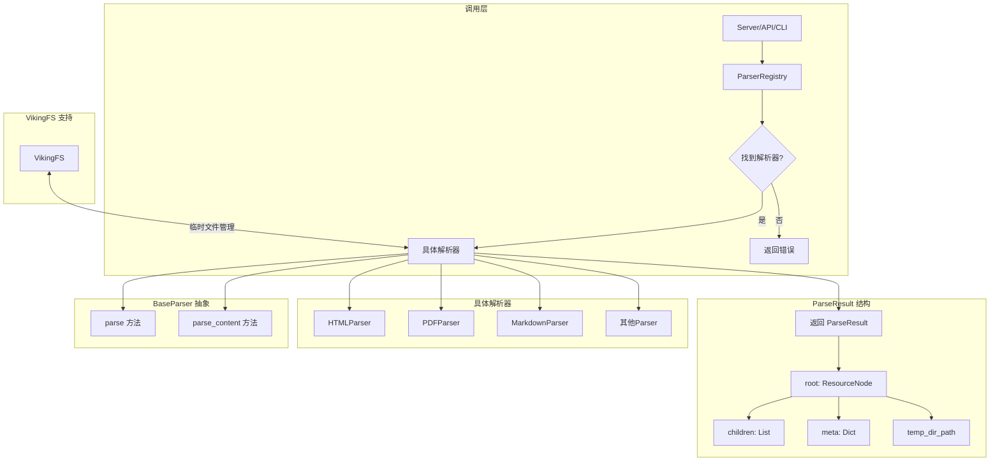

# base_parser_abstract_class 模块技术深度解析

## 概述

`base_parser_abstract_class` 模块是 OpenViking 文档解析系统的核心抽象层。它定义了一个用于将各种格式的文档（PDF、Markdown、HTML、Word 等）转换为树形结构的统一接口。这个模块的存在源于一个核心洞察：**文档解析不应该仅仅是提取文本，而应该保留文档的自然层级结构**——章节、段落、标题等语义元素应该被显式建模，而不是被随意切分。

如果你把整个解析系统想象成一个「文档翻译官」，那么 `BaseParser` 就是所有专业翻译师的抽象基类。每个具体的翻译师（如 PDF 翻译师、Markdown 翻译师）都继承自这个基类，遵循相同的「翻译协议」，但内部使用不同的技术和策略来完成工作。

---

## 架构定位与设计意图

### 问题空间

在 OpenViking 的检索增强生成（RAG）系统中，我们需要处理多种格式的文档。最初的做法可能是简单地提取所有文本，然后按固定长度切分。但这种做法存在明显问题：

1. **语义断裂**：一个完整的段落可能被切分到两个不同的 chunk 中，导致 LLM 无法理解原始上下文
2. **结构丢失**：`# 第一章` 和 `# 第二章` 在纯文本中没有任何区别，检索时无法利用文档结构
3. **格式信息丢失**：PDF 中的表格、代码块、图像说明等特殊元素被扁平化为普通文本

`BaseParser` 的设计正是为了解决这些问题。它强制每个解析器输出一个**树形结构**（`ResourceNode` 的层级关系），从而保留文档的原始组织方式。

### 核心抽象

```
ParseResult (解析结果)
  └── root: ResourceNode (根节点)
        ├── type: NodeType.ROOT
        ├── title: Optional[str]
        ├── level: int (层级深度)
        ├── children: List[ResourceNode] (子节点)
        ├── content_path: Optional[Path] (内容文件路径)
        └── meta: Dict[str, Any] (元数据)
```

这种设计遵循了「PageIndex」理念——保留文档的自然结构，而不是用固定的 chunk 大小来粗暴切分。想象一下，一篇论文的目录结构本身就是一种高效的索引机制，`BaseParser` 就是要把这种结构提取出来。

### 架构示意图



---

## 组件详解

### BaseParser 抽象类

```python
class BaseParser(ABC):
    """
    Abstract base class for document parsers.

    Parsers convert documents into tree structures that preserve
    natural document hierarchy (sections, paragraphs, etc.).

    All parsers use async interface for parsing operations.
    """

    @abstractmethod
    async def parse(self, source: Union[str, Path], instruction: str = "", **kwargs) -> ParseResult:
        """从文件路径或内容字符串解析文档"""
        pass

    @abstractmethod
    async def parse_content(
        self, content: str, source_path: Optional[str] = None, instruction: str = "", **kwargs
    ) -> ParseResult:
        """直接解析文档内容字符串"""
        pass

    @property
    @abstractmethod
    def supported_extensions(self) -> List[str]:
        """支持的文件扩展名列表"""
        pass
```

这里的 `instruction` 参数是理解整个系统的关键。它不是一个简单的配置项，而是一种**解耦策略**——它允许调用者在不了解解析器内部细节的情况下，指导解析器「以何种视角理解文档」。例如：

```python
# 场景1：财务报表 - 关注数字和趋势
result = await parser.parse("report.pdf", instruction="关注关键财务指标和年度对比")

# 场景2：技术文档 - 关注代码示例
result = await parser.parse("api.md", instruction="重点提取代码示例和使用说明")

# 场景3：合同文档 - 关注条款和义务
result = await parser.parse("contract.pdf", instruction="提取各方义务和关键条款")
```

这种设计将「如何解析」（解析器的职责）与「如何理解」（下游 LLM 的职责）分离，解析器只负责结构化提取，不关心具体使用场景。

4. **`**kwargs` 的灵活性**：
   
   `BaseParser` 的方法签名中包含 `**kwargs`，这是一个有意为之的设计选择。它允许：
   
   - 传递解析器特定的配置参数（如 `PDFParser` 的 `strategy` 参数）
   - 传递多模态处理器的引用（如 `vlm_processor`）
   - 未来添加新参数而无需修改接口

   ```python
   # 示例：传递解析器特定的参数
   result = await parser.parse("document.pdf", strategy="mineru", vlm_processor=my_vlm)
   
   # 示例：MarkdownParser 的特殊参数
   result = await parser.parse("readme.md", extract_code_blocks=True, code_language_hints=["python", "rust"])
   ```

   这种「宽接口」策略平衡了类型安全和灵活性。

**设计决策解读：**

1. **为什么是异步接口？**  
   文档解析通常是 I/O 密集型操作——需要读取文件、调用外部 API（如 PDF 转换服务）、处理大型文件等。异步接口允许在等待 I/O 操作时释放控制权，提高并发处理能力。这对于需要同时解析大量文档的场景尤为重要。

2. **为什么有两个抽象方法？**  
   `parse()` 和 `parse_content()` 分别对应两种使用场景：
   - `parse()`：处理文件系统中的文件，需要考虑文件路径、编码检测等
   - `parse_content()`：处理内存中的字符串内容，可能来自 API 响应、数据库等
   
   某些解析器可能只支持其中一种（如 `PDFParser` 只支持 `parse()`，因为 PDF 转换工具需要文件路径）。

3. **`instruction` 参数的作用**  
   这是一个巧妙的设计。不同的使用者可能需要以不同的方式理解同一份文档。例如：
   - 「提取所有技术术语」vs「总结文档大意」
   - 「关注代码示例」vs「关注文字说明」
   
   这个参数会被传递到下游的 LLM 处理流程中，指导如何理解和处理解析后的内容。

### 辅助方法

```python
def can_parse(self, path: Union[str, Path]) -> bool:
    """检查解析器是否能处理给定文件"""
    path = Path(path)
    return path.suffix.lower() in self.supported_extensions

def _read_file(self, path: Union[str, Path]) -> str:
    """带编码检测的文件读取"""
    path = Path(path)
    encodings = ["utf-8", "utf-8-sig", "latin-1", "cp1252"]
    for encoding in encodings:
        try:
            with open(path, "r", encoding=encoding) as f:
                return f.read()
        except UnicodeDecodeError:
            continue
    raise ValueError(f"Unable to decode file: {path}")

def _get_viking_fs(self):
    """获取 VikingFS 单例实例"""
    from openviking.storage.viking_fs import get_viking_fs
    return get_viking_fs()

def _create_temp_uri(self) -> str:
    """创建临时 URI 用于存储解析过程中的中间文件"""
    return self._get_viking_fs().create_temp_uri()
```

#### can_parse() 的设计意图

这是一个**非抽象的具体方法**，提供了基于文件扩展名的快速判断能力：

```python
def can_parse(self, path: Union[str, Path]) -> bool:
    path = Path(path)
    return path.suffix.lower() in self.supported_extensions
```

注意这里使用 `.lower()` 进行小写匹配，这是一种务实的选择——它无法完美处理：
- 多重扩展名（如 `.tar.gz`）
- 大小写敏感系统上的边界情况
- 没有扩展名的特殊文件（如 `Makefile`、`Dockerfile`）

对于需要更精确检测的场景，具体解析器可以覆盖这个方法。例如，一个智能的 PDF 解析器可能会读取文件头部来确认魔数（magic number），而不仅仅是看扩展名。

#### _get_viking_fs() 的延迟导入

```python
def _get_viking_fs(self):
    from openviking.storage.viking_fs import get_viking_fs
    return get_viking_fs()
```

这里使用延迟导入是为了避免循环依赖。`BaseParser` 定义在 `openviking.parse.parsers` 模块中，而 VikingFS 在 `opviking.storage` 中，如果在模块级别导入，可能会在某些导入顺序下导致问题。

这种模式在 Python 中很常见，它体现了「导入即初始化」与「运行时初始化」之间的权衡。

**设计考量：**

1. **编码检测**：`_read_file()` 方法尝试多种常见编码，这是一个防御性编程实践。现实世界的文件编码千奇百怪，特别是处理历史文档或国际化内容时。这个回退机制确保了最大兼容性。

   编码尝试顺序 `["utf-8", "utf-8-sig", "latin-1", "cp1252"]` 的选择是有讲究的：
   - UTF-8 是现代文件的默认编码，优先尝试
   - UTF-8 with BOM 是 Windows 记事本常用的格式
   - Latin-1 能成功读取任何单字节编码的字符（虽然可能是乱码）
   - CP1252 是 Windows 西方语言默认编码

   这种「智能回退」策略在保持简单的同时覆盖了 99% 的实际场景。

2. **VikingFS 集成**：`_create_temp_uri()` 利用 VikingFS（OpenViking 的虚拟文件系统抽象）来管理临时文件。这支持了 v4.0 架构中的三阶段解析流程：

   ```
   原始文档 ──解析──▶ 阶段1 (temp_dir) ──丰富──▶ 阶段2 (meta) ──归档──▶ 阶段3 (最终目录)
   ```

   - **阶段 1**：`detail_file` 存储扁平化的 UUID.md 文件名（如 `"a1b2c3d4.md"`），解析过程中的中间产物
   - **阶段 2**：`meta` 存储语义标题（`semantic_title`）、摘要（`abstract`）、概述（`overview`）
   - **阶段 3**：`content_path` 指向最终目录中的 `content.md`

   `_create_temp_uri()` 返回类似 `viking://temp/abc12345` 的 URI，解析器可以用它来组织中间文件。注意这个 URI 是用于内部临时存储的，调用者无需关心其具体实现。

---

## 数据流与依赖关系

### 上游调用者

```
ParserRegistry (解析器注册中心)
    │
    ├── get_parser_for_file(path) → BaseParser
    │     └── 根据文件扩展名选择合适的解析器
    │
    └── async parse(source, **kwargs) → ParseResult
          └── 自动路由到具体解析器的 parse() 方法
```

`ParserRegistry` 是 `BaseParser` 的主要消费者。它维护了一个扩展名到解析器的映射表，并提供自动选择逻辑：

```python
# 简化流程
def get_parser_for_file(self, path: Union[str, Path]) -> Optional[BaseParser]:
    path = Path(path)
    ext = path.suffix.lower()
    parser_name = self._extension_map.get(ext)
    if parser_name:
        return self._parsers.get(parser_name)
    return None
```

### 下游实现

所有具体解析器都继承自 `BaseParser`：

| 解析器 | 支持扩展名 | 特殊能力 |
|--------|-----------|----------|
| `PDFParser` | `.pdf` | 支持 local/mineru 两种转换策略 |
| `MarkdownParser` | `.md`, `.markdown` | 原生解析，支持 Front Matter |
| `HTMLParser` | `.html`, `.htm` | HTML 到 Markdown 转换 |
| `WordParser` | `.docx`, `.doc` | 使用 markitdown 库 |
| `PowerPointParser` | `.pptx`, `.ppt` | 幻灯片逐页解析 |
| `ExcelParser` | `.xlsx`, `.xls` | 工作表转换为 Markdown 表格 |
| `TextParser` | `.txt`, `.text` | 纯文本的默认解析器 |
| `DirectoryParser` | (目录) | 递归解析目录中的所有文件 |

### 关键依赖

```
BaseParser
    │
    ├── ParseResult (返回值类型)
    │     └── 定义于 openviking.parse.base
    │
    ├── ResourceNode (树节点类型)
    │     └── 定义于 openviking.parse.base
    │
    ├── VikingFS (临时文件管理)
    │     └── openviking.storage.viking_fs.get_viking_fs()
    │
    └── 具体实现类
          ├── PDFParser → MarkdownParser (两阶段转换)
          ├── HTMLParser → MarkdownParser
          └── 其他直接解析器
```

---

## 扩展点与自定义解析

### CustomParserProtocol

除了继承 `BaseParser` 之外，系统还支持通过 Protocol 模式注册自定义解析器：

```python
class CustomParserProtocol(Protocol):
    @property
    def supported_extensions(self) -> List[str]:
        ...

    def can_handle(self, source: Union[str, Path]) -> bool:
        ...

    async def parse(self, source: Union[str, Path], **kwargs) -> ParseResult:
        ...
```

这种方式的优势是**不需要继承**——任何实现了上述接口的对象都可以被注册为解析器。这对于集成第三方库或快速原型开发特别有用。

### 注册自定义解析器

```python
# 方式 1：注册一个实现 CustomParserProtocol 的对象
registry.register_custom(MyCustomParser(), extensions=[".xyz"], name="xyz_parser")

# 方式 2：注册一个回调函数
async def my_parse_fn(source: Union[str, Path], **kwargs) -> ParseResult:
    # 自定义解析逻辑
    ...

registry.register_callback(".xyz", my_parse_fn)
```

---

## 设计权衡与trade-offs

### 1. 继承 vs 组合 vs Protocol

`BaseParser` 使用抽象基类（ABC）定义接口，而 `CustomParserProtocol` 使用 Protocol。这是有意为之的设计：

- **继承（ABC）**：适合「is-a」关系，强制子类实现所有抽象方法。优点是接口明确，缺点是 Python 单继承限制。
- **Protocol**：适合「structural typing」，只要对象有相应方法就能工作。优点是灵活，缺点是运行时才能发现接口不匹配。

当前设计中，核心解析器使用继承（因为它们确实是一种 Parser），而自定义扩展使用 Protocol（因为它们可能来自第三方库）。

### 2. 同步读取 vs 异步读取

`_read_file()` 是同步方法，而 `parse()` 是异步的。这个选择基于以下考量：

- 文件读取通常是快速的本地 I/O，同步读取代码更简单
- 如果需要处理远程文件（如 HDFS、S3），可以在子类中覆盖为异步实现
- 大多数解析器的计算瓶颈在转换过程而非文件读取

### 3. 宽松的返回值 vs 严格验证

`ParseResult` 允许 `warnings` 字段来记录非致命错误，而不是抛出异常。这意味着：

- 部分解析成功（如 PDF 的某些页面解析失败）仍然可以返回结果
- 调用者可以决定是否接受带有警告的结果
- 这符合「fail gracefully」的分布式系统设计原则

---

## 常见陷阱与注意事项

### 1. instruction 参数的误用

`instruction` 不是解析参数，而是**下游 LLM 的指导提示**。如果你在解析阶段需要特殊处理，应该通过 `**kwargs` 传递：

```python
# 错误用法
result = await parser.parse(file, instruction="我只要代码部分")

# 正确用法
result = await parser.parse(file, extract_code_only=True)  # 解析器内部处理
# 然后在 LLM 层面使用 instruction 指导如何理解
```

### 2. 不是所有解析器都支持 parse_content()

查看 `PDFParser` 的实现会发现它直接抛出 `NotImplementedError`：

```python
async def parse_content(self, content: str, ...):
    raise NotImplementedError(
        "PDFParser does not support parsing content strings. "
        "Use parse() with a file path instead."
    )
```

在动态调用前应检查解析器能力，或使用 `ParserRegistry.parse()` 自动路由。

### 3. 编码问题的隐式处理

`_read_file()` 的多编码回退机制虽然方便，但也可能导致隐蔽问题：

- 如果文件实际上是 GBK 编码但被误读为 UTF-8（因为恰好没有触发解码错误），可能导致乱码被当作有效内容
- 建议在高可靠性场景下，显式指定编码或使用 `chardet` 库检测

### 4. temp_dir_path 的 v4.0 迁移

`ParseResult` 中的 `temp_dir_path` 字段是 v4.0 新增的。如果你编写新的解析器并需要临时文件存储：

```python
# 创建临时 URI（推荐）
temp_uri = self._create_temp_uri()
# temp_uri 格式: "viking://temp/abc12345"

# 或者使用旧的本地临时目录方式（已不推荐）
import tempfile
temp_dir = tempfile.mkdtemp(prefix="openviking_parse_")
```

### 5. VikingFS 未初始化时的调用

`_get_viking_fs()` 依赖全局单例已初始化：

```python
def _get_viking_fs(self):
    from openviking.storage.viking_fs import get_viking_fs
    return get_viking_fs()  # 如果未初始化会抛出 RuntimeError
```

**正确顺序**：

```python
# 初始化 VikingFS
from openviking.storage.viking_fs import init_viking_fs
init_viking_fs(config)

# 然后才能使用解析器
parser = MyParser()
result = await parser.parse("file.txt")
```

### 6. 继承时的异步方法覆盖

`BaseParser` 要求 `parse()` 和 `parse_content()` 必须实现为异步方法。确保使用 `async def` 而不是 `def`：

```python
# 正确
async def parse(self, source, ...):
    ...

# 错误 - 会导致运行时错误
def parse(self, source, ...):
    ...
```

---

## 相关模块参考

- [parser_abstractions_and_extension_points](parser_abstractions_and_extension_points.md) - 解析器抽象与扩展点概览
- [custom_parser_protocol_and_wrappers](parser_abstractions_and_extension_points-custom_parser_protocol_and_wrappers.md) - 自定义解析器协议与包装器
- [language_extractor_base](language_extractor_base.md) - 代码语言提取器基类（用于 AST 分析）
- [resource_and_document_taxonomy](resource_and_document_taxonomy.md) - 资源与文档分类体系
- [resource_detection_traversal_metadata](resource_detection_traversal_metadata.md) - 资源检测与遍历元数据