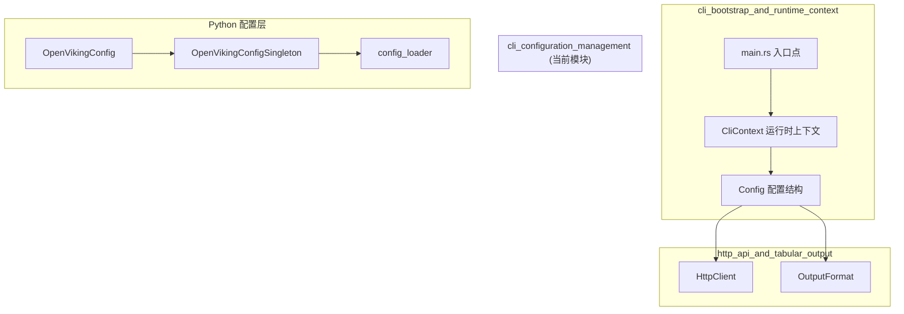

# CLI 配置管理模块 (cli_configuration_management)

## 概述

`cli_configuration_management` 模块是 OpenViking 系统中负责 CLI 客户端配置管理的核心组件。它解决的问题看似简单——如何让命令行客户端知道如何连接到服务器——但实际上涉及到一个微妙的权衡：既要保持极简的启动体验，又要对不同部署场景保持足够的灵活性。

想象一下：你开发了一个需要连接到远程服务的命令行工具。用户可能在本机开发、可能部署到生产环境、可能是完全离线使用。每种场景下的配置需求都不同。一种 naïve 的做法是把所有配置都硬编码，但这显然无法适应多环境。另一种做法是让用户每次都通过命令行参数传递所有配置，但这会让简单的 `ov status` 命令变得冗长繁琐。

这个模块的设计哲学是：**约定优于配置，但保留显式覆盖的能力**。它通过一个三层配置解析链（显式路径 → 环境变量 → 默认路径）来平衡灵活性与便利性，同时确保 CLI 能够以极快的速度启动——因为配置加载发生在真正需要网络通信之前，而不是每次启动时都加载。

## 架构设计

### 模块位置与依赖关系



从架构图中可以看出，这个模块处于 **CLI 启动引导流程的核心位置**。在 `main.rs` 中，`CliContext::new()` 是应用程序最早执行的业务逻辑之一，它在解析命令行参数之后、但在执行任何命令之前被调用。这意味着配置加载的失败会直接导致 CLI 无法启动，而不是在执行命令的过程中才发现配置问题。

### 双层配置架构

理解这个模块的关键在于认识到它实际上包含两个相互关联但职责不同的配置层：

**Rust 层 (ov_cli)**：这是纯 CLI 客户端的配置，负责告诉命令行工具如何连接到后端服务器。它解决的问题是"我在哪里可以找到 OpenViking 服务？"——仅此而已。因此，它的配置项非常精简：服务端 URL、API 密钥、Agent ID、请求超时时间、输出格式偏好。

**Python 层 (openviking_cli)**：这是完整的 OpenViking 客户端配置，不仅包含服务端连接信息，还包含存储后端选择、Embedding 模型配置、各种解析器的参数等。这是一个更复杂的配置系统，因为它需要描述整个数据处理流水线。

这两层之间的桥梁是 `rust_cli.py`。这个极简的 Python 包装器的唯一职责是找到并执行 Rust 二进制文件，避免了 Python 解释器的启动开销。这意味着当你运行 `ov` 命令时，你实际上是在使用 Rust 层的配置；而当你使用 Python API 时，你会用到 Python 层的配置。

## 核心组件详解

### Config 结构体 (Rust)

```rust
#[derive(Debug, Clone, Serialize, Deserialize)]
pub struct Config {
    #[serde(default = "default_url")]
    pub url: String,
    pub api_key: Option<String>,
    pub agent_id: Option<String>,
    #[serde(default = "default_timeout")]
    pub timeout: f64,
    #[serde(default = "default_output_format")]
    pub output: String,
    #[serde(default = "default_echo_command")]
    pub echo_command: bool,
}
```

这个结构体的设计体现了几个关键决策：

**使用 serde 进行序列化/反序列化**：通过 derive 宏自动生成 JSON 序列化代码，这不仅让配置文件格式变得标准（JSON 是人类可读的，也是机器可解析的），还允许 Config 在需要时被序列化为调试输出或配置备份。

**使用 Option<T> 而非空字符串**：对于 `api_key` 和 `agent_id`，使用 `Option<String>` 而非空字符串是一种更具表现力的做法。它明确区分了"用户没有提供"和"用户明确提供了空值"这两种情况。在实际使用中，如果 API 密钥未提供，HttpClient 会以无认证模式运行，这对于某些不需要认证的本地测试场景非常有用。

**使用 default 函数而非常量**：注意到 `default_url()`、`default_timeout()` 等是函数而非 const 函数。这是因为 Rust 的 `#[serde(default = "...")]` 属性要求提供一个函数引用，而函数可以包含更复杂的逻辑（如从环境变量读取默认值）。虽然当前的默认实现很简单，但这种设计为未来添加更智能的默认值（例如自动检测本地服务）留下了扩展空间。

### 配置加载流程

```rust
pub fn load_default() -> Result<Self> {
    let config_path = default_config_path()?;
    if config_path.exists() {
        Self::from_file(&config_path.to_string_lossy())
    } else {
        Ok(Self::default())
    }
}
```

这个看似简单的函数实际上包含了一个重要的设计选择：**如果配置文件不存在，直接返回默认配置，而不是报错**。

为什么这样做？考虑一个首次使用 OpenViking 的用户。他们可能只是想要运行 `ov status` 来检查服务状态，或者运行 `ov --help` 查看帮助信息。如果 CLI 在配置文件不存在时就报错，用户体验会非常糟糕——他们必须先去创建配置文件，然后才能了解这个工具是做什么的。

这种"宽容的设计"在 `load_default()` 中体现为：默认配置指向 `http://localhost:1933`，这是一个本地开发服务的常用地址。如果用户确实需要连接到远程服务器，他们可以创建配置文件来覆盖默认值。

### 三层配置解析链

Python 层的 `config_loader.py` 提供了一个更完整的配置解析实现：

```python
def resolve_config_path(
    explicit_path: Optional[str],
    env_var: str,
    default_filename: str,
) -> Optional[Path]:
    # Level 1: explicit path
    # Level 2: environment variable
    # Level 3: default directory
```

这个设计的智慧在于它为不同使用场景提供了恰当的解决方案：

- **显式路径** 适用于 CI/CD 场景，你可能需要为不同的测试环境使用不同的配置文件
- **环境变量** 适用于容器化部署，配置通过 Kubernetes ConfigMap 或 Docker 环境变量注入
- **默认路径** 适用于日常开发，用户只需在 `~/.openviking/` 下放置配置文件即可

值得注意的是，这个三层解析是**短路求值**的：一旦在某一层级找到配置文件，就不会再检查后续层级。这确保了行为的一致性——你永远不需要担心"环境变量是否会被默认配置覆盖"这类问题。

### 单例模式在 Python 层的应用

```python
class OpenVikingConfigSingleton:
    """Global singleton for OpenVikingConfig."""
    
    _instance: Optional[OpenVikingConfig] = None
    _lock: Lock = Lock()
```

在 Python 层，配置使用了经典的单例模式。但这并非过度设计，而是有明确的技术原因：

**线程安全**：OpenViking 可能被用作多线程应用中的库。想象一个 Web 服务同时处理多个请求，它们都需要访问配置。单例模式配合 `Lock` 确保了在并发初始化时的安全性。

**惰性加载**：配置只在第一次被请求时才加载。如果你只是导入模块而不实际使用配置，不会产生任何文件 I/O。

**双重检查锁定**：使用 `if cls._instance is None` + 锁内再检查的模式，既保证了线程安全，又避免了每次调用都需要获取锁的性能开销。

## 数据流分析

### 配置读取的生命周期

当你运行一个 `ov` 命令时，配置是如何流动的呢？让我们追踪 `ov find "some query"` 这个场景：

1. **命令行解析阶段**：Clap（Rust 的命令行参数解析库）解析用户输入。它读取 `--output table` 这样的全局参数，但不读取配置文件。

2. **上下文初始化阶段**：`CliContext::new(output_format, compact)` 被调用。这是配置加载发生的唯一时刻。注意，配置加载发生在命令行解析之后，这意味着命令行参数可以覆盖配置文件中的某些值（如 `output` 字段）。

3. **配置加载**：`Config::load()` → `Config::load_default()` → 尝试读取 `~/.openviking/ovcli.conf`。

4. **HTTP 客户端创建**：`ctx.get_client()` 创建一个 `HttpClient` 实例，它持有从配置中读取的 URL、API 密钥等信息。

5. **命令执行**：具体的命令处理器（如 `handle_find`）接收这个客户端，执行实际的 HTTP 请求。

6. **结果输出**：根据配置中的 `output` 格式（table/json/simple）格式化结果并输出。

这个流程中有一个关键的观察点：**配置只加载一次**。如果你在同一个 CLI 进程中进行多次操作（虽然目前的 CLI 设计是每次命令都独立进程），配置不会重复加载。这既提高了性能，也确保了行为的一致性。

### 配置如何影响 HttpClient

`HttpClient` 的创建是配置与网络层之间的桥梁：

```rust
pub fn get_client(&self) -> client::HttpClient {
    client::HttpClient::new(
        &self.config.url,
        self.config.api_key.clone(),
        self.config.agent_id.clone(),
        self.config.timeout,
    )
}
```

这里有一个微妙的设计点：`api_key` 和 `agent_id` 被克隆后传递给 HttpClient。这是必要的，因为 `Config` 被存储在 `CliContext` 中，并且可能被多次使用（虽然当前场景下不太可能）。通过克隆，避免了借用问题，也避免了 HttpClient 需要管理借用的复杂性。

`timeout` 参数直接传递给 HttpClient，用于控制 HTTP 请求的超时时间。选择 `f64` 而非 `u64` 是为了与 serde 的序列化兼容——JSON 中的数字可以是浮点数，虽然这里实际上只使用整数值。

## 设计决策与权衡

### 决策一：JSON 作为配置格式

选择 JSON 而非 YAML、TOML 或其他格式，是经过权衡的：

**优点**：
- 无需额外的解析库（serde_json 是 Rust 生态中最成熟、使用最广泛的 JSON 库）
- 与 JavaScript 生态兼容良好，Web 开发者熟悉
- 支持嵌套结构（Python 层的配置就需要嵌套的 storage、embedding 等配置）

**缺点**：
- JSON 不支持注释，对于配置文件来说这是个遗憾的缺失
- 语法比 YAML/TOML 更冗长

对于 CLI 配置来说，这些权衡是可以接受的。JSON 的冗长通过 `serde_json::to_string_pretty` 生成格式化输出来缓解，而注释的缺失可以通过提供示例配置文件来解决。

### 决策二：配置不存在时使用默认值

如前所述，当 `~/.openviking/ovcli.conf` 不存在时，`Config::load_default()` 返回默认配置而非错误。这是一个刻意的设计选择。

**替代方案**：如果选择报错，要求用户必须先创建配置文件，会发生什么？
- 首次用户体验极差：用户安装 CLI 后，第一个命令就失败
- 自动化脚本复杂化：任何使用 `ov` 的脚本都需要先确保配置文件存在

**当前方案的风险**：
- 用户可能不知道他们正在使用默认配置
- 如果他们期望连接到远程服务器但忘记创建配置文件，会收到令人困惑的连接错误

为了缓解这些风险，默认 URL 指向 `localhost:1933`，这是一个不太可能与远程服务冲突的地址。而且，配置加载错误（如果配置文件存在但格式错误）会给出清晰的错误信息。

### 决策三：Rust 与 Python 配置的分离

这是一个有趣的架构决策。理论上，可以使用一个统一的配置格式来同时服务于 CLI 和 Python API。但实际上，系统选择了分离：

**原因**：
- CLI 的需求极为简单（只需要连接信息），而 Python API 的需求复杂得多（需要存储、模型、解析器等配置）
- 统一配置格式会导致 CLI 用户面对一个充满无关字段的配置文件
- 分离允许两个模块独立演进

**代价**：
- 用户需要维护两个配置文件（`ovcli.conf` 和 `ov.conf`）
- 两层配置之间没有继承关系

这个代价在实践中是可以接受的，因为 CLI 用户通常只需要基本的连接配置，而高级用户（使用 Python API 的开发者）通常需要更复杂的配置。

### 决策四：使用 f64 而非 u64 表示超时

这是一个看似奇怪但有实际原因的选择。JSON 没有内置的整数类型概念，所有的数字在解析时都是 JSON Number。在 Rust 端使用 `f64` 可以避免数字解析时的类型转换开销——serde_json 可以直接将 JSON number 解析为 f64，而不需要先尝试解析为 i64/u64 再转换。

更重要的是，HTTP 超时时间在某些场景下可能需要精确到毫秒。使用浮点数允许 `timeout: 0.5` 表示 500 毫秒。虽然当前代码中的默认值是整数（60.0），但这个设计为未来的精细控制留出了空间。

## 使用指南与扩展点

### 创建配置文件

在 `~/.openviking/ovcli.conf` 创建一个 JSON 文件：

```json
{
  "url": "http://localhost:1933",
  "api_key": "your-api-key-here",
  "agent_id": "default-agent",
  "timeout": 60.0,
  "output": "table",
  "echo_command": true
}
```

或者使用环境变量覆盖：

```bash
export OPENVIKING_CLI_CONFIG_FILE=/path/to/custom.conf
ov status
```

### 配置字段详解

| 字段 | 类型 | 默认值 | 说明 |
|------|------|--------|------|
| `url` | String | `http://localhost:1933` | OpenViking 服务器地址 |
| `api_key` | Option\<String\> | None | 认证密钥，None 表示无认证模式 |
| `agent_id` | Option\<String\> | None | Agent 标识符，用于多租户场景 |
| `timeout` | f64 | 60.0 | HTTP 请求超时时间（秒） |
| `output` | String | `table` | 输出格式：`table`、`json`、`simple` |
| `echo_command` | bool | true | 是否在输出中显示执行的命令 |

### 扩展配置模块

如果你需要为 CLI 添加新的配置项（例如代理设置），步骤如下：

1. 在 `Config` 结构体中添加新字段：
   ```rust
   pub proxy: Option<String>,
   ```

2. 添加默认值函数：
   ```rust
   fn default_proxy() -> Option<String> {
       None
   }
   ```

3. 在 `serde` 属性中添加默认值：
   ```rust
   #[serde(default = "default_proxy")]
   pub proxy: Option<String>,
   ```

4. 在 `HttpClient::new()` 中使用这个新参数

这个模式确保了向后兼容性：旧的配置文件（没有新字段）仍然可以正常工作，因为 serde 会使用默认值填充缺失的字段。

## 边缘情况与陷阱

### 陷阱一：配置文件格式错误

如果 `ovcli.conf` 存在但包含无效 JSON，错误信息可能不够友好：

```
Error: Configuration error: Failed to parse config file: ...
```

**建议**：始终使用 `ov config validate`（如果已实现）或手动验证 JSON 格式。可以使用 `python -m json.tool ovcli.conf` 或 `cat ovcli.conf | jq .` 来验证。

### 陷阱二：环境变量与显式路径的优先级

当同时设置环境变量和显式路径时，显式路径会优先：

```bash
# 假设 ~/.openviking/ovcli.conf 存在
export OPENVIKING_CLI_CONFIG_FILE=/tmp/test.conf

# 此时实际使用的是 /tmp/test.conf，而非 ~/.openviking/ovcli.conf
ov status
```

这是预期行为，但可能让用户困惑。如果你希望使用默认配置文件但环境变量已被设置，需要 unset 它。

### 陷阱三：API 密钥中的特殊字符

如果 API 密钥包含特殊字符（如 `$`、`\`、引号），JSON 字符串需要正确转义：

```json
{
  "api_key": "key-with-$special-chars"
}
```

而如果密钥本身包含引号：
```json
{
  "api_key": "key-with-\"quote"
}
```

### 陷阱四：超时设置为零

虽然技术上允许将超时设置为 0.0，但这会导致请求立即失败。如果你需要测试连接性，应该使用 `ov health` 命令而非设置零超时。

### 边缘情况：主目录不存在

`default_config_path()` 依赖 `dirs::home_dir()` 来确定配置目录。在某些嵌入式系统或特殊环境（如某些 Docker 容器）中，这个函数可能返回 `None`。此时，配置加载会失败并返回错误：

```
Error: Configuration error: Could not determine home directory
```

**解决方案**：对于这类环境，应该使用显式的配置文件路径：

```bash
ov --config /path/to/ovcli.conf status
```

或者设置环境变量 `OPENVIKING_CLI_CONFIG_FILE`。

## 与其他模块的关系

这个模块位于 CLI 启动路径的关键位置，与多个模块有紧密关系：

- **[cli_bootstrap_and_runtime_context](cli_bootstrap_and_runtime_context.md)**：Config 是 CliContext 的核心组件，而 CliContext 承载了 CLI 的整个运行时状态
- **[http_client](http_client.md)**：配置中的 url、api_key、timeout 直接影响 HttpClient 的行为
- **[cli_command_structure](cli_command_structure.md)**：命令处理函数接收 CliContext（内含 Config）作为参数
- **[configuration_models_and_singleton](configuration_models_and_singleton.md)**：Python 层的对等模块，提供了更完整的配置系统

## 参考资料

- Rust serde 文档：https://serde.rs/
- Clap（命令行参数解析）：https://clap.rs/
- `dirs` crate：https://docs.rs/dirs/latest/dirs/fn.home_dir.html
- OpenViking 配置示例：[crates/ov_cli/ovcli.conf.example](https://github.com/volcengine/OpenViking/blob/main/crates/ov_cli/ovcli.conf.example)