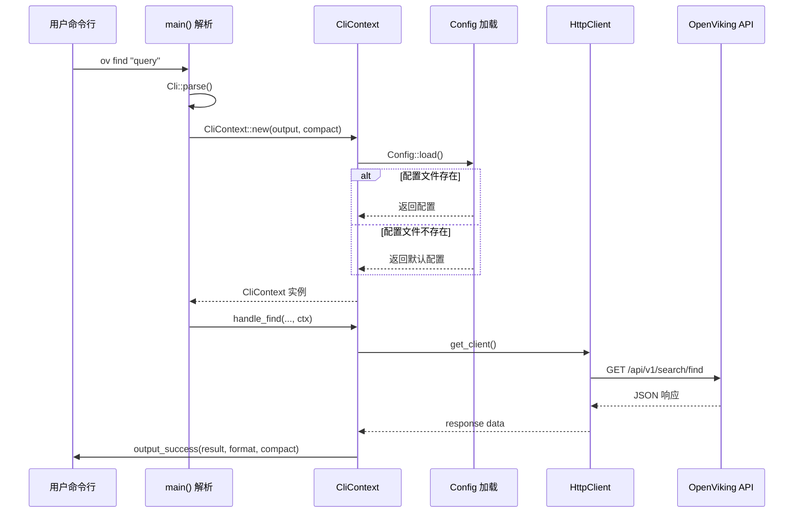

# cli_runtime_context 模块技术深度解析

> 本文档面向刚加入团队的高级工程师。你能读懂代码，但我需要解释设计意图、架构角色，以及那些不显而易见的选择背后的"为什么"。

## 1. 这个模块解决了什么问题？

在构建一个 CLI 工具时，我们面临一个基本的组织问题：**命令处理器（command handlers）需要访问各种共享资源**——配置文件、API 客户端、输出格式设置。如果每个命令都单独获取这些资源，代码会变得重复且难以维护。

想象一下：你走进一家餐厅，服务员（CLI 入口）不需要每次都重新学习厨房在哪里、菜单是什么、服务规则有哪些。所有这些"上下文"信息在餐厅营业前就已经配置好了，服务员只需要把这个上下文传递给每一桌客人（命令处理器）。

**`CliContext` 就是这个"餐厅运营上下文"**——它封装了所有命令处理器都需要的基础设施，让每个命令处理器都能专注于自己的业务逻辑。

### 问题空间的具体表现

OpenViking CLI 面临的实际问题是：
- 不同的命令需要连接同一个后端服务器（`HttpClient`）
- 需要知道服务器的 URL、API Key、Agent ID（来自 `Config`）
- 需要知道用户偏好的输出格式（table 还是 json）
- 需要知道是否使用紧凑模式来简化输出

如果没有统一的上下文，每次写新命令都要重复传递这些参数：

```rust
// 没有 CliContext 的糟糕情况
async fn handle_add_resource(..., url: &str, api_key: &str, agent_id: &str, output_format: OutputFormat, compact: bool) { ... }
async fn handle_add_skill(..., url: &str, api_key: &str, agent_id: &str, output_format: OutputFormat, compact: bool) { ... }
async fn handle_ls(..., url: &str, api_key: &str, agent_id: &str, output_format: OutputFormat, compact: bool) { ... }
// ... 30+ 个命令
```

**`CliContext` 将这些横切关注点（cross-cutting concerns）提取到一个统一的地方。**

## 2. 心理模型：把 CliContext 想象成什么？

### 类比：航空公司的"旅客档案"

当你办理登机手续时，航空公司会创建一个**旅客档案**，里面包含：
- 你的身份信息（姓名、护照号）→ 类似 `Config`
- 你的舱位等级（经济/商务）→ 类似 `OutputFormat`
- 你的特殊需求（素食、轮椅）→ 类似各种标志位

这个档案会跟随你整个旅程：值机、安检、登机、空服、行李提取。每个环节的工作人员不需要重新询问你的信息，只需要读取这份档案。

**`CliContext` 就是 CLI 工具的"旅客档案"**——它随着命令的执行一路传递，让每个处理环节都能获取所需的基础设施信息。

### 核心抽象

```
┌─────────────────────────────────────────────────────┐
│                    CliContext                        │
├─────────────────────────────────────────────────────┤
│  config: Config        ← 服务器连接配置             │
│  output_format: OutputFormat  ← 输出格式（table/json）│
│  compact: bool         ← 是否使用紧凑模式           │
├─────────────────────────────────────────────────────┤
│  get_client() → HttpClient  ← 工厂方法              │
└─────────────────────────────────────────────────────┘
```

## 3. 数据是如何流动的？

### 完整的请求生命周期



### 具体的数据流转步骤

**步骤 1：命令行解析**
`main()` 函数使用 `clap` 库解析命令行参数，得到 `Cli` 结构体：

```rust
let cli = Cli::parse();
// cli.output (OutputFormat)
// cli.compact (bool)
// cli.command (具体的命令枚举)
```

**步骤 2：创建运行时上下文**
将解析出的参数传递给 `CliContext::new()`：

```rust
let ctx = CliContext::new(output_format, compact)?;
```

在 `CliContext::new()` 内部，会**立即加载配置文件**：

```rust
pub fn new(output_format: OutputFormat, compact: bool) -> Result<Self> {
    let config = Config::load()?;  // 这里是关键！
    Ok(Self { config, output_format, compact })
}
```

**步骤 3：命令分发与执行**
`main()` 根据解析出的命令类型，调用相应的 handler 函数，并**传递 ctx 引用**：

```rust
match cli.command {
    Commands::Ls { uri, ... } => handle_ls(uri, ctx).await,
    Commands::AddResource { ... } => handle_add_resource(..., ctx).await,
    // ...
}
```

**步骤 4：Handler 内部获取 HttpClient**
每个 handler 内部，按需从 context 获取 HTTP 客户端：

```rust
async fn handle_ls(uri: String, ctx: CliContext) -> Result<()> {
    let client = ctx.get_client();  // 按需创建
    let result = client.ls(&uri, ...).await?;
    output::output_success(result, ctx.output_format, ctx.compact);
    Ok(())
}
```

### 关键依赖关系

**谁依赖 CliContext（依赖方）：**
- `main()` 函数 —— 创建并传递 context
- 所有命令 handler 函数 —— 接收 context 作为参数

**CliContext 依赖谁（被依赖方）：**
- `Config` —— 配置文件加载
- `OutputFormat` —— 输出格式枚举（定义在 `output.rs`）
- `HttpClient` —— 通过 `get_client()` 工厂方法创建

## 4. 设计决策与权衡

### 决策一：Config 在 Context 创建时 eager 加载

**选择：** 在 `CliContext::new()` 中立即调用 `Config::load()`

**为什么这样做：**
- **快速失败原则**：如果配置文件缺失或格式错误，我们希望在程序启动时立即报错，而不是等到用户执行某个命令才发现
- **简化状态管理**：避免了"Context 创建成功但 Config 加载失败"的中间状态

**权衡：**
- 启动时会有轻微的 I/O 开销（读取配置文件）
- 即使命令不需要网络（如 `ov config show`），也会加载配置

**替代方案考虑：**
- 懒加载（lazy loading）：等到真正需要时才加载配置
- 结论：对于 CLI 工具，启动时读取配置文件是合理的，因为用户启动 CLI 通常就是要执行命令

### 决策二：HttpClient 每次调用都重新创建

**选择：** `get_client()` 每次调用都创建新的 `HttpClient` 实例

```rust
pub fn get_client(&self) -> client::HttpClient {
    client::HttpClient::new(
        &self.config.url,
        self.config.api_key.clone(),
        self.config.agent_id.clone(),
        self.config.timeout,
    )
}
```

**为什么这样做：**
- **避免状态共享问题**：`reqwest::Client` 虽然内部可以复用连接，但它的配置（timeout、代理等）是在创建时固定的。如果要支持运行时更改配置，每次创建新的实例更简单
- **简化为准**：对于 CLI 工具，每次命令执行的网络请求量不大，重新创建客户端的开销可以忽略不计
- **配置一致性**：确保每次获取的 client 都反映最新的配置（如果用户修改了配置文件并重新执行命令）

**权衡：**
- 轻微的性能开销（创建 `reqwest::Client`）
- 无法复用连接池

**替代方案考虑：**
- 在 Context 创建时缓存 HttpClient
- 结论：当前方案更简单，且适合 CLI 的使用模式（单次命令执行，偶尔调用）

### 决策三：CliContext 必须实现 Clone

**选择：** `#[derive(Debug, Clone)]`

```rust
#[derive(Debug, Clone)]
pub struct CliContext {
    pub config: Config,
    pub output_format: OutputFormat,
    pub compact: bool,
}
```

**为什么这样做：**
- **Async 函数传递**：Rust 的 async 函数参数是按值传递的（move semantics）。如果 Context 不是 Clone 的，每个 handler 都会"吃掉"这个 context，导致后续无法使用
- **Handler 转发**：有时一个 handler 可能会调用另一个 handler（内部函数），Clone 使得这种转发变得自然

**权衡：**
- `Config` 也必须 Clone（它确实实现了）
- `OutputFormat` 是 Copy 的（因为是简单的枚举）

**这是一个务实的设计选择**：在 CLI 场景中，Context 很轻量（只是几个字段的拷贝），Clone 的开销可以忽略不计。

### 决策四：配置文件的默认路径

**选择：** `~/.openviking/ovcli.conf`

```rust
pub fn default_config_path() -> Result<PathBuf> {
    let home = dirs::home_dir()
        .ok_or_else(|| Error::Config("Could not determine home directory".to_string()))?;
    Ok(home.join(".openviking").join("ovcli.conf"))
}
```

**为什么这样做：**
- 遵循 Unix 惯例（dotfiles 在主目录）
- 允许多用户系统下每个用户有不同的配置
- 与 `dirs` crate 配合，跨平台兼容

## 5. 新贡献者需要警惕什么？

### Edge Cases 和 Gotchas

**1. 配置加载失败会导致程序退出**

如果配置文件存在但格式错误，`CliContext::new()` 会返回错误：

```rust
let ctx = match CliContext::new(output_format, compact) {
    Ok(ctx) => ctx,
    Err(e) => {
        eprintln!("Error: {}", e);
        std::process::exit(2);  // 退出码 2 表示配置错误
    }
};
```

这意味着即使 `ov --help` 这样的命令，如果配置文件损坏也会失败。

**2. compact 标志的默认值是 true**

```rust
#[arg(short, long, global = true, default_value = "true")]
compact: bool,
```

这是一个**有意的设计选择**：默认情况下，CLI 输出简洁的格式，更适合程序化处理（如被其他工具调用）。如果用户想要完整的 JSON 输出，需要显式指定 `--no-compact` 或使用 `--output json`。

**3. get_client() 每次都克隆配置字符串**

```rust
pub fn get_client(&self) -> client::HttpClient {
    client::HttpClient::new(
        &self.config.url,
        self.config.api_key.clone(),  // 每次都 clone
        self.config.agent_id.clone(), // 每次都 clone
        self.config.timeout,
    )
}
```

这是因为 `Option<String>` 需要所有权才能传递给新的 HttpClient。对于 CLI 工具这不是问题（请求量小），但如果你要在高性能服务中使用这种模式，需要注意这个 allocation。

**4. 隐藏的全局参数**

`output` 和 `compact` 都标记了 `global = true`：

```rust
#[arg(short, long, value_enum, default_value = "table", global = true)]
output: OutputFormat,

#[arg(short, long, global = true, default_value = "true")]
compact: bool,
```

这意味着这些参数可以在子命令之前或之后指定：

```bash
ov --output json ls /foo     # 正确
ov ls --output json /foo     # 也正确
ov ls /foo --output json     # 同样正确
```

**5. 本地路径与远程 URL 的特殊处理**

在 `handle_add_resource` 中有一段特殊逻辑：

```rust
if !path.starts_with("http://") && !path.starts_with("https://") {
    // 检查本地路径是否存在
    // 还处理了反斜杠转义空格的情况
}
```

这是为了帮助用户诊断常见的错误（忘记给包含空格的路径加引号）。

### 隐式契约

**1. Config 必须实现 Default**

因为 `Config::load()` 会在配置文件不存在时返回默认值：

```rust
pub fn load_default() -> Result<Self> {
    let config_path = default_config_path()?;
    if config_path.exists() {
        Self::from_file(&config_path.to_string_lossy())
    } else {
        Ok(Self::default())  // 依赖 Default 实现
    }
}
```

如果你添加新字段到 `Config`，必须给它一个合理的默认值或使用 `#[serde(default)]`。

**2. HttpClient 是 Clone 的**

```pub struct HttpClient {
    http: ReqwestClient,
    // ...
}

impl Clone for HttpClient {
    fn clone(&self) -> Self { ... }
}
```

这允许 context 在多个 async 任务之间共享。但注意：`reqwest::Client` 的 clone 实际上会共享连接池，这是预期的行为。

## 6. 架构角色总结

`cli_runtime_context` 模块在整体架构中的角色是：

| 角色 | 说明 |
|------|------|
| **依赖注入容器** | 封装所有命令处理器需要的基础设施 |
| **配置管理器** | 统一管理应用级配置（服务器 URL、API Key 等） |
| **状态携带者** | 在命令执行过程中传递运行时状态 |
| **工厂方法提供者** | 提供 HttpClient 的创建工厂 |

它是 CLI 应用从"解析参数"到"执行命令"之间的**关键桥梁**——一端连接命令行参数，另一端连接具体的命令处理器。

## 7. 相关模块参考

- [cli-configuration-management](./cli-configuration-management.md) —— Config 的详细设计
- [cli-command-structure](./cli_bootstrap_and_runtime_context-cli_command_structure.md) —— 命令枚举和解析
- [http-client](./http_api_and_tabular_output-http_client.md) —— HttpClient 的完整实现
- [output-formatting](./http_api_and_tabular_output-output_formatting.md) —— OutputFormat 和表格渲染