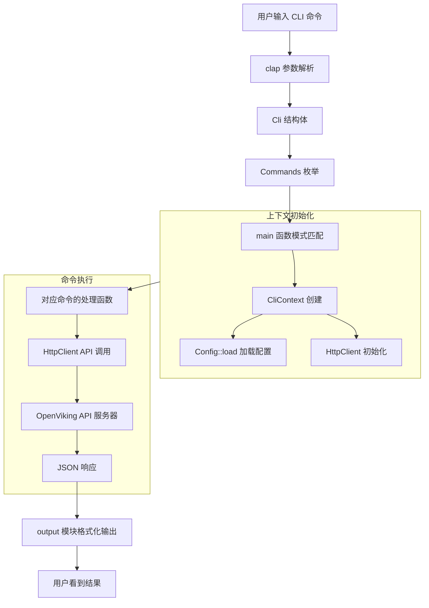

# cli_command_structure 模块技术深潜

## 模块定位与问题空间

想象一下你走进一家大型医院的挂号窗口：窗口后的工作人员需要理解患者说什么，然后把这个请求分发到对应的科室——挂号处、药房、放射科、住院部。`cli_command_structure` 模块就是 OpenViking CLI 的「挂号窗口」：它站在用户与系统之间，负责听懂用户用自然语言表达的意图（`ov add-resource ./docs`、`ov find "authentication"`），把这些意图翻译成结构化的指令，然后分发给下游的处理函数。

这个模块解决的问题是**命令路由的标准化问题**。在没有一个统一入口的情况下，每个子命令可能都需要自己解析参数、自己初始化 HTTP 客户端、自己处理错误。想象如果每个科室都自己派人去挂号窗口抢患者信息，那会是怎样的混乱。这个模块提供的价值是**：把所有命令的公共基础设施（参数解析、上下文初始化、错误处理）抽取出来，让每个具体的命令处理器只需要关注业务逻辑**。

更具体地说，这个模块解决了三个核心问题：

1. **参数解析的一致性**：使用 `clap` 库将命令行参数映射为结构化的 Rust 类型，避免了手写字符串解析的繁琐和错误
2. **运行时上下文的统一初始化**：`CliContext` 在程序启动时创建一次，包含配置、HTTP 客户端、输出格式等所有命令都需要的资源
3. **命令到处理函数的路由**：通过模式匹配将枚举成员路由到具体的异步处理函数

## 架构概览与数据流



### 组件角色分析

**Cli 结构体**（第 76-91 行）是整个 CLI 的入口点。它使用 `clap` 的 `#[derive(Parser)]` 自动生成命令行参数解析逻辑。这个结构体定义了两个全局参数：`--output` 控制输出格式（table 或 json），`--compact` 控制是否使用紧凑表示。然后通过 `#[command(subcommand)]` 委托给 `Commands` 枚举。

**Commands 枚举**（第 93-277 行）是整个模块中最显眼的部分——它用近 200 行定义了 OpenViking CLI 的全部命令集合。这个枚举的每个变体都对应一个具体的 CLI 子命令，变体内部携带该命令所需的全部参数。例如，`AddResource` 变体包含了 `path`、`to`、`reason`、`instruction`、`wait`、`timeout` 等 12 个参数。这种设计的好处是**类型安全**：如果在编译后添加一个新参数但忘记更新某个处理函数，编译器会直接报错。

**CliContext**（第 32-50 行）是运行时上下文的容器。它的设计体现了「资源一次初始化，多次使用」的原则。`Config::load()` 只在上下文创建时调用一次，`HttpClient` 也只初始化一次，然后通过 `get_client()` 方法分发给各个命令。这种设计避免了在每个命令处理函数中重复初始化配置和 HTTP 客户端的开销。

## 核心组件深度解析

### Cli 与 Commands：声明式命令行定义

```rust
#[derive(Parser)]
#[command(name = "openviking")]
#[command(about = "OpenViking - An Agent-native context database")]
#[command(version = env!("CARGO_PKG_VERSION"))]
#[command(arg_required_else_help = true)]
struct Cli { ... }
```

`Cli` 结构体使用了 `clap` 库的声明式宏。`clap` 是 Rust 生态中最成熟的 CLI 参数解析库，它的工作方式类似于 Python 的 `argparse` 或 TypeScript 的 `commander`，但通过宏在编译时生成解析代码。**这里的关键设计决策是「声明式优于编程式」**：你不需要写代码去解析 `env::args()`，只需要声明参数的结构和约束，编译器会为你生成高效的解析逻辑。

`arg_required_else_help = true` 是一个体贴的设计：如果你运行 `openviking` 不带任何子命令，它会自动打印帮助信息而不是报错。这降低了新用户的上手门槛。

**Commands 枚举的设计考量**：

- **嵌套子命令**：通过 `System { action: SystemCommands }` 这样的模式，实现了二级子命令（`ov system status`、`ov system wait`）。这种设计在 CLI 工具中很常见，类似于 `git remote add` 中的 `remote` 是一级命令，`add` 是二级命令。
- **参数默认值**：大量使用 `#[arg(long, default_value = "...")]` 为可选参数提供默认值。这样用户不需要为每个参数指定值，CLI 仍然能工作。
- **命令别名**：`#[command(alias = "list")]` 允许用户用 `ov ls` 或 `ov list` 两种方式调用同一命令，这考虑到了不同用户的习惯。

### CliContext：共享状态的容器

```rust
pub struct CliContext {
    pub config: Config,
    pub output_format: OutputFormat,
    pub compact: bool,
}
```

`CliContext` 的设计体现了一个简单的**门面模式**（Facade Pattern）：它封装了配置、输出格式等所有命令都可能需要的资源，对外提供统一的接口。调用者不需要知道配置从哪里加载、HTTP 客户端如何创建，只需要调用 `ctx.get_client()` 就能获得一个可用的客户端。

**一个重要的设计细节**：`CliContext::new()` 返回 `Result<Self>`。这意味着配置加载失败会导致整个程序无法启动。这是一个**快速失败**（fail-fast）的策略：如果配置有问题，与其让程序在执行过程中某个命令时突然报错，不如在启动时就明确告知用户配置有问题。

### main 函数的命令分发模式

```rust
let result = match cli.command {
    Commands::AddResource { path, to, reason, ... } => {
        handle_add_resource(path, to, reason, ...).await
    }
    Commands::AddSkill { data, wait, timeout } => {
        handle_add_skill(data, wait, timeout, ctx).await
    }
    // ... 其他命令
};
```

main 函数中的模式匹配是整个模块的**调度中心**。这里有一个值得注意的设计选择：**每个命令都有一个专门的处理函数**（如 `handle_add_resource`、`handle_add_skill`），而不是直接在 match 分支中写业务逻辑。

这种「分离调度与执行」的设计有几点好处：

1. **main 函数保持简洁**：如果不分离，main 会膨胀到上千行
2. **便于测试**：可以单独测试每个处理函数
3. **代码复用**：如果某个命令需要被多个入口调用（比如 `Commands::Wait` 和 `SystemCommands::Wait` 都调用 `commands::system::wait`），处理函数可以被复用

但这种设计也有代价：**新增一个命令需要在两个地方修改**——在 Commands 枚举中添加变体，在 main 的 match 中添加处理逻辑。对于大型 CLI 工具，这可能是一个维护负担。

## 依赖分析与契约

### 上游依赖：谁调用这个模块？

从模块树可以看出，这个模块是 `cli_bootstrap_and_runtime_context` 的子模块，被 `crates.ov_cli.src.main` 直接引用。实际上，**这个模块就是 main.rs 本身**，它的「上游」就是运行 CLI 的用户。

### 下游依赖：这个模块调用什么？

| 依赖模块 | 作用 | 依赖方式 |
|---------|------|---------|
| `clap` | CLI 参数解析 | 直接使用 `#[derive(Parser)]` 和 `#[derive(Subcommand)]` 宏 |
| `config::Config` | 配置加载与管理 | `Config::load()` 在 `CliContext::new()` 中调用 |
| `client::HttpClient` | HTTP API 调用 | 通过 `ctx.get_client()` 获取 |
| `output::OutputFormat` | 输出格式控制 | 作为 `CliContext` 的字段和参数传递 |
| `commands::*` | 具体业务逻辑 | 函数调用，每个命令对应一个模块 |

### 数据契约

**输入契约**：

- 命令行参数：符合 `clap` 定义的语法
- 配置文件：JSON 格式，位于 `~/.openviking/ovcli.conf`

**输出契约**：

- 成功时通过 `output_success()` 输出格式化结果
- 失败时打印错误信息并以非零退出码退出

## 设计决策与权衡

### 1. 大型枚举 vs 动态命令注册

`Commands` 枚举目前定义了超过 30 个子命令。这是一个**静态路由**的设计——所有命令在编译时已知。

**为什么这样做？**

- **类型安全**：枚举变体在编译时检查，任何未处理的命令变体都会产生编译警告
- **性能**：没有运行时查找表，命令分发就是一次简单的枚举查表
- **可维护性**：所有命令都列在一起，新增命令时很容易发现哪些地方需要修改

**潜在的痛点**：

- 当命令超过几百个时，枚举会变得难以管理
- 如果需要支持用户自定义命令或插件，这种静态设计不适用

### 2. 同步配置加载 vs 延迟加载

`Config::load()` 在 `CliContext::new()` 中**同步执行**。这意味着程序启动时会阻塞等待配置文件读取完成。

**选择同步加载的理由**：

- 配置文件通常很小（几KB），读取速度很快
- 大多数命令都需要配置信息，延迟加载不会节省太多时间
- 同步代码比异步代码更简单，出错更容易调试

**如果未来需要支持更大的配置（比如需要从远程服务器拉取配置），可以考虑改为异步加载**。

### 3. 紧凑模式（compact）的双重语义

`--compact` 参数在代码中有多重含义：

1. 对于 JSON 输出：使用紧凑的单行 JSON 而不是格式化后的多行 JSON
2. 对于 Table 输出：使用简化表示，过滤掉空值列
3. 对于 API 调用：决定使用 `"agent"` 还是 `"original"` 格式的 API 输出

这种多功能设计是**实用主义**的体现——用一个参数控制多种「简化」行为。但这也意味着 `compact` 的确切含义依赖于输出目标和上下文。新加入的开发者可能需要追踪代码才能理解 `--compact` 的完整效果。

## 边缘情况与陷阱

### 1. 路径中的空格处理

代码中有一个**非常贴心的用户交互设计**（第 387-411 行）：

```rust
// Unescape path: replace backslash followed by space with just space
let unescaped_path = path.replace("\\ ", " ");
let path_obj = Path::new(&unescaped_path);
if !path_obj.exists() {
    // 检查用户是否忘记了给包含空格的路径加引号
    // 打印友好的错误提示
}
```

当你运行 `ov add-resource /path/with spaces/file.txt` 时，Shell 可能会把 `/path/with` 解析为 path 参数，把 `spaces/file.txt` 解析为额外的位置参数。代码会检测这种情况并给出**友好的错误提示**，建议用户使用引号：

```
Suggested command: ov add-resource "/path/with spaces/file.txt"
```

这是**优秀的 CLI 交互设计**——不仅报错，还教用户怎么修。

### 2. 错误退出码的语义

```rust
match CliContext::new(output_format, compact) {
    Ok(ctx) => ctx,
    Err(e) => {
        eprintln!("Error: {}", e);
        std::process::exit(2);  // 配置错误
    }
};

if let Err(e) = result {
    eprintln!("Error: {}", e);
    std::process::exit(1);  // 命令执行错误
}
```

程序使用两个不同的退出码：

- **退出码 2**：配置或初始化失败（程序根本无法开始执行命令）
- **退出码 1**：命令执行失败（程序运行了但没成功）

这种区分对于脚本化调用 CLI 很有用——脚本可以根据退出码决定后续动作。

### 3. 全局参数的作用域

注意 `#[arg(global = true)]` 在 `output` 和 `compact` 参数上的使用：

```rust
#[arg(short, long, value_enum, default_value = "table", global = true)]
output: OutputFormat,

#[arg(short, long, global = true, default_value = "true")]
compact: bool,
```

`global = true` 的含义是：这个参数可以在子命令之前或之后指定。例如，`ov -o json add-resource ./file` 和 `ov add-resource -o json ./file` 都是合法的。这提供了一定的灵活性，但也在解析顺序上带来一些复杂性。

### 4. 超时参数的默认值处理

`Commands::AddResource` 中的 `timeout` 参数没有默认值：

```rust
#[arg(long)]
timeout: f64,
```

但 `handle_add_resource` 函数内部会使用一个默认值：

```rust
commands::resources::add_resource(
    &client, &path, to, reason, instruction, wait,
    Some(timeout),  // 这里 timeout 来自 CLI 参数
    ...
)
```

而在 `commands::resources::add_resource` 内部，如果传入的是 `None`（虽然这里不会发生，因为 clap 已经要求这个参数），会使用一个默认超时值。这种**参数级别的默认值与应用级别的默认值分离**的设计有时会造成混淆。

## 扩展点与演化建议

### 新增命令的步骤

如果要添加一个新命令（比如 `ov bookmark`），需要修改以下位置：

1. **Commands 枚举**：添加 `Bookmark { uri: String, ... }` 变体
2. **main 模式匹配**：添加 `Commands::Bookmark { ... } => handle_bookmark(...).await` 分支
3. **commands/mod.rs**：添加 `pub mod bookmark;`
4. **创建 commands/bookmark.rs**：实现具体的处理函数
5. **可选**：添加单元测试

这是一个**手动化的流程**，对于大型 CLI 可能会变得繁琐。如果未来命令数量快速增长，可以考虑使用**过程宏**或**命令注册表**模式来自动化这部分工作。

### 考虑异步洪泛问题

目前所有命令处理函数都是 `async fn`，但 `clap` 本身是同步的。如果将来需要支持**命令并行执行**（比如用户一次提交多个 `ov` 命令），当前的架构需要调整。

## 与相邻模块的关系

- **[cli_bootstrap_and_runtime_context](./cli_bootstrap_and_runtime_context.md)**：父模块，包含了 CLI 启动和运行时上下文的整体设计
- **[cli_runtime_context](./cli_bootstrap_and_runtime_context-cli_runtime_context.md)**：详细介绍 `CliContext` 的设计与实现
- **[cli_configuration_management](./cli_bootstrap_and_runtime_context-cli_configuration_management.md)**：详细介绍配置管理（`Config` 结构体）
- **[http_client](./rust_cli_interface-http_client.md)**：详细介绍 HTTP 客户端的实现
- **[output_formatting](./rust_cli_interface-output_formatting.md)**：详细介绍输出格式化逻辑

## 小结

`cli_command_structure` 模块是 OpenViking CLI 的大脑半球：它负责接收用户的命令行输入，理解用户的意图，并把这个意图转化为可执行的动作。这个模块的核心价值不是执行具体的业务逻辑（那是 `commands/` 目录下各模块的事），而是**提供一个可靠的、可维护的、可扩展的命令接入点**。

它的设计体现了 Rust 生态中 CLI 开发的最佳实践：使用 `clap` 进行类型安全的参数解析，使用模式匹配进行命令分发，使用结构体封装共享状态。对于即将加入团队的新开发者，理解这个模块的关键是理解 **「声明式定义 + 模式匹配分发」** 这个核心范式——一旦掌握了这个范式，添加新命令或修改现有命令都将变得直观而安全。