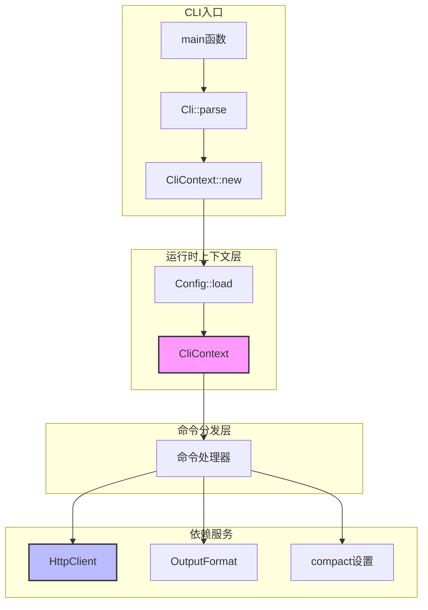

# cli_runtime_context 模块技术深度解析

## 概述

`cli_runtime_context` 模块是 OpenViking CLI 的**运行时上下文层**，它在 CLI 程序启动时被初始化，然后作为"管道"将配置、输出格式偏好和 HTTP 客户端工厂传递给所有命令处理器。想象一下，它就像是餐厅的服务员——顾客（CLI 命令）到来后，服务员负责记住顾客的座位偏好（配置）、点餐习惯（输出格式），并协调后厨（HTTP 客户端）准备菜品。这个模块解决的问题是：**如何避免在每个命令处理器中重复传递相同的配置和初始化逻辑，同时保持命令处理的纯粹性**。

---

## 架构角色与设计意图

### 问题空间

在没有统一的运行时上下文之前，每个 CLI 命令都需要独立完成以下工作：

1. 读取配置文件
2. 解析输出格式选项
3. 实例化 HTTP 客户端
4. 处理超时配置

这种模式导致代码重复不说，更严重的是——如果配置加载方式改变（比如从 JSON 改为 YAML），或者 HTTP 客户端的构造逻辑调整（添加重试机制、代理支持），所有命令处理器都需要同步修改。这违反了软件设计中的**单一职责原则**和**开闭原则**。

### 设计洞察

`CliContext` 的设计核心洞察是：**CLI 程序的整个生命周期共享同一套运行时配置**。用户在启动 CLI 时指定一次配置（如 `--output json`），这个配置就应该贯穿整个命令执行过程。`CliContext` 正是基于这个洞察，将所有"全局"状态封装到一个结构体中。



---

## 核心组件剖析

### CliContext 结构体

```rust
#[derive(Debug, Clone)]
pub struct CliContext {
    pub config: Config,
    pub output_format: OutputFormat,
    pub compact: bool,
}
```

**设计意图**：这三个字段代表了 CLI 运行时最核心的"环境变量"：

- **`config: Config`**：从配置文件加载的持久化配置，包括服务端 URL、API 密钥、超时设置等
- **`output_format: OutputFormat`**：用户指定的输出格式（Table 或 JSON），影响所有命令的输出行为
- **`compact: bool`**：是否使用紧凑表示——对于 JSON 输出会压缩，对于 Table 输出会简化列信息

**为什么这三个字段在一起？** 它们都是"CLI 级别"的全局配置，与具体命令无关。如果未来需要添加第四个全局配置项（比如 `--verbose` 级别），它也应该加入这个结构体。

### new() 构造方法

```rust
impl CliContext {
    pub fn new(output_format: OutputFormat, compact: bool) -> Result<Self> {
        let config = Config::load()?;
        Ok(Self {
            config,
            output_format,
            compact,
        })
    }
}
```

**关键设计决策**：配置加载是**惰性的**——只有当用户真正执行命令时才会加载配置。这与"立即加载"形成对比，立即加载的优点是启动时就能发现配置错误，缺点是即使只是 `ov --help` 也会触发文件读取。`CliContext::new` 选择惰性加载，是因为用户可能只是查看帮助信息，不需要完整配置。

**错误处理**：如果 `Config::load()` 失败，构造会返回 `Result<Self>`，这意味着配置错误会导致 CLI 无法启动。这是合理的设计——没有有效配置，CLI 根本无法与服务器通信。

### get_client() 工厂方法

```rust
pub fn get_client(&self) -> client::HttpClient {
    client::HttpClient::new(
        &self.config.url,
        self.config.api_key.clone(),
        self.config.agent_id.clone(),
        self.config.timeout,
    )
}
```

**设计意图**：HTTP 客户端不是预先创建好的，而是每次调用时按需创建。这背后有一个重要的考量——**连接复用与生命周期管理**。

**为什么不缓存 HttpClient？**

1. **async/await 上下文**：在 async Rust 中，客户端通常需要与特定的运行时绑定
2. **轻量级构造**：`HttpClient` 内部使用 `reqwest`，其 `Client` 类型本身就是连接池，构造开销很低
3. **灵活性**：如果将来需要为不同命令使用不同的超时设置，可以轻松修改

**Tradeoff**：每次调用都创建新客户端会有轻微的性能开销，但在 CLI 场景下可以忽略不计——用户执行一条命令后进程就结束了，连接复用收益不大。

---

## 数据流分析

### 典型命令执行流程

以 `ov add-resource /path/to/file` 为例，数据流如下：

```
1. CLI 参数解析
   ├── Cli::parse() 解析命令行参数
   └── 提取 output_format 和 compact

2. 上下文初始化
   ├── CliContext::new(output_format, compact)
   ├── Config::load() 读取配置文件
   └── 返回包含配置、输出格式的上下文

3. 命令分发
   ├── main() 根据 Commands 枚举匹配到 AddResource
   ├── 调用 handle_add_resource(..., ctx)
   └── 传递整个 CliContext 而非单独字段

4. 命令执行
   ├── ctx.get_client() 创建 HttpClient
   ├── client.add_resource(...) 发送 HTTP 请求
   └── output_success(result, ctx.output_format, ctx.compact) 输出结果
```

**关键观察**：整个数据流是**单向的**——从入口流向命令处理器，命令处理器不修改上下文（`CliContext` 是 `Clone` 的，但修改会创建新实例）。这确保了命令执行的**幂等性**和**可预测性**。

### 与其他模块的契约

**依赖关系**：

| 模块 | 关系 | 说明 |
|------|------|------|
| `Config` | 依赖 | `CliContext::new` 调用 `Config::load()` |
| `HttpClient` | 依赖 | `get_client()` 工厂方法创建实例 |
| `OutputFormat` | 依赖 | 通过构造参数传入，存储为字段 |

**被依赖关系**：

| 模块 | 关系 | 说明 |
|------|------|------|
| main.rs | 被依赖 | 创建 CliContext 并传递给所有 handle_* 函数 |
| commands/* | 被依赖 | 通过参数接收 CliContext，提取需要的信息 |

---

## 设计决策与权衡

### 1. 结构体 vs trait 对象

`CliContext` 是一个具体的结构体，而不是 trait 对象。这是有意的设计：

- **优点**：零动态分发开销，编译器内联优化，类型安全
- **缺点**：如果将来需要支持不同的"context 实现"（比如用于测试的 mock context），会需要泛型或 trait object

**选择理由**：CLI 场景下不存在多种"context 实现"的需求。测试时可以直接构造真实的 `CliContext`，无需 mock。

### 2. Clone vs 不可变

`CliContext` 派生了 `Clone` trait，但默认情况下它是通过引用传递的：

```rust
async fn handle_add_resource(..., ctx: CliContext) -> Result<()>
```

**设计意图**：`Clone` 存在主要是为了：
- 命令处理器内部需要多次调用 `get_client()` 时，可以 cloned 一份
- 将来如果需要并行执行多个命令，每个任务可以拥有独立的上下文拷贝

### 3. 紧凑模式的设计

`compact` 字段是一个有趣的**用户体验设计**：

- **Table 输出**：紧凑模式下只显示关键列，隐藏冗余信息
- **JSON 输出**：紧凑模式下使用更简洁的 JSON（可能移除某些字段）

这种二元对立（紧凑 vs 完整）的设计，降低了用户的认知负担——不需要记住复杂的输出控制选项。

---

## 使用指南与最佳实践

### 如何扩展 CliContext

如果需要添加新的全局配置（比如 `--verbose` 日志级别），步骤如下：

1. 在 `CliContext` 结构体中添加字段：`pub verbose: u8`
2. 在 `Cli::new()` 中解析该参数
3. 在 `CliContext::new()` 中接收并存储
4. 命令处理器通过 `ctx.verbose` 访问

### 常见使用模式

**模式一：提取单个字段**
```rust
async fn handle_something(ctx: CliContext) -> Result<()> {
    let client = ctx.get_client();
    let format = ctx.output_format;
    let compact = ctx.compact;
    // ... 使用这些值
}
```

**模式二：传递整个上下文**
```rust
async fn handle_something(ctx: CliContext) -> Result<()> {
    some_helper(&ctx).await
}

async fn some_helper(ctx: &CliContext) -> Result<()> {
    // 可以访问 ctx 的任何部分
}
```

---

## 边缘情况与注意事项

### 1. 配置加载失败

如果配置文件不存在或格式错误，`CliContext::new()` 会返回错误：

```rust
let ctx = match CliContext::new(output_format, compact) {
    Ok(ctx) => ctx,
    Err(e) => {
        eprintln!("Error: {}", e);
        std::process::exit(2);  // 退出码 2 表示配置错误
    }
};
```

**注意**：main 函数中退出码是 2，而命令执行失败的退出码是 1。这是 Unix 惯例的体现。

### 2. 空 API Key

`Config.api_key` 是 `Option<String>`。如果用户未配置 API key：

- `get_client()` 会创建**不带认证**的 HTTP 客户端
- 服务器可能会拒绝请求，返回 401 错误
- 错误信息会从服务器端返回，而非客户端提前验证

**潜在改进**：可以在 `get_client()` 中添加预检查，如果 api_key 为 None 且命令需要认证，提前报错。

### 3. 超时配置

超时是 `f64` 类型，单位是秒，支持小数：

```rust
pub timeout: f64,
```

这允许灵活的配置，如 `0.5`（500ms）、`30.0`（30秒）。但也带来了边界情况——`0.0` 超时可能被解释为"无超时"或"立即超时"，取决于具体实现。

### 4. compact 的默认值

在 CLI 定义中：

```rust
#[arg(short, long, global = true, default_value = "true")]
compact: bool,
```

**默认值是 `true`**。这意味着默认行为是紧凑输出。这是为了**减少噪音**——大多数用户不需要看到完整的 JSON 结构化输出。

---

## 相关模块参考

- **[cli_bootstrap_and_runtime_context-cli_command_structure](cli_bootstrap_and_runtime_context-cli_command_structure.md)**：了解 Commands 枚举和命令解析
- **[cli_bootstrap_and_runtime_context-cli_configuration_management](cli_bootstrap_and_runtime_context-cli_configuration_management.md)**：深入了解 Config 的加载逻辑和配置文件格式
- **[rust_cli_interface-http_client](rust_cli_interface-http_client.md)**：HttpClient 的内部实现和连接池管理

---

## 总结

`CliContext` 是 OpenViking CLI 的**依赖注入容器**，它将全局配置、输出偏好和 HTTP 客户端工厂打包在一起，传递给所有命令处理器。它的设计遵循了**简单优先**的原则——没有过度抽象，没有动态分发，只有清晰的职责划分。理解这个模块，是理解整个 CLI 架构的钥匙。