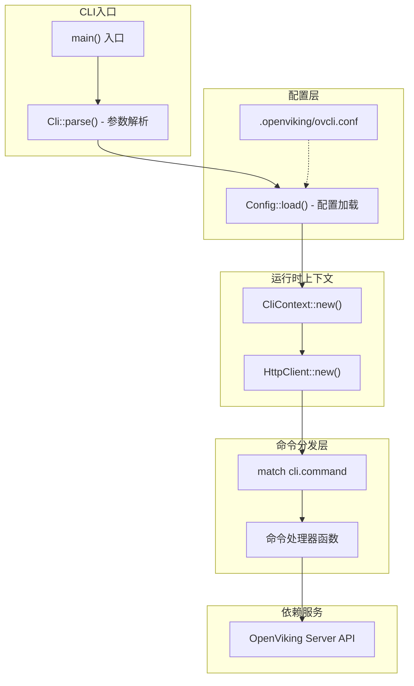
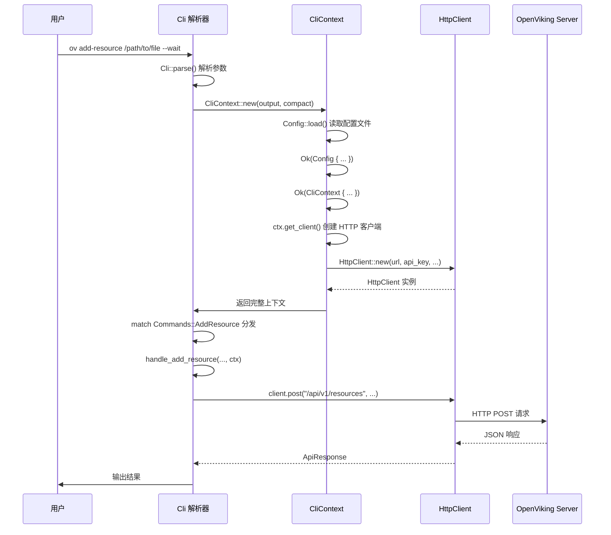

# cli_bootstrap_and_runtime_context 模块深度解析

## 概述

`cli_bootstrap_and_runtime_context` 模块是 OpenViking CLI 的**启动引擎和运行时上下文中枢**。如果你把整个 CLI 应用比作一家餐厅，那么这个模块做的事情类似于：迎接客人（解析命令行参数）、确认客人身份（加载配置）、然后把客人领到对应的餐桌（创建运行时上下文并分发给命令处理器）。

这个模块解决的核心问题是：**如何将用户的命令行意图，转化为对后端 API 的具体调用，并优雅地处理输出**。它不关心具体的业务逻辑（如添加资源、搜索内容），它关心的是：如何启动应用、如何传递配置、以及如何让命令处理器能够一致地访问运行时资源。

---

## 架构概览



### 组件职责

| 组件 | 文件位置 | 职责描述 |
|------|----------|----------|
| `Cli` | `main.rs` | 命令行参数结构定义，使用 clap 定义全局参数和子命令 |
| `CliContext` | `main.rs` | **运行时上下文容器**，承载配置、输出格式、HTTP 客户端 |
| `Config` | `config.rs` | 配置模型定义和加载逻辑，支持文件加载和默认值 |
| `HttpClient` | `client.rs` | HTTP 客户端封装，处理与 OpenViking Server 的通信 |

---

## 核心设计理念：上下文传递模式

### 为什么需要 CliContext？

想象一下：如果每个命令处理器都需要接收 `url`、`api_key`、`agent_id`、`timeout`、`output_format`、`compact` 等六七个参数，会发生什么？

1. **签名膨胀**：每个函数的签名变得臃肿难以阅读
2. **耦合扩散**：参数定义散落在各处，容易出现不一致
3. **扩展困难**：新增一个全局配置项，意味着修改所有处理器函数

**CliContext 就是这个问题的解决方案**——它是一个**依赖注入容器**，将所有命令处理器共同需要的运行时资源打包在一起。你可以把它想象成一个"工具箱"，每个命令处理器从工具箱里取出自己需要的工具，而不是自己准备一套。

```rust
// 处理器只需要一个 ctx 参数，而不是六七个
async fn handle_add_resource(..., ctx: CliContext) -> Result<()> {
    let client = ctx.get_client();  // 需要 HTTP 客户端
    let config = &ctx.config;       // 需要配置
    // ...
}
```

### CliContext 的设计决策

```rust
pub struct CliContext {
    pub config: Config,           // 应用配置
    pub output_format: OutputFormat, // 输出格式（Table/Json）
    pub compact: bool,            // 是否压缩输出
}
```

**设计选择**：上下文采用**值语义**（ownership），而非引用。

- **优点**：处理器可以自由修改 `compact` 等字段而不会影响其他处理器
- **代价**：每次调用都触发一次 `Clone`（`CliContext` 实现了 `Clone`）
- **权衡理由**：CLI 命令是**短生命周期**的，每次执行都是全新的上下文，复制成本可忽略不计。这种简单性比极致性能更重要。

---

## 数据流分析：从命令行到 API 响应

让我们追踪一个具体命令的执行路径，以 `ov add-resource` 为例：



### 关键设计点

1. **配置加载时机**：在 `main()` 函数最开始加载，而非延迟加载。这意味着如果配置文件损坏，CLI 会立即失败并退出（`std::process::exit(2)`）。

2. **客户端生命周期**：`HttpClient` 是**按需创建**的（`get_client()` 方法每次调用都返回新实例），而非单例。
   - **优点**：无状态，线程安全，易于测试
   - **缺点**：每次创建有微小开销，但对于 CLI 这种交互频率极低的场景，这完全不是问题

3. **错误处理分层**：
   - 配置错误 → exit code 2
   - API 错误 → exit code 1  
   - 其他错误 → exit code 1

---

## 配置管理的设计哲学

### 约定优于配置

```rust
// 默认配置路径：~/.openviking/ovcli.conf
pub fn default_config_path() -> Result<PathBuf> {
    let home = dirs::home_dir()
        .ok_or_else(|| Error::Config("Could not determine home directory".to_string()))?;
    Ok(home.join(".openviking").join("ovcli.conf"))
}
```

**设计选择**：使用约定的默认路径，而非让用户自己指定。

- **优点**：用户无需配置即可运行（`ov` 命令直接工作）
- **代价**：需要处理跨平台 home 目录问题（使用 `dirs` crate 解决）
- **扩展性**：也支持从任意文件加载 `Config::from_file(path)`

### 默认值的艺术

```rust
fn default_url() -> String {
    "http://localhost:1933".to_string()  // 开发环境友好
}

fn default_timeout() -> f64 {
    60.0  // 60秒，对于大多数操作足够
}
```

**选择**：`url` 默认指向 `localhost:1933`，而非生产环境。

**理由**：CLI 主要用于开发/调试，本地开发是最高频场景。让开发者开箱即用，比强制他们配置生产环境更有价值。

---

## 命令结构与子命令设计

CLI 使用 **clap** 库的 derive 宏定义命令结构，这带来了几个关键特性：

### 全局参数与子命令参数

```rust
struct Cli {
    #[arg(short, long, value_enum, default_value = "table", global = true)]
    output: OutputFormat,  // 全局参数，所有子命令共享

    #[arg(short, long, global = true, default_value = "true")]
    compact: bool,         // 全局参数

    #[command(subcommand)]
    command: Commands,     // 子命令
}
```

**设计选择**：将 `output` 和 `compact` 作为**全局参数**。

- **效果**：`ov add-resource --output json` 和 `ov find --output json` 都能工作
- **替代方案**：在每个子命令中单独定义（代码重复，容易不一致）

### 子命令的组织逻辑

```rust
enum Commands {
    // 资源管理
    AddResource { ... },
    AddSkill { ... },
    
    // 关系管理
    Relations { ... },
    Link { ... },
    Unlink { ... },
    
    // 导入导出
    Export { ... },
    Import { ... },
    
    // 会话管理
    Session { action: SessionCommands },
    
    // 管理员功能
    Admin { action: AdminCommands },
    
    // ... 等
}
```

**设计选择**：使用**嵌套子命令**（如 `Session { action: SessionCommands }`）组织相关命令。

- **优点**：
  - `ov session new`、`ov session list`、`ov session delete` 结构清晰
  - `SessionCommands` 是独立的 enum，便于扩展
- **缺点**：枚举层次变深，代码可读性略有下降

---

## 跨模块依赖关系

### 上游依赖（这个模块依赖谁）

| 模块 | 依赖内容 | 依赖原因 |
|------|----------|----------|
| `http_api_and_tabular_output` | `HttpClient`, `OutputFormat` | 向 Server 发起 HTTP 请求；格式化输出 |
| `tui_application_orchestration` | `CliContext` | TUI 应用需要访问配置和客户端 |

### 下游依赖（谁依赖这个模块）

| 模块 | 依赖内容 | 依赖原因 |
|------|----------|----------|
| `tui_tree_navigation_and_view_model` | 无直接依赖 | TUI 模块独立于 CLI 上下文运行 |

### 数据契约

```rust
// CliContext 向命令处理器提供的接口
impl CliContext {
    pub fn get_client(&self) -> client::HttpClient { ... }
    // config, output_format, compact 字段直接暴露
}
```

**重要**：命令处理器通过 `ctx.config` 访问配置，通过 `ctx.output_format` 和 `ctx.compact` 控制输出。处理器可以自由读取这些值，但不应该修改它们（除非有特殊理由）。

---

## 设计权衡与tradeoff分析

### 1. 同步配置加载 vs 异步/延迟加载

**选择**：同步加载，在 `main()` 入口处立即执行。

```rust
let ctx = match CliContext::new(output_format, compact) {
    Ok(ctx) => ctx,
    Err(e) => {
        eprintln!("Error: {}", e);
        std::process::exit(2);  // 配置错误，立即退出
    }
};
```

**权衡**：
- **优点**：失败fast，用户立刻知道配置有问题；代码简单，无需处理 Option/Result 的延迟
- **缺点**：CLI 无法在"无配置"状态下运行（即使用默认值也无法绕过文件读取）

**适用场景**：CLI 工具是合理的，因为用户总是需要配置才能与 Server 通信。

---

### 2. 值语义 vs 引用语义（CliContext）

**选择**：值语义，整个结构体可以 Clone。

```rust
#[derive(Debug, Clone)]
pub struct CliContext { ... }
```

**权衡**：
- **优点**：每个命令处理器获得独立的上下文副本，无共享可变状态，线程安全，推理简单
- **缺点**：每次 clone 有轻微复制开销

**适用场景**：CLI 命令是短暂的，每次执行都是新进程，这种权衡是合理的。如果在长期运行的服务器中使用引用语义会更合适。

---

### 3. 按需创建 HttpClient vs 单例/全局客户端

**选择**：每次调用 `get_client()` 创建新实例。

```rust
pub fn get_client(&self) -> client::HttpClient {
    client::HttpClient::new(
        &self.config.url,
        self.config.api_key.clone(),
        self.config.agent_id.clone(),
        self.config.timeout,
    )
}
```

**权衡**：
- **优点**：无状态，易于测试（每次可以构造不同配置的 client），无需考虑生命周期管理
- **缺点**：有轻微的对象创建开销

**适用场景**：CLI 的使用模式是"低频交互"——用户每次只执行一个命令，创建客户端的开销可以忽略。如果是在高频 API 调用的服务器中，应该使用连接池。

---

## 贡献者注意事项：常见陷阱与边界情况

### 1. 配置文件的隐式依赖

**陷阱**：代码隐式依赖 `~/.openviking/ovcli.conf` 存在。

**边界情况**：
- home 目录不存在（`dirs::home_dir()` 返回 `None`）→ 返回配置错误
- 配置文件存在但格式错误（JSON 解析失败）→ 返回配置错误
- 配置文件权限问题 → 返回 IO 错误

**建议**：使用 `ov config validate` 命令在调试配置相关问题时先验证配置有效性。

---

### 2. 路径中空格的转义处理

**陷阱**：`add-resource` 命令需要处理路径中包含空格的情况。

```rust
// handle_add_resource 中的特殊处理
let unescaped_path = path.replace("\\ ", " ");
let path_obj = Path::new(&unescaped_path);
if !path_obj.exists() {
    // 提示用户可能是空格未转义
    eprintln!("It looks like you may have forgotten to quote a path with spaces.");
}
```

**边界情况**：用户命令行 `ov add-resource /path with spaces` 会导致路径被截断。

**建议**：始终使用引号包裹路径：`ov add-resource "/path with spaces"`。

---

### 3. 全局参数的作用域

**陷阱**：`global = true` 的参数必须在子命令之前出现。

**有效**：`ov --output json add-resource /path`
**无效**：`ov add-resource --output json /path`（clap 会报错）

这是 clap 库的行为，文档中有所说明，但在实际使用中容易踩坑。

---

### 4. 错误退出码约定

**约定**：
- Exit code 2：配置/初始化错误
- Exit code 1：运行时错误（API 错误、网络错误等）
- Exit code 0：成功

在集成测试中，需要根据预期退出码验证 CLI 行为。

---

## 子模块文档

本模块包含以下子模块，每个子模块有独立的详细文档：

| 子模块 | 核心组件 | 文档 |
|--------|----------|------|
| CLI 命令行结构 | `Cli`, `Commands` | [cli_command_structure](cli_bootstrap_and_runtime_context-cli_command_structure.md) |
| 运行时上下文 | `CliContext` | [cli_runtime_context](cli_bootstrap_and_runtime_context-cli_runtime_context.md) |
| 配置管理 | `Config` | [cli_configuration_management](cli_bootstrap_and_runtime_context-cli_configuration_management.md) |

---

## 相关文档

- [http_api_and_tabular_output](http_api_and_tabular_output.md) - HTTP 客户端与输出格式化
- [tui_application_orchestration](tui_application_orchestration.md) - TUI 应用编排
- [tui_tree_navigation_and_view_model](tui_tree_navigation_and_view_model.md) - TUI 树形导航