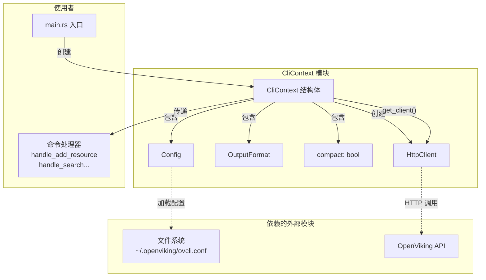

# cli_runtime_context 模块技术深度解析

## 概述

`cli_runtime_context` 模块是 OpenViking CLI 的运行时上下文层，它的核心组件是 `CliContext` 结构体。想象一下当你走进一家餐厅：服务员不是每次需要了解厨房在哪、菜单是什么、今天是周几——这些信息应该在一个"Context"里一次性准备好，然后传递给所有需要它的环节。`CliContext` 正是扮演这个角色：它在 CLI 启动时加载配置、准备好 HTTP 客户端，然后作为"一次性传递袋"传递给所有命令处理器。

这个模块解决的问题是：**避免在每个 CLI 命令中重复传递配置、HTTP 客户端、输出格式等通用参数**。如果没有这个设计，每个命令处理器都需要签名中包含 `&Config, &HttpClient, OutputFormat, bool` 等四五个参数，代码会变得冗长且难以维护。

## 架构设计

### 核心组件



### 数据流追踪

当你执行 `ov find "query" -n 5` 时，数据的完整流动如下：

1. **入口解析** (`main.rs`): `Cli::parse()` 解析命令行参数，提取 `--output` 和 `--compact` 标志
2. **上下文创建**: `CliContext::new(output_format, compact)` 被调用
   - 在构造函数内部，`Config::load()` 尝试从 `~/.openviking/ovcli.conf` 读取配置
   - 如果文件不存在，使用默认配置（`http://localhost:1933`，60秒超时）
3. **命令分发**: 解析出的命令变体（`Commands::Find`）被路由到对应的 handler
4. **客户端获取**: handler 调用 `ctx.get_client()` 获取一个配置好的 `HttpClient`
5. **API 调用**: HTTP 客户端带着配置中的 URL、API Key、Agent ID 向服务器发起请求
6. **结果输出**: handler 将 `ctx.output_format` 和 `ctx.compact` 传给 `output_success()` 函数，决定如何渲染返回数据

## 核心组件详解

### CliContext 结构体

```rust
#[derive(Debug, Clone)]
pub struct CliContext {
    pub config: Config,        // 服务器连接配置
    pub output_format: OutputFormat,  // 输出格式：Table 还是 Json
    pub compact: bool,        // 是否使用紧凑表示
}
```

**设计意图**：这个结构体采用**透明数据传输**（data transfer object）模式，所有字段都是 `pub`，这反映了它的设计哲学——它是一个"数据容器"而非"具有复杂行为的对象"。它不封装复杂的业务逻辑，只是简单地把三个相关但独立的配置项打包在一起。

**字段设计理由**：
- `config`: 必须，因为每个命令都需要知道服务器在哪里、如何认证
- `output_format`: 可选，但需要，因为用户可能 `--output json` 来获取机器可读的输出
- `compact`: 可选，但需要，因为机器（如 agent）需要紧凑输出，而人可能需要完整输出

### Config 结构体

```rust
pub struct Config {
    pub url: String,        // 服务器地址，默认 http://localhost:1933
    pub api_key: Option<String>,  // 认证密钥
    pub agent_id: Option<String>, // Agent 标识
    pub timeout: f64,       // 请求超时，默认 60 秒
    pub output: String,     // 默认输出格式
    pub echo_command: bool, // 是否打印命令回显
}
```

**配置加载逻辑**（见 `config.rs` 第 51-62 行）：

```rust
pub fn load_default() -> Result<Self> {
    let config_path = default_config_path()?;  // ~/.openviking/ovcli.conf
    if config_path.exists() {
        Self::from_file(&config_path.to_string_lossy())
    } else {
        Ok(Self::default())  // 使用硬编码的默认值
    }
}
```

这个设计采用了**渐进式默认值**策略：首先尝试从配置文件读取，如果文件不存在，就使用代码中的硬编码默认值。这种设计的好处是用户只需要配置"必须变"的部分（通常是 URL 和 API Key），其他参数可以保持默认值不动。

### HttpClient 创建

```rust
pub fn get_client(&self) -> client::HttpClient {
    client::HttpClient::new(
        &self.config.url,
        self.config.api_key.clone(),
        self.config.agent_id.clone(),
        self.config.timeout,
    )
}
```

**为什么每次调用都创建新客户端？** 这个问题值得深入思考。表面上看，缓存一个客户端会更高效。但实际上：

1. `HttpClient` 内部包装了 `reqwest::Client`，它已经内置了连接池
2. CLI 是短生命周期程序，每次命令执行完进程就退出
3. 更重要的是，`HttpClient` 的配置来自 `Config`，如果配置在运行时被修改（未来可能支持 `ov config reload`），缓存的客户端会持有旧配置

因此，当前的设计是**正确的**——每次需要时从 Config 重新创建。

## 依赖关系分析

### 向上依赖（什么模块依赖 CliContext）

- **`main.rs` 入口**：创建 `CliContext` 并传递给命令处理器
- **所有命令处理器**：通过 `ctx.get_client()` 获取 HTTP 客户端，通过 `ctx.output_format` 和 `ctx.compact` 控制输出

### 向下依赖（CliContext 依赖什么）

- **`Config` 模块**：从文件系统加载配置
- **`HttpClient` 模块**：基于配置创建 HTTP 客户端
- **`OutputFormat` 枚举**：定义输出格式

### 关键契约

调用 `CliContext::new()` 时，可能失败的唯一操作是 `Config::load()`，它可能因为：
1. 配置文件存在但 JSON 解析失败
2. 配置文件存在但权限不足无法读取
3. `dirs::home_dir()` 无法确定用户主目录

错误会被转换成 `Error::Config` 变体，并在 `main()` 中以退出码 2 退出：

```rust
let ctx = match CliContext::new(output_format, compact) {
    Ok(ctx) => ctx,
    Err(e) => {
        eprintln!("Error: {}", e);
        std::process::exit(2);
    }
};
```

## 设计决策与权衡

### 决策 1：全局配置 vs 按命令配置

**选项 A**：每个命令自己定义需要的参数（如 `--url`、`--api-key`）
**选项 B**：所有命令共享同一个配置源（Config 文件）

**当前选择**：选项 B

**理由**：CLI 的典型使用场景是用户在首次使用时配置一次，之后所有命令都使用相同配置。如果每个命令都要重复指定 URL 和 Key，用户体验极差。选择选项 B 意味着 CLI 更"体贴"用户，但代价是配置修改需要重新启动进程。

### 决策 2：Context 作为简单 struct vs 复杂对象

**当前选择**：简单的数据容器，所有字段公开

**权衡分析**：
- **优点**：调用者可以直接访问任何字段，无需学习 API；没有隐藏行为，调试容易
- **缺点**：无法在 Context 层面添加缓存、日志等横切关注点

当前 CLI 的复杂度不需要那些横切关注点，所以简单的设计是合理的。如果将来需要添加请求日志，可以在 `get_client()` 里做，而不是让 Context 本身变复杂。

### 决策 3：compact 标志的设计

`compact` 字段控制输出的"紧凑程度"：

```rust
pub fn output_success<T: Serialize>(result: T, format: OutputFormat, compact: bool) {
    if matches!(format, OutputFormat::Json) {
        if compact {
            println!("{}", json!({ "ok": true, "result": result }));
        } else {
            println!("{}", serde_json::to_string_pretty(&result).unwrap_or_default());
        }
    } else {
        print_table(result, compact);  // compact 决定是否过滤空列
    }
}
```

这个设计体现了 **"机器友好 vs 人眼友好"** 的权衡：
- `compact=true`（默认）：输出适合 Agent 处理——更少的空字段、更紧凑的 JSON
- `compact=false`：输出适合调试和阅读——完整的字段、格式化的 JSON

默认值是 `true`（见 main.rs 第 44 行 `#[arg(short, long, global = true, default_value = "true")]`），这反映了设计假设：CLI 的主要使用者是自动化脚本和 Agent，而不是人类交互。

## 使用指南与常见陷阱

### 基本使用模式

```rust
// 1. 创建上下文
let ctx = CliContext::new(OutputFormat::Table, true)?;

// 2. 获取客户端
let client = ctx.get_client();

// 3. 调用 API
let result = client.find(query, uri, limit, threshold).await?;

// 4. 输出结果
output_success(&result, ctx.output_format, ctx.compact);
```

### 注意事项

**陷阱 1：Config 加载时机**

`CliContext::new()` 在构造时就会加载配置文件。如果配置文件有问题，程序会在 `main()` 最开始就失败，而不是等到真正需要发请求时才失败。这是一个**有意为之的设计**——尽早失败（fail-fast）让问题更容易诊断。

**陷阱 2：compact 与 output_format 的组合**

| output_format | compact | 效果 |
|--------------|---------|------|
| Table | true | 输出表格，但过滤掉空列 |
| Table | false | 输出完整表格 |
| Json | true | 单行压缩 JSON `{"ok":true,"result":{...}}` |
| Json | false | 格式化 JSON |

**陷阱 3：路径中的空格**

CLI 处理路径时有一个特殊逻辑（见 main.rs 第 233-261 行）：

```rust
let unescaped_path = path.replace("\\ ", " ");
```

这是因为 shell 在传递参数时会将空格转义为 `\ `，CLI 需要反向处理。如果你发现"文件不存在"错误，但路径看起来正确，检查是否有未加引号的空格。

### 扩展点

如果你需要添加新的全局配置（比如代理设置），步骤是：

1. 在 `Config` 结构体中添加字段
2. 在 `Config::default()` 中设置合理的默认值
3. 在 `CliContext` 中直接使用（无需修改，因为字段是直接暴露的）

这种设计允许配置层独立演进，不需要修改 Context 本身。

## 错误处理

`CliContext` 的错误类型定义在 `error.rs` 中：

```rust
pub enum Error {
    Config(String),    // 配置相关错误
    Network(String),  // 网络错误
    Api(String),      // API 返回错误
    Client(String),   // 客户端使用错误
    Parse(String),    // 解析错误
    // ...
}
```

特别注意 `Config` 错误的退出码是 **2**（而不是常规错误的 **1**），这使得脚本可以区分"配置问题"和"命令执行问题"：

```rust
std::process::exit(2);  // 配置错误
std::process::exit(1);  // 执行错误
```

## 相关模块文档

- [cli_bootstrap_and_runtime_context](cli_bootstrap_and_runtime_context.md) - CLI 启动和运行时上下文概览
- [cli_command_structure](cli_command_structure.md) - 命令结构定义
- [cli_configuration_management](cli_configuration_management.md) - 配置管理细节
- [http_client](http_client.md) - HTTP 客户端实现
- [output_formatting](output_formatting.md) - 输出格式化逻辑