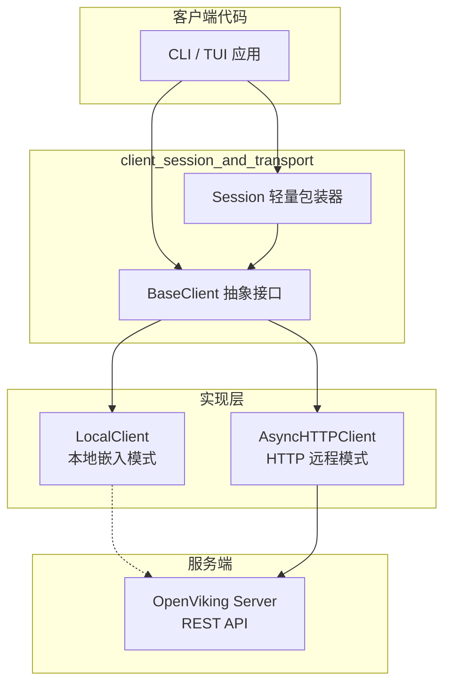

# client_session_and_transport

> 本模块是 OpenViking Python 客户端的**传输层抽象**，它解决的问题是：**如何让上层代码无需关心底层是与本地嵌入式引擎通信，还是与远程 HTTP 服务器通信**。

## 问题空间：为什么需要这个模块？

在构建一个 AI 知识管理系统时，客户端面临一个关键决策：**是使用本地嵌入模式（embedded mode）直接调用引擎，还是使用 HTTP 模式与远程服务器通信？**

两种模式各有适用场景：
- **本地模式**：适合单用户桌面应用、低延迟场景、无需部署服务器
- **HTTP 模式**：适合多用户服务化部署、需要跨网络访问、需要在客户端/服务端独立升级

如果让业务代码直接处理这两种通信方式的差异，代码会变成一场灾难：
- 每个 API 调用都需要 `if local_mode else` 分支
- 错误处理逻辑需要复制两份
- 新增一个 API 端点需要同时修改两处

**`client_session_and_transport` 模块的核心使命就是消除这种重复**——它定义了一套统一的抽象接口，让业务代码只关心"做什么"，而不关心"怎么做"。

## 架构概览



**数据流说明**：

1. **用户发起请求**（CLI/TUI）→ 调用 `Session` 或 `BaseClient` 方法
2. **接口层**（Session/BaseClient）→ 仅定义契约，不涉及实现
3. **实现层**（LocalClient/AsyncHTTPClient）→ 决定如何真正发送请求
4. **传输层** → HTTP 客户端（httpx）或本地调用

## 关键设计决策

### 决策一：接口与实现分离（Interface Segregation）

`BaseClient` 定义了约 50 个抽象方法，涵盖了 OpenViking 的全部功能：
- 资源管理：`add_resource`, `add_skill`, `wait_processed`
- 文件系统：`ls`, `tree`, `stat`, `mkdir`, `rm`, `mv`
- 内容读取：`read`, `abstract`, `overview`
- 搜索：`find`, `search`, `grep`, `glob`
- 关系管理：`relations`, `link`, `unlink`
- 会话管理：`create_session`, `list_sessions`, `get_session`, `delete_session`, `commit_session`, `add_message`
- 打包：`export_ovpack`, `import_ovpack`
- 健康检查：`health`, `get_status`, `is_healthy`

**为什么这样设计？**
- **更换实现无需修改业务代码**：新增一种客户端实现（如 WebSocket 模式）只需实现接口
- **便于测试**：可以用 Mock 客户端替换真实客户端进行单元测试
- **职责清晰**：接口定义"做什么"，实现决定"怎么做"

### 决策二：Session 是轻量包装器，不是独立设计

`Session` 类只有约 60 行代码，它本质上是一个**委托者（Delegator）**而非**参与者**：

```python
class Session:
    def __init__(self, client: "BaseClient", session_id: str, user: UserIdentifier):
        self._client = client  # 真正的执行者
        self.session_id = session_id
        self.user = user

    async def add_message(self, role: str, content: str):
        return await self._client.add_message(self.session_id, role, content)
```

**为什么这样设计？**
- **避免重复**：如果 Session 重新实现所有方法，就成了另一个 BaseClient
- **保持一致性**：任何 BaseClient 实现都能被 Session 使用
- **简化扩展**：新增 API 只需在 BaseClient 添加方法，Session 自动获得能力

### 决策三：异步优先（Async-First）

所有抽象方法都是 `async def`，返回值都是 `Awaitable`。这意味着：
- HTTP 客户端可以充分利用连接池，避免阻塞
- 本地客户端也可以使用 asyncio 实现非阻塞 I/O

**权衡**：
- 同步用户需要使用 `run_async` 包装器（代码中确实存在 `openviking_cli.utils.run_async`）
- 但对于 IO 密集型操作，异步带来的性能提升远大于迁移成本

## 子模块概览

| 子模块 | 职责 | 核心组件 |
|--------|------|----------|
| [base_client](python_client_and_cli_utils-client_session_and_transport-base_client.md) | 定义客户端抽象接口，统一所有客户端实现的行为契约 | `BaseClient` |
| [session_wrapper](python_client_and_cli_utils-client_session_and_transport-session_wrapper.md) | 提供面向会话的轻量级 OOP 接口，封装会话生命周期操作 | `Session` |

## 依赖关系

### 上游依赖（谁调用这个模块）

本模块被以下模块调用：
- **CLI 应用层**：`rust_cli_interface` 中的 TUI 应用通过 `openviking_cli.client.base.BaseClient` 与系统交互
- **配置管理**：`python_client_and_cli_utils.configuration_models_and_singleton` 提供配置注入
- **检索模块**：`retrieval_and_evaluation` 使用客户端进行语义搜索

### 下游依赖（这个模块调用谁）

本模块依赖：
- **服务端 API 契约**：`server_api_contracts` 中的 `openviking.server.routers.sessions.*` 定义了 HTTP 端点契约
- **HTTP 客户端库**：使用 `httpx` 进行 HTTP 通信
- **用户标识**：`python_client_and_cli_utils` 中的 `UserIdentifier` 用于会话用户身份

### 模块位置

```
python_client_and_cli_utils
├── client_session_and_transport    ← 本模块
│   ├── base_client.md             ← 客户端接口抽象
│   └── session_wrapper.md         ← 会话包装器
├── configuration_models_and_singleton
├── content_extraction_schema_and_strategies
├── llm_and_rerank_clients
└── retrieval_trace_and_scoring_types
```

## 给新贡献者的提示

### 1. 添加新 API 的正确姿势

如果你需要在 OpenViking 中添加新功能（例如新的搜索模式）：

1. **在 `BaseClient` 中添加抽象方法**（签名遵循现有模式）
2. **在 `AsyncHTTPClient` 和 `LocalClient` 中实现**
3. **可选**：在 `Session` 中添加便捷包装方法

**不要**只在一个客户端实现中添加方法——这会破坏接口一致性。

### 2. Session 与 BaseClient 的选择

- 需要会话上下文？用 `Session`（例如聊天会话）
- 需要全局操作？用 `BaseClient`（例如列出所有会话）

### 3. 错误处理契约

所有客户端实现必须遵循统一的错误码映射（见 `http.py` 中的 `ERROR_CODE_TO_EXCEPTION`）：
- 服务端返回 `NOT_FOUND` → 客户端抛出 `NotFoundError`
- 服务端返回 `UNAUTHENTICATED` → 客户端抛出 `UnauthenticatedError`

新增客户端实现时必须保持这个映射一致。

### 4. 状态管理

`BaseClient` 定义了生命周期方法：
- `initialize()`：启动前调用
- `close()`：关闭后调用

实现类必须正确管理资源（如 HTTP 连接池、文件句柄），避免资源泄漏。

## 延伸阅读

- [服务端会话 API 契约](../server_api_contracts/session_message_contracts.md) — 理解 Session 在服务端的生命周期
- [配置管理](./configuration_models_and_singleton.md) — 了解客户端如何获取服务端连接配置
- [检索模块](../retrieval_and_evaluation/retrieval_query_orchestration.md) — 了解客户端如何执行语义搜索