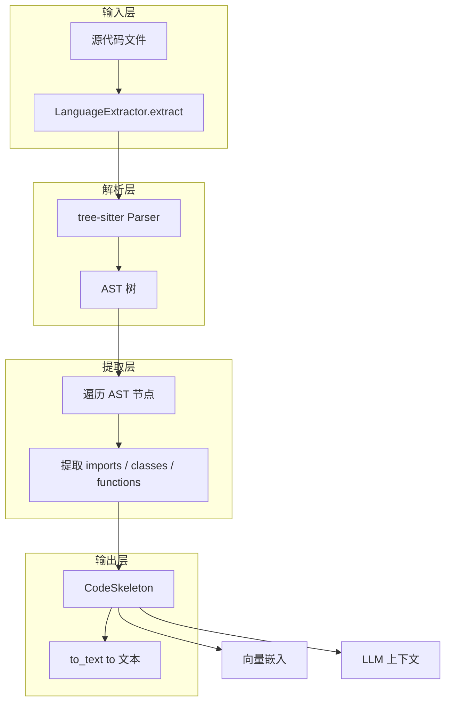

# code_language_ast_extractors

## 模块概述

**一句话说明**：这个模块将源代码文件"反汇编"成结构化的骨架（skeleton）——提取出类、函数、导入语句和文档注释，但不执行代码。

想象一下：你拿到一本烹饪书（源代码），但不想真的去烹饪（执行代码）。你只是想快速翻阅目录，了解这本书里有哪些菜谱类（类）、每道菜谱有什么步骤（方法）、需要什么食材（导入）。`code_language_ast_extractors` 做的事情就是这样——它用 **tree-sitter** 解析器把源代码变成一个"目录"，让系统可以：
- 对代码结构做向量嵌入（用于语义搜索）
- 把代码摘要发送给 LLM（用于问答、生成）
- 理解代码库的 API 表面积

## 架构概览



**数据流向**：用户调用 `extractor.extract(filename, content)` → tree-sitter 生成 AST → 遍历 AST 提取关键节点 → 组装成 `CodeSkeleton` → 转换为文本用于下游任务（embedding 或 LLM）。

**核心抽象**：

| 抽象 | 职责 |
|------|------|
| `LanguageExtractor` | 抽象基类，定义"提取器"的接口契约 |
| `CodeSkeleton` | 提取结果的统一数据结构 |
| `ClassSkeleton` | 单个类的结构：名称、父类、文档、方法列表 |
| `FunctionSig` | 单个函数的签名：名称、参数、返回值类型、文档 |

每个语言-specific 的提取器（如 `PythonExtractor`、`CppExtractor`）都继承 `LanguageExtractor`，实现 `extract(file_name, content) → CodeSkeleton` 方法。

## 关键设计决策

### 1. 为什么用 tree-sitter 而不是语言自带的 ast 模块？

Python 有 `ast`，Java 有 `javalang`，Go 有 `go/parser`——为什么还要用 tree-sitter？

**决策**：统一使用 tree-sitter。

**理由**：
- **跨语言一致性**：所有语言共用同一套解析接口，不需要为每种语言适配不同的 AST API
- **容错性**：tree-sitter 对不完整/畸形的代码更宽容，能在语法错误的情况下仍然生成部分 AST
- **增量解析**：支持只重新解析变化的部分（当前代码未使用，但为未来性能优化留了口子）

**tradeoff**：tree-sitter 是纯 Python 绑定，不如各语言原生解析器"快"（不过对于索引场景，解析通常不是瓶颈，IO 才是）。这是一个"统一性 > 极致性能"的取舍。

### 2. 为什么返回原始字符串而不是类型对象？

看 `FunctionSig` 的定义：
```python
params: str       # 原始参数字符串，如 "source, instruction, **kwargs"
return_type: str  # 原始类型字符串，如 "ParseResult"
```

为什么不解析成 `List[Parameter]` 和 `Optional[Type]`？

**决策**：保持原始字符串。

**理由**：
- **简化**：完全解析每个参数的类型注解非常复杂（涉及泛型、别名、条件类型等）
- **够用**：下游用例（embedding 摘要、LLM 提示）只需要"大概长什么样"，不需要精确的类型树
- **灵活**：字符串格式直接可用于生成代码片段

**tradeoff**：精确性 → 便利性。这是一种"足够好"的实用主义。

### 3. docstring 的处理：首行 vs 完整文档

`CodeSkeleton.to_text()` 有个 `verbose` 参数：
```python
def to_text(self, verbose: bool = False) -> str:
    # 如果 verbose=False，只保留第一行
    # 如果 verbose=True，保留完整文档
```

**决策**：支持两种模式。

**理由**：
- `verbose=False`（默认）：用于直接 embedding，首行摘要足够代表这个符号
- `verbose=True`：用于 ast_llm 模式，完整文档对 LLM 更有价值

这是一个"一鱼两吃"的设计，同一套数据结构服务于两种下游场景。

### 4. 没有缓存机制

每个提取器在 `__init__` 中创建 `Parser` 和 `Language` 对象：
```python
def __init__(self):
    import tree_sitter_python as tspython
    from tree_sitter import Language, Parser
    self._language = Language(tspython.language())
    self._parser = Parser(self._language)
```

**决策**：每次调用都重新解析，不缓存 AST。

**理由**：
- 简单：避免状态管理和缓存失效问题
- 场景匹配：主要用于离线索引（一次性提取），不是在线交互（频繁解析）
- 内存：大规模代码库上缓存 AST 会消耗大量内存

**潜在问题**：如果用于交互式场景（如实时 IDE 插件），会有性能问题。当前设计假设是离线批量处理。

## 子模块概览

| 子模块 | 语言 | 组件 |
|--------|------|------|
| [python_ast_extractor](python_ast_extractor.md) | Python | `PythonExtractor` |
| [systems_programming_ast_extractors](systems_programming_ast_extractors.md) | C++, Go, Rust | `CppExtractor`, `GoExtractor`, `RustExtractor` |
| [application_and_web_platform_ast_extractors](application_and_web_platform_ast_extractors.md) | Java, JavaScript/TypeScript | `JavaExtractor`, `JsTsExtractor` |

## 与其他模块的关系

**上游（谁调用这个模块）**：
- `openviking.parse.parsers.base_parser.BaseParser`：通用解析器，会根据文件类型 dispatch 到对应的 `LanguageExtractor`
- 代码索引 pipeline：用提取的结构化信息做向量嵌入

**下游（这个模块调用谁）**：
- `tree_sitter_*` 语言包：实际的解析实现
- `openviking.parse.parsers.code.ast.skeleton`：输出数据结构

**数据契约**：
```python
# 输入
extract(file_name: str, content: str)  # content 是源代码文本

# 输出
CodeSkeleton(
    file_name: str,        # 文件名
    language: str,         # 语言标识 ("Python", "C/C++", etc.)
    module_doc: str,       # 模块级 docstring
    imports: List[str],    # 导入语句
    classes: List[ClassSkeleton],
    functions: List[FunctionSig]
)
```

## 新贡献者注意事项

### 1. 节点类型硬编码
每个提取器里有大量的 `if child.type == "function_definition":` 判断。tree-sitter 的节点类型是语言-specific 的：
- Python 用 `function_definition`
- JavaScript 用 `function_declaration`  
- Rust 用 `function_item`

**注意**：如果 tree-sitter 版本升级导致节点类型名称变化，这些硬编码会 break。添加新语言时需要查对应语言的 tree-sitter grammar。

### 2. docstring 提取的脆弱性
`_preceding_doc` 函数假设注释总是"紧邻"目标节点。但以下情况会失效：
- 多行空行分隔
- 注释在 `#[cfg]` 条件块内（Rust）
- 格式化工具把注释"推远"了

**注意**：这是"尽力而为"的提取，不是完全可靠的。

### 3. 导入语句的扁平化
`imports` 字段是扁平的字符串列表，不是树结构：
```python
imports: ["asyncio", "os", "typing.Optional"]
```
丢失了 `typing` 是一个 module、而 `Optional` 是其中的一个符号这种层级信息。对于 embedding 场景够用，但如果要做"精确的依赖分析"就不够了。

### 4. 每种语言的能力不一致

| 语言 | 类 | 函数 | 方法 | 导入 | 模块 docstring | 备注 |
|------|-----|------|------|------|----------------|------|
| Python | ✅ | ✅ | ✅ | ✅ | ✅ | 最完整 |
| Go | ✅ (struct/interface) | ✅ | ✅ | ✅ | ❌ | 没有模块级 docstring |
| Rust | ✅ (struct/trait/impl) | ✅ | ✅ | ✅ | ❌ | docstring 格式特殊 |
| Java | ✅ | ❌ | ✅ | ✅ | ❌ | 只提取类 |
| C++ | ✅ | ✅ | ✅ | ✅ | ❌ |  |
| JavaScript/TypeScript | ✅ | ✅ | ✅ | ✅ | ❌ |  |

**注意**：新增语言时，不要假设所有字段都能提取。设计下游处理逻辑时要考虑空列表的情况。

### 5. 编码假设
代码中大量使用：
```python
content_bytes = content.encode("utf-8")
```
假设所有源代码都是 UTF-8。如果遇到 GBK 编码的老文件，会触发 `UnicodeDecodeError`（虽然 `decode("utf-8", errors="replace"` 做了防护，但提取的内容会乱码）。