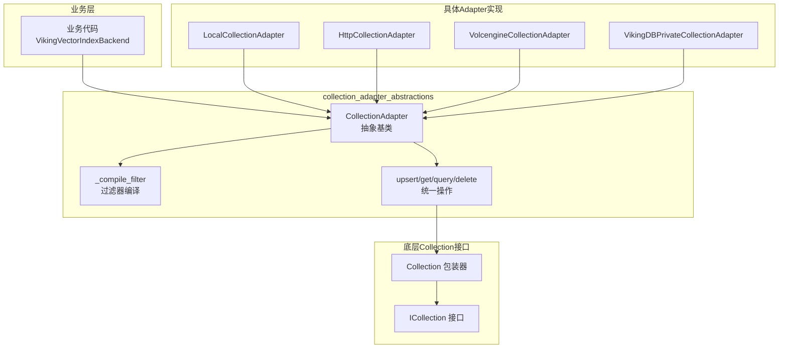

# collection_adapter_abstractions 模块技术深度解析

## 一句话概述

`collection_adapter_abstractions` 模块是 OpenViking 向量存储层的**统一操作门面**——它让业务代码可以用完全相同的方式操作本地文件、远程 HTTP API、云厂商托管服务（Volcengine、VikingDB）等截然不同的向量数据库后端，而无需关心任何后端特定的连接细节、索引差异或查询语法。

想象一个场景：你在开发一个语义检索系统，起初用本地嵌入的向量库，数据增长后想迁移到云服务，或者需要同时支持多种后端。**没有这个抽象层意味着每次后端切换都是一场灾难性的重写**——所有的 CRUD 操作、查询逻辑、索引管理都需要针对新后端重新适配。`CollectionAdapter` 正是为解决这种"后端多样性"问题而生的，它扮演的是**适配器模式（Adapter Pattern）**的角色。

## 架构概览



从架构位置来看，这个模块处于**存储层的入口网关**。业务代码通过它与向量数据库交互，而它再将请求转发给具体的 `Collection` 实现。它不关心数据如何存储、索引如何构建，只关心"如何以统一的方式操作 Collection"。上游被 [VikingVectorIndexBackend](storage_core_and_runtime_primitives.md) 调用，下游对接具体的 Collection 实现。

## 核心抽象：CollectionAdapter

### 设计意图

`CollectionAdapter` 是一个抽象基类（Abstract Base Class, ABC），它定义了向量 Collection 操作的标准接口。类的命名本身就透露了它的角色：**Adapter（适配器）**——一端连接稳定的公共 API，另一端连接多变的底层实现。

这里有一个微妙的分层考虑：

- **`ICollection`**：定义的是底层后端与向量数据库交互的原生接口（比如 `search_by_vector`、`upsert_data`），这些方法名称和签名是后端特定的
- **`Collection`**：`ICollection` 的包装器，增加了一些统一处理和防御性检查
- **`CollectionAdapter`**：在 `Collection` 之上再封装一层，提供更高级、更业务友好的操作语义

这种分层让 `CollectionAdapter` 能够做一些"后端无关"的事情：比如 `_compile_filter` 方法可以将业务代码中的类型安全表达式（`Eq`、`And`、`Range`）转换为各后端能理解的字典 DSL；再比如 `upsert` 方法会自动生成 UUID 作为主键，隐藏了底层实现差异。

### 核心方法分类

`CollectionAdapter` 的方法可以按职责分为几类：

**生命周期管理**：`collection_exists`、`get_collection`、`create_collection`、`drop_collection`、`close`。这些方法控制 Collection 的创建、检查和销毁。其中 `create_collection` 展示了模板方法的典型用法——它定义了一个标准流程：检查是否存在 → 创建后端 Collection → 处理标量索引字段 → 构建索引元数据 → 创建索引。具体的"如何创建后端 Collection"由子类通过 `_create_backend_collection` 实现。

**数据操作**：`upsert`（插入或更新）、`get`（按 ID 获取）、`query`（向量相似度搜索或标量排序）、`delete`（按 ID 或条件删除）、`count`（计数）、`clear`（清空数据）。这是业务代码最常交互的接口。值得注意的是 `query` 方法的设计非常精巧——它根据传入参数的不同（向量、稀疏向量、标量排序字段、无条件随机）自动选择合适的底层搜索方法，让调用方无需关心这些细节。

**扩展钩子**：`_sanitize_scalar_index_fields`、`_build_default_index_meta`、`_normalize_record_for_read`。这些方法以单下划线开头，表示它们是供子类覆盖的扩展点。比如 `_normalize_record_for_read` 允许特定后端在数据返回前做字段映射或格式转换。

**过滤器编译**：`_compile_filter` 是本模块最复杂的算法之一，它将类型安全的表达式 AST（`Eq`、`And`、`Or`、`Range` 等）递归编译为后端兼容的字典 DSL。这个设计让业务代码可以用类型检查友好的方式编写过滤条件，而 Adapter 负责处理不同后端对 DSL 格式的差异。

### 关键设计决策：过滤器编译系统

`_compile_filter` 方法值得深入分析，因为它展示了如何用**解释器模式（Interpreter Pattern）**解决多后端兼容问题。

```python
def _compile_filter(self, expr: FilterExpr | Dict[str, Any] | None) -> Dict[str, Any]:
    if expr is None:
        return {}
    if isinstance(expr, dict):
        return expr  # 直接透传原始字典
    if isinstance(expr, RawDSL):
        return expr.payload  # 透传预编译的 DSL
    # And/Or/Eq/In/Range/Contains/TimeRange 的递归编译...
```

这个设计有几个精妙之处：

1. **多态输入**：方法接受 `FilterExpr`（类型安全的 dataclass）、`dict`（原始 DSL）、`RawDSL`（预编译的 payload）三种形式。这意味着业务代码可以从简单的字典过滤器开始，逐步迁移到类型安全的表达式系统。

2. **短路优化**：对于 `And` 和 `Or`，如果子条件中有 `None`，会被静默过滤掉；如果只剩一个有效条件，会直接返回该条件而不再包装 `{"op": "and", "conds": [...]}`，减少不必要的嵌套层级。

3. **后端无关性**：编译结果是一个通用的字典结构，各后端的 `Collection` 实现负责将其转换为具体的查询 DSL。

## 数据流分析

### 创建集合的完整流程

```
业务层调用 create_collection(name, schema)
            │
            ▼
    CollectionAdapter.create_collection()
            │
            ├──▶ 检查 collection_exists()
            │           │
            │           ▼
            │    _load_existing_collection_if_needed()
            │           │
            │           ▼ (子类实现差异)
            │    LocalCollectionAdapter: 检查本地文件 collection_meta.json
            │    HttpCollectionAdapter: 调用远程 API list_vikingdb_collections
            │    VolcengineAdapter: 调用 get_meta_data() 检查返回
            │
            ├──▶ _create_backend_collection(meta)
            │           │
            │           ▼ (子类实现差异)
            │    LocalCollectionAdapter: get_or_create_local_collection()
            │    HttpCollectionAdapter: get_or_create_http_collection()
            │    VolcengineAdapter: get_or_create_volcengine_collection()
            │
            ├──▶ _sanitize_scalar_index_fields()
            │           │
            │           ▼ (子类可Override)
            │    VolcengineAdapter: 过滤掉 date_time 类型的字段
            │    其他: 原样返回
            │
            ├──▶ _build_default_index_meta()
            │           │
            │           ▼ (子类可Override)
            │    VolcengineAdapter: 使用 HNSW 索引
            │    LocalCollectionAdapter: 使用 FLAT 索引
            │
            └──▶ collection.create_index()
```

这个流程展示了**模板方法模式**的应用：基类定义了骨架流程，子类只需插入特定的实现细节。

### 查询执行流程

```
业务层调用 query(query_vector=..., filter=..., limit=...)
            │
            ▼
    CollectionAdapter.query()
            │
            ├──▶ _compile_filter(filter)
            │           │
            │           ▼
            │    将 FilterExpr AST 转为 dict DSL
            │    例：Eq(field="type", value="doc") 
            │         → {"op": "must", "field": "type", "conds": ["doc"]}
            │
            ├──▶ 选择搜索路径
            │    │
            │    ├─ query_vector 存在: collection.search_by_vector()
            │    ├─ order_by 存在:   collection.search_by_scalar()
            │    └─ 其他情况:        collection.search_by_random()
            │
            ├──▶ 遍历结果，提取 fields 和 score
            │
            └──▶ _normalize_record_for_read()
                      │
                      ▼ (子类可Override)
                 VolcengineAdapter: 将 uri 规范化为 viking:// 前缀
```

## 依赖关系分析

### 上游依赖

`CollectionAdapter` 依赖于以下几个核心模块：

- **`openviking.storage.vectordb.collection.collection.Collection`**：底层 Collection 的包装器，提供了 `search_by_vector`、`upsert_data`、`fetch_data` 等方法的统一入口。Adapter 的所有"数据操作"最终都委托给这个包装类。

- **`openviking.storage.expr`**：过滤器表达式定义模块，提供了 `Eq`、`And`、`Or`、`Range`、`In`、`Contains`、`TimeRange`、`RawDSL` 等 dataclass。这些类型让业务代码能够以类型安全的方式构建查询条件。

- **`openviking.storage.errors.CollectionNotFoundError`**：当请求访问不存在的 Collection 时抛出的异常。这是少数几个 Adapter 会主动抛出的业务异常之一。

- **`openviking.storage.vectordb.service.api_fastapi`**：底层实际执行 HTTP 请求的 FastAPI 客户端函数（通过 Collection 间接调用）。

### 下游实现

四个具体的 Adapter 实现分别针对不同的后端场景：

- **`LocalCollectionAdapter`**：嵌入模式，适用于单机或轻量级场景。数据存储在本地文件系统（`project_path` 目录下）。`_load_existing_collection_if_needed` 通过检查 `collection_meta.json` 文件来判断 Collection 是否已存在。

- **`HttpCollectionAdapter`**：远程 HTTP API 模式，适用于需要连接独立部署的向量数据库服务的场景。它通过 `_remote_has_collection` 方法调用远程 API 来确认 Collection 是否存在。

- **`VolcengineCollectionAdapter`** 和 **`VikingDBPrivateCollectionAdapter`**：云服务商的托管向量数据库模式，提供更高级的云原生能力。这些 Adapter 需要处理云服务特定的认证、连接池、批处理等细节。

### 被谁调用

通过 `create_collection_adapter` 工厂函数，这个模块被以下场景使用：

1. **VikingVectorIndexBackend 初始化时**：当用户启动系统或连接远程服务时，需要创建对应的 Collection Adapter 来管理上下文数据
2. **检索服务**：向量检索时通过 Adapter 执行相似度搜索
3. **存储后端配置**：用户通过配置选择后端类型（local/http/volcengine/vikingdb），工厂函数根据配置创建对应的 Adapter

## 设计权衡与tradeoff

### 1. 抽象层级选择：为什么是两层（Collection + CollectionAdapter）？

一个可能的质疑是：为什么不直接在 `CollectionAdapter` 中实现所有逻辑，让 `ICollection` 变得更简单？

这里的选择基于一个实际考量：**职责分离**。`ICollection` / `Collection` 这层抽象关注的是"如何与向量数据库后端通信"——它定义了搜索、插入、删除等原子操作，这些操作在不同后端之间差异不大（都是 REST API 调用或本地文件操作）。而 `CollectionAdapter` 关注的是"如何让业务代码用得更舒服"——它处理了 ID 生成、记录规范化、复杂的条件编译、Collection 生命周期等业务层面的逻辑。

这种分层也有利于测试：业务逻辑可以在不启动真实向量数据库的情况下通过 mock `Collection` 进行单元测试。

### 2. 同步 vs 异步

当前实现是**完全同步**的。这是一个有意识的简化决策。向量数据库操作（尤其是搜索和批量插入）通常是 IO 密集型而非 CPU 密集型，理论上异步能提供更好的吞吐量。但同步实现大大降低了学习曲线和调试难度——可以用标准的 Python 调试器逐行跟踪，可以在 REPL 中逐步验证。对于一个面向 CLI 和本地场景的工具来说，这个 tradeoff 是合理的。

如果未来需要支持高并发场景，可以在 Adapter 层面之上再包装一层异步代理，而不是修改现有实现。

### 3. 错误处理策略

`CollectionAdapter` 采用了**防御性编程**与**宽容处理**相结合的策略：

- 在公共 API（如 `get_collection`）中，如果 Collection 不存在，会抛出明确的 `CollectionNotFoundError`
- 在 `drop_collection` 中，即使部分操作（如删除索引）失败，也会尽力完成剩余步骤，并用 `logger.warning` 记录问题，而不是直接崩溃
- `close` 方法使用了 `try...finally` 确保即使有异常也能重置状态

这种策略适合工具类应用：尽可能保持可用性，让用户能够继续操作，而不是因为一个非致命错误就完全卡死。

### 4. 过滤器编译的边界

`_compile_filter` 方法接受 `dict` 类型的输入，这意味着它对原始 DSL 是"透传"的。有人可能认为这破坏了类型安全——业务代码可以直接传字典，绕过了表达式的类型检查。

但这恰恰是一个**兼容性设计**。有些场景下，业务方已经有现成的 DSL 格式（比如从配置文件读取），如果强制要求用 `FilterExpr` 类型，就会要求额外的转换逻辑。允许 `dict` 输入，让渐进式迁移成为可能：从简单的字典过滤器开始，等需要复杂逻辑时再迁移到表达式系统。

### 5. 为什么 delete 操作先 query 再 delete？

```python
def delete(self, *, ids: Optional[list[str]] = None, filter: Optional[Dict[str, Any] | FilterExpr] = None, ...):
    delete_ids = list(ids or [])
    if not delete_ids and filter is not None:
        matched = self.query(filter=filter, limit=limit)
        delete_ids = [record["id"] for record in matched if record.get("id")]
    ...
```

这个设计看似冗余，实则必要。**向量数据库的批量删除通常需要 ID 列表**，而业务层可能只提供过滤条件。adapter 帮你完成"查而后删"的模式。需要注意的是，这种两阶段操作在并发场景下可能产生**读-写不一致**，但对于大多数业务场景（离线清理、批量维护）是可以接受的。

### 6. 为什么索引创建在 adapter 内部而非 Collection 层？

注意 `create_collection()` 方法中包含了创建索引的逻辑。这是因为**索引是集合语义的一部分**。不同的后端对索引的支持差异很大：
- Local 后端使用 FLAT 索引（暴力搜索）
- Volcengine 后端使用 HNSW 索引（近似最近邻）
- 有些后端不支持稀疏向量

将索引构建封装在 adapter 内，让每个后端可以根据自己的能力构建合适的索引，这对业务层是完全透明的。

## 使用指南与扩展点

### 创建自定义 Adapter

如果你需要支持一个新的向量数据库后端（比如 Qdrant、Pinecone），你需要：

1. 继承 `CollectionAdapter`，设置 `mode` 属性
2. 实现两个抽象方法：`_load_existing_collection_if_needed`（加载已存在的 Collection）和 `_create_backend_collection`（创建新的 Collection）
3. （可选）覆盖扩展钩子：如 `_normalize_record_for_read` 做数据规范化，`_sanitize_scalar_index_fields` 处理后端特定的索引字段限制

参考 `LocalCollectionAdapter` 或 `HttpCollectionAdapter` 的实现模式。

### 使用表达式构建过滤器

业务代码应该优先使用类型安全的表达式：

```python
from openviking.storage.expr import And, Eq, Range

# 推荐：使用表达式
filter_expr = And(conds=[
    Eq(field="tenant_id", value="user_123"),
    Range(field="timestamp", gte="2024-01-01")
])
results = adapter.query(query_vector=embedding, filter=filter_expr, limit=10)

# 可接受：直接用字典（快速原型或外部 DSL）
results = adapter.query(
    query_vector=embedding, 
    filter={"op": "and", "conds": [{"op": "must", "field": "type", "conds": ["doc"]]},
    limit=10
)
```

### 生命周期管理最佳实践

```python
# 正确：显式管理生命周期
adapter = create_collection_adapter(config)
try:
    adapter.create_collection(name="my_collection", schema={...}, distance="cosine", ...)
    adapter.upsert([{"text": "hello", "vector": [0.1, 0.2]}])
finally:
    adapter.close()  # 确保释放资源

# 错误：依赖析构函数（不保证及时释放）
adapter = create_collection_adapter(config)
adapter.upsert([...])
# 函数退出时可能不会立即关闭
```

## 新贡献者必须注意的事项

### 1. Collection 存在性检查的竞态条件

`collection_exists` 和 `create_collection` 之间没有锁保护。在高并发场景下，两个进程可能同时判断"不存在"然后都尝试创建。生产环境建议在创建前做异常捕获或使用分布式锁。

### 2. 主键生成策略

`upsert` 方法会自动为缺少 `id` 字段的记录生成 UUID。这在大多数场景下是便利的，但如果你的业务逻辑依赖特定的主键生成策略（比如使用业务ID），应该在调用 `upsert` 前自行设置 `id` 字段。

### 3. 过滤器中的布尔值处理

`_coerce_int` 方法有个特殊逻辑——`bool` 类型会被转换为 `None` 而非整数。这是因为 Python 中 `bool` 是 `int` 的子类 (`True == 1`)，但大多数后端无法区分"布尔 true"和"整数 1"。如果你需要存储布尔值，应该用字符串 `"true"`/`"false"` 或专门的布尔字段。

### 4. delete 方法的隐式查询

当只提供 `filter` 而不提供 `ids` 时，`delete` 会先执行一次 `query` 获取匹配的记录 ID，然后再删除。这个设计有两次网络调用的开销，且存在删除时的竞态窗口（查询和删除之间可能有新数据写入）。对于需要精确控制的场景，建议自行获取 IDs 后显式传入。

### 5. 稀疏向量权重

`create_collection` 的 `sparse_weight` 参数默认为 0，意味着默认不使用稀疏向量。如果你的场景需要混合检索（dense + sparse），需要显式设置 `sparse_weight > 0`，这会触发底层索引类型从 `"flat"` 切换为 `"flat_hybrid"`。

### 6. 索引名称硬编码

在 `query()` 方法中，索引名称被硬编码为 `"default"`：

```python
result = coll.search_by_vector(
    index_name="default",
    ...
)
```

这意味着**每个集合只能有一个索引**。如果你需要多索引切换，这个设计需要扩展。

### 7. 远程后端的延迟加载陷阱

```python
def collection_exists(self) -> bool:
    self._load_existing_collection_if_needed()
    return self._collection is not None
```

对于 HTTP 后端，每次调用 `collection_exists()` 都可能触发一次远程 API 调用。如果高频调用此方法，会产生不必要的网络开销。这种"延迟加载"策略在本地后端很高效，但在远程后端需要评估调用频率。

### 8. count() 的精度问题

```python
def count(self, filter: Optional[Dict[str, Any] | FilterExpr] = None) -> int:
    result = coll.aggregate_data(...)
    if "_total" in result.agg:
        parsed_total = self._coerce_int(result.agg.get("_total"))
        ...
```

部分后端的 count 结果可能是浮点数或字符串，代码尝试了多种转换方式。但如果后端返回极端值（如科学计数法），`parse_total` 可能返回 `None`，导致最终返回 0。这种"失败安全"的策略适合大多数场景，但在精确统计场景下需注意。

## 总结

`collection_adapter_abstractions` 模块是 OpenViking 向量存储层的**门面（Facade）**和**适配器（Adapter）**。它通过抽象类 `CollectionAdapter` 定义了统一的 Collection 操作接口，通过 `_compile_filter` 实现了后端无关的查询条件编译，通过工厂函数 `create_adapter` 支持多后端动态切换。

这个模块的核心价值在于**解耦**：让业务代码不关心底层是本地文件、HTTP API 还是云服务，让后端切换成为配置层面的决策而非代码重构。对于新加入的开发者，建议先理解 `query` 方法的多路径分发逻辑和 `_compile_filter` 的递归编译逻辑——这两个方法是整个 Adapter 行为的精髓。