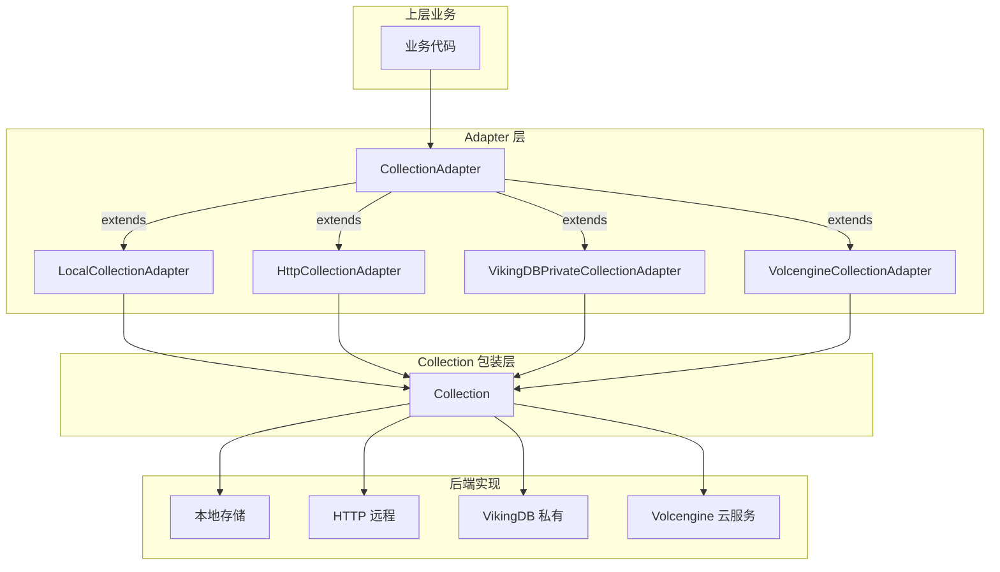
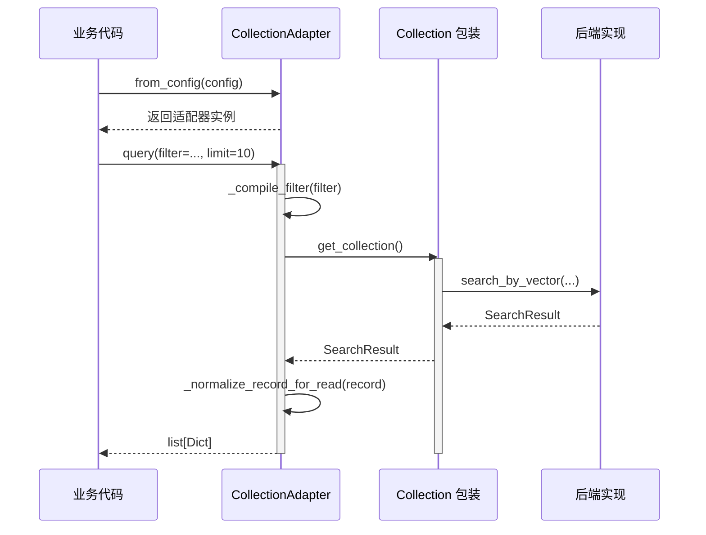

# collection_adapters_abstraction_and_backends

## 模块概述

`collection_adapters_abstraction_and_backends` 是 OpenViking 系统中负责抽象向量数据库（VectorDB）集合操作的核心模块。想象一下：如果把系统比作一家使用多种支付方式（现金、信用卡、支付宝、微信）的商店，那么这个模块就是收银台后面的**统一支付接口**——无论顾客使用哪种支付方式，收银员只需要调用统一的 `pay()` 方法，具体的结算细节由各个支付处理器完成。

这个模块解决的问题是：系统需要支持多种向量数据库后端（本地嵌入式、远程 HTTP 服务、私有部署的 VikingDB、公有云 Volcengine），但上层业务代码不应该关心底层使用的是哪个数据库。通过 Adapter 模式，我们定义了一套统一的 API（`CollectionAdapter` 抽象类），让四种不同的后端实现保持接口一致。



## 架构设计与核心抽象

### CollectionAdapter 抽象基类

`CollectionAdapter` 是整个模块的核心抽象，定义了向量集合操作的完整契约。它的设计遵循了以下原则：

1. **公共 API 无前缀**：面向业务的方法如 `create()`, `query()`, `upsert()`, `delete()`, `count()` 等直接暴露，不加前缀
2. **内部扩展点带下划线**：子类可以重写的方法如 `_load_existing_collection_if_needed()`, `_create_backend_collection()` 等使用下划线前缀
3. **向后兼容别名**：为了平滑过渡，公共方法提供了带下划线版本的重命名（如 `sanitize_scalar_index_fields` 是 `_sanitize_scalar_index_fields` 的别名）

### 数据流动路径



### 四种后端适配器

| 适配器 | 用途 | 集合创建 | 集合删除 | 索引类型 | 特殊能力 |
|--------|------|----------|----------|----------|----------|
| `LocalCollectionAdapter` | 本地嵌入式存储 | ✅ 支持 | ✅ 支持 | flat/flat_hybrid | 支持内存模式 |
| `HttpCollectionAdapter` | 远程 HTTP 服务 | ✅ 支持 | ✅ 支持 | flat/flat_hybrid | 通过 REST API |
| `VikingDBPrivateCollectionAdapter` | 私有 VikingDB 部署 | ❌ 需预创建 | ❌ 需手动 | hnsw/hnsw_hybrid | 严格的字段校验 |
| `VolcengineCollectionAdapter` | Volcengine 公有云 | ✅ 支持 | ✅ 支持 | hnsw/hnsw_hybrid | URI 路径规范化 |

## 关键设计决策与权衡

### 1. 延迟加载 vs 立即加载

**决策**：采用延迟加载（Lazy Loading）策略，集合对象只在首次访问时才从后端加载。

**为什么这样选择**：
- 向量数据库的连接建立成本较高（网络开销、认证过程），不应在 adapter 创建时立即触发
- 业务代码可能创建多个 adapter 但实际只使用其中几个
- 延迟加载让配置验证更早发现问题（创建 adapter 时），而实际查询延迟到使用时

**代码体现**：
```python
def get_collection(self) -> Collection:
    self._load_existing_collection_if_needed()  # 延迟到此时才加载
    if self._collection is None:
        raise CollectionNotFoundError(...)
    return self._collection
```

### 2. 过滤器表达式编译的集中化

**决策**：过滤表达式（Filter Expression）的编译逻辑集中在 `CollectionAdapter` 基类中处理，后端适配器继承使用。

**为什么这样选择**：
- 大多数过滤表达式的语义在所有后端中是通用的（`Eq`, `In`, `Range`, `And`, `Or` 等）
- 避免每个后端重复实现相同的转换逻辑
- 保持 API 层面的统一性：业务代码可以用同一种 DSL 描述过滤条件

**权衡**：某些后端（如私有 VikingDB）对 `date_time` 类型字段有特殊处理，这时通过重写 `_sanitize_scalar_index_fields()` 方法来解决。

### 3. 索引类型的差异化选择

**决策**：本地/HTTP 后端使用 `flat` 索引（暴力搜索，适合小数据集），云端/私有后端使用 `hnsw` 索引（近似搜索，适合大规模数据）。

**为什么这样选择**：
- `flat` 索引实现简单，资源消耗可控，适合开发测试和小型部署
- `hnsw` 索引虽然搜索效率高，但创建和维护成本大，不适合本地场景
- 这种差异化让系统可以根据部署环境自动选择合适的索引策略

### 4. 记录规范化的后端差异处理

**决策**：通过 `_normalize_record_for_read()` 钩子方法，让不同后端可以对返回数据进行个性化处理。

**典型场景**（Volcengine 和 VikingDB 私有部署）：
```python
def _normalize_record_for_read(self, record: Dict[str, Any]) -> Dict[str, Any]:
    for key in ("uri", "parent_uri"):
        value = record.get(key)
        if isinstance(value, str) and not value.startswith("viking://"):
            stripped = value.strip("/")
            if stripped:
                record[key] = f"viking://{stripped}"
    return record
```
这里的问题是：有些后端存储的 URI 是裸路径（`/foo/bar`），有些是带协议前缀的（`viking://foo/bar`），需要统一规范化为带前缀的格式。

## 依赖关系与上下游

### 上游依赖

| 模块 | 依赖关系 | 说明 |
|------|----------|------|
| `storage.expr` | 导入 | 提供过滤表达式类型：`Eq`, `In`, `Range`, `And`, `Or`, `Contains`, `TimeRange`, `RawDSL` |
| `storage.errors` | 导入 | 异常类型定义 |
| `storage.vectordb.collection` | 导入 | `Collection` 包装类和各类后端 Collection 实现 |

### 下游被依赖

| 模块 | 使用方式 |
|------|----------|
| Session 内存管理 | 通过 adapter 存储和检索上下文数据 |
| 检索模块 | 通过 adapter 执行向量相似度搜索 |
| 评估模块 | 通过 adapter 收集和查询评估数据 |

## 子模块文档

- [collection-adapter-abstractions.md](collection-adapter-abstractions.md) — 抽象基类 `CollectionAdapter` 设计细节，包含过滤器编译、模板方法模式等核心机制
- [local-and-http-collection-backends.md](local-and-http-collection_backends.md) — 本地嵌入式与 HTTP 远程后端详解
- [provider_specific_managed_collection_backends.md](provider_specific_managed_collection_backends.md) — 云端托管后端概述
  - [vikingdb_private_adapter.md](vikingdb_private_adapter.md) — 私有 VikingDB 适配器（只读模式）
  - [vectorization_and_storage_adapters-provider_specific_managed_collection_backends-volcengine_adapter.md](vectorization_and_storage_adapters-provider_specific_managed_collection_backends-volcengine_adapter.md) — Volcengine 云服务适配器

## 新贡献者注意事项

### 能力矩阵与陷阱

| 操作 | Local | HTTP | VikingDB 私有 | Volcengine |
|------|-------|------|---------------|------------|
| `create_collection()` | ✅ | ✅ | ❌ 抛出异常 | ✅ |
| `drop_collection()` | ✅ | ✅ | ❌ 抛出异常 | ✅ |
| `upsert()` | ✅ | ✅ | ✅ | ✅ |
| `query()` | ✅ | ✅ | ✅ | ✅ |
| `delete()` | ✅ | ✅ | ✅ | ✅ |
| `count()` | ✅ | ✅ | ✅ | ✅ |
| `clear()` | ✅ | ✅ | ✅ | ✅ |

**特别注意**：私有 VikingDB 部署模式下的适配器不支持集合的创建和删除操作，这些必须通过运维工具预先完成。如果调用 `create_collection()`，会抛出 `NotImplementedError`。

### 过滤表达式编译的边界情况

`_compile_filter()` 方法处理多种表达式类型，但以下情况需要特别留意：

1. **空条件链表**：`And([])` 或 `Or([])` 会返回空字典 `{}`，表示无过滤条件
2. **单条件包装**：`And([cond])` 会简化返回单个条件本身，而非包装在 `and` 操作符中
3. **`RawDSL` 类型**：允许直接传递后端原生的 DSL 格式，绕过表达式编译

### URI 路径规范化的一致性问题

VikingDB 私有部署和 Volcengine 后端都对 URI 字段有特殊处理逻辑（在写入时规范化），这意味着：
- 写入数据时：`uri` 字段会被自动添加 `viking://` 前缀（如果缺失）
- 读取数据时：通过 `_normalize_record_for_read()` 补全前缀
- 如果在业务代码中看到写入和读取的 URI 格式不一致，首先检查是否经过了 adapter 的规范化

### 模式验证的时机

`create_collection()` 方法在创建集合后会立即创建默认索引，但**不验证**字段模式（schema）是否符合预期。字段验证发生在首次 `upsert_data()` 时，如果字段类型不匹配，后端会返回错误。这意味着：
- 开发阶段建议先用小批量数据测试集合配置
- 生产环境修改字段类型需要重建集合