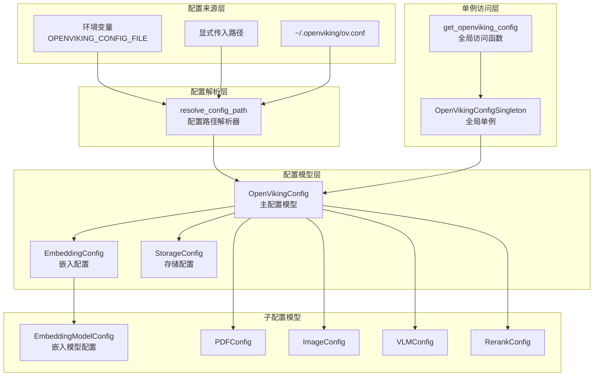

# configuration_models_and_singleton 模块

## 模块概述

`configuration_models_and_singleton` 模块是 OpenViking 系统的配置中枢，负责管理整个应用的生命周期配置。把它想象成系统的"总控室"——所有的关键参数（存储后端、嵌入模型、VLM 视觉语言模型、重排序、解析器等）都在这里定义和集中管理。

**为什么需要这样一个模块？**

在复杂的企业级应用中，配置管理是一个容易被低估的挑战。OpenViking 涉及多个子系统：
- 向量数据库存储（支持本地和远程 HTTP 两种模式）
- 多种嵌入模型提供商（OpenAI、VolcEngine、VikingDB、Jina）
- 文档解析器（PDF、图像、音频、视频、代码、Markdown、HTML 等）
- 视觉语言模型（VLM）
- 重排序服务

如果没有统一的配置抽象，每个子系统各自为政，就会出现：配置格式不一致、验证逻辑散落各处、难以追踪配置来源等问题。这个模块通过 Pydantic 提供强类型配置 + 自动验证，通过单例模式提供全局访问入口，通过配置解析器支持多种配置来源（显式路径、环境变量、默认文件）。

## 架构设计



**核心组件职责：**

| 组件 | 职责 | 关键特性 |
|------|------|----------|
| `OpenVikingConfig` | 主配置模型 | Pydantic BaseModel，提供完整的应用配置结构 |
| `OpenVikingConfigSingleton` | 全局单例 | 线程安全的延迟初始化，配置解析链 |
| `EmbeddingConfig` | 嵌入模型配置 | 支持 dense/sparse/hybrid 三种模式 |
| `EmbeddingModelConfig` | 单个嵌入模型 | 提供商特定的验证逻辑 |
| `resolve_config_path` | 路径解析 | 三级配置来源解析 |

## 配置解析流程

当应用启动并调用 `get_openviking_config()` 时，系统按照以下优先级链解析配置：

```python
# 简化流程
def get_openviking_config():
    # 优先级 1: 显式传入的路径
    # 优先级 2: 环境变量 OPENVIKING_CONFIG_FILE
    # 优先级 3: ~/.openviking/ov.conf
    # 优先级 4: 抛出 FileNotFoundError
```

这个设计的核心理念是：**明确性优先于便利性**。开发者可以通过环境变量或显式参数覆盖默认行为，但当没有任何配置时，系统会给出清晰的错误指引，而非使用危险的默认值。

## 关键设计决策

### 1. 单例模式的必要性

为什么选择单例而非依赖注入？

```python
# 实际使用方式
from openviking_cli.utils.config import get_openviking_config

config = get_openviking_config()  # 随时随地获取配置
```

**选择单例的理由：**
- OpenViking 是一个 CLI 工具，不是长生命周期服务，应用启动时加载一次配置，全生命周期使用
- 很多调用链深处的模块（如嵌入模型工厂、向量存储适配器）需要访问配置，但传递配置会让 API 签名变得臃肿
- 配置在运行时几乎不会变化

**替代方案考虑：**
- 依赖注入：对于需要单元测试的模块，可以通过 `initialize()` 方法注入mock配置
- 模块级全局状态：Python 中单例是更显式的全局状态表达

### 2. Pydantic 验证：配置即代码

所有配置类都继承自 Pydantic 的 `BaseModel`，这带来了几个关键优势：

```python
class EmbeddingModelConfig(BaseModel):
    provider: Optional[str] = Field(default="volcengine", ...)
    
    @model_validator(mode="after")
    def validate_config(self):
        if self.provider == "vikingdb":
            missing = []
            if not self.ak: missing.append("ak")
            if not self.sk: missing.append("sk")
            if missing:
                raise ValueError(f"VikingDB provider requires: {', '.join(missing)}")
```

**优势：**
- **类型安全**：配置错误在启动时暴露，而非运行时
- **文档内嵌**：`Field(description=...)` 让配置项自文档化
- **转换逻辑**：`@model_validator` 处理新旧字段兼容（如 `backend` → `provider`）

### 3. 嵌入模型工厂模式

`EmbeddingConfig` 包含了一个内嵌的工厂方法：

```python
def get_embedder(self):
    if self.hybrid:
        return self._create_embedder(self.hybrid.provider, "hybrid", self.hybrid)
    if self.dense and self.sparse:
        return CompositeHybridEmbedder(dense_embedder, sparse_embedder)
    # ...
```

这是一个**内聚性设计**的示例：配置与创建逻辑放在一起。优点是配置使用者无需关心嵌入器的实例化细节，缺点是配置模块耦合了嵌入器模块（通过延迟导入避免循环依赖）。

### 4. 配置继承与默认值

```python
class OpenVikingConfig(BaseModel):
    storage: StorageConfig = Field(default_factory=lambda: StorageConfig())
    embedding: EmbeddingConfig = Field(default_factory=lambda: EmbeddingConfig())
```

使用 `default_factory` 而非默认值对象，是为了**避免可变默认值的陷阱**（Python 经典面试题）。每次创建配置实例都会获得独立的子配置对象。

## 与其他模块的交互

### 配置消费者

| 模块 | 依赖方式 | 使用场景 |
|------|----------|----------|
| `client_session_and_transport` | 导入 `get_openviking_config` | 获取默认账户/用户标识 |
| `llm_and_rerank_clients` | 通过 `EmbeddingConfig.get_embedder()` | 创建嵌入模型实例 |
| `vectorization_and_storage_adapters` | 配置 `StorageConfig` | 确定存储后端（local/http） |
| `content_extraction_schema_and_strategies` | 使用解析器配置 | PDF/图像/音频等解析参数 |
| `tui_application_orchestration` | 读取 `default_search_mode` | TUI 搜索模式默认选项 |

### 配置来源

| 来源 | 优先级 | 典型场景 |
|------|--------|----------|
| 显式 `initialize(config_dict=...)` | 最高（1） | 单元测试、配置覆盖 |
| `initialize(config_path=...)` | 高（2） | 指定配置文件启动 |
| 环境变量 `OPENVIKING_CONFIG_FILE` | 中（3） | Docker/容器环境 |
| `~/.openviking/ov.conf` | 低（4） | 本地开发默认 |

## 使用指南

### 基本用法

```python
from openviking_cli.utils.config import get_openviking_config

# 获取全局配置（自动解析）
config = get_openviking_config()

# 访问子配置
print(config.storage.workspace)  # "./data"
print(config.embedding.dimension)  # 2048
print(config.default_search_mode)  # "thinking"
```

### 初始化自定义配置

```python
from openviking_cli.utils.config import initialize_openviking_config

# 方式 1: 从文件初始化
config = initialize_openviking_config(path="/my/workspace")

# 方式 2: 传入配置字典
from openviking_cli.utils.config import OpenVikingConfig
config = OpenVikingConfigSingleton.initialize(config_dict={
    "default_account": "my_account",
    "embedding": {
        "dense": {
            "model": "text-embedding-3-small",
            "provider": "openai",
            "api_key": "sk-xxx"
        }
    }
})
```

### 创建嵌入模型实例

```python
from openviking_cli.utils.config import get_openviking_config

config = get_openviking_config()
embedder = config.embedding.get_embedder()  # 自动根据配置创建

# 使用嵌入器
vectors = embedder.embed_documents(["hello world"])
```

## 新贡献者注意事项

### ⚠️ 常见陷阱

1. **配置对象的不可变性**
   ```python
   # 错误：修改配置对象
   config = get_openviking_config()
   config.storage.workspace = "/new/path"  # 可能不生效！
   
   # 正确：重新初始化
   initialize_openviking_config(path="/new/path")
   ```
   Pydantic 模型在验证后是冻结的，修改属性可能触发验证重跑或静默失败。

2. **环境变量 vs 显式参数的竞态**
   ```python
   # 假设环境变量已设置
   os.environ["OPENVIKING_CONFIG_FILE"] = "/path/to/config.json"
   
   # 然后调用 get_openviking_config()
   # 会优先使用环境变量，而非你传入的 explicit_path
   ```

3. **provider 和 backend 字段的兼容处理**
   ```python
   # 旧配置格式（deprecated）
   {"embedding": {"dense": {"backend": "openai", "model": "..."}}}
   
   # 新配置格式
   {"embedding": {"dense": {"provider": "openai", "model": "..."}}}
   
   # 当前兼容处理：在 EmbeddingModelConfig 中同步
   @model_validator(mode="before")
   def sync_provider_backend(cls, data):
       if data.get("backend") and not data.get("provider"):
           data["provider"] = data["backend"]
       return data
   ```
   但注意：这个兼容层是单向的（backend → provider），旧配置可以工作，新配置更推荐。

4. **默认值与验证的时序**
   ```python
   # OpenVikingConfig 中
   embedding: EmbeddingConfig = Field(default_factory=lambda: EmbeddingConfig())
   
   # EmbeddingConfig 的验证器
   @model_validator(mode="after")
   def validate_config(self):
       if not self.dense and not self.sparse and not self.hybrid:
           raise ValueError("At least one embedding configuration...")
   ```
   **问题**：如果你不提供任何嵌入配置，`default_factory` 创建的默认 `EmbeddingConfig` 会在验证时抛出异常。这意味着没有嵌入配置的 OpenVikingConfig 是无效的——这是设计意图，但可能导致初始调试时的困惑。

### 🔧 扩展点

1. **添加新的子配置**
   在 `OpenVikingConfig` 中添加新字段：
   ```python
   class OpenVikingConfig(BaseModel):
       # ...existing fields...
       my_new_feature: MyNewConfig = Field(
           default_factory=lambda: MyNewConfig(),
           description="My new feature configuration"
       )
   ```

2. **添加新的嵌入提供商**
   在 `EmbeddingConfig._create_embedder` 的 `factory_registry` 中注册：
   ```python
   ("new_provider", "dense"): (NewProviderDenseEmbedder, lambda cfg: {...})
   ```
   同时在 `EmbeddingModelConfig.validate_config()` 中添加对应验证逻辑。

3. **配置验证扩展**
   修改全局验证函数 `is_valid_openviking_config()` 添加跨配置一致性检查。

### 📊 配置验证决策树

```
应用程序启动
    │
    ▼
get_openviking_config() 被调用
    │
    ├──▶ 配置已加载？ ──是──▶ 返回缓存实例
    │
    └──▶ 否 ──▶ 解析配置路径（三级链）
              │
              ├──▶ 找到配置文件？
              │     │
              │     ├──是──▶ 解析 JSON
              │     │         │
              │     │         ▼
              │     │    Pydantic 验证
              │     │         │
              │     │    ┌────┴────┐
              │     │    │         │
              │     │  成功      失败
              │     │    │         │
              │     │    ▼         ▼
              │     │  缓存并返回  抛出异常
              │     │
              │     └──否──▶ 抛出 FileNotFoundError
              │               （包含清晰指引）
              │
              └──▶ 未找到？──▶ 抛出 FileNotFoundError
```

## 子模块文档

- [embedding_config](python_client_and_cli_utils-configuration_models_and_singleton-embedding_config.md) — 嵌入模型配置与工厂方法
- [open_viking_config](open-viking-config.md) — 主配置类与全局单例实现

## 相关文档

- [storage_schema_and_query_ranges](storage_schema_and_query_ranges.md) — 存储配置的数据模型
- [content_extraction_schema_and_strategies](content_extraction_schema_and_strategies.md) — 解析器配置
- [llm_and_rerank_clients](llm_and_rerank_clients.md) — 嵌入模型的使用方
- [embedder_base_contracts](embedder_base_contracts.md) — 嵌入模型的抽象接口
- [vectorization_and_storage_adapters](vectorization_and_storage_adapters.md) — 存储后端适配器