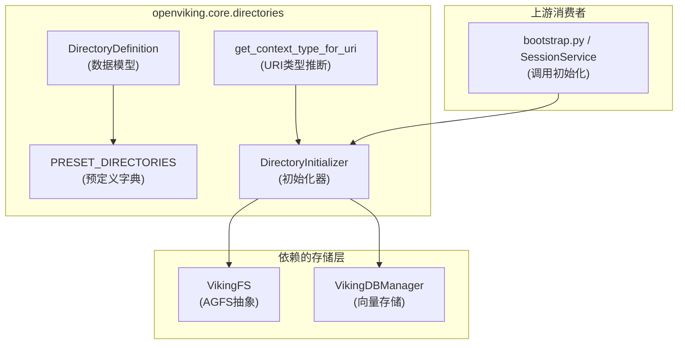

# directory_definition 模块技术深度解析

## 概述：模块的存在理由

**DirectoryDefinition** 是 OpenViking 虚拟文件系统（VikingFS）的"骨架"定义模块。在传统的文件系统中，目录结构是预先创建好的空容器；但在 OpenViking 的设计理念里，**每一个目录都是一条带有语义信息的数据记录**——它不仅存在于文件系统层面，还被向量化和索引，供语义检索使用。

这个模块回答了一个核心问题：**当一个新用户或新 Agent 首次使用系统时，应该看到什么样的目录结构？** 答案不是空的文件夹，而是一个预先设计好的、带有 L0 摘要（abstract）和 L1 概述（overview）的语义目录树。这些描述不是给机器看的——它们会被嵌入向量，用于语义搜索时理解每个目录的用途。

换个更直观的比喻：如果把 OpenViking 的虚拟文件系统比作一座城市，`DirectoryDefinition` 就像城市规划图——它定义了各个区域的职能（住宅区、商业区、工业区），以及每个区域的核心特征描述。当有人问"哪里可以买到家具？"时，向量检索会根据这些描述找到"商业区"的家具城，而不是遍历所有目录名称。

---

## 架构设计



### 核心组件职责

| 组件 | 职责 | 设计意图 |
|------|------|----------|
| `DirectoryDefinition` | 数据结构定义，包含 path、abstract、overview、children 四个字段 | 将目录语义结构化，L0/L1 分离支持分层检索 |
| `PRESET_DIRECTORIES` | 预定义的四个作用域根节点（session/user/agent/resources） | 一次性定义整个系统的默认目录树，避免重复配置 |
| `get_context_type_for_uri` | 根据 URI 路径推断 ContextType（memory/resource/skill） | 让 URI 自己携带类型信息，解耦目录与类型逻辑 |
| `DirectoryInitializer` | 将定义好的目录树写入 AGFS 和向量存储 | 惰性初始化——只创建不存在的目录，支持幂等运行 |

---

## 核心概念与心智模型

### 双层语义描述体系

理解这个模块的关键在于理解 `abstract` 和 `overview` 的区别与用途：

- **abstract（L0 摘要）**：一句话概括目录的用途，作为向量检索时的"快速过滤器"。想象火车站的指示牌——"候车室"三个字足以让你判断要不要进去，不需要详细信息。
  
- **overview（L1 概述）**：多段详细描述，提供完整语境。当你需要判断一个目录是否适合存放"Python 学习笔记"时，仅靠"学习资料"这个抽象不够，你需要知道这个目录下具体有哪些子目录、什么类型的文件。

在代码中，这两个字段被分别写入 `.abstract.md` 和 `.overview.md` 文件（VikingFS 的隐藏文件约定），同时被封装进 `Context` 对象推送到向量数据库。

### 作用域（Scope）的设计

系统定义了四个顶层作用域，每个作用域有独立的生命周期和访问模式：

1. **session（会话级）**：单次对话的临时存储，会话结束后可归档或清理
2. **user（用户级）**：跨会话持久化的用户长期记忆，包括偏好、实体、事件
3. **agent（Agent 级）**：Agent 的学习记忆和技能注册
4. **resources（资源级）**：全局共享的知识库，不绑定特定账户或 Agent

这种划分类似于操作系统的多租户设计——每个 scope 是独立的命名空间，有自己的根目录和访问控制策略。

### 惰性初始化的智慧

`DirectoryInitializer` 的设计体现了**按需创建**的原则：

- 账户级别的根目录（`viking://user`、`viking://agent` 等）在系统初始化时创建一次
- 用户空间目录（`viking://user/{user_id}`）和 Agent 空间目录（`viking://agent/{agent_space}`）是懒加载的——只有当特定用户或 Agent 首次发起请求时才创建
- 幂等性：`initialize_account_directories` 等方法会检查目录是否已存在，避免重复创建

这样做的好处是：新用户首次使用时无需等待初始化所有预定义目录，而是在首次访问时"感觉不到"地完成创建。

---

## 数据流分析

### 初始化流程（以用户首次登录为例）

```
1. 用户发起请求 → RequestContext 包含 user_id/agent_id
   
2. DirectoryInitializer.initialize_account_directories()
   ├── 遍历 PRESET_DIRECTORIES 的四个根节点
   ├── 对每个 scope 创建 viking://{scope} 根目录
   ├── _ensure_directory() 双重检查：
   │   ├── 检查 AGFS 中是否存在 .abstract.md
   │   └── 检查向量数据库中是否存在该 URI 的记录
   └── 如果不存在，则创建并 enqueue embedding message

3. DirectoryInitializer.initialize_user_directories()
   ├── 针对当前用户创建 viking://user/{user_space_name}
   ├── 递归初始化该用户空间下的所有子目录
   └── 每个目录都会在向量数据库中创建 Context 记录

4. 向量索引管道
   ├── EmbeddingMsgConverter.from_context() 转换为待嵌入消息
   ├── 进入 embedding queue
   ├── 生成向量后写入 VikingDB
   └── 后续语义检索可定位到目录级别
```

### URI 到 ContextType 的推断

`get_context_type_for_uri` 函数通过路径匹配推断类型：

```python
if "/memories" in uri:
    return ContextType.MEMORY.value
elif "/resources" in uri:
    return ContextType.RESOURCE.value
elif "/skills" in uri:
    return ContextType.SKILL.value
```

这种字符串匹配的方式简单直接，但也意味着目录结构必须遵循既定约定——如果有人创建了一个名为 "my_skills" 的目录，它不会被识别为 skill 类型。这是一种**约定优于配置**的设计选择， traded flexibility for simplicity。

---

## 设计决策与权衡

### 1. 静态定义 vs 动态发现

选择 `PRESET_DIRECTORIES` 静态字典而非运行时动态扫描文件系统，有以下考量：

| 方面 | 静态定义 | 动态扫描 |
|------|----------|----------|
| 可预测性 | 高——系统行为完全由代码控制 | 低——依赖实际文件系统状态 |
| 初始化速度 | 快——内存中读取定义 | 慢——需要遍历目录 |
| 语义完整性 | 确保每个目录都有描述 | 可能遗漏未描述的目录 |
| 灵活性 | 改动需要修改代码 | 可由配置文件控制 |

当前选择静态定义是因为：**虚拟文件系统的目录不只是存储容器，更是语义索引的节点**。如果允许任意目录结构，就无法保证每个目录都有 abstract/overview 来支持向量检索。

### 2. 双写存储（AGFS + VikingDB）

每个目录同时写入文件系统和向量数据库，这是一个有意为之的耦合设计：

- **AGFS 层面**：目录是一个真实的文件夹，里面可以存放 `.abstract.md`、`.overview.md` 和用户数据文件
- **VikingDB 层面**：目录是一条 `Context` 记录，包含 URI、owner_space、context_type 等元信息，可被语义检索

这种设计避免了"文件系统是唯一真相"或"向量索引是唯一真相"的两难，而是让两者互补。文件系统的元数据（如文件大小、修改时间）服务于传统操作，向量索引服务于语义搜索。

### 3. owner_space 的推导逻辑

在 `_ensure_directory` 方法中，根据 scope 类型推导 `owner_space`：

```python
if scope in {"user", "session"}:
    owner_space = ctx.user.user_space_name()
elif scope == "agent":
    owner_space = ctx.user.agent_space_name()
```

这里有一个微妙的区别：
- `user_space_name()` 直接返回 `user_id`
- `agent_space_name()` 是 `md5(user_id + agent_id)[:12]`——用哈希而非简单拼接，是为了避免命名冲突并保持空间标识的不可预测性

这种设计确保了不同 Agent（即使是同一用户）拥有独立的记忆空间——Agent A 不会看到 Agent B 的案例记录。

---

## 使用指南与扩展点

### 添加新的预定义目录

如果需要在现有 scope 下添加新的子目录，只需修改 `PRESET_DIRECTORIES` 字典：

```python
# 示例：在 user/memories 下添加新的 "goals" 子目录
DirectoryDefinition(
    path="goals",
    abstract="User's goal and milestone tracking.",
    overview="Stores user-defined goals, milestones, and progress tracking...",
)
```

**注意**：这只会影响新创建的账户或首次初始化。对于已有用户，可以提供迁移脚本或清理缓存重新初始化。

### 自定义初始化逻辑

`DirectoryInitializer` 的设计允许子类化来扩展行为：

```python
class CustomDirectoryInitializer(DirectoryInitializer):
    async def _ensure_directory(self, uri, parent_uri, defn, scope, ctx):
        # 添加自定义检查或日志
        return await super()._ensure_directory(uri, parent_uri, defn, scope, ctx)
```

### 在业务代码中调用初始化

典型的调用模式出现在系统引导阶段：

```python
from openviking.core.directories import DirectoryInitializer

initializer = DirectoryInitializer(vikingdb=vikingdb_manager)

# 初始化账户级根目录
count = await initializer.initialize_account_directories(ctx)

# 初始化当前用户的个人空间
user_count = await initializer.initialize_user_directories(ctx)
```

---

## 边缘情况与已知陷阱

### 1. 重复初始化的开销

虽然 `initialize_*_directories` 方法具有幂等性（检查目录是否存在），但它们在每次调用时都会：
- 访问 VikingFS 检查 `.abstract.md` 是否存在
- 查询向量数据库检查 Context 记录是否存在

在高频调用场景下（如每次请求都尝试初始化），这会造成不必要的 I/O 开销。建议在应用启动或用户首次登录时调用一次即可。

### 2. URI 路径大小写敏感

系统使用字符串匹配 `/memories`、`/resources`、`/skills` 来推断 context_type。如果 URI 是 `/Memories`（大写 M），推断会失败，返回默认的 `RESOURCE` 类型。**确保所有目录路径使用小写**。

### 3. owner_space 与 scope 的隐式约定

代码中硬编码了 scope 到 owner_space 的映射逻辑：

```python
if scope in {"user", "session"}:
    owner_space = ctx.user.user_space_name()
elif scope == "agent":
    owner_space = ctx.user.agent_space_name()
```

如果未来添加新的 scope 类型（如 `team`、`organization`），需要同步修改这段逻辑，否则 owner_space 会是空字符串，导致权限和隔离问题。

### 4. 向量嵌入的异步性质

`DirectoryInitializer` 通过 `enqueue_embedding_msg` 将 embedding 任务放入队列，但**不等待向量生成完成**。这意味着：
- 目录在 AGFS 中立即可见
- 向量检索可能在几秒后才生效

对于需要立即检索的场景，这是一个潜在的时间窗口。可以通过检查 embedding queue 的处理状态来确认。

---

## 依赖关系图

```
依赖的模块（上游）：
├── openviking.core.context (Context, ContextType, Vectorize)
├── openviking.server.identity (RequestContext)
├── openviking.storage.queuefs.embedding_msg_converter (EmbeddingMsgConverter)
└── openviking.storage.viking_fs (get_viking_fs)

依赖此模块的下游：
├── openviking.server.bootstrap (调用 DirectoryInitializer)
├── openviking.session.session.Session (用户空间初始化)
└── openviking.service.session_service (会话级目录初始化)
```

---

## 参考资料

### 父模块
- [session_runtime_and_skill_discovery](./session_runtime_and_skill_discovery.md) — 模块总览，了解 Session、SkillLoader、DirectoryDefinition 如何协同工作

### 核心依赖
- [context 模块](./core-context.md) — Context 数据模型的完整定义
- [viking_fs 模块](./storage-viking-fs.md) — VikingFS 文件系统抽象
- [vikingdb_manager 模块](./storage-vikingdb-manager.md) — 向量存储管理器

### 相关功能
- [hierarchical_retriever 模块](./retrieve-hierarchical-retriever.md) — 如何利用目录层级进行语义检索
- [session_runtime](./session_runtime.md) — Session 如何使用目录初始化创建用户/Agent 空间