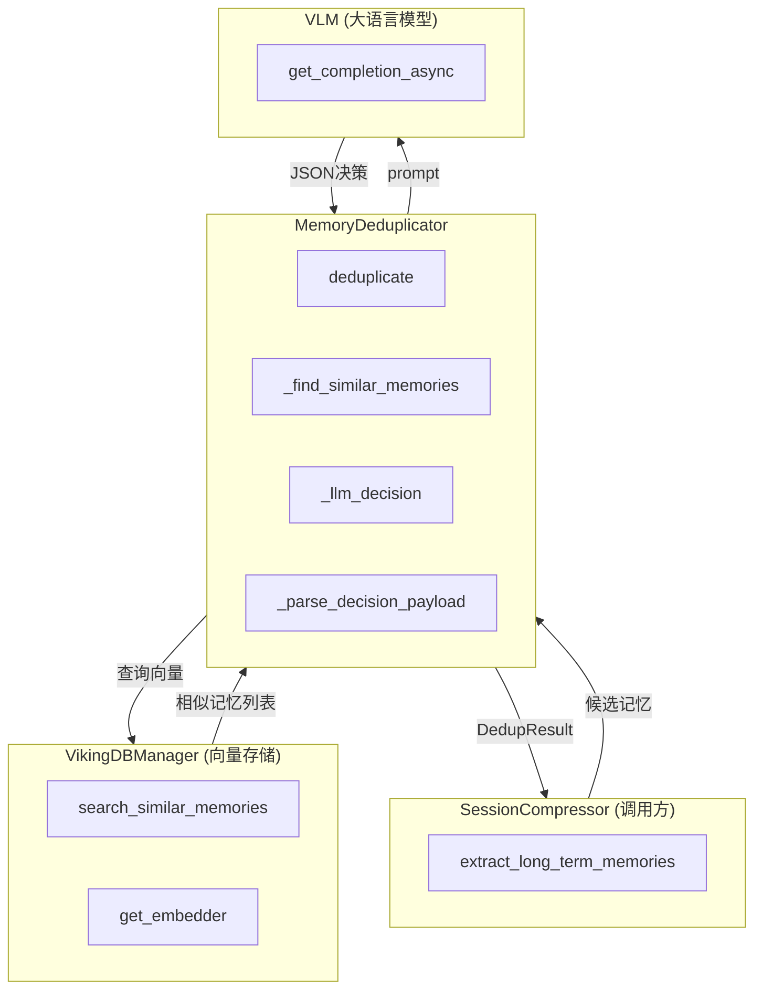

# session_memory_deduplication 模块技术深度解析

## 概述：为什么需要这个模块

在 OpenViking 系统中，当用户的对话会话被提交（commit）时，系统会从中提取**长期记忆**（Long-term Memories）。这些记忆会被存储到向量数据库中，供后续检索使用。然而，这里存在一个核心问题：**如何避免重复记忆的无限膨胀？**

想象一下，一个用户告诉系统"我偏好简洁的回答"，一周后又说"我喜欢简短的答案"，一个月后再说"回答尽量简洁一些"。这三个表述本质上是同一件事，但如果系统不加区分地全部存储，不仅浪费存储空间，还会导致检索时返回大量语义冗余的结果，让 LLM 在作答时受到噪音干扰。

**session_memory_deduplication** 模块正是为解决这一问题而设计的。它的核心职责是：在将候选记忆写入存储之前，判断这个记忆是否与已有记忆重复，如果是，则决定是跳过（skip）、创建新记忆（create）、还是与已有记忆合并（merge）。

这个模块采用**两阶段决策架构**：先用向量相似度进行高效的预筛选，再将候选记忆与少量最相似的已有记忆提交给 LLM 进行语义层面的精细判断。这种设计在计算成本和决策质量之间取得了平衡。

---

## 架构设计与数据流

### 核心抽象

理解这个模块需要掌握四个关键概念：

**1. CandidateMemory（候选记忆）**

这是从会话中提取的待存储记忆，包含三个粒度的文本表示：
- **abstract（L0）**：一句话摘要
- **overview（L1）**：中等详细程度的 Markdown 描述
- **content（L2）**：完整的叙事性内容

这三个层次对应人类记忆的不同抽象级别，LLM 在做去重决策时需要综合考虑。

**2. Context（已有记忆）**

这是系统中已经存储的长期记忆，用 `Context` 对象表示。每个 Context 都有唯一的 URI，格式如 `viking://user/{space}/memories/{category}/{id}`，通过 URI 可以追溯记忆的类型和所属空间。

**3. DedupDecision（候选级决策）**

```python
class DedupDecision(str, Enum):
    SKIP = "skip"      # 重复，跳过
    CREATE = "create"  # 创建新记忆
    NONE = "none"      # 不创建候选，但需要处理已有记忆
```

这个枚举定义了处理候选记忆的三种可能结果。

**4. MemoryActionDecision（已有记忆操作决策）**

```python
class MemoryActionDecision(str, Enum):
    MERGE = "merge"   # 将候选合并到已有记忆
    DELETE = "delete" # 删除冲突的已有记忆
```

这个枚举定义了对已有记忆的操作方式。

### 组件交互图



---

## 核心组件详解

### MemoryDeduplicator 类

这是模块的核心类，负责去重决策的全部逻辑。它的设计体现了**渐进式决策**的思想：先用低成本操作过滤掉明显不需要处理的场景，再用高成本但更智能的 LLM 处理边界情况。

#### 初始化与依赖注入

```python
def __init__(self, vikingdb: VikingDBManager):
    self.vikingdb = vikingdb
    self.embedder = self.vikingdb.get_embedder()
```

这个类依赖 `VikingDBManager` 来完成两项任务：获取嵌入器（用于向量计算）和搜索相似记忆。通过依赖注入的方式，使得单元测试可以轻松 Mock 这些依赖。

#### 两阶段去重流程：deduplicate 方法

这是模块的入口方法，完整地展示了两阶段决策架构：

```python
async def deduplicate(self, candidate: CandidateMemory) -> DedupResult:
    # 阶段1：向量预筛选
    similar_memories = await self._find_similar_memories(candidate)

    if not similar_memories:
        # 没有相似记忆，直接创建
        return DedupResult(
            decision=DedupDecision.CREATE,
            ...
        )

    # 阶段2：LLM 决策
    decision, reason, actions = await self._llm_decision(candidate, similar_memories)
    return DedupResult(...)
```

**阶段1的设计洞察**：为什么不直接用 LLM 判断？因为向量搜索的成本远低于 LLM 调用。如果候选记忆与任何已有记忆都不相似（向量距离超过阈值），直接创建即可，无需浪费 LLM 的计算资源。代码中 `SIMILARITY_THRESHOLD = 0.0` 看似宽松，但这是一个有意的设计选择——宁可多召回一些候选给 LLM 筛选，也不要漏掉可能相似的记忆。

#### 向量预筛选：_find_similar_memories 方法

这个方法的职责是在特定类别（category）下找到与候选记忆最相似的已有记忆：

```python
async def _find_similar_memories(self, candidate: CandidateMemory) -> List[Context]:
    # 1. 为候选生成向量嵌入
    query_text = f"{candidate.abstract} {candidate.content}"
    embed_result = self.embedder.embed(query_text)
    query_vector = embed_result.dense_vector

    # 2. 构建类别 URI 前缀，确保只在同类型记忆间比较
    category_uri_prefix = self._category_uri_prefix(candidate.category.value, candidate.user)

    # 3. 向量数据库搜索
    results = await self.vikingdb.search_similar_memories(
        account_id=account_id,
        owner_space=owner_space,
        category_uri_prefix=category_uri_prefix,
        query_vector=query_vector,
        limit=5,
    )

    # 4. 按相似度阈值过滤
    similar = []
    for result in results:
        score = float(result.get("_score", 0))
        if score >= self.SIMILARITY_THRESHOLD:
            context = Context.from_dict(result)
            similar.append(context)
    return similar
```

**设计意图**：类别过滤是关键的设计选择。系统将记忆分为用户类别（preferences、entities、events）和智能体类别（cases、patterns），只在同一类别内进行比较。例如，"用户偏好的简洁回答"和"智能体处理的代码案例"即使向量相似，也不应该被当作重复。这种设计避免了跨域误判的问题。

**另一个细节**：代码中限制 `limit=5`，只取最相似的 5 条记忆传给 LLM。这既是成本控制（LLM 的上下文窗口有限），也是工程权衡——实验表明，超过 5 条后决策质量提升甚微。

#### LLM 决策：_llm_decision 方法

这个方法将去重决策委托给大语言模型：

```python
async def _llm_decision(self, candidate, similar_memories):
    # 1. 准备 prompt 变量
    prompt = render_prompt(
        "compression.dedup_decision",
        {
            "candidate_content": candidate.content,
            "candidate_abstract": candidate.abstract,
            "candidate_overview": candidate.overview,
            "existing_memories": "\n".join(existing_formatted),
        },
    )

    # 2. 调用 LLM
    response = await vlm.get_completion_async(prompt)

    # 3. 解析响应
    data = parse_json_from_response(response) or {}
    return self._parse_decision_payload(data, similar_memories, candidate)
```

**Prompt 设计的关键约束**（参见 `dedup_decision.yaml`）：

1. **硬约束（Hard constraints）**：
   - 如果 decision 是 "skip"，不应返回 list（因为没有需要操作的已有记忆）
   - 如果任何 list 项使用 "merge"，decision 必须是 "none"
   - 如果 decision 是 "create"，list 只能包含 delete 操作

2. **安全边界**：
   - delete 操作只能用于完全过时的记忆，部分冲突应使用 merge
   - 主题/切面（facet）不匹配的记忆不应被操作

这些约束被编码在 prompt 中，期望 LLM 遵守。同时，代码层面也有防御性检查（见 `_parse_decision_payload`）。

#### 响应解析与规范化：_parse_decision_payload 方法

这是模块中最复杂的部分，负责处理 LLM 返回的各种响应格式，并强制执行安全规则：

```python
def _parse_decision_payload(self, data, similar_memories, candidate):
    # 1. 解析决策字符串
    decision_str = data.get("decision", "create").lower().strip()
    decision = decision_map.get(decision_str, DedupDecision.CREATE)

    # 2. 处理 legacy 响应（向后兼容）
    if decision_str == "merge" and not raw_actions and similar_memories:
        raw_actions = [{"uri": similar_memories[0].uri, "decide": "merge", ...}]

    # 3. 构建 action 列表，处理 URI 和索引两种引用方式
    actions = []
    for item in raw_actions:
        # 支持 uri 和 index 两种定位方式
        memory = similar_by_uri.get(uri) or similar_memories[index - 1]
        actions.append(ExistingMemoryAction(memory=memory, decision=action, ...))

    # 4. 强制安全规则
    if decision == DedupDecision.SKIP:
        return decision, reason, []  # skip 时忽略所有 actions

    has_merge_action = any(a.decision == MemoryActionDecision.MERGE for a in actions)

    # 规则：如果有 merge，CREATE 要被规范化为 NONE
    if decision == DedupDecision.CREATE and has_merge_action:
        decision = DedupDecision.NONE

    # 规则：CREATE 只能携带 delete 操作
    if decision == DedupDecision.CREATE:
        actions = [a for a in actions if a.decision == MemoryActionDecision.DELETE]

    return decision, reason, actions
```

**设计洞察**：为什么需要这么多规范化规则？因为 LLM 的输出不可控。即使 prompt 中明确了约束，LLM 仍可能返回不规范的响应（比如"create" + "merge"组合）。`_parse_decision_payload` 中的规范化逻辑是一种**防御性编程**实践，确保即使 LLM 犯错，系统也不会执行危险操作（如在创建新记忆的同时又合并到已有记忆）。

#### 辅助方法：_extract_facet_key

这个方法从记忆摘要中提取"切面键"（facet key），用于在 prompt 中向 LLM 展示记忆的所属领域：

```python
@staticmethod
def _extract_facet_key(text: str) -> str:
    # 优先使用常见分隔符
    for sep in ("：", ":", "-", "—"):
        if sep in normalized:
            return normalized.split(sep, 1)[0].strip().lower()

    # 回退：取开头的短短语
    m = re.match(r"^(.{1,24})\s", normalized.lower())
    if m:
        return m.group(1).strip()
    return normalized[:24].lower().strip()
```

例如，摘要"饮食偏好：喜欢苹果"会被提取为"饮食偏好"。这帮助 LLM 快速判断候选记忆和已有记忆是否属于同一领域。

---

## 设计决策与权衡

### 1. 两阶段过滤 vs 纯 LLM 决策

**权衡**：为什么不用 LLM 直接判断所有候选？

- **纯 LLM 方案**：每次候选都需要调用 LLM，成本高且延迟大
- **两阶段方案**：先用向量搜索快速过滤明显不重复的候选，只对真正"有可能重复"的候选调用 LLM

当前设计选择了两阶段方案，这是典型的**成本-质量权衡**。向量搜索的成本约为 LLM 调用的 1/100，通过预筛选可以将 LLM 调用量降低一个数量级。

### 2. 相似度阈值为 0

代码中 `SIMILARITY_THRESHOLD = 0.0`，意味着几乎不过滤。这看起来反直觉，但实际上是有意为之：

- **宁可误召回，不可漏召回**：如果阈值过高，可能漏掉真正相似的记忆
- **LLM 是最终的判断者**：即使向量相似度很低，LLM 也可以根据语义判断是否真的重复
- **当前阈值已经是隐式过滤**：向量搜索本身返回的是按相似度排序的结果，limit=5 已经是过滤

### 3. 向后兼容性设计

`_parse_decision_payload` 中有大量处理 legacy 响应格式的代码：

```python
# 兼容旧版本：{"decision":"merge"}
decision_map = {
    "skip": DedupDecision.SKIP,
    "create": DedupDecision.CREATE,
    "none": DedupDecision.NONE,
    "merge": DedupDecision.NONE,  # 旧版本的 merge 映射到 none
}
```

这种设计允许系统升级后，旧的 prompt 版本仍能正常工作。代价是代码复杂度增加，但换取了系统的平滑演进能力。

### 4. 类别隔离策略

```python
_USER_CATEGORIES = {"preferences", "entities", "events"}
_AGENT_CATEGORIES = {"cases", "patterns"}
```

只在同一类别内进行去重比较。这是一个**业务层面的假设**，认为用户的偏好和智能体的案例是不同维度的记忆，不应该互相去重。如果未来业务逻辑变化（比如需要跨类别去重），这里需要修改。

值得注意的是，`SessionCompressor` 中定义了额外的类别策略：
- `ALWAYS_MERGE_CATEGORIES = {MemoryCategory.PROFILE}`：Profile 类别的记忆跳过去重逻辑，直接创建
- `MERGE_SUPPORTED_CATEGORIES`：定义了哪些类别支持 MERGE 操作（preferences、entities、patterns 支持，而 events 和 cases 不支持）

这种分层设计（去重模块负责决策 vs 消费模块负责执行）是一种关注点分离的实践。

---

## 依赖关系与数据契约

### 上游调用者

**SessionCompressor** 是这个模块的主要调用方。在 `extract_long_term_memories` 方法中：

```python
for candidate in candidates:
    result = await self.deduplicator.deduplicate(candidate)
    actions = result.actions or []
    decision = result.decision
    # 根据 decision 和 actions 执行相应操作
```

调用方期望：
1. `deduplicate` 返回一个 `DedupResult` 对象
2. `result.decision` 必须是 `DedupDecision` 枚举值之一
3. `result.actions` 是一个列表，每个元素包含 `memory`（已有 Context）、`decision`（操作类型）、`reason`（理由）

### 下游依赖

1. **VikingDBManager**：提供向量搜索和嵌入能力
2. **VLM（Vision-Language Model）**：用于语义决策
3. **render_prompt**：渲染去重决策的 prompt 模板
4. **Context**：已有记忆的数据结构

### 异常处理

模块对下游失败有容错机制：

- **向量搜索失败**：返回空列表，等同于"无相似记忆，直接创建"
- **LLM 不可用**：默认返回 CREATE（保守策略，宁可重复也不错过）
- **LLM 解析失败**：默认返回 CREATE

这些都是**fail-safe** 的设计，确保系统不会因为去重模块的异常而阻塞记忆存储流程。

---

## 使用示例与扩展

### 基础使用

```python
from openviking.session.memory_deduplicator import MemoryDeduplicator
from openviking.storage import VikingDBManager

# 初始化
vikingdb = VikingDBManager(...)
deduplicator = MemoryDeduplicator(vikingdb=vikingdb)

# 对候选进行去重决策
candidate = CandidateMemory(
    category=MemoryCategory.PREFERENCES,
    abstract="User prefers dark mode",
    overview="...",
    content="...",
    source_session="session_123",
    user=user,
    language="en"
)

result = await deduplicator.deduplicate(candidate)
print(result.decision, result.reason)
```

### 修改相似度阈值

如果需要调整预筛选的严格程度，可以子类化：

```python
class StrictMemoryDeduplicator(MemoryDeduplicator):
    SIMILARITY_THRESHOLD = 0.7  # 更严格的阈值

    # 或者修改传入参数
    def __init__(self, vikingdb, threshold=0.0):
        super().__init__(vikingdb)
        self.SIMILARITY_THRESHOLD = threshold
```

---

## 边缘情况与注意事项

### 1. 冷启动问题

系统初期没有多少记忆时，向量搜索可能返回空结果。此时会直接创建新记忆，即使这些记忆之间可能存在语义重复。这是所有基于向量检索的去重系统的固有问题，需要积累一定量的数据后才能发挥效用。

### 2. 类别边界模糊与空前缀处理

某些记忆可能同时属于多个类别。例如，"用户偏好使用 Python" 既是偏好（preferences），也是技能相关（patterns）。当前设计强制单类别归属，可能导致这类边界情况的处理不够理想。

更值得注意的是，当候选记忆的 category 不在预定义的 `_USER_CATEGORIES` 或 `_AGENT_CATEGORIES` 中时，`_category_uri_prefix()` 会返回空字符串，导致向量搜索在整个账户范围内进行，而不限定 category。这可能引入跨类别的误匹配。虽然这是一个保守的安全措施（防止遗漏），但在未来的版本中可能会引入显式的警告或错误。

### 3. Abstract 获取的多重来源

`_llm_decision()` 方法在构建现有记忆的格式化字符串时，会依次尝试从 `mem.abstract`、`mem._abstract_cache` 和 `mem.meta["abstract"]` 获取摘要：

```python
abstract = (
    getattr(mem, "abstract", "")
    or getattr(mem, "_abstract_cache", "")
    or (mem.meta or {}).get("abstract", "")
)
```

这反映了 `Context.from_dict()` 在反序列化时可能将摘要信息存储在不同位置的复杂性。如果所有这些来源都为空，LLM 将收到一个空的 abstract，这会影响其判断相似性的能力。开发者需要注意数据序列化时的一致性。

### 4. 删除操作的不可逆性

`MemoryActionDecision.DELETE` 会真正删除存储的记忆文件，且从向量索引中移除。这个操作是破坏性的，虽然代码中有各种 guardrails 防止误删，但如果 LLM 判断错误，仍可能造成数据丢失。建议在高风险场景下增加人工审核流程。

### 5. LLM 的token消耗

每次去重决策都会构造一个较长的 prompt（包含候选记忆的 L0/L1/L2 三个层次，以及最多 5 条已有记忆的摘要）。如果系统需要处理大量候选记忆，LLM 的 token 消耗会非常可观。监控并优化 prompt 长度是未来的一个潜在改进方向。

### 6. 并发安全性

当前实现是单实例无状态的，但如果有多个去重请求同时处理同一批候选记忆，可能产生竞态条件。例如，两个请求都判断某候选应该创建，最终导致重复存储。系统目前依赖于上层调用方的事务控制，后续如需分布式部署，需要考虑加锁或分布式事务。

---

## 相关文档

- [session_runtime](./session_runtime.md) — 了解去重模块在记忆提取流程中的位置（commit() 调用 SessionCompressor）
- [context_typing_and_levels](./core_context_prompts_and_sessions-context_typing_and_levels.md) — 了解已有记忆的数据结构 Context
- [prompt_template_metadata](./core_context_prompts_and_sessions-prompt_template_metadata.md) — 了解 LLM 使用的 dedup_decision 提示词模板

---

## 总结

session_memory_deduplication 模块是 OpenViking 记忆系统中的关键质量保障组件。它通过**两阶段决策架构**（向量预筛选 + LLM 语义判断）实现了去重效果与计算成本之间的平衡。模块的核心设计理念是**fail-safe** 和 **defensive**：即使 LLM 返回不规范响应，代码层面的规范化逻辑也能确保系统行为安全可控。

对于新加入的开发者，需要特别关注以下几点：

1. **类别隔离是核心假设**：`_USER_CATEGORIES = {"preferences", "entities", "events"}` 和 `_AGENT_CATEGORIES = {"cases", "patterns"}` 的划分决定了去重只在同类别内进行。如果业务逻辑需要跨类别去重，这里需要修改。

2. **删除操作是破坏性的**：`MemoryActionDecision.DELETE` 会真正删除存储的记忆文件并从向量索引中移除。代码中有多个 guardrails（SKIP 决策不带动作、CREATE 只能有 DELETE 动作、merge 触发决策规范化等）作为最后防线，但在高风险场景下建议增加人工审核。

3. **相似度阈值设为 0 是有意为之**：这反映了"宁可误召回，不可漏召回"的设计哲学。向量搜索只是预过滤，真正的语义判断由 LLM 完成。

4. **向后兼容性代码较多**：`decision_map` 中的 `"merge": DedupDecision.NONE` 映射、`_parse_decision_payload` 中的 legacy 响应处理，都是为了支持系统平滑升级。

5. **并发安全需关注**：当前实现是无状态的，但如果多个请求同时处理同一用户的候选记忆，可能产生竞态条件（如两个请求都判断应该创建，导致重复存储）。上层调用方需要考虑事务控制。

6. **一个未使用的辅助方法**：代码中存在 `_cosine_similarity()` 静态方法，但在实际流程中并未被调用（向量相似度由 VikingDB 返回）。这可能是遗留代码或为未来扩展预留。