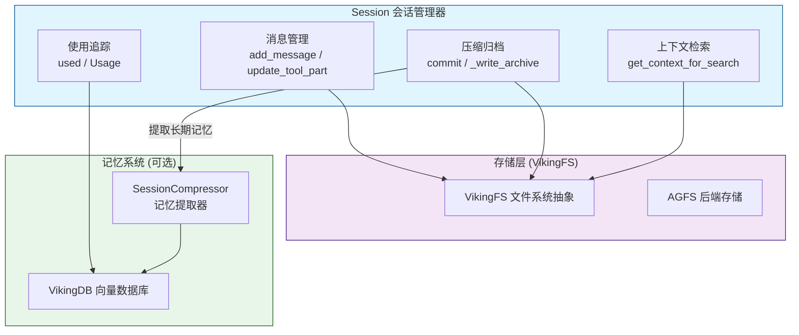
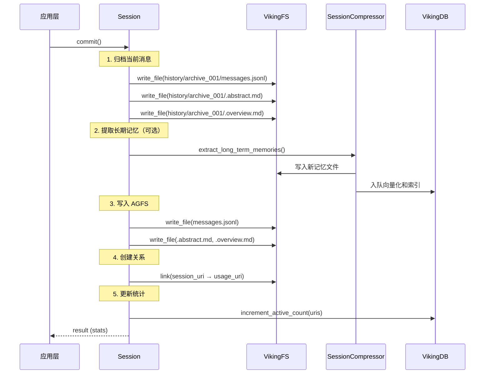

# session_runtime 模块技术深度解析

## 概述

**session_runtime** 是 OpenViking 系统中负责会话生命周期管理的核心模块。如果你把整个系统想象成一座记忆宫殿，那么 Session 就是这座宫殿的"当前展厅"——它管理着用户与 AI 助手正在进行的一场对话的所有上下文信息：用户说了什么、AI 如何回复、调用了哪些工具、引用了哪些记忆和资源。

这个模块解决的核心问题是：**如何在有限的上下文窗口内，维持一场持续、连贯的多轮对话，同时将重要的交互历史转化为长期记忆**。

在一个复杂的 AI 助手中，用户可能会进行数十轮对话，引用大量之前存储的记忆（memory）和资源（resource），调用各种技能（skill）。如果把所有信息都塞进 LLM 的上下文窗口， token 成本会急剧膨胀，性能会下降；但如果过早丢弃对话历史，就会失去重要的上下文线索。Session 模块正是在这两难之间找到了平衡点——它维护"活跃对话"、定期将旧消息"归档"为压缩摘要、并从中提取有价值的信息存入长期记忆系统。

---

## 架构图与组件角色



### 核心组件

**Session 类** 是整个模块的枢纽，它扮演三个关键角色：

1. **对话状态容器**：内存中维护当前会话的消息列表、统计信息和使用记录
2. **持久化适配器**：将对话状态同步到 VikingFS（AGFS 后端），支持增量追加和全量覆写
3. **记忆提取编排器**：在会话提交（commit）时触发长期记忆的提取和存储

**辅助数据结构**：

- **SessionCompression**：记录会话压缩（归档）的状态，包括原始消息数、压缩后消息数、归档索引等
- **SessionStats**：会话统计信息，包括总轮次、总 token 数、使用的上下文数、使用的技能数、提取的记忆数
- **Usage**：单条使用记录，追踪一次交互中引用了哪些上下文或技能

---

## 核心设计理念与心智模型

### 会话即"流水账"

理解 Session 最好的比喻是把它想象成**一本正在书写的流水账**：

- 每当用户说一句话，账本上就增加一行（`add_message`）
- 每当 AI 调用一个工具，账本就记录工具的调用和返回结果（`update_tool_part`）
- 当账本写得差不多了（达到阈值），就把它从头到尾整理一遍，写成一份"摘要"存进历史档案（`commit` / `_write_archive`）

这本"流水账"有两个显著特点：**持续累积**和**定期归档**。

### 消息模型：Part 组合

Session 中的消息不是简单的字符串，而是由多个 **Part** 组成的复合结构：

- **TextPart**：纯文本内容，用户的问题或 AI 的回答
- **ContextPart**：对之前存储的记忆或资源的引用，包含 URI 和摘要（abstract）
- **ToolPart**：工具调用的描述和结果，包含工具 ID、名称、输入输出和状态

这种设计使得对话历史不仅记录了"说了什么"，还记录了"参考了什么"、"用了什么工具"。当这段历史被归档时，这些信息都会成为记忆提取的原材料。

### 压缩与归档机制

Session 采用了**主动归档**策略，而非被动驱逐：

1. 当消息数量累积到一定阈值（`auto_commit_threshold`，默认 8000 tokens），触发 `commit()`
2. 当前所有消息被打包写入 `history/archive_NNN/` 目录
3. 使用 LLM 生成结构化摘要（`.abstract.md` 和 `.overview.md`）
4. 清空内存中的消息列表，重新开始累积

这种设计的优势是**可控性**——归档时机由应用层明确触发，而非由底层缓存策略隐式决定。这对于需要精确控制"记忆提取时机"的 AI 助手尤为重要。

---

## 数据流分析

### 典型会话生命周期

```
创建会话 → 加载历史 → 添加消息 → 更新工具 → 提交归档 → 提取记忆
```

#### 1. 创建与加载

```python
session = Session(
    viking_fs=viking_fs,
    vikingdb_manager=vikingdb_manager,
    session_compressor=compressor,
    session_id="session_123"
)
await session.load()  # 从 VikingFS 恢复历史状态
```

Session 初始化时接受三个核心依赖：
- **VikingFS**：文件系统和关系存储的抽象层
- **VikingDBManager**（可选）：向量数据库管理器，用于更新 active_count 和记忆索引
- **SessionCompressor**（可选）：记忆提取器，负责从归档消息中提取长期记忆

加载过程会：
1. 读取 `viking://session/{user}/{session_id}/messages.jsonl` 恢复内存中的消息
2. 扫描 `history/` 目录，恢复 `compression_index`（归档编号）

#### 2. 添加消息

```python
session.add_message(
    role="user",
    parts=[TextPart(text="帮我查找关于 Python 异步编程的资料")]
)
```

消息被添加到内存列表的同时，会**增量追加**到 `messages.jsonl` 文件中。这里有个关键设计决策：每次 `add_message` 都同步写盘，而非仅在内存中累积。这确保了即使进程异常退出，对话历史也不会丢失。

#### 3. 工具调用追踪

```python
session.update_tool_part(
    message_id="msg_abc123",
    tool_id="tool_search",
    output='{"results": [...]}',
    status="completed"
)
```

当 AI 调用工具时，Session 会：
1. 在内存中找到对应的消息和 ToolPart
2. 更新工具输出和状态
3. 将工具调用详情写入 `tools/{tool_id}/tool.json`
4. 同步更新 `messages.jsonl`

#### 4. 提交与归档

```python
result = session.commit()
```

`commit()` 是 Session 最重要、最复杂的操作，它执行以下步骤：



#### 5. 上下文检索

```python
context = await session.get_context_for_search(
    query="Python 异步",
    max_archives=3,
    max_messages=20
)
```

当需要为意图分析或检索增强生成（RAG）准备上下文时，Session 会：
1. 取出最近 N 条消息（`max_messages`）
2. 扫描历史归档，用查询关键词计算相关性分数
3. 返回最相关且最新的归档摘要列表

---

## 依赖分析与契约

### 上游依赖（Session 依赖什么）

| 依赖组件 | 作用 | 关键方法 |
|---------|------|---------|
| **VikingFS** | 文件系统抽象，持久化消息、归档、关系 | `read_file`, `write_file`, `append_file`, `ls`, `mkdir`, `link`, `stat` |
| **VikingDBManager** | 向量数据库，管理记忆索引和活跃度统计 | `increment_active_count`, `enqueue_embedding_msg`, `delete_uris` |
| **SessionCompressor** | 记忆提取器，从归档消息中提取长期记忆 | `extract_long_term_memories` |
| **Message / Part** | 消息数据结构 | `Message.from_dict`, `Message.to_jsonl` |
| **RequestContext** | 请求上下文，携带用户身份和权限 | 用户身份验证、角色控制 |

### 下游依赖（什么组件调用 Session）

- **CLI / TUI**：命令行界面创建和管理会话
- **HTTP API**：REST API 暴露会话操作
- **检索模块**：调用 `get_context_for_search` 获取对话上下文

### 数据契约

**输入契约**：
- `add_message(role, parts)`：role 必须是 "user" 或 "assistant"，parts 是非空列表
- `used(contexts, skill)`：contexts 是 URI 列表，skill 是包含 uri 字段的字典

**输出契约**：
- `commit()` 返回包含 `session_id`, `status`, `memories_extracted`, `stats` 的字典
- `get_context_for_search()` 返回包含 `summaries`（归档摘要列表）和 `recent_messages`（最近消息列表）的字典

---

## 设计决策与权衡

### 1. 同步写盘 vs 异步缓冲

**决策**：每次 `add_message` 都同步调用 `run_async` 写盘，而非在内存中缓冲后批量写入。

**权衡分析**：
- **优点**：极高的可靠性——即使进程崩溃或机器断电，已添加的消息也不会丢失
- **缺点**：每次添加消息都有一次 I/O 开销，在高频场景下可能影响性能
- **适用场景**：对于 AI 助手这类"对话"场景，可靠性远比极致性能重要。一次对话每秒可能只产生几条消息，I/O 开销可以接受。但如果用于高频日志采集，则需要重新考虑。

### 2. 主动归档 vs 被动驱逐

**决策**：使用显式的 `auto_commit_threshold` 触发归档，而非 LRU 等被动策略。

**权衡分析**：
- **优点**：精确控制归档时机，便于在恰好需要提取记忆的时刻执行；归档内容完整，不会被"意外驱逐"
- **缺点**：需要应用层主动调用 `commit()`，如果忘记调用，内存会持续增长
- **设计意图**：这是有意为之的设计——AI 助手需要在"一轮对话结束后"提取记忆，而不是在任何随意的时刻

### 3. 可选依赖注入

**决策**：VikingDBManager 和 SessionCompressor 都是可选依赖，没有时 Session 降级为纯会话管理（不涉及记忆提取）。

**权衡分析**：
- **优点**：Session 可以独立工作，不需要记忆系统；便于单元测试
- **缺点**：调用方需要知道哪些方法在未注入依赖时是空操作
- **设计意图**：这是一个经典的"依赖倒置"实践——Session 不关心记忆系统如何实现，只关心"能否提取记忆"

### 4. 关系创建的副作用

**决策**：`commit()` 会为每个 Usage 记录创建 `link` 关系。

**权衡分析**：
- **优点**：自动建立会话与引用的上下文/技能之间的关系图，支持后续的"血缘分析"
- **缺点**：如果 Usage 列表很大（比如引用了几十个资源），会触发几十次 `link` 调用，增加延迟
- **改进空间**：可以改为批量 link，或者在后台异步执行

---

## 使用指南与最佳实践

### 初始化 Session

```python
from openviking.session.session import Session
from openviking.storage.viking_fs import get_viking_fs

viking_fs = get_viking_fs()
session = Session(
    viking_fs=viking_fs,
    vikingdb_manager=vikingdb_manager,  # 可选
    session_compressor=session_compressor,  # 可选
    user=user_identifier,
    auto_commit_threshold=8000  # 可自定义
)
await session.load()
```

### 常规交互流程

```python
# 用户发送消息
session.add_message(
    role="user",
    parts=[TextPart(text="帮我写一个快速排序")]
)

# AI 响应
session.add_message(
    role="assistant",
    parts=[
        TextPart(text="好的，这里是快速排序的实现..."),
        ToolPart(tool_id="tool_code", tool_name="write_file", tool_input={"path": "quicksort.py"})
    ]
)

# 追踪引用的上下文
session.used(contexts=["viking://memory/user/001", "viking://resource/github/002"])
```

### 定期提交

```python
# 在对话阶段结束时调用
result = session.commit()
print(f"归档了 {result['archived']} 条消息，提取了 {result['memories_extracted']} 条记忆")
```

---

## 边缘情况与陷阱

### 1. 重复加载

`load()` 方法有内置的 `_loaded` 标志，防止重复加载。但如果你手动修改了 `_messages` 列表并希望从磁盘恢复，需要先设置 `_loaded = False`。

### 2. 空会话提交

如果会话没有任何消息，`commit()` 会直接返回，不会执行归档或记忆提取。调用方需要注意处理这种"空提交"的情况。

### 3. 压缩索引不连续

如果历史目录中的归档文件被手动删除或重命名，`get_context_for_search` 在扫描时可能跳过这些归档。这是"尽力而为"的设计，不保证强一致性。

### 4. LLM 摘要失败

`_generate_archive_summary` 在 LLM 不可用时会回退到简单的统计摘要："N turns, M messages"。这确保了归档不会因为 LLM 调用失败而中断，但摘要的信息量会大打折扣。

### 5. 关系创建的异常吞噬

`_write_relations` 中的 `link` 调用失败时只会记录警告，不会抛出异常。这意味着如果某些关系创建失败，会话提交仍然会"成功"，但关系图可能不完整。调用方如果需要强一致的关系创建，需要在 `commit()` 返回后自行检查。

### 6. 向量索引的最终一致性

`SessionCompressor.extract_long_term_memories` 会将记忆入队到向量量化队列，但索引的更新是异步的。这意味着刚提取的记忆无法立即被语义搜索检索到，需要等待后台处理。

---

## 相关模块参考

- **[session_compressor](./core-context-prompts-and-sessions-session-runtime-and-skill-discovery-session-compressor.md)**：记忆提取器，负责从归档消息中识别和提取长期记忆
- **[viking_fs](./storage-viking-fs.md)**：VikingFS 文件系统抽象层，Session 的大部分持久化操作都通过它完成
- **[message](./message-message.md)**：Message 和 Part 的数据结构定义
- **[context_typing_and_levels](./core-context-prompts-and-sessions-context-typing-and-levels.md)**：L0/L1/L2 上下文级别的定义，帮助理解会话在上下文系统中的位置

---

## 总结

Session 模块是 OpenViking 系统中连接"即时对话"与"长期记忆"的关键枢纽。它通过精心设计的状态机和持久化策略，在保证对话历史不丢失的同时，定期将累积的交互转化为可供检索的长期记忆。理解这个模块的关键在于把握它的"双重角色"：**既是活跃对话的容器，又是历史归档的触发器**。

对于新加入的开发者，建议从 `commit()` 方法入手，理解一次完整的"提交-归档-记忆提取"流程，然后关注 `add_message` 的增量写盘逻辑——这是可靠性与性能权衡的最直接体现。