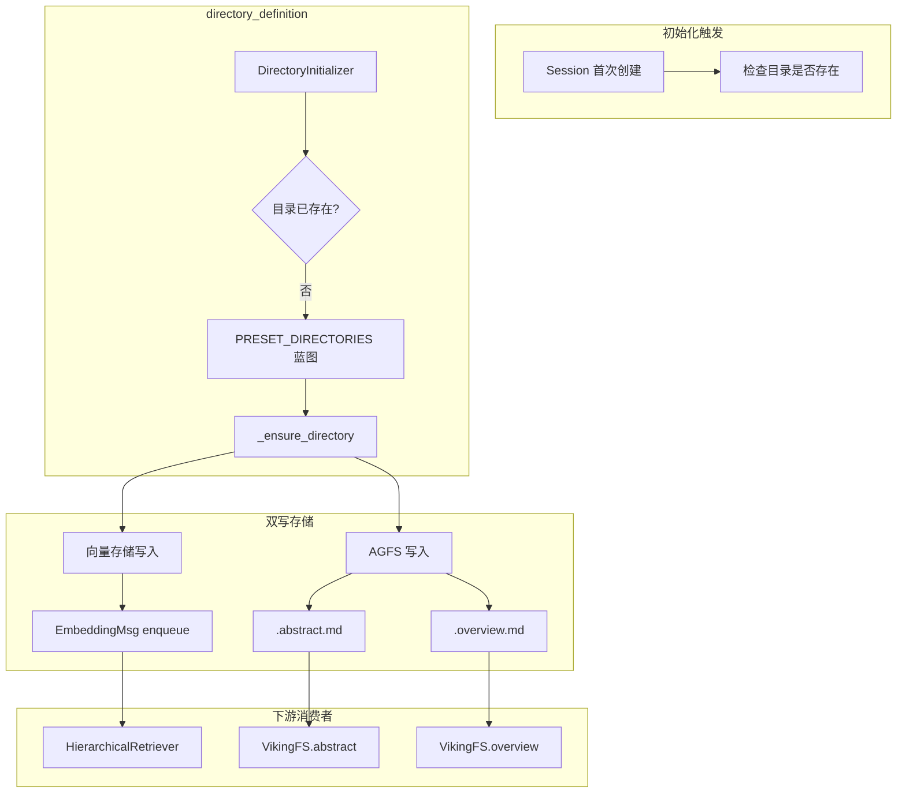

# directory_definition 模块技术深度解析

## 概述

`directory_definition` 模块是 OpenViking 虚拟文件系统（VikingFS）的"骨架设计师"。它定义了系统在初始化时创建的预设目录结构，为整个系统提供了一个统一的、可导航的目录层级。

**解决的问题**：OpenViking 采用"一切皆数据记录"的虚拟文件系统架构。与传统文件系统不同，这里的每个目录本身就是一个可检索、可向量化的上下文对象。但如果没有预设的目录结构，系统就像一座没有城市规划的城市——虽然可以自由建造，但缺乏组织性和可发现性。这个模块为系统预先绘制了"城市蓝图"，定义了 user（用户持久化存储）、agent（智能体能力存储）、session（会话临时存储）、resources（共享资源）四个作用域，每个作用域下都有精心设计的子目录层级。

**架构角色**：这是一个**初始化器**角色——它不参与日常的文件读写操作，而是在系统首次使用时"播种"预设目录结构。一旦目录创建完成，后续的检索、写入等操作由 [VikingFS](../storage/viking_fs.md) 和 [VikingDBManager](../storage/vikingdb_manager.md) 接管。

---

## 核心抽象与心智模型

### DirectoryDefinition：目录蓝图

```python
@dataclass
class DirectoryDefinition:
    path: str      # 相对路径，如 "memories/preferences"
    abstract: str  # L0 摘要——一句话概括
    overview: str  # L1 概述——详细描述
    children: List["DirectoryDefinition"]  # 子目录（递归结构）
```

这个数据结构是整个模块的核心抽象。把它想象成建筑蓝图中的**楼层平面图**：`path` 是房间地址，`abstract` 是门口的小铭牌（让人一眼就知道这个房间是做什么的），`overview` 是房间的详细介绍（供深入了解时使用），`children` 是房间里的套间。

### 四棵预设目录树

模块定义了四个顶层作用域，每一棵都是独立的 `DirectoryDefinition` 树：

| 作用域 | 用途 | 生命周期 | 典型内容 |
|--------|------|----------|----------|
| **session** | 会话级临时存储 | 会话期间 | 当前对话消息、历史存档 |
| **user** | 用户长期记忆 | 跨会话持久化 | 用户偏好、实体、事件 |
| **agent** | 智能体能力 | 跨会话持久化 | 案例、模式、指令、技能 |
| **resources** | 共享知识库 | 全局共享 | 项目资源、主题知识 |

### 目录即上下文

这里有一个关键的设计洞察：**在 OpenViking 中，目录本身就是上下文对象**。每个目录都携带：
- L0 抽象（`.abstract.md`）- 可用于快速筛选
- L1 概述（`.overview.md`）- 用于语义检索
- 向量化表示 - 支持相似度搜索

这种设计使得检索系统可以"穿过"目录层级，感知目录的组织结构，从而提供更精准的上下文推荐。

---

## 架构图与数据流



**数据流说明**：

1. **触发时机**：`DirectoryInitializer` 通常由 [OpenVikingService](../service/core.md) 首次初始化时调用。当服务启动时，系统检查各作用域的目录是否已初始化。

2. **蓝图匹配**：根据请求的 `scope`（user/agent/session/resources），从 `PRESET_DIRECTORIES` 字典中取出对应的目录树定义。

3. **递归创建**：`DirectoryInitializer._initialize_children` 递归遍历目录树，为每个节点执行：
   - **AGFS 写入**：调用 [VikingFS.write_context](storage-vectorization_and_storage_adapters-collection_adapters_abstraction_and_backends.md)，创建 `.abstract.md` 和 `.overview.md` 文件
   - **向量索引**：创建 `Context` 对象，通过 [EmbeddingMsgConverter](storage_core_and_runtime_primitives-observer_and_queue_processing_primitives.md) 转换为嵌入消息并入队

4. **惰性初始化**：只有当实际访问某个路径时才触发创建，而非系统启动时全部初始化。这是性能与可用性的权衡。

---

## 核心组件详解

### DirectoryDefinition 数据类

这是纯粹的**数据容器**，没有业务逻辑。设计决策：
- 使用 `dataclass` 而非 Pydantic：避免运行时验证开销，因为这些对象在初始化时是可信的
- `children` 字段允许递归嵌套，支持任意深度的目录树
- `path` 采用相对路径：允许同一个子树在不同的父路径下复用

### get_context_type_for_uri：URI 到语义的桥梁

```python
def get_context_type_for_uri(uri: str) -> str:
    if "/memories" in uri:
        return ContextType.MEMORY.value
    elif "/resources" in uri:
        return ContextType.RESOURCE.value
    elif "/skills" in uri:
        return ContextType.SKILL.value
    elif uri.startswith("viking://session"):
        return ContextType.MEMORY.value
    return ContextType.RESOURCE.value
```

这个函数展示了 OpenViking 的一个重要约定：**URI 结构隐含语义**。通过简单的字符串匹配，系统就能推断出这个目录属于哪种上下文类型。这是一种**约定优于配置**的设计——开发者只需遵循 `viking://scope/.../memories/...` 的命名规范，系统自动理解其语义。

### DirectoryInitializer：初始化引擎

这是模块的主要执行者，负责将"蓝图"变成"现实"。核心方法：

#### initialize_account_directories

初始化账户级别的根目录（user、agent、resources、session 四个作用域根节点）。这些是账户级别的共享结构，所有用户共享同一套顶层命名空间。

#### initialize_user_directories 和 initialize_agentDirectories

注意这两个方法处理的是 **user-space 和 agent-space** 的概念。在 OpenViking 的多租户架构中：

- `viking://user/{user_space_name}/...` - 每个用户独立的记忆空间
- `viking://agent/{agent_space_name}/...` - 每个智能体独立的能力空间

这种方法实现了**命名空间隔离**：不同用户/智能体的数据存储在不同的路径下，但共享相同的目录结构模板。

#### _ensure_directory：双重保证

```python
async def _ensure_directory(self, uri, parent_uri, defn, scope, ctx):
    # 1. 确保 AGFS 文件存在
    if not await self._check_agfs_files_exist(uri):
        await self._create_agfs_structure(uri, abstract, overview)
    
    # 2. 确保向量索引记录存在
    existing = await self.vikingdb.get_context_by_uri(account_id, uri)
    if not existing:
        context = Context(...)
        dir_emb_msg = EmbeddingMsgConverter.from_context(context)
        await self.vikingdb.enqueue_embedding_msg(dir_emb_msg)
```

这里体现了 OpenViking 的**双重存储模型**：
- **AGFS**（通过 VikingFS）负责文件内容和层级结构
- **向量数据库**负责语义检索

两者必须保持同步。如果只在 AGFS 创建了目录，但向量索引中没有记录，那么这个目录就无法被语义检索发现。

---

## 设计决策与权衡

### 1. 惰性初始化 vs 预创建

**选择**：惰性初始化（lazy initialization）

**理由**：预创建所有目录到向量数据库会产生巨大的初始化开销。考虑到：
- 大型系统可能有成千上万个预设目录
- 每个目录都需要生成向量嵌入
- 大部分目录可能在当前会话中永远不会用到

惰性初始化将这些开销推迟到实际使用时，实现了"按需付费"。

**代价**：首次访问某个目录时会有延迟（需要创建目录 + 生成嵌入），且增加了代码复杂度（需要检查目录是否存在）。

### 2. 双写存储模型

**选择**：同时写入 AGFS 和向量数据库

**理由**：这是 OpenViking 混合存储架构的核心：
- AGFS 提供传统文件系统的操作模型（read/write/ls），便于与现有工具集成
- 向量数据库提供语义搜索能力

**代价**：
- 需要维护两处存储的一致性（本模块通过先检查存在性来避免重复写入）
- 增加了初始化的复杂度

### 3. URI 语义推断

**选择**：通过 URI 字符串模式匹配推断上下文类型

```python
if "/memories" in uri:
    return ContextType.MEMORY.value
```

**理由**：
- 简单直接，无需额外的元数据表
- 符合"约定优于配置"原则
- 开发者可以直观地通过命名表达意图

**代价**：
- 字符串匹配有轻微的性能开销
- URI 命名必须遵循约定，否则推断会失败

### 4. Scope vs Space 的命名区分

- **Scope**（作用域）：user、agent、session、resources 四个顶层分类
- **Space**（空间）：具体的用户空间名或智能体空间名

这种双层结构 `viking://{scope}/{space}/...` 既保证了类型安全（scope 是有限的枚举），又支持了多租户隔离（space 是动态的）。

---

## 与其他模块的关系

### 上游：谁调用这个模块

1. **[OpenVikingService](../service/core.md)**：在 `initialize()` 方法中调用三个初始化方法，是模块的主要调用方
2. **初始化脚本**：系统首次启动时批量触发

### 下游：这个模块依赖谁

1. **[VikingFS](../storage/viking_fs.md)**：通过 `get_viking_fs()` 获取实例，写入 `.abstract.md` 和 `.overview.md`
2. **[VikingDBManager](../storage/vikingdb_manager.md)**：入队嵌入消息，建立向量索引
3. **[Context](../core/context.md)**：创建上下文对象时使用
4. **[EmbeddingMsgConverter](../storage/queuefs/embedding_msg_converter.md)**：将 Context 转换为可入队的嵌入消息
5. **[RequestContext](../server/identity.md)**：提供账户和用户身份信息

### 数据契约

| 方向 | 契约内容 |
|------|----------|
| 输入 | `RequestContext`（包含 account_id, user 信息）|
| 中间产物 | `Context` 对象（包含 uri, abstract, overview, context_type）|
| 输出 | AGFS 文件 `.abstract.md` / `.overview.md` + 向量数据库记录 |

---

## 常见问题和注意事项

### 1. 目录创建的双重检查

在生产环境中，可能会出现 AGFS 和向量数据库不一致的情况（比如 AGFS 创建成功但向量入队失败）。此时 `_ensure_directory` 的设计是**幂等的**——再次调用时会跳过已存在的目录，不会重复创建。

### 2. run_async 的混用

代码中同时存在 `async/await` 和 `run_async` 的调用：

```python
run_async(
    viking_fs.write_file(uri=f"{archive_uri}/.abstract.md", content=abstract, ctx=self.ctx)
)
```

这是因为 VikingFS 的 `write_file` 方法是异步的，但在某些同步上下文中需要调用它。**注意**：这种混用可能在异步上下文中导致意外行为，建议统一使用 await。

### 3. Owner Space 的推导逻辑

在 `_ensure_directory` 中，owner_space 的推导依赖于 scope：

```python
if scope in {"user", "session"}:
    owner_space = ctx.user.user_space_name()
elif scope == "agent":
    owner_space = ctx.user.agent_space_name()
```

这个逻辑必须与 [VikingFS 的 URI 解析逻辑](storage-vectorization_and_storage_adapters-collection_adapters_abstraction_and_backends.md) 保持一致，否则访问控制可能会出问题。

### 4. 目录结构的扩展性

PRESET_DIRECTORIES 是硬编码的字典。如果需要支持用户自定义目录结构，需要：
1. 扩展 DirectoryDefinition 支持从配置文件加载
2. 考虑动态目录与预设目录的合并策略

### 5. 性能考量

每次调用 `initialize_user_directories` 或 `initialize_agent_directories` 都会：
- 遍历整个目录树
- 对每个节点执行文件系统 I/O 和向量数据库查询

在高频调用的场景下，建议添加缓存或批量检查机制。

---

## 参考资料

- [VikingFS 虚拟文件系统](../storage/viking_fs.md)
- [Context 统一上下文类](../core/context.md)
- [Session 会话管理](session_runtime.md)
- [EmbeddingMsgConverter 嵌入消息转换器](../storage/queuefs/embedding_msg_converter.md)
- [HierarchicalRetriever 分层检索器](../retrieval/retrieval_query_orchestration.md)