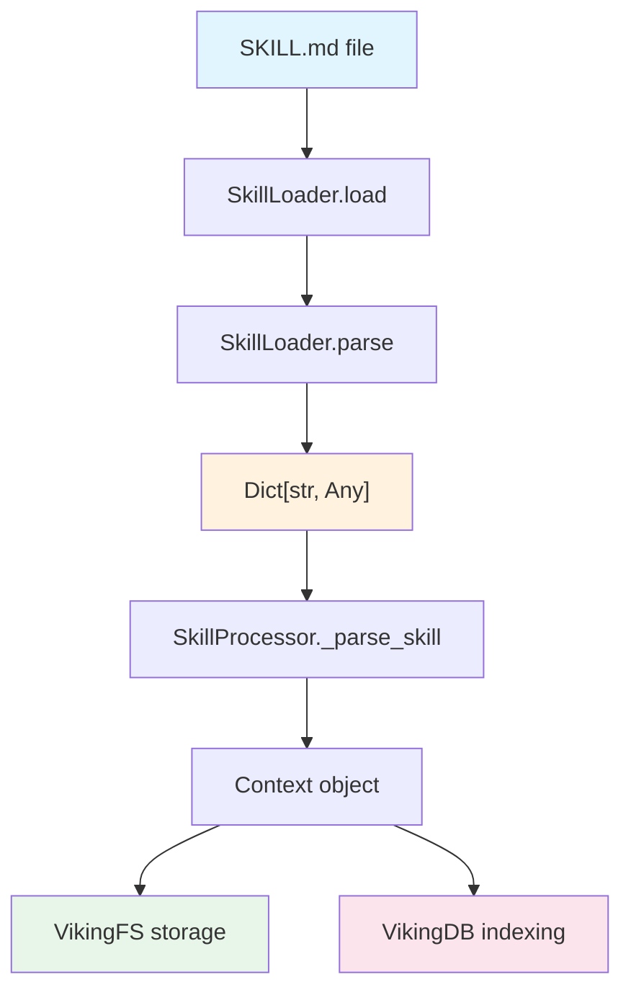

# SkillLoader 模块技术深度解析

## 概述

`skill_loader` 模块是 OpenViking 系统中处理 **SKILL.md 文件** 的核心组件。想象一下，如果你的系统是一个拥有众多"技能"（Skills）的 AI 代理，这些技能需要以结构化的方式定义、存储和检索——那么 SKILL.md 就是定义这些技能的"配方卡"，而 `SkillLoader` 就是读取并解析这些配方的机器。

**它解决的问题**非常直接：在 OpenViking 系统中，技能（Skill）是一种可复用的 Agent 能力单元。系统需要一种统一的方式来定义技能的名字、描述、可用工具、标签，以及技能的详细使用说明。这些信息需要从文本文件中被解析出来，转化为程序可处理的字典结构。

一个典型的 SKILL.md 文件看起来是这样的：

```yaml
---
name: adding-resource
description: Add resources to OpenViking, aka. ov. Use when an agent needs to add files...
allowed-tools:
  - ov_add_resource
tags:
  - resource management
  - import
---

# OpenViking (OV) `add-resource`

The `ov add-resource` command imports external resources...
```

这种设计借鉴了静态网站生成器（如 Jekyll、Hugo）中广泛使用的 **YAML Frontmatter** 模式——在文档主体之前使用 `---` 包裹的 YAML 元数据区。这种模式的优势在于：它同时满足人类可读性（写文档时）和机器可解析性（解析时）。

---

## 架构定位与数据流向



从架构角度看，`SkillLoader` 处于整个技能处理流水线 的**最上游**。它是一个纯粹的解析层——只负责将文本转换为结构化数据，不涉及任何 I/O 存储或业务逻辑。

**数据流分析：**

1. **入口阶段**：`SkillProcessor` 接收多种形式的技能数据（文件路径、目录路径、原始字符串、字典），根据数据类型决定调用 `SkillLoader.load()` 还是 `SkillLoader.parse()`
2. **解析阶段**：`SkillLoader` 负责分离 Frontmatter 与主体内容，解析 YAML 元数据，验证必填字段
3. **转换阶段**：解析结果（字典）被转换为 `Context` 对象，注入到 VikingFS 存储系统，并加入向量数据库索引

---

## 核心组件详解

### SkillLoader 类

`SkillLoader` 是一个仅有类方法的工具类（Utility Class），设计理念是**无状态、纯函数式**——所有的解析逻辑都通过类方法实现，不维护任何实例状态。这种设计使得它可以安全地被并发调用，也便于单元测试。

#### FRONTMATTER_PATTERN 正则表达式

```python
FRONTMATTER_PATTERN = re.compile(r"^---\s*\n(.*?)\n---\s*\n(.*)$", re.DOTALL)
```

这个正则表达式是整个解析器的核心。它的设计逻辑如下：

- `^---\s*\n`：匹配行首的三个短横线、可选空白字符、然后是换行
- `(.*?)`：非贪婪匹配，捕获 Frontmatter 内容（YAML 部分）
- `\n---\s*\n`：匹配闭合的三个短横线和换行
- `(.*)$`：捕获剩余的所有内容（Markdown 主体）
- `re.DOTALL` 标志确保 `.` 能匹配换行符，使得多行 Frontmatter 能被正确捕获

**设计考量**：为什么不使用更通用的 YAML 解析器先完整解析再判断？因为 Frontmatter 本质上是文档元数据，需要与文档主体分离。正则表达式在这里比完整的 YAML 解析更轻量，也更适合处理"缺少 Frontmatter"这种边界情况（此时返回空主体）。

#### load() 方法

```python
@classmethod
def load(cls, path: str) -> Dict[str, Any]:
    """Load Skill from file and return as dict."""
    file_path = Path(path)
    if not file_path.exists():
        raise FileNotFoundError(f"Skill file not found: {path}")

    content = file_path.read_text(encoding="utf-8")
    return cls.parse(content, source_path=str(file_path))
```

**设计意图**：这是最常用的入口方法，负责从文件系统加载文件。它做了两层封装：
1. 文件存在性检查——提前失败，快速返回
2. 统一编码（UTF-8）——避免不同系统编码导致的问题

**返回值结构**：

```python
{
    "name": str,                    # 必填，技能名称
    "description": str,             # 必填，技能一句话描述
    "content": str,                 # Markdown 主体内容
    "source_path": str,             # 文件来源路径
    "allowed_tools": List[str],     # 可选，允许使用的工具列表
    "tags": List[str],              # 可选，技能标签
}
```

#### parse() 方法

```python
@classmethod
def parse(cls, content: str, source_path: str = "") -> Dict[str, Any]:
    """Parse SKILL.md content and return as dict."""
    frontmatter, body = cls._split_frontmatter(content)

    if not frontmatter:
        raise ValueError("SKILL.md must have YAML frontmatter")

    meta = yaml.safe_load(frontmatter)
    if not isinstance(meta, dict):
        raise ValueError("Invalid YAML frontmatter")

    if "name" not in meta:
        raise ValueError("Skill must have 'name' field")
    if "description" not in meta:
        raise ValueError("Skill must have 'description' field")

    return {...}
```

**业务规则验证**：
- 必填字段：`name` 和 `description` 是技能的身份证，没有它们技能就无法被系统正确索引和展示
- 可选字段：`allowed-tools` 和 `tags` 为技能提供了扩展能力——前者限制技能可调用的工具，后者支持灵活的分类和检索
- `yaml.safe_load()` 的使用是安全考量——防止执行任意 Python 代码

#### to_skill_md() 方法：双向转换

```python
@classmethod
def to_skill_md(cls, skill_dict: Dict[str, Any]) -> str:
    """Convert skill dict to SKILL.md format."""
    frontmatter: dict = {
        "name": skill_dict["name"],
        "description": skill_dict.get("description", ""),
    }

    yaml_str = yaml.dump(frontmatter, allow_unicode=True, sort_keys=False)

    return f"---\n{yaml_str}---\n\n{skill_dict.get('content', '')}"
```

这个方法实现了**解析的逆过程**——将字典转换回 SKILL.md 格式。它存在的原因可能是：
- 技能编辑场景：用户从系统导出技能进行修改
- 备份/迁移：将存储中的技能导出为标准文件格式

---

## 依赖分析与契约

### 上游调用者：SkillProcessor

`SkillLoader` 的主要消费者是 [`openviking.utils.skill_processor.SkillProcessor`](utils-skill-processor.md)。`SkillProcessor` 是一个完整的技能处理管道，它接收多种输入格式：

| 输入类型 | 处理逻辑 |
|---------|---------|
| `Path` 指向目录 | 查找 `SKILL.md`，收集其他辅助文件 |
| `Path` 指向单个文件 | 直接调用 `SkillLoader.load()` |
| 原始字符串 | 调用 `SkillLoader.parse()` |
| 字典格式 | 直接使用或转换为 MCP 格式 |

### 下游依赖

`SkillLoader` 本身不依赖其他业务模块，只依赖标准库：
- `pathlib.Path`：文件系统路径操作
- `re`：正则表达式
- `yaml`：YAML 解析

### 与 Context 的桥接

解析后的字典会被转换为 `Context` 对象（参见 [`openviking.core.context.Context`](core-context.md)）。`Context` 是 OpenViking 的统一上下文模型，它将技能与记忆（Memory）、资源（Resource）统一管理：

```python
context = Context(
    uri=f"viking://agent/skills/{skill_dict['name']}",
    context_type=ContextType.SKILL.value,
    meta={
        "name": skill_dict["name"],
        "description": skill_dict.get("description", ""),
        "allowed_tools": skill_dict.get("allowed_tools", []),
        "tags": skill_dict.get("tags", []),
        "source_path": skill_dict.get("source_path", ""),
    },
)
```

---

## 设计决策与权衡

### 1. 为什么采用 YAML Frontmatter 而非 JSON 或 TOML？

**决策**：使用 YAML 作为 Frontmatter 格式。

**考量因素**：
- **可读性**：YAML 对人类最友好，支持注释，可以写多行字符串
- **生态成熟度**：Jekyll、Hugo、VuePress 等主流静态站点都采用此模式，开发者已经熟悉
- **灵活性**：相比 JSON，YAML 不需要引号包裹键名，不需要逗号分隔
- **Python 内置支持**：`PyYAML` 是标准依赖

**权衡**：YAML 解析相对较慢，且语法复杂（隐式类型、锚点等可能带来意外行为）。但对于 Frontmatter 这种小范围元数据，这些缺点可接受。

### 2. 为什么必填字段只有 name 和 description？

**决策**：`name` 和 `description` 是必填的，而 `allowed-tools`、`tags` 是可选的。

**设计理由**：
- `name` 是技能的唯一标识符，没有它无法在系统中定位技能
- `description` 是技能的"电梯演讲"，用于语义检索和向用户展示
- `allowed-tools` 涉及安全沙箱配置，初版设计为可选
- `tags` 是增强性元数据，不影响技能核心功能

### 3. 为什么使用类方法而非实例方法？

**决策**：所有方法都是 `@classmethod`。

**设计理由**：
- `SkillLoader` 是无状态的工具类，不需要实例化
- 类方法更符合"操作"而非"对象"的语义
- 调用方可以直接 `SkillLoader.load(path)`，无需先 `SkillLoader()` 再调用

---

## 使用示例与扩展

### 基本用法

```python
from openviking.core.skill_loader import SkillLoader

# 从文件加载
skill = SkillLoader.load("/path/to/SKILL.md")
print(skill["name"])        # "adding-resource"
print(skill["description"]) # "Add resources to OpenViking..."

# 从字符串解析
raw_content = """---
name: my-skill
description: A custom skill
tags:
  - custom
  - example
---

# Skill Content

This is the detailed usage instructions.
"""
skill = SkillLoader.parse(raw_content)
print(skill["content"])  # "# Skill Content\n\nThis is the detailed usage instructions."
```

### 集成到自定义处理流程

如果你需要实现自己的技能处理逻辑，`SkillLoader` 提供了清晰的入口点：

```python
from openviking.core.skill_loader import SkillLoader

def process_skill_custom(path: str):
    # 1. 解析
    skill = SkillLoader.load(path)
    
    # 2. 验证扩展字段
    if skill.get("allowed_tools"):
        validate_tools(skill["allowed_tools"])
    
    # 3. 自定义转换
    return transform_to_your_format(skill)
```

---

## 边界情况与注意事项

### 1. 文件不存在

```python
SkillLoader.load("/nonexistent/SKILL.md")
# Raises: FileNotFoundError: Skill file not found: /nonexistent/SKILL.md
```

调用方需要自行处理文件不存在的异常，或者在此之前验证路径有效性。

### 2. 缺少 Frontmatter

```python
SkillLoader.parse("# Hello\nThis is a skill without frontmatter")
# Raises: ValueError: SKILL.md must have YAML frontmatter
```

系统要求所有技能文件必须包含 Frontmatter。如果你需要支持纯 Markdown 格式的技能，需要修改 `_split_frontmatter` 的逻辑。

### 3. YAML 解析失败

```python
SkillLoader.parse("""---
name: test
invalid yaml: [unclosed
---
content""")
# Raises: yaml.YAMLError (具体异常类型取决于错误)
```

Frontmatter 必须是有效的 YAML。调用方可以选择捕获异常并提供更友好的错误提示。

### 4. 缺少必填字段

```python
SkillLoader.parse("""---
description: Has description but no name
---
content""")
# Raises: ValueError: Skill must have 'name' field
```

这是故意设计的——系统不允许创建"无名"的技能。

### 5. 编码问题

```python
file_path.write_text("内容", encoding="gbk")  # 写一个 GBK 编码的文件
SkillLoader.load(path)  # 假设文件不是 UTF-8 编码
# 可能抛出 UnicodeDecodeError
```

`load()` 方法硬编码使用 UTF-8 编码。如果你的技能文件可能使用其他编码，需要在读取前进行编码检测或转换。

---

## 相关模块参考

- **[SkillProcessor](utils-skill-processor.md)**：`SkillLoader` 的主要消费者，完整的技能处理管道
- **[Context](core-context.md)**：技能解析后转换的目标类型，统一上下文模型
- **[ContextType](core-context-typing-and-levels.md)**：枚举类型，定义 `SKILL` 上下文类型
- **[Session](session-runtime.md)**：会话管理，技能的"使用"会在会话中被追踪