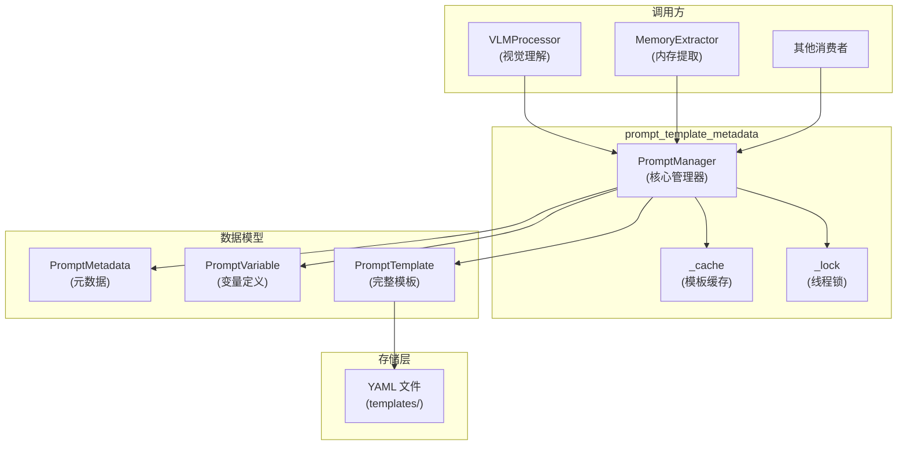

# prompt_template_metadata 模块技术深度解析

## 概述

`prompt_template_metadata` 模块是 OpenViking 系统中管理提示词模板的核心组件。如果你把整个系统想象成一家餐厅，那么这个模块就像是**菜单管理系统**——它负责存储、管理和组合各种"菜谱"（提示词模板），确保每次调用 LLM 时都能提供正确格式的输入。

这个模块解决的问题是：在复杂的 AI Agent 系统中，你可能需要数十个不同的提示词来处理不同场景——视觉理解、内存提取、文档压缩、检索排序等等。如果这些提示词分散在代码各处，会导致维护困难、版本不一致、变量校验缺失等问题。该模块通过集中化管理、类型化变量定义、运行时验证和模板缓存，提供了一种可靠且高效的方式来管理这些提示词。

## 架构概览



**数据流动的核心逻辑**：调用方通过 `render_prompt()` 或 `PromptManager.render()` 提出请求 → 管理器检查缓存是否已有加载好的模板 → 如无，从对应 YAML 文件加载并解析为 `PromptTemplate` 对象 → 对传入的变量进行校验和应用默认值 → 使用 Jinja2 引擎渲染模板 → 返回最终的字符串。

## 核心组件

### PromptMetadata：模板的身份证明

```python
class PromptMetadata(BaseModel):
    id: str           # 唯一标识，如 "vision.image_understanding"
    name: str         # 人类可读名称
    description: str  # 用途描述
    version: str      # 版本号，用于追踪变更
    language: str     # 模板语言 (en/zh-CN 等)
    category: str     # 分类 (vision/compression/retrieval 等)
```

这个类的设计目的是为每个模板提供**身份元数据**。注意 `id` 字段的命名约定：使用点分隔的层级结构 `category.name`，这与文件系统的目录结构对应。例如 `vision.image_understanding` 对应文件 `vision/image_understanding.yaml`。这种一致性设计使得模板 ID 到文件路径的映射逻辑简单且可预测。

### PromptVariable：变量的类型化契约

```python
class PromptVariable(BaseModel):
    name: str                      # 变量名，对应 Jinja2 中的 {{ var_name }}
    type: str                      # 类型声明 (string/int/float/bool)
    description: str               # 用途说明，供开发者参考
    default: Any = None            # 默认值，允许变量可选
    required: bool = True          # 是否必须提供
    max_length: Optional[int] = None  # 字符串最大长度限制
```

这是模块中最关键的的设计决策之一：**将变量声明与模板内容分离**。这样做的好处是可以在渲染前进行类型检查和长度限制，而不需要在每个调用方重复这些逻辑。想象一个场景：如果某个模板的 `context` 变量最大长度从 500 改为 1000，你只需要修改 YAML 中的 `max_length`，所有调用方都会自动获得这个保护，无需修改任何代码。

### PromptTemplate：完整的模板定义

```python
class PromptTemplate(BaseModel):
    metadata: PromptMetadata           # 身份信息
    variables: List[PromptVariable]    # 变量定义列表
    template: str                      # Jinja2 模板内容
    output_schema: Optional[Dict]      # 期望的输出结构（用于解析 LLM 响应）
    llm_config: Optional[Dict]         # LLM 配置参数 (temperature, supports_vision 等)
```

这个模型将模板的所有方面打包在一起。值得注意的是 `llm_config` 字段——它允许每个模板指定自己的 LLM 参数（如温度、是否支持视觉等），这意味着调用方不需要知道具体应该用什么样的配置来调用 LLM。

### PromptManager：模板的中央厨房

这是整个模块的核心类。它的设计融合了几个重要的模式：

**单例模式**：通过 `get_manager()` 函数和全局 `_default_manager` 变量，提供了一个全局共享的管理器实例。这类似于其他注册表模式（如解析器注册表），确保整个应用使用同一套模板缓存。

**缓存策略**：
```python
self._cache: Dict[str, PromptTemplate] = {}
self._lock = threading.RLock()
```
使用字典作为缓存，加上可重入锁保护并发访问。为什么选择 `RLock` 而不是 `Lock`？因为在渲染流程中可能存在嵌套调用——例如，某个模板的变量处理逻辑可能触发对另一个模板的加载。使用 `RLock` 允许同一线程多次获取锁，避免死锁。

**懒加载与按需缓存**：
```python
def load_template(self, prompt_id: str) -> PromptTemplate:
    # 先检查缓存
    if self.enable_caching and prompt_id in self._cache:
        return self._cache[prompt_id]
    
    # 缓存未命中，从文件加载
    file_path = self._resolve_template_path(prompt_id)
    data = yaml.safe_load(f)
    template = PromptTemplate.model_validate(data)
    
    # 缓存起来
    if self.enable_caching:
        with self._lock:
            self._cache[prompt_id] = template
```

这种设计避免了启动时加载所有模板的开销——只有实际被使用的模板才会被加载和缓存。

**路径解析逻辑**：
```python
def _resolve_template_path(self, prompt_id: str) -> Path:
    parts = prompt_id.split(".")
    category = parts[0]
    name = "_".join(parts[1:])
    return self.templates_dir / category / f"{name}.yaml"
```

这里有一个**隐式约定**：模板 ID 中用点分隔的每一部分（除了第一部分作为目录名），在文件名中会用下划线连接。例如 `vision.page_understanding` → `vision/page_understanding.yaml`。这个设计需要新开发者注意——如果你创建了 `vision.batch_processing` 这样的 ID，期望的文件路径应该是 `vision/batch_processing.yaml`。

## 渲染流程详解

当你调用 `render_prompt("vision.image_understanding", {"instruction": "分析图片", "context": "这是图片周围的内容"})` 时，背后发生了什么？

**第一步：加载模板**。管理器首先检查内存缓存，如果命中直接返回；如果未命中，根据 ID 解析出文件路径，从 YAML 文件读取内容，使用 Pydantic 验证结构，然后放入缓存。

**第二步：应用默认值**。遍历模板中定义的所有变量，如果调用方没有提供某变量但模板指定了默认值，则自动填充。

```python
for var_def in template.variables:
    if var_def.name not in variables and var_def.default is not None:
        variables[var_def.name] = var_def.default
```

**第三步：变量校验**。这是保障系统健壮性的关键环节。代码会检查：
- 所有 `required=True` 的变量是否都已提供
- 提供的变量类型是否与声明的类型匹配（基本的 string/int/float/bool 检查）

如果校验失败，会抛出 `ValueError` 并明确指出缺少哪个变量或类型不匹配。

**第四步：长度截断**。这是另一个重要保护机制：

```python
for var_def in template.variables:
    if (var_def.max_length
        and var_def.name in variables
        and isinstance(variables[var_def.name], str)):
        variables[var_def.name] = variables[var_def.name][:var_def.max_length]
```

这个设计防止了超长输入导致 LLM 输出质量下降或 API 超限。在 `vision.image_understanding.yaml` 中，`context` 变量就设置了 `max_length: 500`。

**第五步：Jinja2 渲染**。所有准备完成后，使用 Jinja2 引擎将变量值注入到模板字符串中。模板支持 Jinja2 的完整语法，包括条件块 ``、循环 ``、过滤器等。

## 依赖关系分析

### 上游依赖（谁调用这个模块）

从代码分析来看，这个模块被以下核心组件使用：

1. **VLMProcessor** (`openviking.parse.vlm`): 用于视觉理解任务
   - 调用 `render_prompt("vision.image_understanding", ...)`
   - 调用 `render_prompt("vision.table_understanding", ...)`
   - 调用 `render_prompt("vision.page_understanding", ...)`
   - 调用 `get_llm_config()` 获取 VLM 调用参数

2. **MemoryExtractor** (`opeviking.session.memory_extractor`): 用于内存提取
   - 调用 `render_prompt("compression.memory_extraction", ...)`

这种设计意味着调用方**不需要知道**具体的提示词内容，只需要提供变量值。提示词的格式化和校验完全由该模块处理。

### 下游依赖（这个模块依赖什么）

- **Jinja2**: 模板渲染引擎
- **PyYAML**: YAML 文件解析
- **Pydantic**: 数据模型验证
- **Python threading**: 线程安全的缓存管理

这些依赖都是成熟的、广泛使用的库，降低了维护风险。

## 设计权衡与决策

### 1. 为什么选择 YAML 而不是 JSON 或 Python 代码？

JSON 的问题是无法添加注释，而提示词模板通常需要详细的说明文档（见 `memory_extraction.yaml` 中的大量注释）。纯 Python 代码的问题是灵活性过高——如果有人在代码中直接修改模板字符串，可能会绕过类型检查和验证。使用 YAML 获得了：
- 人类可读的格式
- 内置注释支持
- 与代码分离（可以由非开发者编辑）
- 结构化的类型定义（通过 Pydantic 验证）

### 2. 为什么不使用预编译的模板对象缓存？

Jinja2 的 `Template` 对象本身也可以被缓存，但当前的实现选择在**每次渲染时重新创建**。这个决策的考量是：模板缓存已经包含了模板字符串，缓存 `Template` 对象节省的开销很小（主要是避免一次字符串解析），而代码复杂度增加带来的维护成本更高。当前的实现足够简单且性能可接受。

### 3. 单例模式的利弊

使用全局单例 `get_manager()` 简化了调用方的代码——不需要传递管理器实例。但这也带来了测试上的挑战：单例状态在测试间可能泄漏。模块提供了 `clear_cache()` 方法来缓解这个问题，允许在测试中重置状态。一种更好的设计可能是提供 `PromptManager` 实例作为依赖注入，但这会增加调用方的复杂度。当前的设计是实用主义的选择。

### 4. 类型验证的粒度

当前的类型验证只支持基本的 Python 类型（str、int、float、bool）：

```python
expected_type = {
    "string": str,
    "int": int,
    "float": (int, float),
    "bool": bool,
}.get(var_def.type)
```

没有支持复杂类型（如列表、字典、枚举）。这是有意的简化——对于提示词变量，过于复杂的类型定义会增加 YAML 的复杂度，而收益有限。如果将来需要更复杂的验证，可以扩展这个逻辑。

## 使用示例与最佳实践

### 基本用法：渲染一个提示词

```python
from openviking.prompts import render_prompt

# 简单的变量替换
prompt = render_prompt(
    "vision.image_understanding",
    {
        "instruction": "分析这张图片的内容",
        "context": "图片来自用户上传的产品照片"
    }
)
# 返回渲染后的完整提示词字符串
```

### 获取 LLM 配置

```python
from openviking.prompts import get_llm_config

# 获取特定提示词推荐的 LLM 参数
config = get_llm_config("vision.image_understanding")
# 返回: {"temperature": 0.0, "supports_vision": True}
```

### 创建自定义模板

在 `templates/my_category/my_template.yaml` 中：

```yaml
metadata:
  id: "my_category.my_template"
  name: "My Custom Template"
  description: "用于某特定任务的模板"
  version: "1.0.0"
  language: "zh-CN"
  category: "my_category"

variables:
  - name: "input_text"
    type: "string"
    description: "输入的文本"
    required: true
  - name: "max_tokens"
    type: "int"
    description: "最大生成token数"
    default: 1000
    required: false
  - name: "context"
    type: "string"
    description: "上下文信息"
    default: ""
    required: false
    max_length: 200

template: |
  请处理以下文本：
  
  {{ input_text }}
  
  
  附加上下文：{{ context }}
  
  
  请确保输出不超过 {{ max_tokens }} 个 token。

llm_config:
  temperature: 0.7
  model: "gpt-4"
```

### 使用 PromptManager 进行更细粒度的控制

```python
from openviking.prompts.manager import PromptManager
from pathlib import Path

# 创建自定义配置的管理器
manager = PromptManager(
    templates_dir=Path("./custom_templates"),
    enable_caching=True  # 默认开启缓存
)

# 加载模板
template = manager.load_template("my_category.my_template")

# 列出所有可用模板
all_prompts = manager.list_prompts()  # 所有
vision_prompts = manager.list_prompts(category="vision")  # 按分类过滤

# 清除缓存（测试时有用）
manager.clear_cache()
```

## 边缘情况与注意事项

### 1. 模板文件不存在

```python
manager.load_template("nonexistent.template")
# 抛出 FileNotFoundError
```

调用方需要处理这种情况。好的实践是使用 `try-except` 包装，或者在开发时确保模板 ID 正确。

### 2. YAML 解析错误

如果 YAML 文件格式错误，会抛出 Pydantic 的 `ValidationError`。这通常意味着模板文件有语法错误，需要检查 YAML 格式。

### 3. 变量类型不匹配

```python
# 模板定义: name: "count", type: "int"
render_prompt("some.template", {"count": "42"})  # 传入字符串
# 抛出 ValueError: Variable 'count' expects type int, got str
```

这个保护机制可以防止很多运行时错误。

### 4. 循环引用

Jinja2 模板本身可能包含复杂的逻辑，但该模块不提供模板间的引用能力。如果你想让一个模板引用另一个模板，需要在代码层面组合，或者使用 Jinja2 的 `include` 语法（但需要修改加载逻辑）。

### 5. 线程安全

缓存的读写使用 `RLock` 保护，是线程安全的。但需要注意：如果禁用了缓存（`enable_caching=False`），每次调用都会重新加载文件，此时文件系统的并发读取可能成为瓶颈。在多线程环境下，建议保持缓存开启。

### 6. 内存泄漏风险

如果系统中使用了大量的不同模板，缓存会持续增长。虽然当前没有提供 LRU 或大小限制，但可以通过定期调用 `clear_cache()` 或创建新的管理器实例来控制内存使用。

## 扩展点与定制

### 添加新的变量类型

当前的类型映射是硬编码的：

```python
expected_type = {
    "string": str,
    "int": int,
    "float": (int, float),
    "bool": bool,
}.get(var_def.type)
```

如果需要支持新类型（如 `list`、`dict`），可以修改 `_validate_variables` 方法。

### 自定义模板加载逻辑

可以通过继承 `PromptManager` 并重写 `_resolve_template_path` 来实现从数据库、远程服务器或其他来源加载模板。

### 模板版本管理

当前的 `version` 字段只是元数据，没有自动的版本检查逻辑。如果需要强制版本兼容性，可以在 `load_template` 中添加版本验证。

## 相关模块参考

- **[session_runtime](session_runtime.md)**: `Session` 类使用提示词模板进行内存提取
- **[content_extraction_schema_and_strategies](python_client_and_cli_utils-content_extraction_schema_and_strategies.md)**: 内容提取相关类型，与 VLM 处理流程相关
- **[llm_and_rerank_clients](llm_and_rerank_clients.md)**: LLM 客户端，理解如何将渲染后的提示词发送给模型